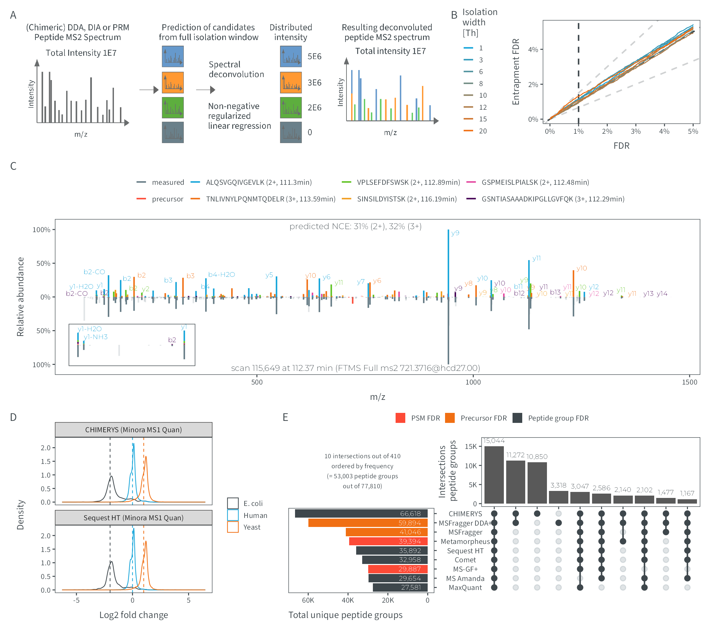

# Figure 1
MSAID
2024-12-17

- [Setup](#setup)
- [Data](#data)
  - [Entrapment](#entrapment)
  - [DeCon mirror plot](#decon-mirror-plot)
  - [Density plot](#density-plot)
  - [Upset PTM Groups level](#upset-ptm-groups-level)
- [Figure](#figure)

# Setup

This document describes how the data analysis and plots for figure 1
were generated. To recreate the figures, make sure to download all input
files (available on
[PRIDE](https://www.ebi.ac.uk/pride/archive?keyword=PXD053241)), place
them under `dataPath` (adjust in `load-dependencies.R` to your own
folder structure) and generate intermediate results in the linked `.R`
scripts.

<details>
<summary>
Details on setup
</summary>

``` r
suppressMessages(source(here::here("scripts/load-dependencies.R")))
msaid_organism <- c("Human" = msaid_blue, "Yeast" = msaid_orange, "E. coli" = msaid_darkgray)

path <- file.path(here::here(), "figure-1")
figurePath <- file.path(dataPath, "data/figure-1")
```

</details>

# Data

<details>
<summary>
Details on data processing
</summary>

## Entrapment

[R code to generate input file
`figure-1B-entrapment.csv`](figure-1B-entrapment.R)

``` r
mean_efdr <- fread(file.path(figurePath, "figure-1B-entrapment.csv"))
software_levels <- as.character(c(1, 3, 6, 8, 10, 12, 15, 20))
mean_efdr[, SOFTWARE := factor(SOFTWARE, software_levels)]

p_entrapment <- ggplot(mean_efdr, aes(x = Q_VALUE, y = ENTRAPMENT_Q_VALUE, color = SOFTWARE)) +
  geom_abline(intercept = 0, slope = 1, color = msaid_darkgray, linetype = "dashed") +
  geom_abline(intercept = 0, slope = 1.5, alpha = 0.25,
              color = msaid_darkgray, linetype = "dashed") +
  geom_abline(intercept = 0, slope = 2/3, alpha = 0.25,
              color = msaid_darkgray, linetype = "dashed") +
  geom_vline(xintercept = 0.01, color = msaid_darkgray, linetype = "dashed") + 
  geom_line(linewidth = 0.25) +
  scale_x_continuous(labels = label_percent()) +
  scale_y_continuous(labels = label_percent()) +
  scale_color_manual("Isolation\nwidth\n[Th]", values = msaid_gradient_2(8)) +
  guides(color = guide_legend(override.aes = list(linewidth = 0.5))) +
  xlab("FDR") + ylab("Entrapment FDR") + theme(legend.position = "left")
```

## DeCon mirror plot

[R code to generate input file
`scan-115649-decon-mirror.csv`](figure-1CE-decon-mirror-upset.R)

CAVE: Re-running peptide predictions requires a local instance of
INFERYS and the external LFQ benchmark raw file.

``` r
data_sub <- fread(file.path(figurePath, "intermediate/scan-115649-decon-mirror.csv"))
rawScans <- 115649L
rawPath <- file.path(dataPath, "_external-raw-files/LFQ_Bench_human/LFQ_Orbitrap_DDA_Human_01.raw")

dt_spectra <-
  plotMirror(dataTable = data_sub,
             rawSample = "CHIMERYS_1",
             rawPath = rawPath,
             rawScans = rawScans,
             outputPath = path,
             loadPredictions = T,
             rawActivation = "HCD",
             ppmShift = -0.70,
             ppmTolerance = 17.47,
             inferysApi = "localhost:8081",
             inferysModel = "inferys_3.0.0_fragmentation",
             quiet = T)

#generate plotting data object for export
fwrite(dt_spectra$spectra, file.path(figurePath, "figure-1C-decon-mirror.csv"))

#mirror plot inset
dt_inset <- dt_spectra$spectra[mz_recal>129 & mz_recal<148]
spec_color <- c(msaid_gray, msaid_red, msaid_col[-6], viridis(1))
ptm_label <- data_sub[order(-score_coefficient_normalized), paste0(ptm, " (", charge, "+)")]
names(spec_color) <- c("measured", "precursor", ptm_label)
dt_inset[!is.na(annotation), annotationMax := ifelse(fraction_end==max(fraction_end), annotation, NA), by=mz]

p_inset <- ggplot(dt_inset, aes(x=mz, xend=mz, color=label, label=annotationMax)) +
  geom_segment(data = dt_inset[is_truncated==F],
               aes(alpha=is_identified, y=fraction_start, yend=fraction_end), show.legend = F) +
  geom_segment(data = dt_inset[is_truncated==T],
               aes(alpha=is_identified, y=fraction_start, yend=fraction_end),
               arrow = arrow(length = unit(0.1, "inches")), show.legend = F) +
  geom_text_repel(aes(y=fraction_end),
                  family = "Montserrat Light", size = 3/.pt, show.legend = F,
                  na.rm = T, nudge_y = 0.01, box.padding = 0.05, max.overlaps = 8,
                  segment.size = 0.2, segment.alpha = 0.5,
                  segment.linetype = "dashed", ylim = c(0, 1)) +
  xlab("m/z") + ylab("Relative abundance") + xlim(c(128.5, 148)) +
  scale_color_manual("", values = spec_color) +
  scale_alpha_manual(guide = "none", values = c("TRUE" = 1, "FALSE" = 0.2)) +
  scale_y_continuous(labels = function(x) label_percent()(abs(x)),
                     limits = dt_inset[, range(fraction_end)]*4/3) +
  theme(legend.position = "none",
        axis.ticks = element_blank(),
        axis.title.x = element_blank(),
        axis.title.y = element_blank(),
        axis.text = element_blank(),
        rect = element_blank())
#p_inset
p_mirror_inset <- dt_spectra$plots$`115649` +
  inset_element(p_inset, left = 0.01, bottom = 0.01, right = 0.225, top = 0.425)
```

TIC contribution for mention in the paper text

CAVE: the package `rawrr` requires installation before first use, please
refer to the package manual

``` r
dt_scan <- readSpectrum(rawPath, rawScans)
format(dt_scan[[1]]$TIC, scientific = T)
data_sub[order(score_coefficient_normalized), .(round(score_coefficient_normalized*100, 0))]
```

## Density plot

[R code to generate input file
`figure-1D-density.csv`](figure-1D-density.R)

``` r
dtOrg <- fread(file.path(figurePath, "figure-1D-density.csv"))
dtOrg <- dtOrg[hasMethionine=="no Met"]
organismLabels <- c("E. coli", "Human", "Yeast")
organismRatios <- setNames(log2(c(0.25, 1, 2)), organismLabels)
dtOrg[, organism := factor(organism, organismLabels)]
contrastLevels <- c("CHIMERYS (Minora MS1 Quan)", "Sequest-HT (Minora MS1 Quan)")
contrastLabels <- c("CHIMERYS (Minora MS1 Quan)", "Sequest HT (Minora MS1 Quan)")
dtOrg[, contrastLabel := factor(contrastLabel, contrastLevels, contrastLabels)]
dtMaLines <- data.table(YINTERCEPT = organismRatios, organism = factor(organismLabels))

p_org <- ggplot(dtOrg, aes(x=ratio, color=organism)) +
  geom_density(linewidth=0.25) +
  geom_vline(data=dtMaLines, aes(xintercept=YINTERCEPT, color=organism),
             linetype = "dashed", linewidth = 0.25, show.legend = F) +
  scale_color_manual(NULL, values = msaid_organism) +
  scale_x_continuous(breaks = pretty_breaks()) +
  guides(fill = guide_legend(override.aes = list(color = NA, size = 2))) +
  facet_wrap(vars(contrastLabel), ncol = 1) +
  xlab("Log2 fold change") + ylab("Density") +
  theme(legend.position = "right", plot.background = element_rect(fill = "transparent", colour = NA))
```

## Upset PTM Groups level

[R code to generate input file
`figure-1E-upset.csv`](figure-1CE-decon-mirror-upset.R)

``` r
#subset data for upset plot
data_upset <- fread(file.path(figurePath, "figure-1E-upset.csv"))
conditionLevels <- c("CHIMERYS", "Comet", "MSAmanda", "MSGFplus", "MSFragger",
                     "MSFragger-DDAplus", "MaxQuant", "Metamorpheus", "SequestHT")
conditionLabels <- c("CHIMERYS", "Comet", "MS Amanda", "MS-GF+", "MSFragger",
                     "MSFragger DDA+", "MaxQuant", "Metamorpheus", "Sequest HT")
data_upset[, condition := factor(condition, conditionLevels, conditionLabels)]
data_upset[, level := factor(level, c("PSM-level FDR", "PCM-level FDR", "PTM group-level FDR"),
                             c("PSM FDR", "Precursor FDR", "Peptide group FDR"))]

groupFillColors <- c("PSM FDR" = msaid_red,
                     "Precursor FDR" = msaid_orange,
                     "Peptide group FDR" = msaid_darkgray)
fill_color <- data_upset[, level[1], by = condition]$V1
names(fill_color) <- data_upset[, level[1], by = condition]$condition

p_upset <- plotUpset(dataTable = data_upset,
                     groupColumn = "condition",
                     observationColumn = "ptm_group_J",
                     observationLabel = "peptide groups",
                     groupFillColumn = "level",
                     groupFillColors = groupFillColors,
                     labelDistance = c(0.05, 0.1),
                     labelSize = c(5L, 3L),
                     plotRelativeWidths = c(0.4, -0.2, 0.6),
                     plotRelativeHeights = c(0.45, -0.2, 0.55),
                     labelType = "total inside",
                     orderUpset = "frequency",
                     maxIntersections = 10L)
# ggsave2(file.path(path, "bar_upset_ptmGroup.pdf"), plot = p_upset,
#         width = 90, height = 50, units = "mm", device = cairo_pdf)

dtGuide <- data_upset[, .N, keyby=level]

p_upset_guide <- ggplot(dtGuide, aes(x=level, y=N, fill=level)) +
  geom_bar(stat = "identity") +
  scale_fill_manual(NULL, values = groupFillColors) +
  theme(legend.position = "top")

p_upset_guide <-
  plot_grid(get_plot_component(p_upset_guide, 'guide-box-top', return_all = TRUE))
```

</details>

# Figure

<details>
<summary>
Details on figure generation
</summary>

``` r
p_workflow <- image_ggplot2(image_read(file.path(path, "workflow-schema-2024-06-01.pdf"),
                                       density = 600))
p_design <- "AAAABB\nCCCCCC\nDDEEEE"

p_DDA <- free(p_workflow) + p_entrapment + p_mirror_inset + p_org + p_upset +
  plot_layout(heights = c(1, 1.5, 1.5), design = p_design, guides = "keep") +
  plot_annotation(tag_levels = list(c("A", "B", "C", "", "D", "E")))

p_DDA <- p_DDA +
  inset_element(p_upset_guide, left = 0.7, bottom = 0.95, right = 0.3, top = 0.95, align_to = "full")

suppressWarnings(ggsave2(file.path(path, "figure-1.pdf"), plot = p_DDA,
                         width = 180, height = 160, units = "mm", device = cairo_pdf))
suppressWarnings(ggsave2(file.path(path, "figure-1.png"), plot = p_DDA,
                         width = 180, height = 160, units = "mm"))
```

</details>


