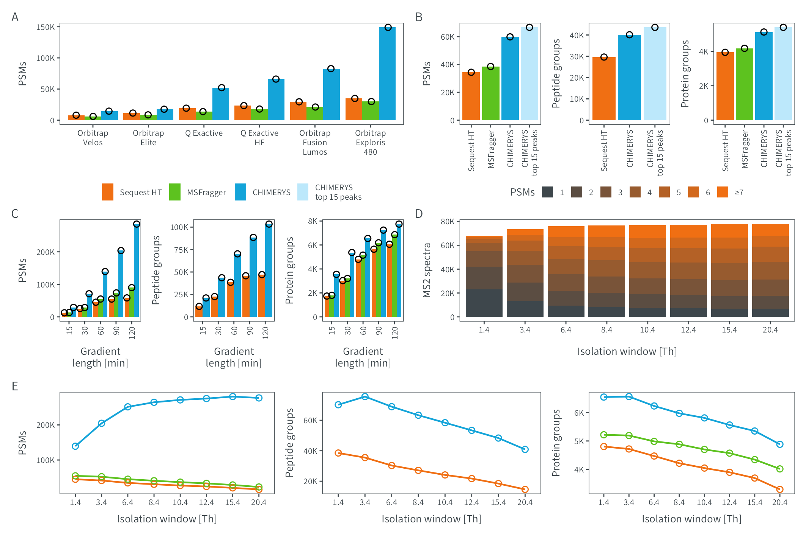

# Figure 2
MSAID
2024-12-16

- [Setup](#setup)
- [Data](#data)
  - [Gradient](#gradient)
  - [OTIT CID](#otit-cid)
  - [MS Instruments](#ms-instruments)
  - [Isolation Window](#isolation-window)
  - [spectra per IW](#spectra-per-iw)
- [Figure](#figure)

# Setup

This document describes how the data analysis and plots for figure 2
were generated. To recreate the figures, make sure to download all input
files (available on
[PRIDE](https://www.ebi.ac.uk/pride/archive?keyword=PXD053241)), place
them under `dataPath` (adjust in `load-dependencies.R` to your own
folder structure) and generate intermediate results in the linked `.R`
scripts.

<details>
<summary>
Details on setup
</summary>

``` r
suppressMessages(source(here::here("scripts/load-dependencies.R")))
suppressMessages(source(here::here("scripts/data-ids.R")))
msaid_SE <- c("Sequest HT" = msaid_orange,
              "MSFragger" = msaid_green,
              "CHIMERYS" = msaid_blue,
              "CHIMERYS\ntop 15 peaks" = msaid_lightblue)

path <- file.path(here::here(), "figure-2")
figurePath <- file.path(dataPath, "data/figure-2")
```

</details>

# Data

<details>
<summary>
Details on data processing
</summary>

All `.csv` input files were generated using the `readIds(...)` function
reading search engine results (`.pdResult` files and MSFragger output
folders).

## Gradient

``` r
data_gradient <- fread(file.path(figurePath, "figure-2C-Gradient.csv"))
data_gradient[, condition_SE := factor(gsub("^.*_(.)$", "\\1", studies),
                                       levels = c("S", "M", "C"),
                                       labels = c("Sequest HT", "MSFragger", "CHIMERYS"))]
data_gradient[, condition_gradient := factor(gsub("^(.*)_.$", "\\1", studies),
                                       levels = c("015min", "030min", "060min", "090min", "120min"),
                                       labels = c("15", "30", "60", "90", "120"))]

p_gradient_psm <- ggplot(data_gradient[!is.na(psms_FDR)],
                         aes(x=condition_gradient, y=psms_FDR, fill=condition_SE)) +
  geom_bar(stat = "summary", fun = mean, position = "dodge") +
  geom_jitter(shape = 1L, position = position_jitterdodge(0.1, 0, 0.9), show.legend = F) +
  scale_y_continuous(labels = label_number(scale_cut = cut_short_scale())) +
  scale_fill_manual(NULL, values = msaid_SE) +
  xlab("Gradient\nlength [min]") + ylab("PSMs") +
  theme(legend.position = "none") +
  theme_tilt_xaxis(90, T)

p_gradient_pep <- ggplot(data_gradient[!is.na(peptideGroups_FDR)],
                         aes(x=condition_gradient, y=peptideGroups_FDR, fill=condition_SE)) +
  geom_bar(stat = "summary", fun = mean, position = "dodge") +
  geom_jitter(shape = 1L, position = position_jitterdodge(0.1, 0, 0.9)) +
  scale_y_continuous(labels = label_number(scale_cut = cut_short_scale())) +
  scale_fill_manual(NULL, values = msaid_SE) +
  xlab("Gradient\nlength [min]") + ylab("Peptide groups") +
  theme(legend.position = "none") +
  theme_tilt_xaxis(90, T)

p_gradient_prot <- ggplot(data_gradient[!is.na(proteinGroups_FDR)],
                          aes(x=condition_gradient, y=proteinGroups_FDR, fill=condition_SE)) +
  geom_bar(stat = "summary", fun = mean, position = "dodge") +
  geom_jitter(shape = 1L, position = position_jitterdodge(0.1, 0, 0.9)) +
  scale_y_continuous(labels = label_number(scale_cut = cut_short_scale())) +
  scale_fill_manual(NULL, values = msaid_SE) +
  xlab("Gradient\nlength [min]") + ylab("Protein groups") +
  theme(legend.position = "none") +
  theme_tilt_xaxis(90, T)
```

## OTIT CID

``` r
data_OTITCID <- fread(file.path(figurePath, "figure-2B-CID.csv"))
data_OTITCID[, condition_SE := factor(studies,
                                      levels = c("S", "M", "C", "C_Top15"),
                                      labels = c("Sequest HT", "MSFragger",
                                                 "CHIMERYS", "CHIMERYS\ntop 15 peaks"))]

p_iontrap_psm <- ggplot(data_OTITCID[!is.na(psms_FDR)],
                        aes(x=condition_SE, y=psms_FDR, fill=condition_SE)) +
  geom_bar(stat = "summary", fun = mean, position = "dodge") +
  geom_point(shape = 1L, show.legend = F) +
  scale_y_continuous(labels = label_number(scale_cut = cut_short_scale())) +
  scale_fill_manual(NULL, values = msaid_SE) +
  xlab(NULL) + ylab("PSMs") + theme(legend.position = "none") +
  theme_tilt_xaxis(90, T)

p_iontrap_pep <- ggplot(data_OTITCID[!is.na(peptideGroups_FDR)],
                        aes(x=condition_SE, y=peptideGroups_FDR, fill=condition_SE)) +
  geom_bar(stat = "summary", fun = mean, position = "dodge") +
  geom_point(shape = 1L) +
  scale_y_continuous(labels = label_number(scale_cut = cut_short_scale())) +
  scale_fill_manual(NULL, values = msaid_SE) +
  xlab(NULL) + ylab("Peptide groups") + theme(legend.position = "none") +
  theme_tilt_xaxis(90, T)

p_iontrap_prot <- ggplot(data_OTITCID[!is.na(proteinGroups_FDR)],
                         aes(x=condition_SE, y=proteinGroups_FDR, fill=condition_SE)) +
  geom_bar(stat = "summary", fun = mean, position = "dodge") +
  geom_point(shape = 1L) +
  scale_y_continuous(labels = label_number(scale_cut = cut_short_scale())) +
  scale_fill_manual(NULL, values = msaid_SE) +
  xlab(NULL) + ylab("Protein groups") + theme(legend.position = "none") +
  theme_tilt_xaxis(90, T)

seq_psm <- data_OTITCID[condition_SE=="Sequest HT", psms_FDR]
data_OTITCID[, .(condition_SE, round((psms_FDR-seq_psm)/seq_psm, 2))]
```

                 condition_SE    V2
                       <fctr> <num>
    1:               CHIMERYS  0.74
    2: CHIMERYS\ntop 15 peaks  0.94
    3:             Sequest HT  0.00
    4:              MSFragger  0.12

``` r
seq_pep <- data_OTITCID[condition_SE=="Sequest HT", peptideGroups_FDR]
data_OTITCID[, .(condition_SE, round((peptideGroups_FDR-seq_pep)/seq_pep, 2))]
```

                 condition_SE    V2
                       <fctr> <num>
    1:               CHIMERYS  0.35
    2: CHIMERYS\ntop 15 peaks  0.47
    3:             Sequest HT  0.00
    4:              MSFragger    NA

``` r
seq_prot <- data_OTITCID[condition_SE=="Sequest HT", proteinGroups_FDR]
data_OTITCID[, .(condition_SE, round((proteinGroups_FDR-seq_prot)/seq_prot, 2))]
```

                 condition_SE    V2
                       <fctr> <num>
    1:               CHIMERYS  0.30
    2: CHIMERYS\ntop 15 peaks  0.37
    3:             Sequest HT  0.00
    4:              MSFragger  0.06

## MS Instruments

``` r
data_MS <- fread(file.path(figurePath, "figure-2A-Instruments.csv"))
data_MS[, condition_SE := factor(gsub("^.*_(.)$", "\\1", studies),
                                 levels = c("S", "M", "C"),
                                 labels = c("Sequest HT", "MSFragger", "CHIMERYS"))]
MS_labels <- c("Orbitrap\nVelos", "Orbitrap\nElite",
               "Q Exactive", "Q Exactive\nHF",
               "Orbitrap\nFusion\nLumos", "Orbitrap\nExploris\n480")
data_MS[, condition_MS := factor(gsub("^._(.*)_.$", "\\1", studies),
                                 levels = c("Velos", "Elite", "QE", "HF", "Lumos", "Exploris"),
                                 labels = MS_labels)]

p_instruments_pep <- ggplot(data_MS[!is.na(psms_FDR)],
                            aes(x=condition_MS, y=psms_FDR, fill=condition_SE)) +
  geom_bar(stat = "summary", fun = mean, position = "dodge") +
  geom_jitter(shape = 1L, position = position_jitterdodge(0.1, 0, 0.9)) +
  scale_y_continuous(labels = label_number(scale_cut = cut_short_scale())) +
  scale_fill_manual(NULL, values = msaid_SE) +
  xlab(NULL) + ylab("PSMs") + theme(legend.position = "none")
```

## Isolation Window

``` r
data_IW_C <- fread(file.path(figurePath, "figure-2E-wwDDA_60min_C.csv"))
data_IW_S <- fread(file.path(figurePath, "figure-2E-wwDDA_60min_S.csv"))
data_IW_M <- fread(file.path(figurePath, "figure-2E-wwDDA_60min_M.csv"))

data_IW <- rbind(cbind(condition_SE = "Sequest HT", data_IW_S),
                 cbind(condition_SE = "MSFragger", data_IW_M),
                 cbind(condition_SE = "CHIMERYS", data_IW_C),
                 fill=T)

data_IW[, condition_SE := factor(condition_SE,
                                 levels = c("Sequest HT", "MSFragger", "CHIMERYS"))]

IW_levels <- c("1.4", "3.4", "6.4", "8.4", "10.4", "12.4", "15.4", "20.4")
data_IW[, condition_IW := factor(studies, levels = IW_levels)]

p_IW_psms <- ggplot(data_IW[!is.na(psms_FDR)],
                    aes(x=condition_IW, y=psms_FDR, group=condition_SE, color=condition_SE)) +
  geom_line() +
  geom_point(shape = 1L) +
  scale_y_continuous(labels = label_number(scale_cut = cut_short_scale())) +
  scale_color_manual(NULL, values = msaid_SE) +
  xlab("Isolation window [Th]") + ylab("PSMs") + theme(legend.position = "none")

p_IW_pep <- ggplot(data_IW[!is.na(peptideGroups_FDR)],
                   aes(x=condition_IW, y=peptideGroups_FDR, group=condition_SE, color=condition_SE)) +
  geom_line() +
  geom_point(shape = 1L) +
  scale_y_continuous(labels = label_number(scale_cut = cut_short_scale())) +
  scale_color_manual(NULL, values = msaid_SE) +
  xlab("Isolation window [Th]") + ylab("Peptide groups") + theme(legend.position = "none")

p_IW_prot <- ggplot(data_IW[!is.na(proteinGroups_FDR)],
                    aes(x=condition_IW, y=proteinGroups_FDR, group=condition_SE, color=condition_SE)) +
  geom_line() +
  geom_point(shape = 1L) +
  scale_y_continuous(labels = label_number(scale_cut = cut_short_scale())) +
  scale_color_manual(NULL, values = msaid_SE) +
  xlab("Isolation window [Th]") + ylab("Protein groups") + theme(legend.position = "none")
```

## spectra per IW

[R code to generate input file
`figure-2D-spectra-per-IW.csv`](spectra-per-IW.R)

``` r
count_spectra <- fread(file.path(figurePath, "figure-2D-spectra-per-IW.csv"))
IW_labels <- c("1.4", "3.4", "6.4", "8.4", "10.4", "12.4", "15.4", "20.4")
count_spectra[, condition_IW := factor(condition_IW, IW_labels)]
count_psms_labels <- c("≥7", 6:1)
count_spectra[, counts_PSMs := factor(counts_PSMs, count_psms_labels)]

count_psms_labels_n <- count_spectra[, uniqueN(counts_PSMs)]
msaid_col_grad <- msaid_gradient_2b(count_psms_labels_n)[count_psms_labels_n:1]
p_IW_spectra <- ggplot(count_spectra, aes(x=condition_IW, y=N, fill=counts_PSMs)) +
  geom_bar(stat = "identity") +
  scale_y_continuous(labels = label_number(scale_cut = cut_short_scale())) +
  scale_fill_manual("PSMs", values = msaid_col_grad) +
  theme(legend.position = "none") +
  xlab("Isolation window [Th]") + ylab("MS2 spectra")
```

</details>

# Figure

<details>
<summary>
Details on figure generation
</summary>

``` r
p_legend_a <-
  ggdraw(get_plot_component(p_iontrap_psm + theme(legend.position = "top"),
                            'guide-box-top', return_all = TRUE))
p_legend_b <-
  ggdraw(get_plot_component(p_IW_spectra + theme(legend.position = "top") +
                                          guides(fill = guide_legend(ncol = 7, reverse = T)),
                            'guide-box-top', return_all = TRUE))

layout_annotation <- list(c("A", "B", "", "", "", "", "C", "", "", "D", "E", "", ""))
layout_design <- "1112AB\nCCCDDD\nEFGHHH\nIIJJKK"

p_applications <- p_instruments_pep + p_iontrap_psm + p_iontrap_pep + p_iontrap_prot +
  p_legend_a + p_legend_b +
  p_gradient_psm + p_gradient_pep + p_gradient_prot + p_IW_spectra +
  p_IW_psms + p_IW_pep + p_IW_prot +
  plot_layout(heights = c(1, 0.2, 1, 1), design = layout_design) +
  plot_annotation(tag_levels = layout_annotation)

ggsave2(file.path(path, "figure-2.pdf"), plot = p_applications,
        width = 180, height = 120, units = "mm", device = cairo_pdf)
ggsave2(file.path(path, "figure-2.png"), plot = p_applications,
        width = 180, height = 120, units = "mm")
```

</details>


