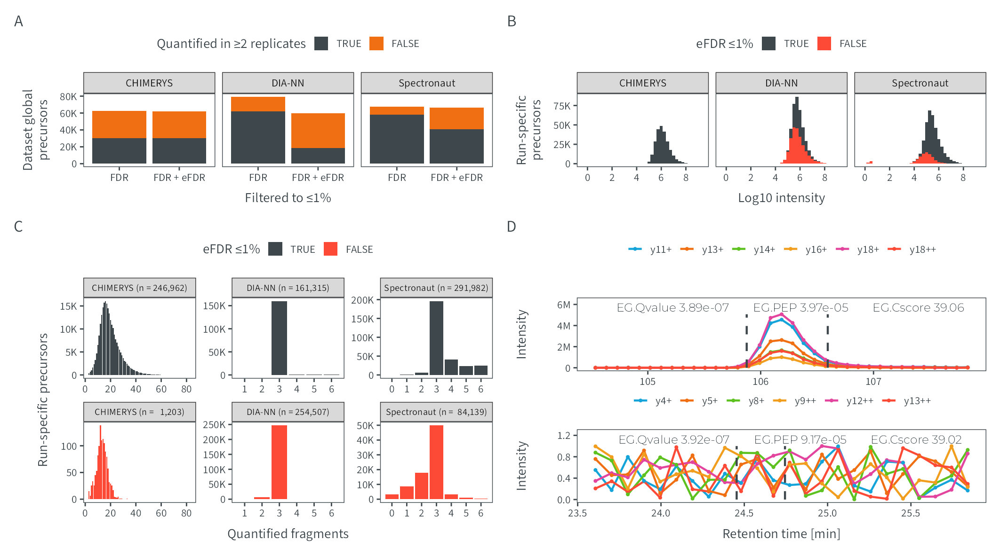

# Figure 3
MSAID
2024-11-27

- [Setup](#setup)
- [Data](#data)
  - [Entrapment IDs](#entrapment-ids)
  - [Precursor quan distribution](#precursor-quan-distribution)
  - [Fragments count](#fragments-count)
  - [XICs](#xics)
- [Figure](#figure)

# Setup

This document describes how the data analysis and plots for figure 3
were generated. To recreate the figures, make sure to download all input
files (available on
[PRIDE](https://www.ebi.ac.uk/pride/archive?keyword=PXD053241)), place
them under `dataPath` (adjust in `load-dependencies.R` to your own
folder structure) and generate intermediate results in the linked `.R`
scripts.

<details>
<summary>
Details on setup
</summary>

``` r
suppressMessages(source(here::here("scripts/load-dependencies.R")))
msaid_quantified <- c("TRUE" = msaid_darkgray, "FALSE" = msaid_orange)
msaid_eFDR <- c("TRUE" = msaid_darkgray, "FALSE" = msaid_red)

path <- file.path(here::here(), "figure-3")
figurePath <- file.path(dataPath, "figure-3")
```

</details>

# Data

<details>
<summary>
Details on data processing
</summary>

## Entrapment IDs

[R code to generate input file
`20241127_figure3a_bardata_pcmsConditionApexQuan_localPcmEfdr1_pepFasta.fst`](figure-3A-entrapment-barplot.R)

``` r
dtFdr <- read_fst(file.path(figurePath, "20241127_figure3a_bardata_pcmsConditionApexQuan_localPcmEfdr1_pepFasta.fst"),
                  as.data.table = T)
setnames(dtFdr, c("SOFTWARE", "CONDITION_MIN2_QUAN_FDR", "Survive 1%", "# of precursors in dataset"),
         c("software", "condMin2", "fdrType", "N"))
dtFdr[, fdrType := factor(fdrType, c("FDR", "eFDR"), c("FDR", "FDR + eFDR"))]
softwareLevels <- c("CHIMERYS", "DIA-NN", "SPECTRONAUT", "SPECTRONAUT_FILTERED")
softwareLabels <- c("CHIMERYS", "DIA-NN", "Spectronaut", "Spectronaut\n(curated)")
dtFdr[, software := factor(software, softwareLevels, softwareLabels)]
dtFdr[, isMin2 := factor(condMin2==2, c(T, F))]
dtFdr <- dtFdr[software %in% softwareLabels[1:3]]

dtFdr[, sum(N), keyby = .(software, fdrType, isMin2)]
```

    Key: <software, fdrType, isMin2>
           software    fdrType isMin2    V1
             <fctr>     <fctr> <fctr> <int>
     1:    CHIMERYS        FDR   TRUE 30469
     2:    CHIMERYS        FDR  FALSE 32012
     3:    CHIMERYS FDR + eFDR   TRUE 30324
     4:    CHIMERYS FDR + eFDR  FALSE 31808
     5:      DIA-NN        FDR   TRUE 61717
     6:      DIA-NN        FDR  FALSE 17509
     7:      DIA-NN FDR + eFDR   TRUE 18670
     8:      DIA-NN FDR + eFDR  FALSE 41126
     9: Spectronaut        FDR   TRUE 58029
    10: Spectronaut        FDR  FALSE  9678
    11: Spectronaut FDR + eFDR   TRUE 40610
    12: Spectronaut FDR + eFDR  FALSE 25613

``` r
p_eFdr <- ggplot(dtFdr, aes(x=fdrType, y=N, fill=isMin2)) +
  geom_bar(stat = "identity", position = position_stack(reverse = T)) +
  facet_grid(cols = vars(software)) +
  scale_y_continuous(labels = label_number(scale_cut = cut_short_scale())) +
  scale_fill_manual("Quantified in ≥2 replicates", values = msaid_quantified) +
  theme(legend.position = "top") +
  xlab("Filtered to ≤1%") + ylab("Dataset global\nprecursors")

round(dtFdr[software == 'CHIMERYS' & fdrType == 'FDR' & 
              condMin2 == 2, sum(N)] /
        dtFdr[software == 'CHIMERYS' & fdrType == 'FDR', sum(N)] * 100, 0)
```

    [1] 49

``` r
round(dtFdr[software == 'CHIMERYS' & fdrType == 'FDR + eFDR' & 
              condMin2 == 2, sum(N)] /
        dtFdr[software == 'CHIMERYS' & fdrType == 'FDR + eFDR', sum(N)] * 100, 0)
```

    [1] 49

``` r
round(dtFdr[software == 'Spectronaut' & fdrType == 'FDR' & 
              condMin2 == 2, sum(N)] /
        dtFdr[software == 'Spectronaut' & fdrType == 'FDR', sum(N)] * 100, 0)
```

    [1] 86

``` r
round(dtFdr[software == 'Spectronaut' & fdrType == 'FDR + eFDR' & 
              condMin2 == 2, sum(N)] /
        dtFdr[software == 'Spectronaut' & fdrType == 'FDR + eFDR', sum(N)] * 100, 0)
```

    [1] 61

``` r
round(dtFdr[software == 'DIA-NN' & fdrType == 'FDR' & 
              condMin2 == 2, sum(N)] /
        dtFdr[software == 'DIA-NN' & fdrType == 'FDR', sum(N)] * 100, 0)
```

    [1] 78

``` r
round(dtFdr[software == 'DIA-NN' & fdrType == 'FDR + eFDR' & 
              condMin2 == 2, sum(N)] /
        dtFdr[software == 'DIA-NN' & fdrType == 'FDR + eFDR', sum(N)] * 100, 0)
```

    [1] 31

## Precursor quan distribution

[R code to generate input file
`20241127_figure3a_combined_pcms_localPcmGrouper_apexQuan_pepEntr1.fst`](figure-3B-entrapment-histograms.R)

``` r
filePath <- file.path(figurePath, "20241127_figure3a_combined_pcms_localPcmGrouper_apexQuan_pepEntr1.fst")
colNames <- c("SOFTWARE", "SAMPLE", "ID", "QUAN", "Q_VALUE",
              "ENTRAPMENT_Q_VALUE", "ENTRAPMENT_Q_VALUE_1")
dtQuanPrec <- read_fst(filePath, as.data.table = T, columns = colNames)
softwareLevels <- c("CHIMERYS", "DIA-NN", "SPECTRONAUT", "SPECTRONAUT_FILTERED")
softwareLabels <- c("CHIMERYS", "DIA-NN", "Spectronaut", "Spectronaut\n(curated)")
dtQuanPrec[, SOFTWARE := factor(SOFTWARE, softwareLevels, softwareLabels)]
dtQuanPrec[SOFTWARE != "CHIMERYS", ENTRAPMENT_Q_VALUE := ENTRAPMENT_Q_VALUE_1]
dtQuanPrec[, isEfdr001 := factor(ENTRAPMENT_Q_VALUE <= 0.01, c(T, F))]
dtQuanPrec <- dtQuanPrec[Q_VALUE<=0.01 & SOFTWARE %in% softwareLabels[1:3]]

p_quanPrec <- ggplot(dtQuanPrec, aes(x=log10(QUAN), fill=isEfdr001)) +
  geom_histogram(binwidth = 0.25) +
  facet_grid(cols = vars(SOFTWARE)) +
  scale_x_continuous(breaks = breaks_extended(7)) +
  scale_y_continuous(labels = label_number(scale_cut = cut_short_scale())) +
  scale_fill_manual("eFDR ≤1%", values = msaid_eFDR) +
  theme(legend.position = "top") +
  xlab("Log10 intensity") + ylab("Run-specific\nprecursors")
```

## Fragments count

R code to generate input file
`20241127_figure3c_quanFrags_noNorm_pepFasta_localPcmFdr_pepFasta_apexQuan.fst`[figure-3C-fragment-counting-prep.R](figure-3C-fragment-counting-prep.R)
and [figure-3C-fragment-counting.R](figure-3C-fragment-counting.R)

``` r
filePathQuan <- file.path(figurePath, "20241127_figure3c_quanFrags_noNorm_pepFasta_localPcmFdr_pepFasta_apexQuan.fst")
dtFragQuan <- read_fst(filePathQuan, as.data.table = T)
softwareLevels <- c("CHIMERYS", "DIA-NN", "SPECTRONAUT")
softwareLabels <- c("CHIMERYS", "DIA-NN", "Spectronaut")
dtFragQuan[, SOFTWARE := factor(SOFTWARE, softwareLevels, softwareLabels)]
setnames(dtFragQuan, "QUAN_FRAGS", "FRAGS")

dtFragQuan[, isEfdr := factor(ENTRAPMENT_Q_VALUE<=0.01, c(T, F))]
cutBreaks <- c(-1, 0, 2, 3, 6, 12, 40, Inf)
dtFragQuan[, FRAGS_LABEL := factor(cut(FRAGS, cutBreaks), cut(cutBreaks[-1], cutBreaks),
                                   c("0", "1-2", "3", "4-6", "7-12", "12-40", ">40"))]
dtFragCountCut <- dtFragQuan[, .N, keyby=.(SOFTWARE, isEfdr, FRAGS_LABEL)]
maxN <- dtFragCountCut[, sum(N), by=.(SOFTWARE, FRAGS_LABEL)][, max(V1)]

dtFragCount <- dtFragQuan[, .N, keyby=.(SOFTWARE, isEfdr, FRAGS)]
#cross-join to force 0 bars within SOFTWARE
dtCj <- dtFragCount[, CJ(isEfdr, FRAGS, unique = T), by=SOFTWARE]
dtFragCount <- dtFragCount[dtCj, on=c("SOFTWARE", "isEfdr", "FRAGS")]
dtFragCount[is.na(N), N := 0]
#format labeling
isEfdrLabelLevels <- c("eFDR ≤1%", "eFDR >1%")
dtFragCount[, isEfdrLabel := factor(ifelse(isEfdr==T, isEfdrLabelLevels[1], isEfdrLabelLevels[2]), isEfdrLabelLevels)]
dtFragCountLabel <- dtFragCount[, .(label = paste("n =", format(sum(N), big.mark=",", trim=T))),
                                keyby=.(SOFTWARE, isEfdr, isEfdrLabel)]
dtFragCount[, totalCount := sum(N), by=.(SOFTWARE, isEfdr, isEfdrLabel)]
dtFragCount[, facetLabel := paste0(SOFTWARE, " (n = ", format(totalCount, big.mark=","), ")")]
facetLabelLevels <- dtFragCount[, unique(facetLabel), keyby=.(isEfdr, SOFTWARE)][, V1]
dtFragCount[, facetLabel := factor(facetLabel, facetLabelLevels)]

p_fragQuan <- ggplot(dtFragCount, aes(x=FRAGS, y=N, fill=isEfdr)) +
  geom_bar(stat = "identity") +
  facet_wrap(~ facetLabel, scales = "free") +
  scale_fill_manual("eFDR ≤1%", values = msaid_eFDR) +
  scale_y_continuous(labels = label_number(scale_cut = cut_short_scale())) +
  scale_x_continuous(breaks = pretty_breaks(n = 6)) +
  xlab("Quantified fragments") + ylab("Run-specific precursors") +
  theme(legend.position = "top", strip.text = element_text(size=4))
```

## XICs

[R code to generate input files
`20241118_figure3d_example_goodXic_apexQuan_pepEntr.fst` and
`20241118_figure3d_example_emptyXic_apexQuan_pepEntr.fst`](figure-3D-xics.R)

``` r
xicGood <- read_fst(file.path(figurePath, "20241127_figure3d_example_goodXic_apexQuan_pepEntr.fst"),
                    as.data.table = T)
IonLabelGoodLevels <- xicGood[, unique(IonLabel)]
IonLabelGoodLevelsLabel <- gsub("^\\[\\[(.*)\\].*\\]$", "\\1", IonLabelGoodLevels)
xicGood[, IonLabel := factor(IonLabel, IonLabelGoodLevels, IonLabelGoodLevelsLabel)]
rtGood <- xicGood[, c(unique(EG.StartRT), unique(EG.EndRT))]
labelGood <-
  paste0("EG.Qvalue ", format(unique(xicGood$Q_VALUE), digits = 3), "        ",
         "EG.PEP ", format(3.972671e-05, digits = 3), "        ",
         "EG.Cscore ", format(unique(xicGood$SVMSCORE), digits = 4))

p_xic_good <- ggplot(xicGood, aes(x=RT, y=Intensity, color=IonLabel)) +
  geom_line() +
  geom_point(size = 0.25) +
  annotate("line", x = rtGood[1], y = c(0, max(xicGood$Intensity)),
           linetype = "dashed", color = msaid_darkgray) +
  annotate("line", x = rtGood[2], y = c(0, max(xicGood$Intensity)),
           linetype = "dashed", color = msaid_darkgray) +
  scale_y_continuous(labels = label_number(scale_cut = cut_short_scale()),
                     limits = c(0, max(xicGood$Intensity)*1.25)) +
  scale_color_manual(NULL, values = msaid_col) +
  xlab(NULL) + ylab("Intensity") +
  annotate("text", x=mean(xicGood$RT), y=max(xicGood$Intensity)*1.25*0.9, hjust=0.475,
           label = labelGood, family="Montserrat Light", color=msaid_darkgray, size=6/.pt) +
  guides("color" = guide_legend(nrow = 1)) +
  theme(legend.position = "top", plot.background = element_rect("transparent", NA))


xicEmpty <- read_fst(file.path(figurePath, "20241127_figure3d_example_emptyXic_apexQuan_pepEntr.fst"),
                     as.data.table = T)
IonLabelEmptyLevels <- xicEmpty[, unique(IonLabel)]
IonLabelEmptyLevelsLabel <- gsub("^\\[\\[(.*)\\].*\\]$", "\\1", IonLabelEmptyLevels)
xicEmpty[, IonLabel := factor(IonLabel, IonLabelEmptyLevels, IonLabelEmptyLevelsLabel)]
rtEmpty <- xicEmpty[, c(unique(EG.StartRT), unique(EG.EndRT))]
labelEmpty <-
  paste0("EG.Qvalue ", format(unique(xicEmpty$Q_VALUE), digits = 3), "        ",
         "EG.PEP ", format(9.172532e-05, digits = 3), "        ",
         "EG.Cscore ", format(unique(xicEmpty$SVMSCORE), digits = 4))

p_xic_empty <- ggplot(xicEmpty, aes(x=RT, y=Intensity, color=IonLabel)) +
  geom_line() +
  geom_point(size = 0.25) +
  annotate("line", x = rtEmpty[1], y = c(0, 1), linetype = "dashed", color = msaid_darkgray) +
  annotate("line", x = rtEmpty[2], y = c(0, 1), linetype = "dashed", color = msaid_darkgray) +
  scale_y_continuous(labels = label_number(scale_cut = cut_short_scale()),
                     limits = c(0, max(xicEmpty$Intensity)*1.25)) +
  scale_color_manual(NULL, values = msaid_col) +
  xlab("Retention time [min]") + ylab("Intensity") +
  annotate("text", x=mean(xicEmpty$RT), y=max(xicEmpty$Intensity)*1.25*0.9, hjust=0.475,
           label = labelEmpty, family="Montserrat Light", color=msaid_darkgray, size=6/.pt) +
  guides("color" = guide_legend(nrow = 1)) +
  theme(legend.position = "top", plot.background = element_rect("transparent", NA))
```

</details>

# Figure

<details>
<summary>
Details on figure generation
</summary>

``` r
layout_annotation <- list(c("A", "B", "C", "D", ""))
layout_design <- "AAABBB\nCCCDDD\nCCCEEE\nCCCFFF"

p_DIA <- p_eFdr + p_quanPrec + p_fragQuan + p_xic_good + plot_spacer() + p_xic_empty +
  plot_layout(heights = c(1, 1, -0.6, 1), design = layout_design) +
  plot_annotation(tag_levels = layout_annotation)

suppressWarnings(ggsave2(file.path(path, "figure-3.pdf"), plot = p_DIA,
                         width = 180, height = 100, units = "mm", device = cairo_pdf))
suppressWarnings(ggsave2(file.path(path, "figure-3.png"), plot = p_DIA,
                         width = 180, height = 100, units = "mm"))
```

</details>


