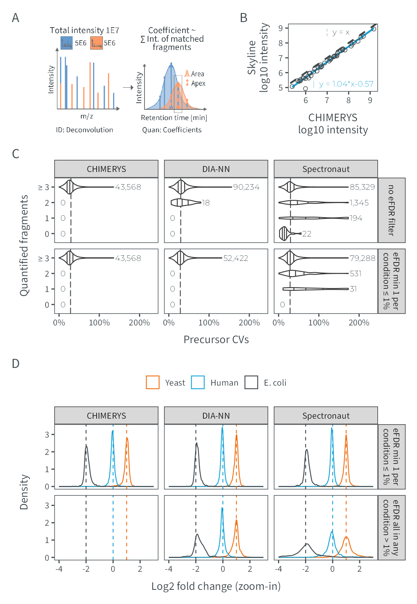

# Figure 4
MSAID
2024-12-20

- [Setup](#setup)
- [Data](#data)
  - [Skyline correlation](#skyline-correlation)
  - [CV violins](#cv-violins)
  - [Density plot](#density-plot)
- [Figure](#figure)

# Setup

This document describes how the data analysis and plots for figure 4
were generated. To recreate the figures, make sure to download all input
files (available on
[PRIDE](https://www.ebi.ac.uk/pride/archive?keyword=PXD053241)), place
them under `dataPath` (adjust in `load-dependencies.R` to your own
folder structure) and generate intermediate results in the linked `.R`
scripts.

<details>
<summary>
Details on setup
</summary>

``` r
suppressMessages(source(here::here("scripts/load-dependencies.R")))
msaid_SE <- c("Sequest HT" = msaid_orange, "CHIMERYS" = msaid_blue,
              "CHIMERYS\ntop 15 peaks" = msaid_lightblue)
msaid_quantified <- c("TRUE" = msaid_darkgray, "FALSE" = msaid_red)
msaid_organism <- c("Human" = msaid_blue, "Yeast" = msaid_orange, "E. coli" = msaid_darkgray)

path <- file.path(here::here(), "figure-4")
figurePath <- file.path(dataPath, "data/figure-4")
```

</details>

# Data

<details>
<summary>
Details on data processing
</summary>

## Skyline correlation

Intensities were exported directly from Skyline and matched to CHIMERYS
intensity values.

``` r
data_cor <- fread(file.path(figurePath, "intermediate/quan_corr_skyline.csv"))[, .(Peptide, CHIMERYS)]
data_new <- fread(file.path(figurePath, "intermediate/Skyline_pcm_quan_export_martin_max5fragments_240617_redo.csv"))
data_new <- data_new[, .(Peptide, SkylineNew = `Total Area Fragment`)]
data_cor <- merge(data_cor, data_new, by="Peptide", all=T)

fwrite(data_cor, file.path(figurePath, "figure-4B-correlation.csv"))

p_cor <- ggplot(data_cor, aes(x=log10(CHIMERYS), y=log10(SkylineNew))) +
  geom_abline(slope = 1, intercept = 0, color = msaid_darkgray, linetype = "dashed") +
  geom_smooth(method="lm", formula= y~x, col = msaid_blue, linewidth = 0.5) +
  geom_point(shape = 1L, stroke = 0.25, size = 1, color = msaid_darkgray) +
  xlab("CHIMERYS\nlog10 intensity") + ylab("Skyline\nlog10 intensity")
```

## CV violins

[R code to generate input file `figure-4C-CVs.csv`](figure-4C-cvs.R)

``` r
dtCv <- fread(file.path(figurePath, "figure-4C-CVs.csv"))

cvEfdrLabel <- c("no eFDR filter", "eFDR min 1 per\ncondition ≤ 1%")
dtCv[, TYPE := factor(TYPE, cvEfdrLabel)]
softwareLabels <- c("CHIMERYS", "DIA-NN", "Spectronaut", "Spectronaut\n(curated)")
dtCv[, SOFTWARE := factor(SOFTWARE, softwareLabels)]
dtCv[, LABEL := factor(LABEL, c("0", "1", "2", "≥ 3"))]

dtCvMed <- dtCv[!is.na(CV), .(medianCv = median(CV)), keyby=TYPE]

dtCvCount <- dtCv[!is.na(CV), .(.N, maxCv = max(CV)), keyby=.(TYPE, SOFTWARE, LABEL)]
dtCj <- dtCvCount[, CJ(TYPE, LABEL, SOFTWARE, unique = T)]
setkey(dtCj, TYPE, SOFTWARE, LABEL)
dtCvCount <- dtCvCount[dtCj]
dtCvCount[, maxCv := max(maxCv, na.rm = T), by=.(TYPE, SOFTWARE, LABEL)]
dtCvCount[is.na(N), N := 0]
dtCvCount[is.na(maxCv) | N<2, maxCv := 0]
dtCvCount[, labelN := format(N, big.mark=",", trim=T)]

p_cv <- ggplot(dtCv[!is.na(CV)], aes(x=CV, y=LABEL, fill=LABEL)) +
  geom_vline(data=dtCvMed, aes(xintercept = medianCv), linetype = "longdash",
             color = msaid_darkgray, linewidth = 0.25) +
  geom_violin(draw_quantiles = c(0.25, 0.5, 0.75), linewidth = 0.25) +
  geom_text(data=dtCvCount, aes(x=maxCv+max(maxCv)*0.02, label=labelN),
            position = position_dodge(0.9), color=msaid_darkgray,
            family="Montserrat Light", size=5/.pt, hjust = 0) +
  scale_x_continuous(labels = label_percent(), limits = c(0, 2.35)) +
  scale_fill_manual("Quantified fragments", values = colorRampPalette(c(msaid_red, msaid_darkgray))(4L),
                    breaks = c('0', '1', '2', '≥ 3'), drop = F) +
  facet_grid(cols = vars(SOFTWARE), rows = vars(TYPE)) +
  xlab("Precursor CVs") + ylab("Quantified fragments") +
  theme(legend.position = "none", plot.background = element_rect(fill = "transparent", colour = NA),
        strip.text = element_text(size = 5), axis.text.x = element_text(size = 5))

#list median CVs for the manuscript
dtCv[TYPE=="eFDR min 1 per\ncondition ≤ 1%" & !is.na(CV),
     round(median(CV)*100, 1), keyby=SOFTWARE]
```

    Key: <SOFTWARE>
          SOFTWARE    V1
            <fctr> <num>
    1:    CHIMERYS  26.9
    2:      DIA-NN  29.1
    3: Spectronaut  29.2

## Density plot

[R code to generate input file `figure-4D-density.csv`](figure-4D-ma.R)

``` r
dtOrg <- fread(file.path(figurePath, "figure-4D-density.csv"))
softwareLabels <- c("CHIMERYS", "DIA-NN", "Spectronaut", "Spectronaut\n(curated)")
dtOrg[, SOFTWARE := factor(SOFTWARE, softwareLabels)]
organismLabels <- c("Yeast", "Human", "E. coli")
organismRatios <- setNames(log2(c(2, 1, 0.25)), organismLabels)
dtOrg[, ORGANISM := factor(ORGANISM, organismLabels)]
efdrLabels <- c("eFDR min 1 per\ncondition ≤ 1%", "eFDR all in any\ncondition > 1%")
dtOrg[, eFdrLabelCond := factor(eFdrLabelCond, efdrLabels)]
dtMaLines <- data.table(YINTERCEPT = organismRatios, ORGANISM = factor(organismLabels))

p_density <- ggplot(dtOrg, aes(x=LOG2RATIO, color=ORGANISM)) +
  geom_density(linewidth=0.25) +
  geom_vline(data=dtMaLines, aes(xintercept=YINTERCEPT, color=ORGANISM),
             linetype = "dashed", linewidth = 0.25, show.legend = F) +
  scale_color_manual(NULL, values = msaid_organism) +
  scale_x_continuous(breaks = pretty_breaks(), limits = c(-4, 3)) +
  guides(fill = guide_legend(override.aes = list(color = NA, size = 2))) +
  facet_grid(rows = vars(eFdrLabelCond), cols = vars(SOFTWARE)) +
  xlab("Log2 fold change (zoom-in)") + ylab("Density") +
  theme(legend.position = "top", strip.text = element_text(size = 5))

#mean and sd of log2 ratios after eFDR filtering (at least 1 per each condition)
dtOrg[eFdrLabelCond=="eFDR min 1\nper condition ≤ 1%",
      .(mean = round(mean(LOG2RATIO, na.rm=T), 2),
        sd = round(sd(LOG2RATIO, na.rm=T), 2)), keyby=.(SOFTWARE, ORGANISM)]
```

    Key: <SOFTWARE, ORGANISM>
    Empty data.table (0 rows and 4 cols): SOFTWARE,ORGANISM,mean,sd

</details>

# Figure

<details>
<summary>
Details on figure generation
</summary>

``` r
p_schema <- image_ggplot2(image_read(file.path(path, "workflow-schema-4.pdf"),
                                       density = 600))

layout_annotation <- list(c("A", "B", "C", "D"))
layout_design <- "AAAABB\nCCCCCC\nDDDDDD"

p_ms2Quan <- free(p_schema) + p_cor + p_cv + p_density +
  plot_layout(heights = c(1, 2, 2), design = layout_design) +
  plot_annotation(tag_levels = layout_annotation)

ggsave2(file.path(path, "figure-4.pdf"), plot = p_ms2Quan,
        width = 90, height = 130, units = "mm", device = cairo_pdf)
```

    Warning: Removed 289 rows containing non-finite outside the scale range
    (`stat_density()`).

``` r
ggsave2(file.path(path, "figure-4.png"), plot = p_ms2Quan,
        width = 90, height = 130, units = "mm")
```

    Warning: Removed 289 rows containing non-finite outside the scale range
    (`stat_density()`).

</details>


