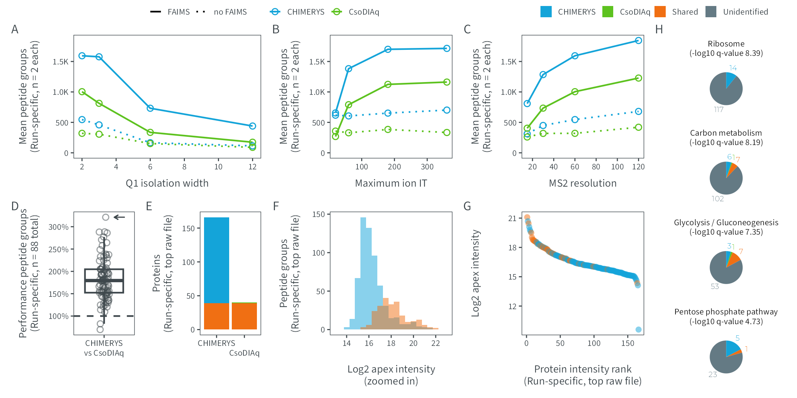

# Figure 5
MSAID
2024-12-17

- [Setup](#setup)
- [Data](#data)
  - [Count plots](#count-plots)
  - [Relative performance](#relative-performance)
  - [Sensitivity](#sensitivity)
  - [Rank plot](#rank-plot)
  - [Protein plot](#protein-plot)
  - [Cytoscape proteins](#cytoscape-proteins)
- [Figure](#figure)

# Setup

This document describes how the data analysis and plots for figure 5
were generated. To recreate the figures, make sure to download all input
files (available on
[PRIDE](https://www.ebi.ac.uk/pride/archive?keyword=PXD053241)), place
them under `dataPath` (adjust in `load-dependencies.R` to your own
folder structure) and generate intermediate results in the linked `.R`
scripts.

<details>
<summary>
Details on setup
</summary>

``` r
suppressMessages(source(here::here("scripts/load-dependencies.R")))
msaid_organism <- c("Human" = msaid_blue, "Yeast" = msaid_orange, "E. coli" = msaid_darkgray)

path <- file.path(here::here(), "figure-5")
figurePath <- file.path(dataPath, "data/figure-5")
```

</details>

# Data

<details>
<summary>
Details on plot generation
</summary>

[R code to generate all input `.csv`
files](figure-5AtoH-search-engine-results.R)

## Count plots

``` r
byCol <- c("type", "condition", "replicate", "sample", "condition_faims", "condition_iw",
           "condition_study", "condition_it", "condition_resolution")
shapeBoth <- c("no FAIMS" = "dotted", "FAIMS" = "solid")
colBoth <- c("CHIMERYS" = msaid_blue, "CsoDIAq" = msaid_green)
colShared <- c("CHIMERYS" = msaid_blue, "CsoDIAq" = msaid_green, "Shared" = msaid_orange)
colPathway <- c("CHIMERYS" = msaid_blue, "CsoDIAq" = msaid_green,
                "Shared" = msaid_orange, "Pathway" = msaid_gray)

counts_local <- fread(file.path(figurePath, "figure-5ABC-counts.csv"))
counts_local[, type := factor(type, c("CHIMERYS", "CsoDIAq"))]
counts_local[, condition_faims := factor(condition_faims, c("FAIMS", "no FAIMS"))]

#isolation width
counts_IW <- counts_local[like(condition, "60k-118ms-(2|3|6|12)th-1ov"),
                          .(N = round(mean(N))), keyby=c(byCol[c(-3L, -4L)])]
#injection time
counts_IT <- counts_local[condition_study=="it" & condition_iw==2,
                          .(N = round(mean(N))), keyby=c(byCol[c(-3L, -4L)])]
#ms2 resolution
counts_Res <- counts_local[condition_study=="res" & condition_iw==2,
                           .(N = round(mean(N))), keyby=c(byCol[c(-3L, -4L)])]

#plot
maxY <- max(c(counts_IW$N, counts_IT$N, counts_Res$N))
pIwBoth <-
  ggplot(counts_IW, aes(x=condition_iw, y=N, linetype=condition_faims,
                        color=type, group=paste(condition_faims, type))) +
  geom_line() +
  geom_point(shape = 1L) +
  xlab("Q1 isolation width") + ylab("Mean peptide groups\n(Run-specific, n = 2 each)") +
  scale_color_manual(NULL, values = colBoth) +
  scale_linetype_manual(NULL, values = shapeBoth) +
  scale_x_continuous(breaks = pretty_breaks()) +
  scale_y_continuous(limits = c(0, maxY),
                     labels = label_number(scale_cut = append(cut_short_scale(), 1, 1))) +
  theme(legend.position = "none")
pItBoth <-
  ggplot(counts_IT, aes(x=condition_it, y=N, linetype=condition_faims,
                        color=type, group=paste(condition_faims, type))) +
  geom_line() +
  geom_point(shape = 1L) +
  xlab("Maximum ion IT") + ylab("Mean peptide groups\n(Run-specific, n = 2 each)") +
  scale_color_manual(NULL, values = colBoth) +
  scale_linetype_manual(NULL, values = shapeBoth) +
  scale_x_continuous(breaks = pretty_breaks()) +
  scale_y_continuous(limits = c(0, maxY),
                     labels = label_number(scale_cut = append(cut_short_scale(), 1, 1))) +
  theme(legend.position = "none")
pResBoth <- 
  ggplot(counts_Res, aes(x=condition_resolution, y=N,  linetype=condition_faims,
                         color=type, group=paste(condition_faims, type))) +
  geom_line() +
  geom_point(shape = 1L) +
  xlab("MS2 resolution") + ylab("Mean peptide groups\n(Run-specific, n = 2 each)") +
  scale_color_manual(NULL, values = colBoth) +
  scale_linetype_manual(NULL, values = shapeBoth) +
  scale_x_continuous(breaks = pretty_breaks(6)) +
  scale_y_continuous(limits = c(0, maxY),
                     labels = label_number(scale_cut = append(cut_short_scale(), 1, 1))) +
  theme(legend.position = "none")
```

## Relative performance

``` r
#relative counts
rel_local <- fread(file.path(figurePath, "figure-5D-relative.csv"), sep=",")
rel_local[, type := factor(type, "CHIMERYS vs CsoDIAq", "CHIMERYS\nvs CsoDIAq")]
max_y <- rel_local[, max(rel)]

pRelLocalPaper <- ggplot(rel_local, aes(x=type, y=rel)) +
  geom_hline(yintercept = 1, color = msaid_darkgray, linetype = "dashed") +
  geom_boxplot(outliers = F, color = msaid_darkgray) +
  geom_point(shape = 1L, alpha = 0.5, color = msaid_darkgray,
             position = position_jitter(0.1, seed = 123L)) +
  geom_segment(x = 1.4, y = max_y, xend = 1.2, yend = max_y,
               arrow = arrow(length = unit(1, "mm")),
               linewidth = 0.25, color = msaid_darkgray) +
  scale_y_continuous(labels = label_percent()) +
  xlab(NULL) + ylab("Performance peptide groups\n(Run-specific, n = 88 total)")
```

## Sensitivity

``` r
results_sub <- fread(file.path(figurePath, "figure-5F-sensitivity.csv"))

pIntensityPaper <- ggplot(results_sub, aes(x=score_coefficient_lasso, fill=nTypeLabel)) +
  geom_histogram(binwidth = 0.5, position = "identity", alpha = 0.5) +
  scale_fill_manual(NULL, values = c("CHIMERYS" = msaid_blue, "Shared" = msaid_orange)) +
  scale_x_continuous(breaks = pretty_breaks()) +
  scale_y_continuous(labels = label_number(scale_cut = append(cut_short_scale(), 1, 1))) +
  xlab("Log2 apex intensity\n(zoomed in)") + ylab("Peptide groups\n(Run-specific, top raw file)") +
  coord_cartesian(xlim = c(13, 23)) + theme(legend.position = "none", legend.location = "plot")
```

## Rank plot

``` r
proteins_sub <- fread(file.path(figurePath, "figure-5G-rank.csv"))

pRankPaperProtein <- ggplot(proteins_sub, aes(x=rank, y=score_coefficient_lasso, color=nTypeLabel)) +
  geom_point(shape = 16L, alpha = 0.5) +
  scale_color_manual(NULL, values = c("CHIMERYS" = msaid_blue, "Shared" = msaid_orange)) +
  scale_x_continuous(labels = label_number(scale_cut = append(cut_short_scale(), 1, 1))) +
  xlab("Protein intensity rank\n(Run-specific, top raw file)") + ylab("Log2 apex intensity") +
  theme(legend.position = "none")
```

## Protein plot

``` r
proteins_sub2_count <- fread(file.path(figurePath, "figure-E-protein.csv"))
proteins_sub2_count[, type := factor(type, c("CHIMERYS", "CsoDIAq"),
                                     c("CHIMERYS", "\nCsoDIAq"))]

p_prot_bar <- ggplot(proteins_sub2_count, aes(x=type, y=N, fill=nTypeLabel)) +
  geom_bar(stat = "identity") +
  scale_fill_manual(NULL, values = colShared) +
  xlab(NULL) + ylab("Proteins\n(Run-specific, top raw file)") +
  theme(legend.position = "none")
```

## Cytoscape proteins

``` r
pie <- fread(file.path(figurePath, "figure-5H-cytoscape.csv"))
term <- unique(pie$description)[c(1, 2, 3, 6)]
pie[, variable := factor(variable, c("Pathway", "Shared", "CsoDIAq", "CHIMERYS"))]
pie[, description := factor(description, unique(description))]

p_pie <- ggplot(pie[description %in% term], aes(x="", y=value, fill=variable)) +
  geom_bar(stat = "identity") +
  geom_text(aes(label = value, y = pos, color=variable), nudge_x = 0.75,
            size = 5/.pt, family = "Montserrat Light", show.legend = FALSE) +
  scale_fill_manual(NULL, values = colPathway) +
  scale_color_manual(NULL, values = colPathway) +
  facet_wrap(vars(description), scales = "free", ncol = 1) +
  xlab(NULL) + ylab(NULL) +
  coord_polar(theta = "y") +
  guides(fill=guide_legend(nrow = 1, reverse = TRUE)) +
  theme(legend.position = "none",
        rect = element_blank(),
        panel.border = element_blank(),
        axis.line=element_blank(),axis.text.x=element_blank(),
        axis.text.y=element_blank(),axis.ticks=element_blank(),
        axis.title.x=element_blank(),
        axis.title.y=element_blank(),
        strip.clip = "off")
```

</details>

# Figure

<details>
<summary>
Details on figure generation
</summary>

``` r
p_legend <- ggdraw(get_plot_component(pIwBoth + theme(legend.position = "top"),
                                      'guide-box-top', return_all = TRUE))
p_legend2 <- ggdraw(get_plot_component(p_pie + theme(legend.position = "top"),
                                       'guide-box-top', return_all = TRUE))
p_design <- "AAAABBBB\nCCDDEEFF\nGHIIJJFF"
p_fig5 <- p_legend + p_legend2 +
  pIwBoth + pItBoth + pResBoth + free(p_pie) +
  pRelLocalPaper + p_prot_bar + pIntensityPaper + pRankPaperProtein +
  plot_layout(heights = c(0.1, 1, 1), design = p_design) +
  plot_annotation(tag_levels = list(c("", "", "A", "B", "C", "H", "D", "E", "F", "G")))

suppressWarnings(ggsave2(file.path(path, "figure-5.pdf"), plot = p_fig5,
                         width = 180, height = 90, units = "mm", device = cairo_pdf))
suppressWarnings(ggsave2(file.path(path, "figure-5.png"), plot = p_fig5,
                         width = 180, height = 90, units = "mm"))
```

</details>


