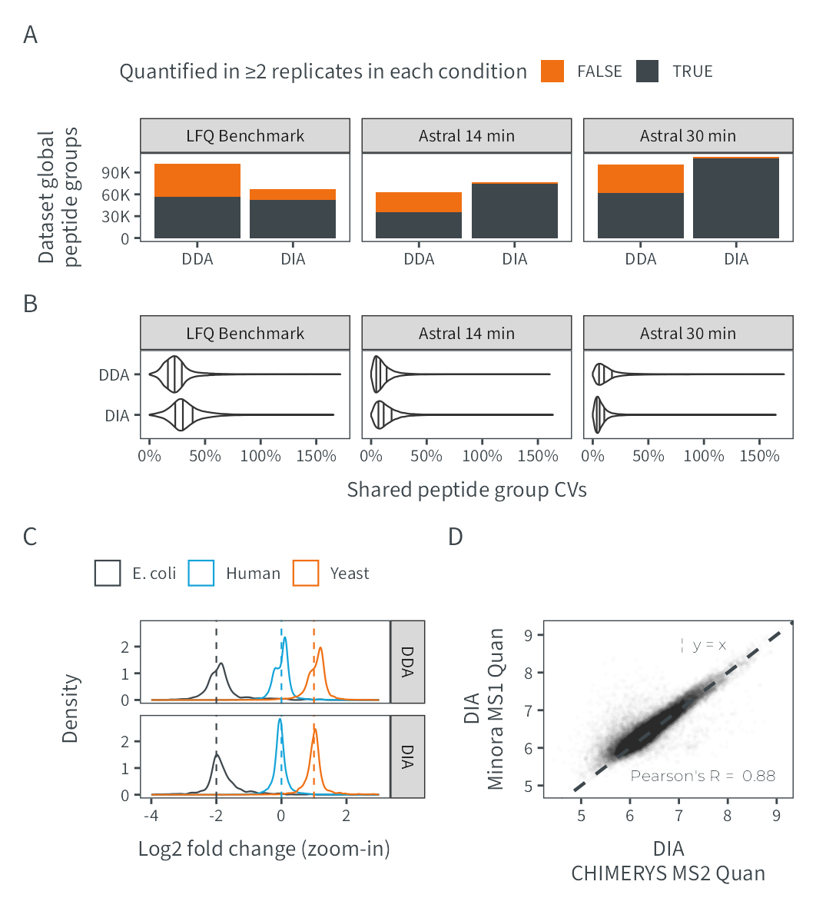

# Figure 6
MSAID
2025-01-24

- [Setup](#setup)
- [Library](#library)
- [Data](#data)
  - [Peptide Group IDs](#peptide-group-ids)
  - [CVs](#cvs)
  - [Density plot](#density-plot)
  - [Quan correlation](#quan-correlation)
- [Plot](#plot)

# Setup

This document describes how the data analysis and plots for figure 6
were generated. To recreate the figures, make sure to download all input
files (available on
[PRIDE](https://www.ebi.ac.uk/pride/archive?keyword=PXD053241)), place
them under `dataPath` (adjust in `load-dependencies.R` to your own
folder structure) and generate intermediate results in the linked `.R`
scripts.

<details>
<summary>
Details on setup
</summary>

# Library

``` r
suppressMessages(source(here::here("scripts/load-dependencies.R")))
msaid_quantified <- c("TRUE" = msaid_darkgray, "FALSE" = msaid_orange)
msaid_eFDR <- c("TRUE" = msaid_darkgray, "FALSE" = msaid_red)
msaid_organism <- c("Human" = msaid_blue, "Yeast" = msaid_orange, "E. coli" = msaid_darkgray)

path <- file.path(here::here(), "figure-6")
figurePath <- file.path(dataPath, "data/figure-6")
```

</details>

# Data

<details>
<summary>
Details on data processing
</summary>

[R code to generate all `.csv` input files](id-counts.R)

## Peptide Group IDs

``` r
dtIds <- fread(file.path(figurePath, "figure-6A-counts.csv"))
dtIds[, type := factor(type, c("LFQ Benchmark", "Astral 14 min", "Astral 30 min"))]
dtIds[, condition_MS := factor(condition_MS, c("DDA", "DIA"))]

p_pepGrId <- ggplot(dtIds, aes(x=condition_MS, y=N, fill=isQuanMin2)) +
  geom_bar(stat = "identity") +
  scale_y_continuous(labels = label_number(scale_cut = cut_short_scale())) +
  scale_fill_manual("Quantified in ≥2 replicates in each condition", values = msaid_quantified) +
  facet_grid(cols = vars(type)) +
  theme(legend.position = "top", legend.location = "plot") +
  xlab(NULL) + ylab("Dataset global\npeptide groups")
```

## CVs

``` r
dtCvs <- fread(file.path(figurePath, "figure-6B-CVs.csv"))
dtCvs[, type := factor(type, c("LFQ Benchmark", "Astral 14 min", "Astral 30 min"))]
dtCvs[, condition_MS := factor(condition_MS, c("DDA", "DIA"))]

p_Cvs <- ggplot(dtCvs, aes(x=cv, y=condition_MS)) +
  geom_violin(draw_quantiles = c(0.25, 0.5, 0.75), linewidth = 0.25) +
  scale_x_continuous(labels = label_percent()) +
  scale_y_discrete(limits = rev) +
  facet_grid(cols = vars(type)) +
  xlab("Shared peptide group CVs") + ylab(NULL) +
  theme(plot.background = element_rect(fill = "transparent", colour = NA))
```

## Density plot

``` r
dtLfqOrg <- fread(file.path(figurePath, "figure-6C-density.csv"))
contrastLabels <- c("DDA (Minora MS1 Quan)", "DIA (CHIMERYS MS2 Quan)")
dtLfqOrg[, contrastLabel := factor(contrastLabel, contrastLabels, c("DDA", "DIA"))]
organismLabels <- c("E. coli", "Human", "Yeast")
organismRatios <- setNames(log2(c(0.25, 1, 2)), organismLabels)
dtLfqOrg[, organism := factor(organism, organismLabels)]

dtMaLines <- data.table(YINTERCEPT = organismRatios, organism = factor(organismLabels))

p_lfq_org <- ggplot(dtLfqOrg, aes(x=ratio, color=organism)) +
  geom_density(linewidth=0.25) +
  geom_vline(data=dtMaLines, aes(xintercept=YINTERCEPT, color=organism),
             linetype = "dashed", linewidth = 0.25, show.legend = F) +
  scale_color_manual(NULL, values = msaid_organism) +
  scale_x_continuous(breaks = pretty_breaks(), limits = c(-4, 3)) +
  guides(fill = guide_legend(override.aes = list(color = NA, size = 2))) +
  facet_grid(rows = vars(contrastLabel)) +
  xlab("Log2 fold change (zoom-in)") + ylab("Density") +
  theme(legend.position = "top", legend.location = "plot", axis.title.x = element_text(hjust = 0.8))
```

## Quan correlation

[R code to generate input file `LFQ3_cor_DIA.csv`](id-counts.R)

``` r
dtLfqCor <- fread(file.path(figurePath, "figure-6D-correlation.csv"))
corLfq <- dtLfqCor[, round(cor(log10(2^CHIMERYS), log10(2^Minora), method = "pearson"), 2)]
corLfq <- paste("Pearson's R = ", corLfq)

p_lfq_cor <- ggplot(dtLfqCor, aes(x=log10(2^CHIMERYS), y=log10(2^Minora))) +
  rasterise(geom_point(shape = 16L, size = 0.25, alpha = 0.01), dpi = 600) +
  annotate("text", x = 7.5, y = 8.75, label = "¦  y = x",
           size = 5/.pt, family = "Montserrat Light", color = msaid_darkgray) +
  annotate("text", x = 7.5, y = 5.25, label = corLfq,
           size = 5/.pt, family = "Montserrat Light", color = msaid_darkgray) +
  geom_abline(slope = 1, intercept = 0, color = msaid_darkgray, linetype = "dashed") +
  xlab("DIA\nCHIMERYS MS2 Quan") + ylab("DIA\nMinora MS1 Quan")
```

</details>

# Plot

<details>
<summary>
Details on plot generation
</summary>

``` r
layout_annotation <- list(c("A", "B", "C", "D"))
layout_design <- "AAAAAA\nBBBBBB\nCCCDDD"

p_fig5 <- p_pepGrId + p_Cvs + p_lfq_org + p_lfq_cor +
  plot_layout(heights = c(1, 1, 2, 1, 1), design = layout_design) +
  plot_annotation(tag_levels = layout_annotation)

ggsave2(file.path(path, "figure-6.pdf"), plot = p_fig5,
        width = 90, height = 100, units = "mm", device = cairo_pdf)
```

    Warning: Removed 256 rows containing non-finite outside the scale range
    (`stat_density()`).

``` r
ggsave2(file.path(path, "figure-6.png"), plot = p_fig5,
        width = 90, height = 100, units = "mm")
```

    Warning: Removed 256 rows containing non-finite outside the scale range
    (`stat_density()`).

</details>


