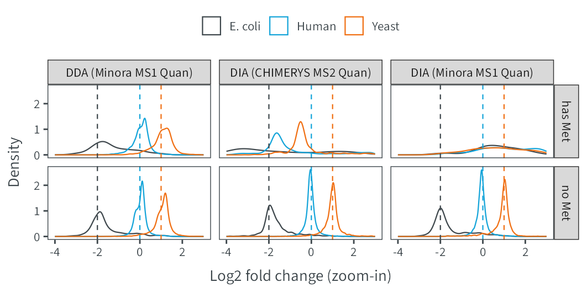
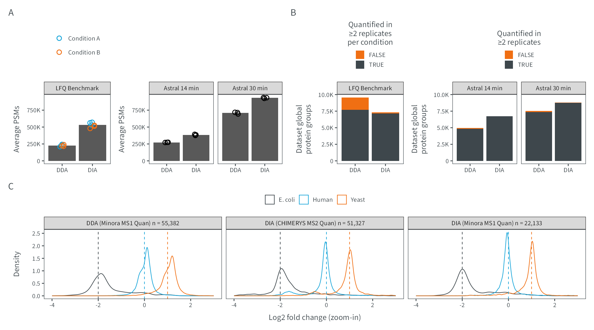

# Figure E10
MSAID
2025-04-23

- [Setup](#setup)
- [Data](#data)
  - [PSMs](#psms)
  - [Protein groups](#protein-groups)
  - [Ratio densities](#ratio-densities)
  - [Correction: Methionine](#correction-methionine)
- [Figure](#figure)

# Setup

This document describes how the data analysis and plots for extended
figure 9 were generated. To recreate the figures, make sure to download
all input files (available on
[PRIDE](https://www.ebi.ac.uk/pride/archive?keyword=PXD053241)), place
them under `dataPath` (adjust in `load-dependencies.R` to your own
folder structure) and generate intermediate results in the linked `.R`
scripts.

<details>
<summary>
Details on setup
</summary>

``` r
suppressMessages(source(here::here("scripts/load-dependencies.R")))
path <- file.path(here::here(), "figure-E10")
figurePath <- file.path(dataPath, "data/figure-E10")
msaid_quantified <- c("TRUE" = msaid_darkgray, "FALSE" = msaid_orange)
msaid_eFDR <- c("TRUE" = msaid_darkgray, "FALSE" = msaid_red)
msaid_organism <- c("Human" = msaid_blue, "Yeast" = msaid_orange, "E. coli" = msaid_darkgray)
```

</details>

# Data

<details>
<summary>
Details on data processing
</summary>

## PSMs

[R code to generate input files `figure-E10A-LFQ3.csv`,
`figure-E10A-Astral14.csv` and
`figure-E10A-Astral30.csv`](figure-E10AB-counts.R)

``` r
#LFQ3
countPsmLfq <- fread(file.path(figurePath, "figure-E10A-LFQ3.csv"))
countPsmLfq[, condition := factor(condition, c("DDA-CondA", "DDA-CondB", "DIA-CondA", "DIA-CondB"))]
countPsmLfq[, condition_MS := factor(gsub("^(.*)-.*$", "\\1", condition), c("DDA", "DIA"))]
countPsmLfq[, condition_org := factor(gsub("^.*-(.*)$", "\\1", condition), c("CondA", "CondB"),
                                      c("Condition A", "Condition B"))]
countPsmLfq[, type := factor("LFQ Benchmark")]

#Astral
countPsmAst14 <- fread(file.path(figurePath, "figure-E10A-Astral14.csv"))
countPsmAst14[, condition_MS := factor(condition, c("DDA", "DIA"))]
countPsmAst14[, type := factor("Astral 14 min")]

countPsmAst30 <- fread(file.path(figurePath, "figure-E10A-Astral30.csv"))
countPsmAst30[, condition_MS := factor(condition, c("DDA", "DIA"))]
countPsmAst30[, type := factor("Astral 30 min")]

countPsmAst <- rbind(countPsmAst14, countPsmAst30)

#plots
maxPsmN <- max(c(countPsmLfq$N, countPsmAst$N))

p_psmLfq <- ggplot(countPsmLfq, aes(x=condition_MS, y=N)) +
  geom_bar(stat = "summary", fun = mean) +
  geom_jitter(aes(color=condition_org), shape = 1L, width = 0.1, height = 0) +
  scale_color_manual(NULL, values = c("Condition A" = msaid_blue, "Condition B" = msaid_orange)) +
  scale_y_continuous(labels = label_number(scale_cut = cut_short_scale2()),
                     limits = c(0, maxPsmN)) +
  guides(color = guide_legend(nrow = 2)) +
  facet_grid(cols = vars(type)) +
  xlab(NULL) + ylab("Average PSMs") + theme(legend.position = "top", legend.title = element_text(hjust = 0.5))

p_psmAst <- ggplot(countPsmAst, aes(x=condition_MS, y=N)) +
  geom_bar(stat = "summary", fun = mean) +
  geom_jitter(shape = 1L, width = 0.1, height = 0) +
  scale_y_continuous(labels = label_number(scale_cut = cut_short_scale2()),
                     limits = c(0, maxPsmN)) +
  facet_grid(cols = vars(type)) +
  xlab(NULL) + ylab("Average PSMs")
```

## Protein groups

[R code to generate input files `figure-E10B-LFQ3.csv`,
`figure-E10B-Astral14.csv` and
`figure-E10B-Astral30.csv`](figure-E10AB-counts.R)

``` r
#LFQ3
countProtGrpLfq <- fread(file.path(figurePath, "figure-E10B-LFQ3.csv"))
contrasts <- c("DDA-CondA_vs_DDA-CondB", "DIA-CondA_vs_DIA-CondB")
contrastLabels <- c("DDA (Minora MS1 Quan)", "DIA (CHIMERYS MS2 Quan)")
countProtGrpLfq[, contrastLabel := factor(contrast, contrasts, contrastLabels)]
countProtGrpLfq[, condition_MS := factor(contrast, contrasts, c("DDA", "DIA"))]
countProtGrpLfq[, type := factor("LFQ Benchmark")]

#Astral
countProtGrpAst14 <- fread(file.path(figurePath, "figure-E10B-Astral14.csv"))
countProtGrpAst14[, condition := factor(condition, c("DDA", "DIA"))]
countProtGrpAst14[, type := factor("Astral 14 min")]

countProtGrpAst30 <- fread(file.path(figurePath, "figure-E10B-Astral30.csv"))
countProtGrpAst30[, condition := factor(condition, c("DDA", "DIA"))]
countProtGrpAst30[, type := factor("Astral 30 min")]

countProtGrpAst <- rbind(countProtGrpAst14, countProtGrpAst30)

#plots
maxPrtN <- max(c(countProtGrpLfq[, sum(N), by=condition_MS][, V1],
                 countProtGrpAst[, sum(N), by=.(type, condition)][, V1]))

p_prtLfq <- ggplot(countProtGrpLfq, aes(x=condition_MS, y=N, fill=isQuanMin2Each)) +
  geom_bar(stat = "identity") +
  scale_y_continuous(labels = label_number(scale_cut = cut_short_scale2()),
                     limits = c(0, maxPrtN)) +
  scale_fill_manual("Quantified in\n≥2 replicates\nper condition", values = msaid_quantified) +
  theme(legend.position = "top", legend.title = element_text(hjust = 0.5)) +
  guides(fill = guide_legend(nrow = 2, direction = "vertical")) +
  facet_grid(cols = vars(type)) +
  xlab(NULL) + ylab("Dataset global\nprotein groups")

p_prtAst <- ggplot(countProtGrpAst, aes(x=condition, y=N, fill=isQuanMin2)) +
  geom_bar(stat = "identity") +
  facet_grid(cols = vars(type)) +
  scale_y_continuous(labels = label_number(scale_cut = cut_short_scale2()),
                     limits = c(0, maxPrtN)) +
  scale_fill_manual("Quantified in\n≥2 replicates", values = msaid_quantified) +
  guides(fill = guide_legend(nrow = 2, direction = "vertical")) +
  theme(legend.position = "top", legend.title = element_text(hjust = 0.5)) +
  xlab(NULL) + ylab("Dataset global\nprotein groups")
```

## Ratio densities

[R code to generate input file
`figure-E10C-density.csv`](figure-E10C-density.R)

``` r
organismLabels <- c("E. coli", "Human", "Yeast")
organismRatios <- setNames(log2(c(0.25, 1, 2)), organismLabels)
dtLines <- data.table(YINTERCEPT = organismRatios, organism = factor(organismLabels))

dtRatios <- fread(file.path(figurePath, "figure-E10C-density.csv"))
dtRatios[, organism := factor(organism, organismLabels)]
contrastLabels <- c("DDA (Minora MS1 Quan)",
                    "DIA (Minora MS1 Quan)",
                    "DIA (CHIMERYS MS2 Quan)")
dtRatios[, contrastLabel := factor(contrastLabel, contrastLabels)]
dtRatiosNoMet <- dtRatios[hasMethionine=="no Met"]
dtRatiosNoMet[, nRatios := .N, by=contrastLabel]
dtRatiosNoMet[, contrasLabelN := paste0(contrastLabel, " n = ", format(nRatios, big.mark=",", trim=T))]

p_ratio <- ggplot(dtRatiosNoMet, aes(x=ratio, color=organism)) +
  geom_density(linewidth=0.25) +
  geom_vline(data=dtLines, aes(xintercept=YINTERCEPT, color=organism),
             linetype = "dashed", linewidth = 0.25, show.legend = F) +
  scale_color_manual(NULL, values = msaid_organism) +
  scale_x_continuous(breaks = pretty_breaks(), limits = c(-4, 3)) +
  guides(fill = guide_legend(override.aes = list(color = NA, size = 2))) +
  facet_grid(cols = vars(contrasLabelN)) +
  xlab("Log2 fold change (zoom-in)") + ylab("Density") +
  theme(legend.position = "top")
```

</details>

## Correction: Methionine

It was brought to our attention that figure E10 panel C does not filter
out Methionine-containing peptides, as stated in the [paper Methods
section](https://www.nature.com/articles/s41592-025-02663-w#data-availability):

> Notably, peptides containing methionine residues were excluded from
> all analyses of the LFQBench-type dataset, as raw files might show
> differential oxidation.

Even though this filter was created in figure E10 (see [R code to
generate input file `figure-E10C-density.csv` line
36](figure-E10C-density.R)), it was not used to actually filter - thus
the figure still includes Methionine-containing peptides at time of
publication. In this version of the Github code, this was corrected. The
figure below shows how Methionine-containing peptides in the DIA files
are regulated substantially differently than those that are
Methionine-free (in both MS1 and MS2 quantification approaches).

<details>
<summary>
Details on figure generation
</summary>

``` r
contrastLabels2 <- c("DDA (Minora MS1 Quan)", "DIA (CHIMERYS MS2 Quan)", "DIA (Minora MS1 Quan)")
dtRatios[, contrastLabel2 := factor(contrastLabel, contrastLabels2)]

p_ratio_Met <- ggplot(dtRatios, aes(x=ratio, color=organism)) +
  geom_density(linewidth=0.25) +
  geom_vline(data=dtLines, aes(xintercept=YINTERCEPT, color=organism),
             linetype = "dashed", linewidth = 0.25, show.legend = F) +
  scale_color_manual(NULL, values = msaid_organism) +
  scale_x_continuous(breaks = pretty_breaks(), limits = c(-4, 3)) +
  guides(fill = guide_legend(override.aes = list(color = NA, size = 2))) +
  facet_grid(cols = vars(contrastLabel2), rows = vars(hasMethionine)) +
  xlab("Log2 fold change (zoom-in)") + ylab("Density") +
  theme(legend.position = "top")

ggsave2(file.path(path, "figure-E10-Met.png"), plot = p_ratio_Met,
        width = 90, height = 45, units = "mm")
```

    Warning: Removed 1919 rows containing non-finite outside the scale range
    (`stat_density()`).

</details>



<details>
<summary>
Details on raw file meta information
</summary>

Looking into the raw file meta information, we can see that these 150
min gradient files were measured over the course of **four days**, and
although the order was preserved for conditions, this may have
contributed to sample degradation, e.g. via oxidation.

| Raw_file | File_header | Comment |
|----|----|----|
| LFQ_Orbitrap_AIF_Condition_A_Sample_Alpha_01 | 2021-03-14 11:45:19 | Cal 29-01-2021-colonne Thermo 2um -U3000 CHR011 |
| LFQ_Orbitrap_AIF_Condition_A_Sample_Alpha_02 | 2021-03-10 11:37:06 | Cal 29-01-2021-colonne Thermo 2um -U3000 CHR011 |
| LFQ_Orbitrap_AIF_Condition_A_Sample_Alpha_03 | 2021-03-11 20:49:00 | Cal 29-01-2021-colonne Thermo 2um -U3000 CHR011 |
| LFQ_Orbitrap_AIF_Condition_B_Sample_Alpha_01 | 2021-03-14 15:08:35 | Cal 29-01-2021-colonne Thermo 2um -U3000 CHR011 |
| LFQ_Orbitrap_AIF_Condition_B_Sample_Alpha_02 | 2021-03-10 15:00:22 | Cal 29-01-2021-colonne Thermo 2um -U3000 CHR011 |
| LFQ_Orbitrap_AIF_Condition_B_Sample_Alpha_03 | 2021-03-12 00:12:17 | Cal 29-01-2021-colonne Thermo 2um -U3000 CHR011 |

</details>

# Figure

<details>
<summary>
Details on figure generation
</summary>

``` r
p_design <- c("ABBCDD\nEEEEEE")
p_annotation <- list(c("A", "", "B", "", "C"))

p <- p_psmLfq + p_psmAst + p_prtLfq + p_prtAst + p_ratio +
  plot_layout(design = p_design, heights = c(1, 1)) +
  plot_annotation(tag_levels = p_annotation)

ggsave2(file.path(path, "figure-E10.pdf"), plot = p,
        width = 180, height = 100, units = "mm", device = cairo_pdf)
```

    Warning: Removed 406 rows containing non-finite outside the scale range
    (`stat_density()`).

``` r
ggsave2(file.path(path, "figure-E10.png"), plot = p,
        width = 180, height = 100, units = "mm")
```

    Warning: Removed 406 rows containing non-finite outside the scale range
    (`stat_density()`).

``` r
ggsave2(file.path(path, "figure-E10.eps"), plot = p,
        width = 180, height = 100, units = "mm")
```

    Warning in grid.Call(C_stringMetric, as.graphicsAnnot(x$label)): font family
    'Source Sans 3' not found in PostScript font database

    Warning in grid.Call(C_stringMetric, as.graphicsAnnot(x$label)): font family
    'Source Sans 3' not found in PostScript font database
    Warning in grid.Call(C_stringMetric, as.graphicsAnnot(x$label)): font family
    'Source Sans 3' not found in PostScript font database
    Warning in grid.Call(C_stringMetric, as.graphicsAnnot(x$label)): font family
    'Source Sans 3' not found in PostScript font database
    Warning in grid.Call(C_stringMetric, as.graphicsAnnot(x$label)): font family
    'Source Sans 3' not found in PostScript font database
    Warning in grid.Call(C_stringMetric, as.graphicsAnnot(x$label)): font family
    'Source Sans 3' not found in PostScript font database
    Warning in grid.Call(C_stringMetric, as.graphicsAnnot(x$label)): font family
    'Source Sans 3' not found in PostScript font database
    Warning in grid.Call(C_stringMetric, as.graphicsAnnot(x$label)): font family
    'Source Sans 3' not found in PostScript font database
    Warning in grid.Call(C_stringMetric, as.graphicsAnnot(x$label)): font family
    'Source Sans 3' not found in PostScript font database
    Warning in grid.Call(C_stringMetric, as.graphicsAnnot(x$label)): font family
    'Source Sans 3' not found in PostScript font database
    Warning in grid.Call(C_stringMetric, as.graphicsAnnot(x$label)): font family
    'Source Sans 3' not found in PostScript font database
    Warning in grid.Call(C_stringMetric, as.graphicsAnnot(x$label)): font family
    'Source Sans 3' not found in PostScript font database
    Warning in grid.Call(C_stringMetric, as.graphicsAnnot(x$label)): font family
    'Source Sans 3' not found in PostScript font database
    Warning in grid.Call(C_stringMetric, as.graphicsAnnot(x$label)): font family
    'Source Sans 3' not found in PostScript font database

    Warning in grid.Call(C_textBounds, as.graphicsAnnot(x$label), x$x, x$y, : font
    family 'Source Sans 3' not found in PostScript font database
    Warning in grid.Call(C_textBounds, as.graphicsAnnot(x$label), x$x, x$y, : font
    family 'Source Sans 3' not found in PostScript font database
    Warning in grid.Call(C_textBounds, as.graphicsAnnot(x$label), x$x, x$y, : font
    family 'Source Sans 3' not found in PostScript font database
    Warning in grid.Call(C_textBounds, as.graphicsAnnot(x$label), x$x, x$y, : font
    family 'Source Sans 3' not found in PostScript font database
    Warning in grid.Call(C_textBounds, as.graphicsAnnot(x$label), x$x, x$y, : font
    family 'Source Sans 3' not found in PostScript font database
    Warning in grid.Call(C_textBounds, as.graphicsAnnot(x$label), x$x, x$y, : font
    family 'Source Sans 3' not found in PostScript font database
    Warning in grid.Call(C_textBounds, as.graphicsAnnot(x$label), x$x, x$y, : font
    family 'Source Sans 3' not found in PostScript font database
    Warning in grid.Call(C_textBounds, as.graphicsAnnot(x$label), x$x, x$y, : font
    family 'Source Sans 3' not found in PostScript font database

    Warning in grid.Call(C_stringMetric, as.graphicsAnnot(x$label)): font family
    'Source Sans 3' not found in PostScript font database
    Warning in grid.Call(C_stringMetric, as.graphicsAnnot(x$label)): font family
    'Source Sans 3' not found in PostScript font database
    Warning in grid.Call(C_stringMetric, as.graphicsAnnot(x$label)): font family
    'Source Sans 3' not found in PostScript font database
    Warning in grid.Call(C_stringMetric, as.graphicsAnnot(x$label)): font family
    'Source Sans 3' not found in PostScript font database
    Warning in grid.Call(C_stringMetric, as.graphicsAnnot(x$label)): font family
    'Source Sans 3' not found in PostScript font database
    Warning in grid.Call(C_stringMetric, as.graphicsAnnot(x$label)): font family
    'Source Sans 3' not found in PostScript font database
    Warning in grid.Call(C_stringMetric, as.graphicsAnnot(x$label)): font family
    'Source Sans 3' not found in PostScript font database
    Warning in grid.Call(C_stringMetric, as.graphicsAnnot(x$label)): font family
    'Source Sans 3' not found in PostScript font database
    Warning in grid.Call(C_stringMetric, as.graphicsAnnot(x$label)): font family
    'Source Sans 3' not found in PostScript font database
    Warning in grid.Call(C_stringMetric, as.graphicsAnnot(x$label)): font family
    'Source Sans 3' not found in PostScript font database
    Warning in grid.Call(C_stringMetric, as.graphicsAnnot(x$label)): font family
    'Source Sans 3' not found in PostScript font database
    Warning in grid.Call(C_stringMetric, as.graphicsAnnot(x$label)): font family
    'Source Sans 3' not found in PostScript font database
    Warning in grid.Call(C_stringMetric, as.graphicsAnnot(x$label)): font family
    'Source Sans 3' not found in PostScript font database
    Warning in grid.Call(C_stringMetric, as.graphicsAnnot(x$label)): font family
    'Source Sans 3' not found in PostScript font database

    Warning in grid.Call(C_textBounds, as.graphicsAnnot(x$label), x$x, x$y, : font
    family 'Source Sans 3' not found in PostScript font database
    Warning in grid.Call(C_textBounds, as.graphicsAnnot(x$label), x$x, x$y, : font
    family 'Source Sans 3' not found in PostScript font database
    Warning in grid.Call(C_textBounds, as.graphicsAnnot(x$label), x$x, x$y, : font
    family 'Source Sans 3' not found in PostScript font database
    Warning in grid.Call(C_textBounds, as.graphicsAnnot(x$label), x$x, x$y, : font
    family 'Source Sans 3' not found in PostScript font database
    Warning in grid.Call(C_textBounds, as.graphicsAnnot(x$label), x$x, x$y, : font
    family 'Source Sans 3' not found in PostScript font database

    Warning in grid.Call(C_stringMetric, as.graphicsAnnot(x$label)): font family
    'Source Sans 3' not found in PostScript font database
    Warning in grid.Call(C_stringMetric, as.graphicsAnnot(x$label)): font family
    'Source Sans 3' not found in PostScript font database
    Warning in grid.Call(C_stringMetric, as.graphicsAnnot(x$label)): font family
    'Source Sans 3' not found in PostScript font database
    Warning in grid.Call(C_stringMetric, as.graphicsAnnot(x$label)): font family
    'Source Sans 3' not found in PostScript font database
    Warning in grid.Call(C_stringMetric, as.graphicsAnnot(x$label)): font family
    'Source Sans 3' not found in PostScript font database
    Warning in grid.Call(C_stringMetric, as.graphicsAnnot(x$label)): font family
    'Source Sans 3' not found in PostScript font database
    Warning in grid.Call(C_stringMetric, as.graphicsAnnot(x$label)): font family
    'Source Sans 3' not found in PostScript font database
    Warning in grid.Call(C_stringMetric, as.graphicsAnnot(x$label)): font family
    'Source Sans 3' not found in PostScript font database
    Warning in grid.Call(C_stringMetric, as.graphicsAnnot(x$label)): font family
    'Source Sans 3' not found in PostScript font database
    Warning in grid.Call(C_stringMetric, as.graphicsAnnot(x$label)): font family
    'Source Sans 3' not found in PostScript font database
    Warning in grid.Call(C_stringMetric, as.graphicsAnnot(x$label)): font family
    'Source Sans 3' not found in PostScript font database
    Warning in grid.Call(C_stringMetric, as.graphicsAnnot(x$label)): font family
    'Source Sans 3' not found in PostScript font database
    Warning in grid.Call(C_stringMetric, as.graphicsAnnot(x$label)): font family
    'Source Sans 3' not found in PostScript font database
    Warning in grid.Call(C_stringMetric, as.graphicsAnnot(x$label)): font family
    'Source Sans 3' not found in PostScript font database

    Warning in grid.Call(C_textBounds, as.graphicsAnnot(x$label), x$x, x$y, : font
    family 'Source Sans 3' not found in PostScript font database
    Warning in grid.Call(C_textBounds, as.graphicsAnnot(x$label), x$x, x$y, : font
    family 'Source Sans 3' not found in PostScript font database
    Warning in grid.Call(C_textBounds, as.graphicsAnnot(x$label), x$x, x$y, : font
    family 'Source Sans 3' not found in PostScript font database
    Warning in grid.Call(C_textBounds, as.graphicsAnnot(x$label), x$x, x$y, : font
    family 'Source Sans 3' not found in PostScript font database
    Warning in grid.Call(C_textBounds, as.graphicsAnnot(x$label), x$x, x$y, : font
    family 'Source Sans 3' not found in PostScript font database
    Warning in grid.Call(C_textBounds, as.graphicsAnnot(x$label), x$x, x$y, : font
    family 'Source Sans 3' not found in PostScript font database
    Warning in grid.Call(C_textBounds, as.graphicsAnnot(x$label), x$x, x$y, : font
    family 'Source Sans 3' not found in PostScript font database
    Warning in grid.Call(C_textBounds, as.graphicsAnnot(x$label), x$x, x$y, : font
    family 'Source Sans 3' not found in PostScript font database
    Warning in grid.Call(C_textBounds, as.graphicsAnnot(x$label), x$x, x$y, : font
    family 'Source Sans 3' not found in PostScript font database
    Warning in grid.Call(C_textBounds, as.graphicsAnnot(x$label), x$x, x$y, : font
    family 'Source Sans 3' not found in PostScript font database
    Warning in grid.Call(C_textBounds, as.graphicsAnnot(x$label), x$x, x$y, : font
    family 'Source Sans 3' not found in PostScript font database
    Warning in grid.Call(C_textBounds, as.graphicsAnnot(x$label), x$x, x$y, : font
    family 'Source Sans 3' not found in PostScript font database
    Warning in grid.Call(C_textBounds, as.graphicsAnnot(x$label), x$x, x$y, : font
    family 'Source Sans 3' not found in PostScript font database
    Warning in grid.Call(C_textBounds, as.graphicsAnnot(x$label), x$x, x$y, : font
    family 'Source Sans 3' not found in PostScript font database
    Warning in grid.Call(C_textBounds, as.graphicsAnnot(x$label), x$x, x$y, : font
    family 'Source Sans 3' not found in PostScript font database
    Warning in grid.Call(C_textBounds, as.graphicsAnnot(x$label), x$x, x$y, : font
    family 'Source Sans 3' not found in PostScript font database
    Warning in grid.Call(C_textBounds, as.graphicsAnnot(x$label), x$x, x$y, : font
    family 'Source Sans 3' not found in PostScript font database
    Warning in grid.Call(C_textBounds, as.graphicsAnnot(x$label), x$x, x$y, : font
    family 'Source Sans 3' not found in PostScript font database
    Warning in grid.Call(C_textBounds, as.graphicsAnnot(x$label), x$x, x$y, : font
    family 'Source Sans 3' not found in PostScript font database
    Warning in grid.Call(C_textBounds, as.graphicsAnnot(x$label), x$x, x$y, : font
    family 'Source Sans 3' not found in PostScript font database
    Warning in grid.Call(C_textBounds, as.graphicsAnnot(x$label), x$x, x$y, : font
    family 'Source Sans 3' not found in PostScript font database
    Warning in grid.Call(C_textBounds, as.graphicsAnnot(x$label), x$x, x$y, : font
    family 'Source Sans 3' not found in PostScript font database
    Warning in grid.Call(C_textBounds, as.graphicsAnnot(x$label), x$x, x$y, : font
    family 'Source Sans 3' not found in PostScript font database
    Warning in grid.Call(C_textBounds, as.graphicsAnnot(x$label), x$x, x$y, : font
    family 'Source Sans 3' not found in PostScript font database
    Warning in grid.Call(C_textBounds, as.graphicsAnnot(x$label), x$x, x$y, : font
    family 'Source Sans 3' not found in PostScript font database
    Warning in grid.Call(C_textBounds, as.graphicsAnnot(x$label), x$x, x$y, : font
    family 'Source Sans 3' not found in PostScript font database
    Warning in grid.Call(C_textBounds, as.graphicsAnnot(x$label), x$x, x$y, : font
    family 'Source Sans 3' not found in PostScript font database
    Warning in grid.Call(C_textBounds, as.graphicsAnnot(x$label), x$x, x$y, : font
    family 'Source Sans 3' not found in PostScript font database
    Warning in grid.Call(C_textBounds, as.graphicsAnnot(x$label), x$x, x$y, : font
    family 'Source Sans 3' not found in PostScript font database
    Warning in grid.Call(C_textBounds, as.graphicsAnnot(x$label), x$x, x$y, : font
    family 'Source Sans 3' not found in PostScript font database
    Warning in grid.Call(C_textBounds, as.graphicsAnnot(x$label), x$x, x$y, : font
    family 'Source Sans 3' not found in PostScript font database
    Warning in grid.Call(C_textBounds, as.graphicsAnnot(x$label), x$x, x$y, : font
    family 'Source Sans 3' not found in PostScript font database
    Warning in grid.Call(C_textBounds, as.graphicsAnnot(x$label), x$x, x$y, : font
    family 'Source Sans 3' not found in PostScript font database
    Warning in grid.Call(C_textBounds, as.graphicsAnnot(x$label), x$x, x$y, : font
    family 'Source Sans 3' not found in PostScript font database
    Warning in grid.Call(C_textBounds, as.graphicsAnnot(x$label), x$x, x$y, : font
    family 'Source Sans 3' not found in PostScript font database
    Warning in grid.Call(C_textBounds, as.graphicsAnnot(x$label), x$x, x$y, : font
    family 'Source Sans 3' not found in PostScript font database
    Warning in grid.Call(C_textBounds, as.graphicsAnnot(x$label), x$x, x$y, : font
    family 'Source Sans 3' not found in PostScript font database
    Warning in grid.Call(C_textBounds, as.graphicsAnnot(x$label), x$x, x$y, : font
    family 'Source Sans 3' not found in PostScript font database
    Warning in grid.Call(C_textBounds, as.graphicsAnnot(x$label), x$x, x$y, : font
    family 'Source Sans 3' not found in PostScript font database
    Warning in grid.Call(C_textBounds, as.graphicsAnnot(x$label), x$x, x$y, : font
    family 'Source Sans 3' not found in PostScript font database
    Warning in grid.Call(C_textBounds, as.graphicsAnnot(x$label), x$x, x$y, : font
    family 'Source Sans 3' not found in PostScript font database
    Warning in grid.Call(C_textBounds, as.graphicsAnnot(x$label), x$x, x$y, : font
    family 'Source Sans 3' not found in PostScript font database
    Warning in grid.Call(C_textBounds, as.graphicsAnnot(x$label), x$x, x$y, : font
    family 'Source Sans 3' not found in PostScript font database
    Warning in grid.Call(C_textBounds, as.graphicsAnnot(x$label), x$x, x$y, : font
    family 'Source Sans 3' not found in PostScript font database
    Warning in grid.Call(C_textBounds, as.graphicsAnnot(x$label), x$x, x$y, : font
    family 'Source Sans 3' not found in PostScript font database
    Warning in grid.Call(C_textBounds, as.graphicsAnnot(x$label), x$x, x$y, : font
    family 'Source Sans 3' not found in PostScript font database
    Warning in grid.Call(C_textBounds, as.graphicsAnnot(x$label), x$x, x$y, : font
    family 'Source Sans 3' not found in PostScript font database
    Warning in grid.Call(C_textBounds, as.graphicsAnnot(x$label), x$x, x$y, : font
    family 'Source Sans 3' not found in PostScript font database
    Warning in grid.Call(C_textBounds, as.graphicsAnnot(x$label), x$x, x$y, : font
    family 'Source Sans 3' not found in PostScript font database
    Warning in grid.Call(C_textBounds, as.graphicsAnnot(x$label), x$x, x$y, : font
    family 'Source Sans 3' not found in PostScript font database
    Warning in grid.Call(C_textBounds, as.graphicsAnnot(x$label), x$x, x$y, : font
    family 'Source Sans 3' not found in PostScript font database
    Warning in grid.Call(C_textBounds, as.graphicsAnnot(x$label), x$x, x$y, : font
    family 'Source Sans 3' not found in PostScript font database
    Warning in grid.Call(C_textBounds, as.graphicsAnnot(x$label), x$x, x$y, : font
    family 'Source Sans 3' not found in PostScript font database
    Warning in grid.Call(C_textBounds, as.graphicsAnnot(x$label), x$x, x$y, : font
    family 'Source Sans 3' not found in PostScript font database
    Warning in grid.Call(C_textBounds, as.graphicsAnnot(x$label), x$x, x$y, : font
    family 'Source Sans 3' not found in PostScript font database
    Warning in grid.Call(C_textBounds, as.graphicsAnnot(x$label), x$x, x$y, : font
    family 'Source Sans 3' not found in PostScript font database

    Warning: Removed 406 rows containing non-finite outside the scale range
    (`stat_density()`).

    Warning in grid.Call(C_textBounds, as.graphicsAnnot(x$label), x$x, x$y, : font
    family 'Source Sans 3' not found in PostScript font database
    Warning in grid.Call(C_textBounds, as.graphicsAnnot(x$label), x$x, x$y, : font
    family 'Source Sans 3' not found in PostScript font database
    Warning in grid.Call(C_textBounds, as.graphicsAnnot(x$label), x$x, x$y, : font
    family 'Source Sans 3' not found in PostScript font database
    Warning in grid.Call(C_textBounds, as.graphicsAnnot(x$label), x$x, x$y, : font
    family 'Source Sans 3' not found in PostScript font database
    Warning in grid.Call(C_textBounds, as.graphicsAnnot(x$label), x$x, x$y, : font
    family 'Source Sans 3' not found in PostScript font database
    Warning in grid.Call(C_textBounds, as.graphicsAnnot(x$label), x$x, x$y, : font
    family 'Source Sans 3' not found in PostScript font database
    Warning in grid.Call(C_textBounds, as.graphicsAnnot(x$label), x$x, x$y, : font
    family 'Source Sans 3' not found in PostScript font database
    Warning in grid.Call(C_textBounds, as.graphicsAnnot(x$label), x$x, x$y, : font
    family 'Source Sans 3' not found in PostScript font database
    Warning in grid.Call(C_textBounds, as.graphicsAnnot(x$label), x$x, x$y, : font
    family 'Source Sans 3' not found in PostScript font database
    Warning in grid.Call(C_textBounds, as.graphicsAnnot(x$label), x$x, x$y, : font
    family 'Source Sans 3' not found in PostScript font database
    Warning in grid.Call(C_textBounds, as.graphicsAnnot(x$label), x$x, x$y, : font
    family 'Source Sans 3' not found in PostScript font database
    Warning in grid.Call(C_textBounds, as.graphicsAnnot(x$label), x$x, x$y, : font
    family 'Source Sans 3' not found in PostScript font database
    Warning in grid.Call(C_textBounds, as.graphicsAnnot(x$label), x$x, x$y, : font
    family 'Source Sans 3' not found in PostScript font database
    Warning in grid.Call(C_textBounds, as.graphicsAnnot(x$label), x$x, x$y, : font
    family 'Source Sans 3' not found in PostScript font database
    Warning in grid.Call(C_textBounds, as.graphicsAnnot(x$label), x$x, x$y, : font
    family 'Source Sans 3' not found in PostScript font database
    Warning in grid.Call(C_textBounds, as.graphicsAnnot(x$label), x$x, x$y, : font
    family 'Source Sans 3' not found in PostScript font database
    Warning in grid.Call(C_textBounds, as.graphicsAnnot(x$label), x$x, x$y, : font
    family 'Source Sans 3' not found in PostScript font database
    Warning in grid.Call(C_textBounds, as.graphicsAnnot(x$label), x$x, x$y, : font
    family 'Source Sans 3' not found in PostScript font database
    Warning in grid.Call(C_textBounds, as.graphicsAnnot(x$label), x$x, x$y, : font
    family 'Source Sans 3' not found in PostScript font database
    Warning in grid.Call(C_textBounds, as.graphicsAnnot(x$label), x$x, x$y, : font
    family 'Source Sans 3' not found in PostScript font database
    Warning in grid.Call(C_textBounds, as.graphicsAnnot(x$label), x$x, x$y, : font
    family 'Source Sans 3' not found in PostScript font database
    Warning in grid.Call(C_textBounds, as.graphicsAnnot(x$label), x$x, x$y, : font
    family 'Source Sans 3' not found in PostScript font database
    Warning in grid.Call(C_textBounds, as.graphicsAnnot(x$label), x$x, x$y, : font
    family 'Source Sans 3' not found in PostScript font database
    Warning in grid.Call(C_textBounds, as.graphicsAnnot(x$label), x$x, x$y, : font
    family 'Source Sans 3' not found in PostScript font database
    Warning in grid.Call(C_textBounds, as.graphicsAnnot(x$label), x$x, x$y, : font
    family 'Source Sans 3' not found in PostScript font database
    Warning in grid.Call(C_textBounds, as.graphicsAnnot(x$label), x$x, x$y, : font
    family 'Source Sans 3' not found in PostScript font database
    Warning in grid.Call(C_textBounds, as.graphicsAnnot(x$label), x$x, x$y, : font
    family 'Source Sans 3' not found in PostScript font database
    Warning in grid.Call(C_textBounds, as.graphicsAnnot(x$label), x$x, x$y, : font
    family 'Source Sans 3' not found in PostScript font database
    Warning in grid.Call(C_textBounds, as.graphicsAnnot(x$label), x$x, x$y, : font
    family 'Source Sans 3' not found in PostScript font database
    Warning in grid.Call(C_textBounds, as.graphicsAnnot(x$label), x$x, x$y, : font
    family 'Source Sans 3' not found in PostScript font database
    Warning in grid.Call(C_textBounds, as.graphicsAnnot(x$label), x$x, x$y, : font
    family 'Source Sans 3' not found in PostScript font database
    Warning in grid.Call(C_textBounds, as.graphicsAnnot(x$label), x$x, x$y, : font
    family 'Source Sans 3' not found in PostScript font database
    Warning in grid.Call(C_textBounds, as.graphicsAnnot(x$label), x$x, x$y, : font
    family 'Source Sans 3' not found in PostScript font database
    Warning in grid.Call(C_textBounds, as.graphicsAnnot(x$label), x$x, x$y, : font
    family 'Source Sans 3' not found in PostScript font database
    Warning in grid.Call(C_textBounds, as.graphicsAnnot(x$label), x$x, x$y, : font
    family 'Source Sans 3' not found in PostScript font database
    Warning in grid.Call(C_textBounds, as.graphicsAnnot(x$label), x$x, x$y, : font
    family 'Source Sans 3' not found in PostScript font database
    Warning in grid.Call(C_textBounds, as.graphicsAnnot(x$label), x$x, x$y, : font
    family 'Source Sans 3' not found in PostScript font database
    Warning in grid.Call(C_textBounds, as.graphicsAnnot(x$label), x$x, x$y, : font
    family 'Source Sans 3' not found in PostScript font database
    Warning in grid.Call(C_textBounds, as.graphicsAnnot(x$label), x$x, x$y, : font
    family 'Source Sans 3' not found in PostScript font database
    Warning in grid.Call(C_textBounds, as.graphicsAnnot(x$label), x$x, x$y, : font
    family 'Source Sans 3' not found in PostScript font database
    Warning in grid.Call(C_textBounds, as.graphicsAnnot(x$label), x$x, x$y, : font
    family 'Source Sans 3' not found in PostScript font database
    Warning in grid.Call(C_textBounds, as.graphicsAnnot(x$label), x$x, x$y, : font
    family 'Source Sans 3' not found in PostScript font database
    Warning in grid.Call(C_textBounds, as.graphicsAnnot(x$label), x$x, x$y, : font
    family 'Source Sans 3' not found in PostScript font database
    Warning in grid.Call(C_textBounds, as.graphicsAnnot(x$label), x$x, x$y, : font
    family 'Source Sans 3' not found in PostScript font database
    Warning in grid.Call(C_textBounds, as.graphicsAnnot(x$label), x$x, x$y, : font
    family 'Source Sans 3' not found in PostScript font database
    Warning in grid.Call(C_textBounds, as.graphicsAnnot(x$label), x$x, x$y, : font
    family 'Source Sans 3' not found in PostScript font database
    Warning in grid.Call(C_textBounds, as.graphicsAnnot(x$label), x$x, x$y, : font
    family 'Source Sans 3' not found in PostScript font database
    Warning in grid.Call(C_textBounds, as.graphicsAnnot(x$label), x$x, x$y, : font
    family 'Source Sans 3' not found in PostScript font database
    Warning in grid.Call(C_textBounds, as.graphicsAnnot(x$label), x$x, x$y, : font
    family 'Source Sans 3' not found in PostScript font database
    Warning in grid.Call(C_textBounds, as.graphicsAnnot(x$label), x$x, x$y, : font
    family 'Source Sans 3' not found in PostScript font database
    Warning in grid.Call(C_textBounds, as.graphicsAnnot(x$label), x$x, x$y, : font
    family 'Source Sans 3' not found in PostScript font database
    Warning in grid.Call(C_textBounds, as.graphicsAnnot(x$label), x$x, x$y, : font
    family 'Source Sans 3' not found in PostScript font database
    Warning in grid.Call(C_textBounds, as.graphicsAnnot(x$label), x$x, x$y, : font
    family 'Source Sans 3' not found in PostScript font database
    Warning in grid.Call(C_textBounds, as.graphicsAnnot(x$label), x$x, x$y, : font
    family 'Source Sans 3' not found in PostScript font database

    Warning in grid.Call.graphics(C_text, as.graphicsAnnot(x$label), x$x, x$y, :
    font family 'Source Sans 3' not found in PostScript font database
    Warning in grid.Call.graphics(C_text, as.graphicsAnnot(x$label), x$x, x$y, :
    font family 'Source Sans 3' not found in PostScript font database
    Warning in grid.Call.graphics(C_text, as.graphicsAnnot(x$label), x$x, x$y, :
    font family 'Source Sans 3' not found in PostScript font database

    Warning in grid.Call.graphics(C_text, as.graphicsAnnot(x$label), x$x, x$y, :
    family 'Source Sans 3' not included in postscript() device

    Warning in grid.Call.graphics(C_text, as.graphicsAnnot(x$label), x$x, x$y, :
    font family 'Source Sans 3' not found in PostScript font database
    Warning in grid.Call.graphics(C_text, as.graphicsAnnot(x$label), x$x, x$y, :
    font family 'Source Sans 3' not found in PostScript font database
    Warning in grid.Call.graphics(C_text, as.graphicsAnnot(x$label), x$x, x$y, :
    font family 'Source Sans 3' not found in PostScript font database

    Warning in grid.Call.graphics(C_text, as.graphicsAnnot(x$label), x$x, x$y, :
    family 'Source Sans 3' not included in postscript() device

    Warning in grid.Call.graphics(C_text, as.graphicsAnnot(x$label), x$x, x$y, :
    font family 'Source Sans 3' not found in PostScript font database
    Warning in grid.Call.graphics(C_text, as.graphicsAnnot(x$label), x$x, x$y, :
    font family 'Source Sans 3' not found in PostScript font database
    Warning in grid.Call.graphics(C_text, as.graphicsAnnot(x$label), x$x, x$y, :
    font family 'Source Sans 3' not found in PostScript font database

    Warning in grid.Call.graphics(C_text, as.graphicsAnnot(x$label), x$x, x$y, :
    family 'Source Sans 3' not included in postscript() device

    Warning in grid.Call.graphics(C_text, as.graphicsAnnot(x$label), x$x, x$y, :
    font family 'Source Sans 3' not found in PostScript font database
    Warning in grid.Call.graphics(C_text, as.graphicsAnnot(x$label), x$x, x$y, :
    font family 'Source Sans 3' not found in PostScript font database
    Warning in grid.Call.graphics(C_text, as.graphicsAnnot(x$label), x$x, x$y, :
    font family 'Source Sans 3' not found in PostScript font database

    Warning in grid.Call.graphics(C_text, as.graphicsAnnot(x$label), x$x, x$y, :
    family 'Source Sans 3' not included in postscript() device

    Warning in grid.Call.graphics(C_text, as.graphicsAnnot(x$label), x$x, x$y, :
    font family 'Source Sans 3' not found in PostScript font database
    Warning in grid.Call.graphics(C_text, as.graphicsAnnot(x$label), x$x, x$y, :
    font family 'Source Sans 3' not found in PostScript font database
    Warning in grid.Call.graphics(C_text, as.graphicsAnnot(x$label), x$x, x$y, :
    font family 'Source Sans 3' not found in PostScript font database

    Warning in grid.Call.graphics(C_text, as.graphicsAnnot(x$label), x$x, x$y, :
    family 'Source Sans 3' not included in postscript() device

    Warning in grid.Call.graphics(C_text, as.graphicsAnnot(x$label), x$x, x$y, :
    font family 'Source Sans 3' not found in PostScript font database
    Warning in grid.Call.graphics(C_text, as.graphicsAnnot(x$label), x$x, x$y, :
    font family 'Source Sans 3' not found in PostScript font database
    Warning in grid.Call.graphics(C_text, as.graphicsAnnot(x$label), x$x, x$y, :
    font family 'Source Sans 3' not found in PostScript font database

    Warning in grid.Call.graphics(C_text, as.graphicsAnnot(x$label), x$x, x$y, :
    family 'Source Sans 3' not included in postscript() device

    Warning in grid.Call.graphics(C_text, as.graphicsAnnot(x$label), x$x, x$y, :
    font family 'Source Sans 3' not found in PostScript font database
    Warning in grid.Call.graphics(C_text, as.graphicsAnnot(x$label), x$x, x$y, :
    font family 'Source Sans 3' not found in PostScript font database
    Warning in grid.Call.graphics(C_text, as.graphicsAnnot(x$label), x$x, x$y, :
    font family 'Source Sans 3' not found in PostScript font database

    Warning in grid.Call.graphics(C_text, as.graphicsAnnot(x$label), x$x, x$y, :
    family 'Source Sans 3' not included in postscript() device

    Warning in grid.Call.graphics(C_text, as.graphicsAnnot(x$label), x$x, x$y, :
    font family 'Source Sans 3' not found in PostScript font database
    Warning in grid.Call.graphics(C_text, as.graphicsAnnot(x$label), x$x, x$y, :
    font family 'Source Sans 3' not found in PostScript font database
    Warning in grid.Call.graphics(C_text, as.graphicsAnnot(x$label), x$x, x$y, :
    font family 'Source Sans 3' not found in PostScript font database
    Warning in grid.Call.graphics(C_text, as.graphicsAnnot(x$label), x$x, x$y, :
    font family 'Source Sans 3' not found in PostScript font database

    Warning in grid.Call.graphics(C_text, as.graphicsAnnot(x$label), x$x, x$y, :
    family 'Source Sans 3' not included in postscript() device

    Warning in grid.Call.graphics(C_text, as.graphicsAnnot(x$label), x$x, x$y, :
    font family 'Source Sans 3' not found in PostScript font database
    Warning in grid.Call.graphics(C_text, as.graphicsAnnot(x$label), x$x, x$y, :
    font family 'Source Sans 3' not found in PostScript font database
    Warning in grid.Call.graphics(C_text, as.graphicsAnnot(x$label), x$x, x$y, :
    font family 'Source Sans 3' not found in PostScript font database
    Warning in grid.Call.graphics(C_text, as.graphicsAnnot(x$label), x$x, x$y, :
    font family 'Source Sans 3' not found in PostScript font database

    Warning in grid.Call.graphics(C_text, as.graphicsAnnot(x$label), x$x, x$y, :
    family 'Source Sans 3' not included in postscript() device

    Warning in grid.Call.graphics(C_text, as.graphicsAnnot(x$label), x$x, x$y, :
    font family 'Source Sans 3' not found in PostScript font database
    Warning in grid.Call.graphics(C_text, as.graphicsAnnot(x$label), x$x, x$y, :
    font family 'Source Sans 3' not found in PostScript font database
    Warning in grid.Call.graphics(C_text, as.graphicsAnnot(x$label), x$x, x$y, :
    font family 'Source Sans 3' not found in PostScript font database

    Warning in grid.Call.graphics(C_text, as.graphicsAnnot(x$label), x$x, x$y, :
    family 'Source Sans 3' not included in postscript() device

    Warning in grid.Call.graphics(C_text, as.graphicsAnnot(x$label), x$x, x$y, :
    font family 'Source Sans 3' not found in PostScript font database
    Warning in grid.Call.graphics(C_text, as.graphicsAnnot(x$label), x$x, x$y, :
    font family 'Source Sans 3' not found in PostScript font database
    Warning in grid.Call.graphics(C_text, as.graphicsAnnot(x$label), x$x, x$y, :
    font family 'Source Sans 3' not found in PostScript font database
    Warning in grid.Call.graphics(C_text, as.graphicsAnnot(x$label), x$x, x$y, :
    font family 'Source Sans 3' not found in PostScript font database

    Warning in grid.Call.graphics(C_text, as.graphicsAnnot(x$label), x$x, x$y, :
    family 'Source Sans 3' not included in postscript() device

    Warning in grid.Call.graphics(C_text, as.graphicsAnnot(x$label), x$x, x$y, :
    font family 'Source Sans 3' not found in PostScript font database
    Warning in grid.Call.graphics(C_text, as.graphicsAnnot(x$label), x$x, x$y, :
    font family 'Source Sans 3' not found in PostScript font database
    Warning in grid.Call.graphics(C_text, as.graphicsAnnot(x$label), x$x, x$y, :
    font family 'Source Sans 3' not found in PostScript font database
    Warning in grid.Call.graphics(C_text, as.graphicsAnnot(x$label), x$x, x$y, :
    font family 'Source Sans 3' not found in PostScript font database

    Warning in grid.Call.graphics(C_text, as.graphicsAnnot(x$label), x$x, x$y, :
    family 'Source Sans 3' not included in postscript() device

    Warning in grid.Call.graphics(C_text, as.graphicsAnnot(x$label), x$x, x$y, :
    font family 'Source Sans 3' not found in PostScript font database
    Warning in grid.Call.graphics(C_text, as.graphicsAnnot(x$label), x$x, x$y, :
    font family 'Source Sans 3' not found in PostScript font database
    Warning in grid.Call.graphics(C_text, as.graphicsAnnot(x$label), x$x, x$y, :
    font family 'Source Sans 3' not found in PostScript font database

    Warning in grid.Call.graphics(C_text, as.graphicsAnnot(x$label), x$x, x$y, :
    family 'Source Sans 3' not included in postscript() device

    Warning in grid.Call.graphics(C_text, as.graphicsAnnot(x$label), x$x, x$y, :
    font family 'Source Sans 3' not found in PostScript font database
    Warning in grid.Call.graphics(C_text, as.graphicsAnnot(x$label), x$x, x$y, :
    font family 'Source Sans 3' not found in PostScript font database
    Warning in grid.Call.graphics(C_text, as.graphicsAnnot(x$label), x$x, x$y, :
    font family 'Source Sans 3' not found in PostScript font database

    Warning in grid.Call.graphics(C_text, as.graphicsAnnot(x$label), x$x, x$y, :
    family 'Source Sans 3' not included in postscript() device

    Warning in grid.Call.graphics(C_text, as.graphicsAnnot(x$label), x$x, x$y, :
    font family 'Source Sans 3' not found in PostScript font database
    Warning in grid.Call.graphics(C_text, as.graphicsAnnot(x$label), x$x, x$y, :
    font family 'Source Sans 3' not found in PostScript font database
    Warning in grid.Call.graphics(C_text, as.graphicsAnnot(x$label), x$x, x$y, :
    font family 'Source Sans 3' not found in PostScript font database

    Warning in grid.Call.graphics(C_text, as.graphicsAnnot(x$label), x$x, x$y, :
    family 'Source Sans 3' not included in postscript() device

    Warning in grid.Call.graphics(C_text, as.graphicsAnnot(x$label), x$x, x$y, :
    font family 'Source Sans 3' not found in PostScript font database
    Warning in grid.Call.graphics(C_text, as.graphicsAnnot(x$label), x$x, x$y, :
    font family 'Source Sans 3' not found in PostScript font database
    Warning in grid.Call.graphics(C_text, as.graphicsAnnot(x$label), x$x, x$y, :
    font family 'Source Sans 3' not found in PostScript font database

    Warning in grid.Call.graphics(C_text, as.graphicsAnnot(x$label), x$x, x$y, :
    family 'Source Sans 3' not included in postscript() device

    Warning in grid.Call.graphics(C_text, as.graphicsAnnot(x$label), x$x, x$y, :
    font family 'Source Sans 3' not found in PostScript font database
    Warning in grid.Call.graphics(C_text, as.graphicsAnnot(x$label), x$x, x$y, :
    font family 'Source Sans 3' not found in PostScript font database
    Warning in grid.Call.graphics(C_text, as.graphicsAnnot(x$label), x$x, x$y, :
    font family 'Source Sans 3' not found in PostScript font database

    Warning in grid.Call.graphics(C_text, as.graphicsAnnot(x$label), x$x, x$y, :
    family 'Source Sans 3' not included in postscript() device

    Warning in grid.Call.graphics(C_text, as.graphicsAnnot(x$label), x$x, x$y, :
    font family 'Source Sans 3' not found in PostScript font database
    Warning in grid.Call.graphics(C_text, as.graphicsAnnot(x$label), x$x, x$y, :
    font family 'Source Sans 3' not found in PostScript font database
    Warning in grid.Call.graphics(C_text, as.graphicsAnnot(x$label), x$x, x$y, :
    font family 'Source Sans 3' not found in PostScript font database

    Warning in grid.Call.graphics(C_text, as.graphicsAnnot(x$label), x$x, x$y, :
    family 'Source Sans 3' not included in postscript() device

    Warning in grid.Call.graphics(C_text, as.graphicsAnnot(x$label), x$x, x$y, :
    font family 'Source Sans 3' not found in PostScript font database
    Warning in grid.Call.graphics(C_text, as.graphicsAnnot(x$label), x$x, x$y, :
    font family 'Source Sans 3' not found in PostScript font database
    Warning in grid.Call.graphics(C_text, as.graphicsAnnot(x$label), x$x, x$y, :
    font family 'Source Sans 3' not found in PostScript font database

    Warning in grid.Call.graphics(C_text, as.graphicsAnnot(x$label), x$x, x$y, :
    family 'Source Sans 3' not included in postscript() device

    Warning in grid.Call.graphics(C_text, as.graphicsAnnot(x$label), x$x, x$y, :
    font family 'Source Sans 3' not found in PostScript font database
    Warning in grid.Call.graphics(C_text, as.graphicsAnnot(x$label), x$x, x$y, :
    font family 'Source Sans 3' not found in PostScript font database
    Warning in grid.Call.graphics(C_text, as.graphicsAnnot(x$label), x$x, x$y, :
    font family 'Source Sans 3' not found in PostScript font database

    Warning in grid.Call.graphics(C_text, as.graphicsAnnot(x$label), x$x, x$y, :
    family 'Source Sans 3' not included in postscript() device

    Warning in grid.Call.graphics(C_text, as.graphicsAnnot(x$label), x$x, x$y, :
    font family 'Source Sans 3' not found in PostScript font database
    Warning in grid.Call.graphics(C_text, as.graphicsAnnot(x$label), x$x, x$y, :
    font family 'Source Sans 3' not found in PostScript font database
    Warning in grid.Call.graphics(C_text, as.graphicsAnnot(x$label), x$x, x$y, :
    font family 'Source Sans 3' not found in PostScript font database

    Warning in grid.Call.graphics(C_text, as.graphicsAnnot(x$label), x$x, x$y, :
    family 'Source Sans 3' not included in postscript() device

    Warning in grid.Call.graphics(C_text, as.graphicsAnnot(x$label), x$x, x$y, :
    font family 'Source Sans 3' not found in PostScript font database
    Warning in grid.Call.graphics(C_text, as.graphicsAnnot(x$label), x$x, x$y, :
    font family 'Source Sans 3' not found in PostScript font database
    Warning in grid.Call.graphics(C_text, as.graphicsAnnot(x$label), x$x, x$y, :
    font family 'Source Sans 3' not found in PostScript font database
    Warning in grid.Call.graphics(C_text, as.graphicsAnnot(x$label), x$x, x$y, :
    font family 'Source Sans 3' not found in PostScript font database

    Warning in grid.Call.graphics(C_text, as.graphicsAnnot(x$label), x$x, x$y, :
    family 'Source Sans 3' not included in postscript() device

    Warning in grid.Call.graphics(C_text, as.graphicsAnnot(x$label), x$x, x$y, :
    font family 'Source Sans 3' not found in PostScript font database
    Warning in grid.Call.graphics(C_text, as.graphicsAnnot(x$label), x$x, x$y, :
    font family 'Source Sans 3' not found in PostScript font database
    Warning in grid.Call.graphics(C_text, as.graphicsAnnot(x$label), x$x, x$y, :
    font family 'Source Sans 3' not found in PostScript font database
    Warning in grid.Call.graphics(C_text, as.graphicsAnnot(x$label), x$x, x$y, :
    font family 'Source Sans 3' not found in PostScript font database

    Warning in grid.Call.graphics(C_text, as.graphicsAnnot(x$label), x$x, x$y, :
    family 'Source Sans 3' not included in postscript() device

    Warning in grid.Call.graphics(C_text, as.graphicsAnnot(x$label), x$x, x$y, :
    font family 'Source Sans 3' not found in PostScript font database
    Warning in grid.Call.graphics(C_text, as.graphicsAnnot(x$label), x$x, x$y, :
    font family 'Source Sans 3' not found in PostScript font database
    Warning in grid.Call.graphics(C_text, as.graphicsAnnot(x$label), x$x, x$y, :
    font family 'Source Sans 3' not found in PostScript font database

    Warning in grid.Call.graphics(C_text, as.graphicsAnnot(x$label), x$x, x$y, :
    family 'Source Sans 3' not included in postscript() device

    Warning in grid.Call.graphics(C_text, as.graphicsAnnot(x$label), x$x, x$y, :
    font family 'Source Sans 3' not found in PostScript font database
    Warning in grid.Call.graphics(C_text, as.graphicsAnnot(x$label), x$x, x$y, :
    font family 'Source Sans 3' not found in PostScript font database
    Warning in grid.Call.graphics(C_text, as.graphicsAnnot(x$label), x$x, x$y, :
    font family 'Source Sans 3' not found in PostScript font database

    Warning in grid.Call.graphics(C_text, as.graphicsAnnot(x$label), x$x, x$y, :
    family 'Source Sans 3' not included in postscript() device

    Warning in grid.Call.graphics(C_text, as.graphicsAnnot(x$label), x$x, x$y, :
    font family 'Source Sans 3' not found in PostScript font database
    Warning in grid.Call.graphics(C_text, as.graphicsAnnot(x$label), x$x, x$y, :
    font family 'Source Sans 3' not found in PostScript font database
    Warning in grid.Call.graphics(C_text, as.graphicsAnnot(x$label), x$x, x$y, :
    font family 'Source Sans 3' not found in PostScript font database

    Warning in grid.Call.graphics(C_text, as.graphicsAnnot(x$label), x$x, x$y, :
    family 'Source Sans 3' not included in postscript() device

    Warning in grid.Call.graphics(C_text, as.graphicsAnnot(x$label), x$x, x$y, :
    font family 'Source Sans 3' not found in PostScript font database
    Warning in grid.Call.graphics(C_text, as.graphicsAnnot(x$label), x$x, x$y, :
    font family 'Source Sans 3' not found in PostScript font database
    Warning in grid.Call.graphics(C_text, as.graphicsAnnot(x$label), x$x, x$y, :
    font family 'Source Sans 3' not found in PostScript font database

    Warning in grid.Call.graphics(C_text, as.graphicsAnnot(x$label), x$x, x$y, :
    family 'Source Sans 3' not included in postscript() device

    Warning in grid.Call.graphics(C_text, as.graphicsAnnot(x$label), x$x, x$y, :
    font family 'Source Sans 3' not found in PostScript font database
    Warning in grid.Call.graphics(C_text, as.graphicsAnnot(x$label), x$x, x$y, :
    font family 'Source Sans 3' not found in PostScript font database
    Warning in grid.Call.graphics(C_text, as.graphicsAnnot(x$label), x$x, x$y, :
    font family 'Source Sans 3' not found in PostScript font database

    Warning in grid.Call.graphics(C_text, as.graphicsAnnot(x$label), x$x, x$y, :
    family 'Source Sans 3' not included in postscript() device

    Warning in grid.Call.graphics(C_text, as.graphicsAnnot(x$label), x$x, x$y, :
    font family 'Source Sans 3' not found in PostScript font database
    Warning in grid.Call.graphics(C_text, as.graphicsAnnot(x$label), x$x, x$y, :
    font family 'Source Sans 3' not found in PostScript font database
    Warning in grid.Call.graphics(C_text, as.graphicsAnnot(x$label), x$x, x$y, :
    font family 'Source Sans 3' not found in PostScript font database

    Warning in grid.Call.graphics(C_text, as.graphicsAnnot(x$label), x$x, x$y, :
    family 'Source Sans 3' not included in postscript() device

    Warning in grid.Call.graphics(C_text, as.graphicsAnnot(x$label), x$x, x$y, :
    font family 'Source Sans 3' not found in PostScript font database
    Warning in grid.Call.graphics(C_text, as.graphicsAnnot(x$label), x$x, x$y, :
    font family 'Source Sans 3' not found in PostScript font database
    Warning in grid.Call.graphics(C_text, as.graphicsAnnot(x$label), x$x, x$y, :
    font family 'Source Sans 3' not found in PostScript font database

    Warning in grid.Call.graphics(C_text, as.graphicsAnnot(x$label), x$x, x$y, :
    family 'Source Sans 3' not included in postscript() device

    Warning in grid.Call.graphics(C_text, as.graphicsAnnot(x$label), x$x, x$y, :
    font family 'Source Sans 3' not found in PostScript font database
    Warning in grid.Call.graphics(C_text, as.graphicsAnnot(x$label), x$x, x$y, :
    font family 'Source Sans 3' not found in PostScript font database
    Warning in grid.Call.graphics(C_text, as.graphicsAnnot(x$label), x$x, x$y, :
    font family 'Source Sans 3' not found in PostScript font database
    Warning in grid.Call.graphics(C_text, as.graphicsAnnot(x$label), x$x, x$y, :
    font family 'Source Sans 3' not found in PostScript font database

    Warning in grid.Call.graphics(C_text, as.graphicsAnnot(x$label), x$x, x$y, :
    family 'Source Sans 3' not included in postscript() device

    Warning in grid.Call.graphics(C_text, as.graphicsAnnot(x$label), x$x, x$y, :
    font family 'Source Sans 3' not found in PostScript font database
    Warning in grid.Call.graphics(C_text, as.graphicsAnnot(x$label), x$x, x$y, :
    font family 'Source Sans 3' not found in PostScript font database
    Warning in grid.Call.graphics(C_text, as.graphicsAnnot(x$label), x$x, x$y, :
    font family 'Source Sans 3' not found in PostScript font database

    Warning in grid.Call.graphics(C_text, as.graphicsAnnot(x$label), x$x, x$y, :
    family 'Source Sans 3' not included in postscript() device

    Warning in grid.Call.graphics(C_text, as.graphicsAnnot(x$label), x$x, x$y, :
    font family 'Source Sans 3' not found in PostScript font database
    Warning in grid.Call.graphics(C_text, as.graphicsAnnot(x$label), x$x, x$y, :
    font family 'Source Sans 3' not found in PostScript font database
    Warning in grid.Call.graphics(C_text, as.graphicsAnnot(x$label), x$x, x$y, :
    font family 'Source Sans 3' not found in PostScript font database

    Warning in grid.Call.graphics(C_text, as.graphicsAnnot(x$label), x$x, x$y, :
    family 'Source Sans 3' not included in postscript() device

    Warning in grid.Call.graphics(C_text, as.graphicsAnnot(x$label), x$x, x$y, :
    font family 'Source Sans 3' not found in PostScript font database
    Warning in grid.Call.graphics(C_text, as.graphicsAnnot(x$label), x$x, x$y, :
    font family 'Source Sans 3' not found in PostScript font database
    Warning in grid.Call.graphics(C_text, as.graphicsAnnot(x$label), x$x, x$y, :
    font family 'Source Sans 3' not found in PostScript font database

``` r
ggsave2(file.path(path, "figure-E10.jpeg"), plot = p,
        width = 180, height = 100, units = "mm")
```

    Warning: Removed 406 rows containing non-finite outside the scale range
    (`stat_density()`).

``` r
ggsave2(file.path(path, "figure-E10.tiff"), plot = p,
        width = 180, height = 100, units = "mm")
```

    Warning: Removed 406 rows containing non-finite outside the scale range
    (`stat_density()`).

</details>


