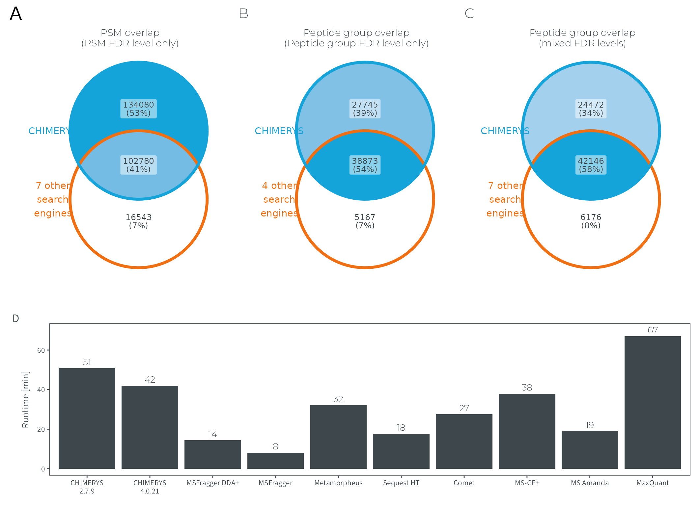

# Figure E2
MSAID
2024-12-17

- [Setup](#setup)
- [Data](#data)
  - [PSM CHIMERYS vs all 7](#psm-chimerys-vs-all-7)
  - [Peptide groups CHIMERYS vs native
    only](#peptide-groups-chimerys-vs-native-only)
  - [Peptide groups CHIMERYS vs all
    7](#peptide-groups-chimerys-vs-all-7)
  - [Runtimes](#runtimes)
- [Figure](#figure)

# Setup

This document describes how the data analysis and plots for extended
figure 2 were generated. To recreate the figures, make sure to download
all input files (available on
[PRIDE](https://www.ebi.ac.uk/pride/archive?keyword=PXD053241)), place
them under `dataPath` (adjust in `load-dependencies.R` to your own
folder structure) and generate intermediate results in the linked `.R`
scripts.

<details>
<summary>
Details on setup
</summary>

``` r
suppressMessages(source(here::here("scripts/load-dependencies.R")))

path <- file.path(here::here(), "figure-E2")
figurePath <- file.path(dataPath, "data/figure-E2")
```

</details>

# Data

<details>
<summary>
Details on data processing
</summary>

## PSM CHIMERYS vs all 7

[R code to generate input file
`figure-E2A-venn-psms.csv`](venn-diagrams.R)

``` r
data_venn_psm_duell <- fread(file.path(figurePath, "figure-E2A-venn-psms.csv"))
data_venn_psm_duell[, condition := factor(condition,
                                          c("7 other search engines", "CHIMERYS"),
                                          c("7 other\nsearch\nengines", "CHIMERYS"))]
data_venn_psm_duell <- split(data_venn_psm_duell[, .(condition, psm_J)],
                             by="condition", keep.by=F, drop = T)
data_venn_psm_duell <- lapply(data_venn_psm_duell, function(x) unlist(x, use.names = F))

p_venn_psm_duell <-
  ggVennDiagram(data_venn_psm_duell,
                set_color = c(msaid_orange, msaid_blue), set_size = 7/.pt,
                label_color = msaid_darkgray, label_size = 6/.pt) +
  theme(text = element_text(family="Montserrat Light", size = 8.4, color=msaid_darkgray),
        legend.position = "none") +
  scale_fill_gradient(low="white", high = msaid_blue) +
  scale_x_continuous(expand = expansion(mult = .2)) +
  ggtitle("PSM overlap\n(PSM FDR level only)") +
  theme(plot.title = element_text(hjust = 0.5, size = 7))
```

## Peptide groups CHIMERYS vs native only

[R code to generate input file
`figure-E2B-venn-peptides-native.csv`](venn-diagrams.R)

``` r
data_venn_ptm_native_duell <- fread(file.path(figurePath, "figure-E2B-venn-peptides-native.csv"))
data_venn_ptm_native_duell[, condition := factor(condition,
                                          c("4 other search engines", "CHIMERYS"),
                                          c("4 other\nsearch\nengines", "CHIMERYS"))]
data_venn_ptm_native_duell <- split(data_venn_ptm_native_duell[, .(condition, ptm_group_J)],
                                    by="condition", keep.by=F, drop = T)
data_venn_ptm_native_duell <- lapply(data_venn_ptm_native_duell, function(x) unlist(x, use.names = F))

p_venn_ptm_native_duell <-
  ggVennDiagram(data_venn_ptm_native_duell,
                set_color = c(msaid_orange, msaid_blue), set_size = 7/.pt,
                label_color = msaid_darkgray, label_size = 6/.pt) +
  theme(text = element_text(family="Montserrat Light", size = 8.4, color=msaid_darkgray),
        legend.position = "none") +
  scale_fill_gradient(low="white", high = msaid_blue) +
  scale_x_continuous(expand = expansion(mult = .2)) +
  ggtitle("Peptide group overlap\n(Peptide group FDR level only)") +
  theme(plot.title = element_text(hjust = 0.5, size = 7))
```

## Peptide groups CHIMERYS vs all 7

[R code to generate input file
`figure-E2C-venn-peptides-all.csv`](venn-diagrams.R)

``` r
data_venn_ptm_all_duell <- fread(file.path(figurePath, "figure-E2C-venn-peptides-all.csv"))
data_venn_ptm_all_duell[, condition := factor(condition,
                                          c("7 other search engines", "CHIMERYS"),
                                          c("7 other\nsearch\nengines", "CHIMERYS"))]
data_venn_ptm_all_duell <- split(data_venn_ptm_all_duell[, .(condition, ptm_group_J)],
                                    by="condition", keep.by=F, drop = T)
data_venn_ptm_all_duell <- lapply(data_venn_ptm_all_duell, function(x) unlist(x, use.names = F))

p_venn_ptm_all_duell <-
  ggVennDiagram(data_venn_ptm_all_duell,
                set_color = c(msaid_orange, msaid_blue), set_size = 7/.pt,
                label_color = msaid_darkgray, label_size = 6/.pt) +
  theme(text = element_text(family="Montserrat Light", size = 8.4, color=msaid_darkgray),
        legend.position = "none") +
  scale_fill_gradient(low="white", high = msaid_blue) +
  scale_x_continuous(expand = expansion(mult = .2)) +
  ggtitle("Peptide group overlap\n(mixed FDR levels)") +
  theme(plot.title = element_text(hjust = 0.5, size = 7))
```

## Runtimes

Runtimes were manually recorded and saved as `figure-E2D-runtimes.csv`

``` r
dtRuntimes <- fread(file.path(figurePath, "figure-E2D-runtimes.csv"))
dtRuntimesSummed <- dtRuntimes[, .(Runtime = sum(Runtime)), by=Software]
softwareLabels <- c('CHIMERYS 2',
                    'MSFragger DDA+',
                    'MSFragger',
                    'Metamorpheus',
                    'Sequest HT',
                    'Comet',
                    'MS-GF+',
                    'MS Amanda',
                    'MaxQuant')
dtRuntimesSummed[, Software := factor(Software, softwareLabels)]

p_runtimes <- ggplot(dtRuntimesSummed, aes(x=Software, y=Runtime)) +
  geom_bar(stat = "identity", fill = msaid_darkgray) +
  geom_text(aes(x=Software, y=Runtime, label = round(Runtime, 0)), vjust=-0.5, family = "Montserrat Light",
            size = 6.5/.pt, color = msaid_darkgray) +
  theme(axis.title.x = element_blank()) + 
  ylab("Runtime [min]") +
  ylim(c(0, 70))
```

</details>

# Figure

<details>
<summary>
Details on figure generation
</summary>

``` r
p_design <- "AABBCC\nDDDDDD"

p_supp_overlap <- free(p_venn_psm_duell) + free(p_venn_ptm_native_duell) +
free(p_venn_ptm_all_duell) + free(p_runtimes) +
plot_layout(design = p_design, heights = c(1, 0.6)) +
plot_annotation(tag_levels = "A")

ggsave2(file.path(path, "figure-E2.pdf"), plot = p_supp_overlap,
        width = 180, height = 130, units = "mm", device = cairo_pdf)
ggsave2(file.path(path, "figure-E2.png"), plot = p_supp_overlap,
        width = 180, height = 130, units = "mm") #, dpi = 92
```

</details>


