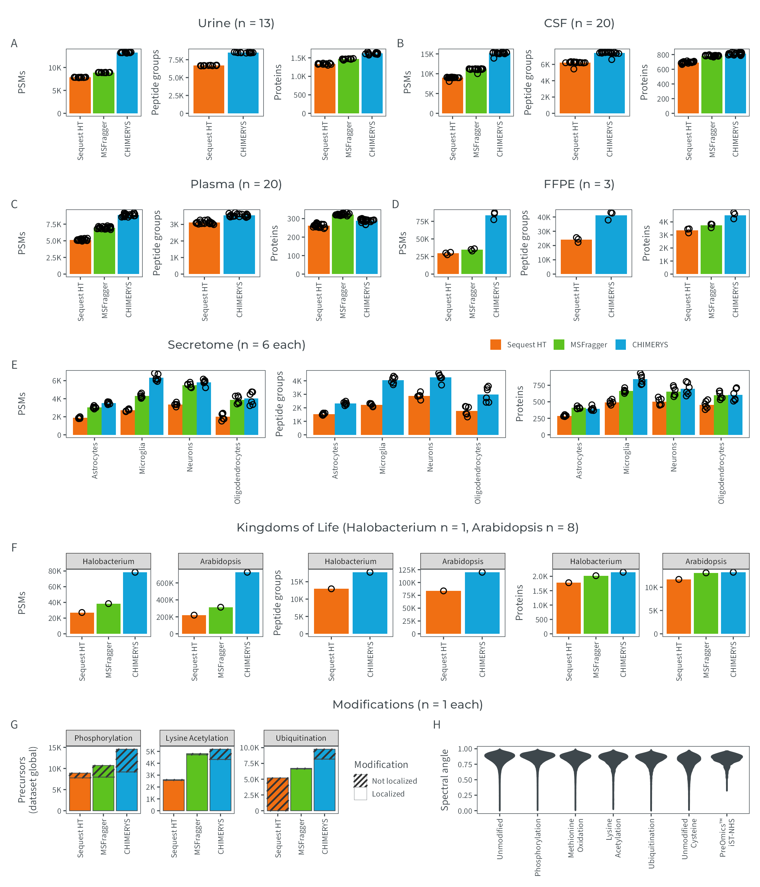

# Figure E4
MSAID
2025-01-24

- [Setup](#setup)
- [Data](#data)
  - [Urine](#urine)
  - [CSF](#csf)
  - [Plasma](#plasma)
  - [FFPE](#ffpe)
  - [Secretome](#secretome)
  - [Kingdoms of Life](#kingdoms-of-life)
  - [Modification Counts](#modification-counts)
  - [Modification spectral angles](#modification-spectral-angles)
- [Figure](#figure)

# Setup

This document describes how the data analysis and plots for extended
figure 4 were generated. To recreate the figures, make sure to download
all input files (available on
[PRIDE](https://www.ebi.ac.uk/pride/archive?keyword=PXD053241)), place
them under `dataPath` (adjust in `load-dependencies.R` to your own
folder structure) and generate intermediate results in the linked `.R`
scripts.

<details>
<summary>
Details on setup
</summary>

``` r
suppressMessages(source(here::here("scripts/load-dependencies.R")))
path <- file.path(here::here(), "figure-E4")
figurePath <- file.path(dataPath, "data/figure-E4")

msaid_SE <- c("Sequest HT" = msaid_orange,
              "MSFragger" = msaid_green,
              "CHIMERYS" = msaid_blue)
```

</details>

# Data

<details>
<summary>
Details on data processing
</summary>

## Urine

``` r
dt_urine <- fread(file.path(figurePath, "figure-E4A-urine.csv"))
dt_urine[, studies := factor(studies, levels = c("S", "M", "C"),
                             labels = c("Sequest HT", "MSFragger", "CHIMERYS"))]

p_urine_psm <- ggplot(dt_urine[!is.na(psms_FDR)],
                      aes(x=studies, y=psms_FDR, fill=studies)) +
  geom_bar(stat = "summary", fun = mean) +
  geom_jitter(shape = 1L, width = 0.3, height = 0, show.legend = FALSE) +
  scale_y_continuous(labels = label_number(scale_cut = cut_short_scale2())) +
  scale_fill_manual(NULL, values = msaid_SE) +
  xlab(NULL) + ylab("PSMs") + theme(legend.position = "none") +
  theme_tilt_xaxis(90, T)

p_urine_pep <- ggplot(dt_urine[!is.na(peptideGroups_FDR)],
                      aes(x=studies, y=peptideGroups_FDR, fill=studies)) +
  geom_bar(stat = "summary", fun = mean) +
  geom_jitter(shape = 1L, width = 0.3, height = 0) +
  scale_y_continuous(labels = label_number(scale_cut = cut_short_scale2())) +
  scale_fill_manual(NULL, values = msaid_SE) +
  xlab(NULL) + ylab("Peptide groups") + theme(legend.position = "none") +
  theme_tilt_xaxis(90, T)

p_urine_prot <- ggplot(dt_urine[!is.na(proteinGroups_FDR)],
                       aes(x=studies, y=proteinGroups_FDR, fill=studies)) +
  geom_bar(stat = "summary", fun = mean) +
  geom_jitter(shape = 1L, width = 0.3, height = 0) +
  scale_y_continuous(labels = label_number(scale_cut = cut_short_scale2())) +
  scale_fill_manual(NULL, values = msaid_SE) +
  xlab(NULL) + ylab("Proteins") + theme(legend.position = "none") +
  theme_tilt_xaxis(90, T)

dt_mean <- dt_urine[, .(mean = mean(proteinGroups_FDR)), keyby=studies]
dt_mean[, .(studies, mean, relative = percent((mean[studies=="CHIMERYS"] - mean) / mean, accuracy=1))]
```

    Key: <studies>
          studies     mean relative
           <fctr>    <num>   <char>
    1: Sequest HT 1336.538      21%
    2:  MSFragger 1460.231      11%
    3:   CHIMERYS 1618.692       0%

## CSF

``` r
dt_csf <- fread(file.path(figurePath, "figure-E4B-csf.csv"))
dt_csf[, studies := factor(studies, levels = c("S", "M", "C"),
                           labels = c("Sequest HT", "MSFragger", "CHIMERYS"))]

p_csf_psm <- ggplot(dt_csf[!is.na(psms_FDR)],
                    aes(x=studies, y=psms_FDR, fill=studies)) +
  geom_bar(stat = "summary", fun = mean) +
  geom_jitter(shape = 1L, width = 0.3, height = 0) +
  scale_y_continuous(labels = label_number(scale_cut = cut_short_scale2())) +
  scale_fill_manual(NULL, values = msaid_SE) +
  xlab(NULL) + ylab("PSMs") + theme(legend.position = "none") +
  theme_tilt_xaxis(90, T)

p_csf_pep <- ggplot(dt_csf[!is.na(peptideGroups_FDR)],
                    aes(x=studies, y=peptideGroups_FDR, fill=studies)) +
  geom_bar(stat = "summary", fun = mean) +
  geom_jitter(shape = 1L, width = 0.3, height = 0) +
  scale_y_continuous(labels = label_number(scale_cut = cut_short_scale2())) +
  scale_fill_manual(NULL, values = msaid_SE) +
  xlab(NULL) + ylab("Peptide groups") + theme(legend.position = "none") +
  theme_tilt_xaxis(90, T)

p_csf_prot <- ggplot(dt_csf[!is.na(proteinGroups_FDR)],
                     aes(x=studies, y=proteinGroups_FDR, fill=studies)) +
  geom_bar(stat = "summary", fun = mean) +
  geom_jitter(shape = 1L, width = 0.3, height = 0) +
  scale_y_continuous(labels = label_number(scale_cut = cut_short_scale2())) +
  scale_fill_manual(NULL, values = msaid_SE) +
  xlab(NULL) + ylab("Proteins") + theme(legend.position = "none") +
  theme_tilt_xaxis(90, T)

dt_mean <- dt_csf[, .(mean = mean(proteinGroups_FDR)), keyby=studies]
dt_mean[, .(studies, mean, relative = percent((mean[studies=="CHIMERYS"] - mean) / mean, accuracy=1))]
```

    Key: <studies>
          studies   mean relative
           <fctr>  <num>   <char>
    1: Sequest HT 692.80      17%
    2:  MSFragger 783.95       4%
    3:   CHIMERYS 812.10       0%

## Plasma

``` r
dt_plasma <- fread(file.path(figurePath, "figure-E4C-plasma.csv"))
dt_plasma[, studies := factor(studies, levels = c("S", "M", "C"),
                              labels = c("Sequest HT", "MSFragger", "CHIMERYS"))]

p_plasma_psm <- ggplot(dt_plasma[!is.na(psms_FDR)],
                       aes(x=studies, y=psms_FDR, fill=studies)) +
  geom_bar(stat = "summary", fun = mean) +
  geom_jitter(shape = 1L, width = 0.3, height = 0) +
  scale_y_continuous(labels = label_number(scale_cut = cut_short_scale2())) +
  scale_fill_manual(NULL, values = msaid_SE) +
  xlab(NULL) + ylab("PSMs") + theme(legend.position = "none") +
  theme_tilt_xaxis(90, T)

p_plasma_pep <- ggplot(dt_plasma[!is.na(peptideGroups_FDR)],
                       aes(x=studies, y=peptideGroups_FDR, fill=studies)) +
  geom_bar(stat = "summary", fun = mean) +
  geom_jitter(shape = 1L, width = 0.3, height = 0) +
  scale_y_continuous(labels = label_number(scale_cut = cut_short_scale2())) +
  scale_fill_manual(NULL, values = msaid_SE) +
  xlab(NULL) + ylab("Peptide groups") + theme(legend.position = "none") +
  theme_tilt_xaxis(90, T)

p_plasma_prot <- ggplot(dt_plasma[!is.na(proteinGroups_FDR)],
                        aes(x=studies, y=proteinGroups_FDR, fill=studies)) +
  geom_bar(stat = "summary", fun = mean) +
  geom_jitter(shape = 1L, width = 0.3, height = 0) +
  scale_y_continuous(labels = label_number(scale_cut = cut_short_scale2())) +
  scale_fill_manual(NULL, values = msaid_SE) +
  xlab(NULL) + ylab("Proteins") + theme(legend.position = "none") +
  theme_tilt_xaxis(90, T)

dt_mean <- dt_plasma[, .(mean = mean(proteinGroups_FDR)), keyby=studies]
dt_mean[, .(studies, mean, relative = percent((mean[studies=="CHIMERYS"] - mean) / mean, accuracy=1))]
```

    Key: <studies>
          studies   mean relative
           <fctr>  <num>   <char>
    1: Sequest HT 262.35      10%
    2:  MSFragger 322.20     -10%
    3:   CHIMERYS 289.05       0%

## FFPE

``` r
dt_ffpe <- fread(file.path(figurePath, "figure-E4D-ffpe.csv"))
dt_ffpe[, studies := factor(studies, levels = c("S", "M", "C"),
                            labels = c("Sequest HT", "MSFragger", "CHIMERYS"))]

p_ffpe_psm <- ggplot(dt_ffpe[!is.na(psms_FDR)],
                     aes(x=studies, y=psms_FDR, fill=studies)) +
  geom_bar(stat = "summary", fun = mean) +
  geom_jitter(shape = 1L, width = 0.1, height = 0) +
  scale_y_continuous(labels = label_number(scale_cut = cut_short_scale2())) +
  scale_fill_manual(NULL, values = msaid_SE) +
  xlab(NULL) + ylab("PSMs") + theme(legend.position = "none") +
  theme_tilt_xaxis(90, T)

p_ffpe_pep <- ggplot(dt_ffpe[!is.na(peptideGroups_FDR)],
                     aes(x=studies, y=peptideGroups_FDR, fill=studies)) +
  geom_bar(stat = "summary", fun = mean) +
  geom_jitter(shape = 1L, width = 0.1, height = 0) +
  scale_y_continuous(labels = label_number(scale_cut = cut_short_scale2())) +
  scale_fill_manual(NULL, values = msaid_SE) +
  xlab(NULL) + ylab("Peptide groups") + theme(legend.position = "none") +
  theme_tilt_xaxis(90, T)

p_ffpe_prot <- ggplot(dt_ffpe[!is.na(proteinGroups_FDR)],
                      aes(x=studies, y=proteinGroups_FDR, fill=studies)) +
  geom_bar(stat = "summary", fun = mean) +
  geom_jitter(shape = 1L, width = 0.1, height = 0) +
  scale_y_continuous(labels = label_number(scale_cut = cut_short_scale2())) +
  scale_fill_manual(NULL, values = msaid_SE) +
  xlab(NULL) + ylab("Proteins") + theme(legend.position = "none") +
  theme_tilt_xaxis(90, T)

dt_mean <- dt_ffpe[, .(mean = mean(proteinGroups_FDR)), keyby=studies]
dt_mean[, .(studies, mean, relative = percent((mean[studies=="CHIMERYS"] - mean) / mean, accuracy=1))]
```

    Key: <studies>
          studies     mean relative
           <fctr>    <num>   <char>
    1: Sequest HT 3355.667      35%
    2:  MSFragger 3732.000      21%
    3:   CHIMERYS 4519.000       0%

## Secretome

``` r
dt_secretome <- fread(file.path(figurePath, "figure-E4E-secretome.csv"))
dt_secretome[, type := factor(gsub("^(.*)_.$", "\\1", studies),
                              c("Astro", "Microglia", "MiSroglia", "Neurons", "Oligo"),
                              c("Astrocytes", "Microglia", "Microglia", "Neurons", "Oligodendrocytes"))]
dt_secretome[, studies := factor(gsub("^.*_(.)$", "\\1", studies), levels = c("S", "M", "C"),
                                 labels = c("Sequest HT", "MSFragger", "CHIMERYS"))]

p_secretome_psm <- ggplot(dt_secretome[!is.na(psms_FDR)],
                          aes(x=type, y=psms_FDR, fill=studies)) +
  geom_bar(stat = "summary", fun = mean, position = "dodge") +
  geom_jitter(shape = 1L, position = position_jitterdodge(0.2, 0, 0.9)) +
  scale_y_continuous(labels = label_number(scale_cut = cut_short_scale2())) +
  scale_fill_manual(NULL, values = msaid_SE) +
  xlab(NULL) + ylab("PSMs") + theme(legend.position = "none") +
  theme_tilt_xaxis(90, T)

p_secretome_pep <- ggplot(dt_secretome[!is.na(peptideGroups_FDR)],
                          aes(x=type, y=peptideGroups_FDR, fill=studies)) +
  geom_bar(stat = "summary", fun = mean, position = "dodge") +
  geom_jitter(shape = 1L, position = position_jitterdodge(0.2, 0, 0.9)) +
  scale_y_continuous(labels = label_number(scale_cut = cut_short_scale2())) +
  scale_fill_manual(NULL, values = msaid_SE) +
  xlab(NULL) + ylab("Peptide groups") + theme(legend.position = "none") +
  theme_tilt_xaxis(90, T)

p_secretome_prot <- ggplot(dt_secretome[!is.na(proteinGroups_FDR)],
                           aes(x=type, y=proteinGroups_FDR, fill=studies)) +
  geom_bar(stat = "summary", fun = mean, position = "dodge") +
  geom_jitter(shape = 1L, position = position_jitterdodge(0.2, 0, 0.9)) +
  scale_y_continuous(labels = label_number(scale_cut = cut_short_scale2())) +
  scale_fill_manual(NULL, values = msaid_SE) +
  xlab(NULL) + ylab("Proteins") + theme(legend.position = "none") +
  theme_tilt_xaxis(90, T)

dt_mean <- dt_secretome[, .(mean = mean(proteinGroups_FDR)), keyby=.(studies, type)]
dt_mean[, .(relative = percent((mean[studies=="CHIMERYS"] - mean) / mean, accuracy=1),
            studies, mean), keyby=type]
```

    Key: <type>
                    type relative    studies     mean
                  <fctr>   <char>     <fctr>    <num>
     1:       Astrocytes      37% Sequest HT 287.3333
     2:       Astrocytes      -4%  MSFragger 407.6667
     3:       Astrocytes       0%   CHIMERYS 393.3333
     4:        Microglia      71% Sequest HT 491.1667
     5:        Microglia      27%  MSFragger 663.8333
     6:        Microglia       0%   CHIMERYS 840.8333
     7:          Neurons      39% Sequest HT 500.8333
     8:          Neurons       6%  MSFragger 656.0000
     9:          Neurons       0%   CHIMERYS 695.6667
    10: Oligodendrocytes      33% Sequest HT 454.3333
    11: Oligodendrocytes       0%  MSFragger 601.1667
    12: Oligodendrocytes       0%   CHIMERYS 603.0000

## Kingdoms of Life

``` r
dt_ara <- fread(file.path(figurePath, "figure-E4F-ara.csv"))
dt_halo <- fread(file.path(figurePath, "figure-E4F-halo.csv"))
dt_kingdoms <- rbind(cbind(type = "Arabidopsis", dt_ara),
                     cbind(type = "Halobacterium", dt_halo))
dt_kingdoms[, type := factor(type, c("Halobacterium", "Arabidopsis"))]
dt_kingdoms[, studies := factor(studies, levels = c("S", "M", "C"),
                                labels = c("Sequest HT", "MSFragger", "CHIMERYS"))]

p_kingdoms_psm <- ggplot(dt_kingdoms[!is.na(psms_FDR)],
                         aes(x=studies, y=psms_FDR, fill=studies)) +
  geom_bar(stat = "identity") +
  geom_point(shape = 1L) +
  scale_y_continuous(labels = label_number(scale_cut = cut_short_scale2())) +
  scale_fill_manual(NULL, values = msaid_SE) +
  facet_wrap(vars(type), ncol = 2, scales = "free_y") +
  xlab(NULL) + ylab("PSMs") + theme(legend.position = "none") +
  theme_tilt_xaxis(90, T)

p_kingdoms_pep <- ggplot(dt_kingdoms[!is.na(peptideGroups_FDR)],
                         aes(x=studies, y=peptideGroups_FDR, fill=studies)) +
  geom_bar(stat = "identity") +
  geom_point(shape = 1L) +
  scale_y_continuous(labels = label_number(scale_cut = cut_short_scale2())) +
  scale_fill_manual(NULL, values = msaid_SE) +
  facet_wrap(vars(type), ncol = 2, scales = "free_y") +
  xlab(NULL) + ylab("Peptide groups") + theme(legend.position = "none") +
  theme_tilt_xaxis(90, T)

p_kingdoms_prot <- ggplot(dt_kingdoms[!is.na(proteinGroups_FDR)],
                          aes(x=studies, y=proteinGroups_FDR, fill=studies)) +
  geom_bar(stat = "identity") +
  geom_point(shape = 1L) +
  scale_y_continuous(labels = label_number(scale_cut = cut_short_scale2())) +
  scale_fill_manual(NULL, values = msaid_SE) +
  facet_wrap(vars(type), ncol = 2, scales = "free_y") +
  xlab(NULL) + ylab("Proteins") + theme(legend.position = "none") +
  theme_tilt_xaxis(90, T)

dt_mean <- dt_kingdoms[, .(mean = mean(proteinGroups_FDR)), keyby=.(studies, type)]
dt_mean[, .(relative = percent((mean[studies=="CHIMERYS"] - mean) / mean, accuracy=1),
            studies, mean), keyby=type]
```

    Key: <type>
                type relative    studies  mean
              <fctr>   <char>     <fctr> <num>
    1: Halobacterium      20% Sequest HT  1777
    2: Halobacterium       6%  MSFragger  2021
    3: Halobacterium       0%   CHIMERYS  2141
    4:   Arabidopsis      13% Sequest HT 11680
    5:   Arabidopsis       1%  MSFragger 13079
    6:   Arabidopsis       0%   CHIMERYS 13209

## Modification Counts

``` r
dt_ptm <- fread(file.path(figurePath, "figure-E4G-ptms-counts.csv"))
dt_ptm[, SOFTWARE := factor(SOFTWARE, c("Sequest HT", "MSFragger", "CHIMERYS"))]
dt_ptm[, PTM := factor(PTM, c("Phosphorylation", "Lysine Acetylation", "Ubiquitination"))]
dt_ptm[, TYPE := factor(TYPE, c("Not localized", "Localized"))]

p_ptm_counts <- ggplot(dt_ptm, aes(x=SOFTWARE, y=N, fill=SOFTWARE, pattern=TYPE)) +
  geom_bar_pattern(stat = "identity",
                   color = msaid_darkgray, 
                   pattern_fill = msaid_darkgray,
                   pattern_angle = 45,
                   pattern_density = 0.001,
                   pattern_spacing = 0.08,
                   pattern_key_scale_factor = 0.1,
                   linewidth = .2) +
  scale_y_continuous(labels = label_number(scale_cut = cut_short_scale2())) +
  scale_fill_manual(NULL, values = msaid_SE, guide = "none") +
  scale_pattern_manual(name = "Modification", values = c("Not localized" = "stripe", "Localized" = "none")) +
  facet_wrap(vars(PTM), ncol = 3, scales = "free_y") +
  xlab(NULL) + ylab("Precursors\n(dataset global)") +
  guides(pattern = guide_legend(override.aes = list(fill = "white")), fill = 'none') +
  theme_tilt_xaxis(90, T)

dt_mean <- dt_ptm[, .(mean = mean(N)), keyby=.(SOFTWARE, PTM)]
dt_mean[, .(relative = percent((mean[SOFTWARE=="CHIMERYS"] - mean) / mean, accuracy=1),
            SOFTWARE, mean), keyby=PTM]
```

    Key: <PTM>
                      PTM relative   SOFTWARE   mean
                   <fctr>   <char>     <fctr>  <num>
    1:    Phosphorylation      64% Sequest HT 4455.5
    2:    Phosphorylation      36%  MSFragger 5356.0
    3:    Phosphorylation       0%   CHIMERYS 7286.0
    4: Lysine Acetylation      98% Sequest HT 1308.0
    5: Lysine Acetylation       8%  MSFragger 2404.5
    6: Lysine Acetylation       0%   CHIMERYS 2593.5
    7:     Ubiquitination      88% Sequest HT 2599.5
    8:     Ubiquitination      45%  MSFragger 3359.5
    9:     Ubiquitination       0%   CHIMERYS 4879.0

## Modification spectral angles

``` r
dt_ptm_sa <- fread(file.path(figurePath, "figure-E4H-ptms-sa.csv"))

ptmLevels <- c('Unmodified', 'Phosphorylation', 'Methionine Oxidation',
               'Lysine Acetylation', 'Ubiquitination', 'Unmodified Cysteine',
               'PreOmics™ iST-NHS')
ptmLabels <- c('Unmodified', 'Phosphorylation', 'Methionine\nOxidation',
               'Lysine\nAcetylation', 'Ubiquitination', 'Unmodified\nCysteine',
               'PreOmics™\niST-NHS')
dt_ptm_sa[, PTM := factor(PTM, ptmLevels, ptmLabels)]

p_ptm_sa <- ggplot(dt_ptm_sa, aes(x=PTM, y=SA)) +
  geom_violin(fill = msaid_darkgray, color = msaid_darkgray) +  
  theme(legend.position = "none") + theme_tilt_xaxis(90, T) + 
  xlab(NULL) + ylab("Spectral angle")
```

</details>

# Figure

<details>
<summary>
Details on figure generation
</summary>

``` r
p_legend <- ggdraw2(get_plot_component(p_urine_psm + theme(legend.position = "top"),
                                       'guide-box-top', return_all = TRUE))

layout_title <- c("Urine (n = 13)",
                  "CSF (n = 20)",
                  "Plasma (n = 20)",
                  "FFPE (n = 3)",
                  "Secretome (n = 6 each)",
                  "Kingdoms of Life (Halobacterium n = 1, Arabidopsis n = 8)",
                  "Modifications (n = 1 each)")

title_urine <- ggplot_placeholder(layout_title[1], 8, "Montserrat Medium")
title_csf <- ggplot_placeholder(layout_title[2], 8, "Montserrat Medium")
title_plasma <- ggplot_placeholder(layout_title[3], 8, "Montserrat Medium")
title_ffpe <- ggplot_placeholder(layout_title[4], 8, "Montserrat Medium")
title_secretome <- ggplot_placeholder(layout_title[5], 8, "Montserrat Medium")
title_kingdoms <- ggplot_placeholder(layout_title[6], 8, "Montserrat Medium")
title_ptm <- ggplot_placeholder(layout_title[7], 8, "Montserrat Medium")

layout_annotation <- list(c("", "", "A", "", "", "B", "", "",
                            "", "", "C", "", "", "D", "", "",
                            "", "", "E", "", "",
                            "", "F", "", "", 
                            "", "G", "H"))

p <- (title_urine | title_csf) / (p_urine_psm | p_urine_pep | p_urine_prot | p_csf_psm | p_csf_pep | p_csf_prot) /
  (title_plasma | title_ffpe) / (p_plasma_psm | p_plasma_pep | p_plasma_prot | p_ffpe_psm | p_ffpe_pep | p_ffpe_prot) /
  (title_secretome | p_legend) / (p_secretome_psm | p_secretome_pep | p_secretome_prot) /
  (title_kingdoms) / (p_kingdoms_psm | p_kingdoms_pep | p_kingdoms_prot) /
  (title_ptm) / (p_ptm_counts | p_ptm_sa) +
  plot_layout(heights = c(0.2, 1, 0.2, 1, 0.2, 1, 0.2, 1, 0.2, 1)) +
  plot_annotation(tag_levels = layout_annotation)

ggsave2(file.path(path, "figure-E4.pdf"), plot = p,
        width = 180, height = 210, units = "mm", device = cairo_pdf)
ggsave2(file.path(path, "figure-E4.png"), plot = p,
        width = 180, height = 210, units = "mm")
ggsave2(file.path(path, "figure-E4.eps"), plot = p,
        width = 180, height = 210, units = "mm")
```

    Warning in grid.Call(C_stringMetric, as.graphicsAnnot(x$label)): font family
    'Source Sans 3' not found in PostScript font database
    Warning in grid.Call(C_stringMetric, as.graphicsAnnot(x$label)): font family
    'Source Sans 3' not found in PostScript font database
    Warning in grid.Call(C_stringMetric, as.graphicsAnnot(x$label)): font family
    'Source Sans 3' not found in PostScript font database
    Warning in grid.Call(C_stringMetric, as.graphicsAnnot(x$label)): font family
    'Source Sans 3' not found in PostScript font database
    Warning in grid.Call(C_stringMetric, as.graphicsAnnot(x$label)): font family
    'Source Sans 3' not found in PostScript font database
    Warning in grid.Call(C_stringMetric, as.graphicsAnnot(x$label)): font family
    'Source Sans 3' not found in PostScript font database
    Warning in grid.Call(C_stringMetric, as.graphicsAnnot(x$label)): font family
    'Source Sans 3' not found in PostScript font database
    Warning in grid.Call(C_stringMetric, as.graphicsAnnot(x$label)): font family
    'Source Sans 3' not found in PostScript font database
    Warning in grid.Call(C_stringMetric, as.graphicsAnnot(x$label)): font family
    'Source Sans 3' not found in PostScript font database
    Warning in grid.Call(C_stringMetric, as.graphicsAnnot(x$label)): font family
    'Source Sans 3' not found in PostScript font database
    Warning in grid.Call(C_stringMetric, as.graphicsAnnot(x$label)): font family
    'Source Sans 3' not found in PostScript font database
    Warning in grid.Call(C_stringMetric, as.graphicsAnnot(x$label)): font family
    'Source Sans 3' not found in PostScript font database
    Warning in grid.Call(C_stringMetric, as.graphicsAnnot(x$label)): font family
    'Source Sans 3' not found in PostScript font database
    Warning in grid.Call(C_stringMetric, as.graphicsAnnot(x$label)): font family
    'Source Sans 3' not found in PostScript font database
    Warning in grid.Call(C_stringMetric, as.graphicsAnnot(x$label)): font family
    'Source Sans 3' not found in PostScript font database
    Warning in grid.Call(C_stringMetric, as.graphicsAnnot(x$label)): font family
    'Source Sans 3' not found in PostScript font database
    Warning in grid.Call(C_stringMetric, as.graphicsAnnot(x$label)): font family
    'Source Sans 3' not found in PostScript font database
    Warning in grid.Call(C_stringMetric, as.graphicsAnnot(x$label)): font family
    'Source Sans 3' not found in PostScript font database
    Warning in grid.Call(C_stringMetric, as.graphicsAnnot(x$label)): font family
    'Source Sans 3' not found in PostScript font database
    Warning in grid.Call(C_stringMetric, as.graphicsAnnot(x$label)): font family
    'Source Sans 3' not found in PostScript font database
    Warning in grid.Call(C_stringMetric, as.graphicsAnnot(x$label)): font family
    'Source Sans 3' not found in PostScript font database
    Warning in grid.Call(C_stringMetric, as.graphicsAnnot(x$label)): font family
    'Source Sans 3' not found in PostScript font database
    Warning in grid.Call(C_stringMetric, as.graphicsAnnot(x$label)): font family
    'Source Sans 3' not found in PostScript font database
    Warning in grid.Call(C_stringMetric, as.graphicsAnnot(x$label)): font family
    'Source Sans 3' not found in PostScript font database
    Warning in grid.Call(C_stringMetric, as.graphicsAnnot(x$label)): font family
    'Source Sans 3' not found in PostScript font database
    Warning in grid.Call(C_stringMetric, as.graphicsAnnot(x$label)): font family
    'Source Sans 3' not found in PostScript font database
    Warning in grid.Call(C_stringMetric, as.graphicsAnnot(x$label)): font family
    'Source Sans 3' not found in PostScript font database
    Warning in grid.Call(C_stringMetric, as.graphicsAnnot(x$label)): font family
    'Source Sans 3' not found in PostScript font database

    Warning in grid.Call(C_textBounds, as.graphicsAnnot(x$label), x$x, x$y, : font
    family 'Source Sans 3' not found in PostScript font database
    Warning in grid.Call(C_textBounds, as.graphicsAnnot(x$label), x$x, x$y, : font
    family 'Source Sans 3' not found in PostScript font database
    Warning in grid.Call(C_textBounds, as.graphicsAnnot(x$label), x$x, x$y, : font
    family 'Source Sans 3' not found in PostScript font database
    Warning in grid.Call(C_textBounds, as.graphicsAnnot(x$label), x$x, x$y, : font
    family 'Source Sans 3' not found in PostScript font database
    Warning in grid.Call(C_textBounds, as.graphicsAnnot(x$label), x$x, x$y, : font
    family 'Source Sans 3' not found in PostScript font database
    Warning in grid.Call(C_textBounds, as.graphicsAnnot(x$label), x$x, x$y, : font
    family 'Source Sans 3' not found in PostScript font database

    Warning in grid.Call(C_stringMetric, as.graphicsAnnot(x$label)): font family
    'Source Sans 3' not found in PostScript font database
    Warning in grid.Call(C_stringMetric, as.graphicsAnnot(x$label)): font family
    'Source Sans 3' not found in PostScript font database
    Warning in grid.Call(C_stringMetric, as.graphicsAnnot(x$label)): font family
    'Source Sans 3' not found in PostScript font database
    Warning in grid.Call(C_stringMetric, as.graphicsAnnot(x$label)): font family
    'Source Sans 3' not found in PostScript font database
    Warning in grid.Call(C_stringMetric, as.graphicsAnnot(x$label)): font family
    'Source Sans 3' not found in PostScript font database
    Warning in grid.Call(C_stringMetric, as.graphicsAnnot(x$label)): font family
    'Source Sans 3' not found in PostScript font database
    Warning in grid.Call(C_stringMetric, as.graphicsAnnot(x$label)): font family
    'Source Sans 3' not found in PostScript font database
    Warning in grid.Call(C_stringMetric, as.graphicsAnnot(x$label)): font family
    'Source Sans 3' not found in PostScript font database
    Warning in grid.Call(C_stringMetric, as.graphicsAnnot(x$label)): font family
    'Source Sans 3' not found in PostScript font database
    Warning in grid.Call(C_stringMetric, as.graphicsAnnot(x$label)): font family
    'Source Sans 3' not found in PostScript font database
    Warning in grid.Call(C_stringMetric, as.graphicsAnnot(x$label)): font family
    'Source Sans 3' not found in PostScript font database
    Warning in grid.Call(C_stringMetric, as.graphicsAnnot(x$label)): font family
    'Source Sans 3' not found in PostScript font database
    Warning in grid.Call(C_stringMetric, as.graphicsAnnot(x$label)): font family
    'Source Sans 3' not found in PostScript font database
    Warning in grid.Call(C_stringMetric, as.graphicsAnnot(x$label)): font family
    'Source Sans 3' not found in PostScript font database

    Warning in grid.Call(C_textBounds, as.graphicsAnnot(x$label), x$x, x$y, : font
    family 'Source Sans 3' not found in PostScript font database
    Warning in grid.Call(C_textBounds, as.graphicsAnnot(x$label), x$x, x$y, : font
    family 'Source Sans 3' not found in PostScript font database
    Warning in grid.Call(C_textBounds, as.graphicsAnnot(x$label), x$x, x$y, : font
    family 'Source Sans 3' not found in PostScript font database
    Warning in grid.Call(C_textBounds, as.graphicsAnnot(x$label), x$x, x$y, : font
    family 'Source Sans 3' not found in PostScript font database
    Warning in grid.Call(C_textBounds, as.graphicsAnnot(x$label), x$x, x$y, : font
    family 'Source Sans 3' not found in PostScript font database
    Warning in grid.Call(C_textBounds, as.graphicsAnnot(x$label), x$x, x$y, : font
    family 'Source Sans 3' not found in PostScript font database
    Warning in grid.Call(C_textBounds, as.graphicsAnnot(x$label), x$x, x$y, : font
    family 'Source Sans 3' not found in PostScript font database
    Warning in grid.Call(C_textBounds, as.graphicsAnnot(x$label), x$x, x$y, : font
    family 'Source Sans 3' not found in PostScript font database
    Warning in grid.Call(C_textBounds, as.graphicsAnnot(x$label), x$x, x$y, : font
    family 'Source Sans 3' not found in PostScript font database
    Warning in grid.Call(C_textBounds, as.graphicsAnnot(x$label), x$x, x$y, : font
    family 'Source Sans 3' not found in PostScript font database
    Warning in grid.Call(C_textBounds, as.graphicsAnnot(x$label), x$x, x$y, : font
    family 'Source Sans 3' not found in PostScript font database
    Warning in grid.Call(C_textBounds, as.graphicsAnnot(x$label), x$x, x$y, : font
    family 'Source Sans 3' not found in PostScript font database
    Warning in grid.Call(C_textBounds, as.graphicsAnnot(x$label), x$x, x$y, : font
    family 'Source Sans 3' not found in PostScript font database
    Warning in grid.Call(C_textBounds, as.graphicsAnnot(x$label), x$x, x$y, : font
    family 'Source Sans 3' not found in PostScript font database
    Warning in grid.Call(C_textBounds, as.graphicsAnnot(x$label), x$x, x$y, : font
    family 'Source Sans 3' not found in PostScript font database
    Warning in grid.Call(C_textBounds, as.graphicsAnnot(x$label), x$x, x$y, : font
    family 'Source Sans 3' not found in PostScript font database
    Warning in grid.Call(C_textBounds, as.graphicsAnnot(x$label), x$x, x$y, : font
    family 'Source Sans 3' not found in PostScript font database
    Warning in grid.Call(C_textBounds, as.graphicsAnnot(x$label), x$x, x$y, : font
    family 'Source Sans 3' not found in PostScript font database
    Warning in grid.Call(C_textBounds, as.graphicsAnnot(x$label), x$x, x$y, : font
    family 'Source Sans 3' not found in PostScript font database
    Warning in grid.Call(C_textBounds, as.graphicsAnnot(x$label), x$x, x$y, : font
    family 'Source Sans 3' not found in PostScript font database
    Warning in grid.Call(C_textBounds, as.graphicsAnnot(x$label), x$x, x$y, : font
    family 'Source Sans 3' not found in PostScript font database
    Warning in grid.Call(C_textBounds, as.graphicsAnnot(x$label), x$x, x$y, : font
    family 'Source Sans 3' not found in PostScript font database
    Warning in grid.Call(C_textBounds, as.graphicsAnnot(x$label), x$x, x$y, : font
    family 'Source Sans 3' not found in PostScript font database
    Warning in grid.Call(C_textBounds, as.graphicsAnnot(x$label), x$x, x$y, : font
    family 'Source Sans 3' not found in PostScript font database
    Warning in grid.Call(C_textBounds, as.graphicsAnnot(x$label), x$x, x$y, : font
    family 'Source Sans 3' not found in PostScript font database
    Warning in grid.Call(C_textBounds, as.graphicsAnnot(x$label), x$x, x$y, : font
    family 'Source Sans 3' not found in PostScript font database
    Warning in grid.Call(C_textBounds, as.graphicsAnnot(x$label), x$x, x$y, : font
    family 'Source Sans 3' not found in PostScript font database
    Warning in grid.Call(C_textBounds, as.graphicsAnnot(x$label), x$x, x$y, : font
    family 'Source Sans 3' not found in PostScript font database
    Warning in grid.Call(C_textBounds, as.graphicsAnnot(x$label), x$x, x$y, : font
    family 'Source Sans 3' not found in PostScript font database
    Warning in grid.Call(C_textBounds, as.graphicsAnnot(x$label), x$x, x$y, : font
    family 'Source Sans 3' not found in PostScript font database
    Warning in grid.Call(C_textBounds, as.graphicsAnnot(x$label), x$x, x$y, : font
    family 'Source Sans 3' not found in PostScript font database
    Warning in grid.Call(C_textBounds, as.graphicsAnnot(x$label), x$x, x$y, : font
    family 'Source Sans 3' not found in PostScript font database
    Warning in grid.Call(C_textBounds, as.graphicsAnnot(x$label), x$x, x$y, : font
    family 'Source Sans 3' not found in PostScript font database
    Warning in grid.Call(C_textBounds, as.graphicsAnnot(x$label), x$x, x$y, : font
    family 'Source Sans 3' not found in PostScript font database
    Warning in grid.Call(C_textBounds, as.graphicsAnnot(x$label), x$x, x$y, : font
    family 'Source Sans 3' not found in PostScript font database
    Warning in grid.Call(C_textBounds, as.graphicsAnnot(x$label), x$x, x$y, : font
    family 'Source Sans 3' not found in PostScript font database
    Warning in grid.Call(C_textBounds, as.graphicsAnnot(x$label), x$x, x$y, : font
    family 'Source Sans 3' not found in PostScript font database
    Warning in grid.Call(C_textBounds, as.graphicsAnnot(x$label), x$x, x$y, : font
    family 'Source Sans 3' not found in PostScript font database
    Warning in grid.Call(C_textBounds, as.graphicsAnnot(x$label), x$x, x$y, : font
    family 'Source Sans 3' not found in PostScript font database
    Warning in grid.Call(C_textBounds, as.graphicsAnnot(x$label), x$x, x$y, : font
    family 'Source Sans 3' not found in PostScript font database
    Warning in grid.Call(C_textBounds, as.graphicsAnnot(x$label), x$x, x$y, : font
    family 'Source Sans 3' not found in PostScript font database
    Warning in grid.Call(C_textBounds, as.graphicsAnnot(x$label), x$x, x$y, : font
    family 'Source Sans 3' not found in PostScript font database
    Warning in grid.Call(C_textBounds, as.graphicsAnnot(x$label), x$x, x$y, : font
    family 'Source Sans 3' not found in PostScript font database
    Warning in grid.Call(C_textBounds, as.graphicsAnnot(x$label), x$x, x$y, : font
    family 'Source Sans 3' not found in PostScript font database
    Warning in grid.Call(C_textBounds, as.graphicsAnnot(x$label), x$x, x$y, : font
    family 'Source Sans 3' not found in PostScript font database
    Warning in grid.Call(C_textBounds, as.graphicsAnnot(x$label), x$x, x$y, : font
    family 'Source Sans 3' not found in PostScript font database
    Warning in grid.Call(C_textBounds, as.graphicsAnnot(x$label), x$x, x$y, : font
    family 'Source Sans 3' not found in PostScript font database
    Warning in grid.Call(C_textBounds, as.graphicsAnnot(x$label), x$x, x$y, : font
    family 'Source Sans 3' not found in PostScript font database
    Warning in grid.Call(C_textBounds, as.graphicsAnnot(x$label), x$x, x$y, : font
    family 'Source Sans 3' not found in PostScript font database
    Warning in grid.Call(C_textBounds, as.graphicsAnnot(x$label), x$x, x$y, : font
    family 'Source Sans 3' not found in PostScript font database
    Warning in grid.Call(C_textBounds, as.graphicsAnnot(x$label), x$x, x$y, : font
    family 'Source Sans 3' not found in PostScript font database
    Warning in grid.Call(C_textBounds, as.graphicsAnnot(x$label), x$x, x$y, : font
    family 'Source Sans 3' not found in PostScript font database
    Warning in grid.Call(C_textBounds, as.graphicsAnnot(x$label), x$x, x$y, : font
    family 'Source Sans 3' not found in PostScript font database
    Warning in grid.Call(C_textBounds, as.graphicsAnnot(x$label), x$x, x$y, : font
    family 'Source Sans 3' not found in PostScript font database
    Warning in grid.Call(C_textBounds, as.graphicsAnnot(x$label), x$x, x$y, : font
    family 'Source Sans 3' not found in PostScript font database
    Warning in grid.Call(C_textBounds, as.graphicsAnnot(x$label), x$x, x$y, : font
    family 'Source Sans 3' not found in PostScript font database
    Warning in grid.Call(C_textBounds, as.graphicsAnnot(x$label), x$x, x$y, : font
    family 'Source Sans 3' not found in PostScript font database
    Warning in grid.Call(C_textBounds, as.graphicsAnnot(x$label), x$x, x$y, : font
    family 'Source Sans 3' not found in PostScript font database
    Warning in grid.Call(C_textBounds, as.graphicsAnnot(x$label), x$x, x$y, : font
    family 'Source Sans 3' not found in PostScript font database
    Warning in grid.Call(C_textBounds, as.graphicsAnnot(x$label), x$x, x$y, : font
    family 'Source Sans 3' not found in PostScript font database
    Warning in grid.Call(C_textBounds, as.graphicsAnnot(x$label), x$x, x$y, : font
    family 'Source Sans 3' not found in PostScript font database
    Warning in grid.Call(C_textBounds, as.graphicsAnnot(x$label), x$x, x$y, : font
    family 'Source Sans 3' not found in PostScript font database
    Warning in grid.Call(C_textBounds, as.graphicsAnnot(x$label), x$x, x$y, : font
    family 'Source Sans 3' not found in PostScript font database
    Warning in grid.Call(C_textBounds, as.graphicsAnnot(x$label), x$x, x$y, : font
    family 'Source Sans 3' not found in PostScript font database
    Warning in grid.Call(C_textBounds, as.graphicsAnnot(x$label), x$x, x$y, : font
    family 'Source Sans 3' not found in PostScript font database
    Warning in grid.Call(C_textBounds, as.graphicsAnnot(x$label), x$x, x$y, : font
    family 'Source Sans 3' not found in PostScript font database
    Warning in grid.Call(C_textBounds, as.graphicsAnnot(x$label), x$x, x$y, : font
    family 'Source Sans 3' not found in PostScript font database
    Warning in grid.Call(C_textBounds, as.graphicsAnnot(x$label), x$x, x$y, : font
    family 'Source Sans 3' not found in PostScript font database
    Warning in grid.Call(C_textBounds, as.graphicsAnnot(x$label), x$x, x$y, : font
    family 'Source Sans 3' not found in PostScript font database
    Warning in grid.Call(C_textBounds, as.graphicsAnnot(x$label), x$x, x$y, : font
    family 'Source Sans 3' not found in PostScript font database
    Warning in grid.Call(C_textBounds, as.graphicsAnnot(x$label), x$x, x$y, : font
    family 'Source Sans 3' not found in PostScript font database
    Warning in grid.Call(C_textBounds, as.graphicsAnnot(x$label), x$x, x$y, : font
    family 'Source Sans 3' not found in PostScript font database
    Warning in grid.Call(C_textBounds, as.graphicsAnnot(x$label), x$x, x$y, : font
    family 'Source Sans 3' not found in PostScript font database
    Warning in grid.Call(C_textBounds, as.graphicsAnnot(x$label), x$x, x$y, : font
    family 'Source Sans 3' not found in PostScript font database
    Warning in grid.Call(C_textBounds, as.graphicsAnnot(x$label), x$x, x$y, : font
    family 'Source Sans 3' not found in PostScript font database
    Warning in grid.Call(C_textBounds, as.graphicsAnnot(x$label), x$x, x$y, : font
    family 'Source Sans 3' not found in PostScript font database
    Warning in grid.Call(C_textBounds, as.graphicsAnnot(x$label), x$x, x$y, : font
    family 'Source Sans 3' not found in PostScript font database
    Warning in grid.Call(C_textBounds, as.graphicsAnnot(x$label), x$x, x$y, : font
    family 'Source Sans 3' not found in PostScript font database
    Warning in grid.Call(C_textBounds, as.graphicsAnnot(x$label), x$x, x$y, : font
    family 'Source Sans 3' not found in PostScript font database
    Warning in grid.Call(C_textBounds, as.graphicsAnnot(x$label), x$x, x$y, : font
    family 'Source Sans 3' not found in PostScript font database
    Warning in grid.Call(C_textBounds, as.graphicsAnnot(x$label), x$x, x$y, : font
    family 'Source Sans 3' not found in PostScript font database
    Warning in grid.Call(C_textBounds, as.graphicsAnnot(x$label), x$x, x$y, : font
    family 'Source Sans 3' not found in PostScript font database
    Warning in grid.Call(C_textBounds, as.graphicsAnnot(x$label), x$x, x$y, : font
    family 'Source Sans 3' not found in PostScript font database
    Warning in grid.Call(C_textBounds, as.graphicsAnnot(x$label), x$x, x$y, : font
    family 'Source Sans 3' not found in PostScript font database
    Warning in grid.Call(C_textBounds, as.graphicsAnnot(x$label), x$x, x$y, : font
    family 'Source Sans 3' not found in PostScript font database
    Warning in grid.Call(C_textBounds, as.graphicsAnnot(x$label), x$x, x$y, : font
    family 'Source Sans 3' not found in PostScript font database
    Warning in grid.Call(C_textBounds, as.graphicsAnnot(x$label), x$x, x$y, : font
    family 'Source Sans 3' not found in PostScript font database
    Warning in grid.Call(C_textBounds, as.graphicsAnnot(x$label), x$x, x$y, : font
    family 'Source Sans 3' not found in PostScript font database
    Warning in grid.Call(C_textBounds, as.graphicsAnnot(x$label), x$x, x$y, : font
    family 'Source Sans 3' not found in PostScript font database
    Warning in grid.Call(C_textBounds, as.graphicsAnnot(x$label), x$x, x$y, : font
    family 'Source Sans 3' not found in PostScript font database
    Warning in grid.Call(C_textBounds, as.graphicsAnnot(x$label), x$x, x$y, : font
    family 'Source Sans 3' not found in PostScript font database
    Warning in grid.Call(C_textBounds, as.graphicsAnnot(x$label), x$x, x$y, : font
    family 'Source Sans 3' not found in PostScript font database
    Warning in grid.Call(C_textBounds, as.graphicsAnnot(x$label), x$x, x$y, : font
    family 'Source Sans 3' not found in PostScript font database
    Warning in grid.Call(C_textBounds, as.graphicsAnnot(x$label), x$x, x$y, : font
    family 'Source Sans 3' not found in PostScript font database
    Warning in grid.Call(C_textBounds, as.graphicsAnnot(x$label), x$x, x$y, : font
    family 'Source Sans 3' not found in PostScript font database
    Warning in grid.Call(C_textBounds, as.graphicsAnnot(x$label), x$x, x$y, : font
    family 'Source Sans 3' not found in PostScript font database
    Warning in grid.Call(C_textBounds, as.graphicsAnnot(x$label), x$x, x$y, : font
    family 'Source Sans 3' not found in PostScript font database
    Warning in grid.Call(C_textBounds, as.graphicsAnnot(x$label), x$x, x$y, : font
    family 'Source Sans 3' not found in PostScript font database
    Warning in grid.Call(C_textBounds, as.graphicsAnnot(x$label), x$x, x$y, : font
    family 'Source Sans 3' not found in PostScript font database
    Warning in grid.Call(C_textBounds, as.graphicsAnnot(x$label), x$x, x$y, : font
    family 'Source Sans 3' not found in PostScript font database
    Warning in grid.Call(C_textBounds, as.graphicsAnnot(x$label), x$x, x$y, : font
    family 'Source Sans 3' not found in PostScript font database
    Warning in grid.Call(C_textBounds, as.graphicsAnnot(x$label), x$x, x$y, : font
    family 'Source Sans 3' not found in PostScript font database
    Warning in grid.Call(C_textBounds, as.graphicsAnnot(x$label), x$x, x$y, : font
    family 'Source Sans 3' not found in PostScript font database
    Warning in grid.Call(C_textBounds, as.graphicsAnnot(x$label), x$x, x$y, : font
    family 'Source Sans 3' not found in PostScript font database
    Warning in grid.Call(C_textBounds, as.graphicsAnnot(x$label), x$x, x$y, : font
    family 'Source Sans 3' not found in PostScript font database
    Warning in grid.Call(C_textBounds, as.graphicsAnnot(x$label), x$x, x$y, : font
    family 'Source Sans 3' not found in PostScript font database
    Warning in grid.Call(C_textBounds, as.graphicsAnnot(x$label), x$x, x$y, : font
    family 'Source Sans 3' not found in PostScript font database
    Warning in grid.Call(C_textBounds, as.graphicsAnnot(x$label), x$x, x$y, : font
    family 'Source Sans 3' not found in PostScript font database
    Warning in grid.Call(C_textBounds, as.graphicsAnnot(x$label), x$x, x$y, : font
    family 'Source Sans 3' not found in PostScript font database
    Warning in grid.Call(C_textBounds, as.graphicsAnnot(x$label), x$x, x$y, : font
    family 'Source Sans 3' not found in PostScript font database
    Warning in grid.Call(C_textBounds, as.graphicsAnnot(x$label), x$x, x$y, : font
    family 'Source Sans 3' not found in PostScript font database
    Warning in grid.Call(C_textBounds, as.graphicsAnnot(x$label), x$x, x$y, : font
    family 'Source Sans 3' not found in PostScript font database
    Warning in grid.Call(C_textBounds, as.graphicsAnnot(x$label), x$x, x$y, : font
    family 'Source Sans 3' not found in PostScript font database
    Warning in grid.Call(C_textBounds, as.graphicsAnnot(x$label), x$x, x$y, : font
    family 'Source Sans 3' not found in PostScript font database
    Warning in grid.Call(C_textBounds, as.graphicsAnnot(x$label), x$x, x$y, : font
    family 'Source Sans 3' not found in PostScript font database
    Warning in grid.Call(C_textBounds, as.graphicsAnnot(x$label), x$x, x$y, : font
    family 'Source Sans 3' not found in PostScript font database
    Warning in grid.Call(C_textBounds, as.graphicsAnnot(x$label), x$x, x$y, : font
    family 'Source Sans 3' not found in PostScript font database
    Warning in grid.Call(C_textBounds, as.graphicsAnnot(x$label), x$x, x$y, : font
    family 'Source Sans 3' not found in PostScript font database
    Warning in grid.Call(C_textBounds, as.graphicsAnnot(x$label), x$x, x$y, : font
    family 'Source Sans 3' not found in PostScript font database
    Warning in grid.Call(C_textBounds, as.graphicsAnnot(x$label), x$x, x$y, : font
    family 'Source Sans 3' not found in PostScript font database
    Warning in grid.Call(C_textBounds, as.graphicsAnnot(x$label), x$x, x$y, : font
    family 'Source Sans 3' not found in PostScript font database
    Warning in grid.Call(C_textBounds, as.graphicsAnnot(x$label), x$x, x$y, : font
    family 'Source Sans 3' not found in PostScript font database
    Warning in grid.Call(C_textBounds, as.graphicsAnnot(x$label), x$x, x$y, : font
    family 'Source Sans 3' not found in PostScript font database
    Warning in grid.Call(C_textBounds, as.graphicsAnnot(x$label), x$x, x$y, : font
    family 'Source Sans 3' not found in PostScript font database
    Warning in grid.Call(C_textBounds, as.graphicsAnnot(x$label), x$x, x$y, : font
    family 'Source Sans 3' not found in PostScript font database
    Warning in grid.Call(C_textBounds, as.graphicsAnnot(x$label), x$x, x$y, : font
    family 'Source Sans 3' not found in PostScript font database
    Warning in grid.Call(C_textBounds, as.graphicsAnnot(x$label), x$x, x$y, : font
    family 'Source Sans 3' not found in PostScript font database
    Warning in grid.Call(C_textBounds, as.graphicsAnnot(x$label), x$x, x$y, : font
    family 'Source Sans 3' not found in PostScript font database
    Warning in grid.Call(C_textBounds, as.graphicsAnnot(x$label), x$x, x$y, : font
    family 'Source Sans 3' not found in PostScript font database
    Warning in grid.Call(C_textBounds, as.graphicsAnnot(x$label), x$x, x$y, : font
    family 'Source Sans 3' not found in PostScript font database
    Warning in grid.Call(C_textBounds, as.graphicsAnnot(x$label), x$x, x$y, : font
    family 'Source Sans 3' not found in PostScript font database
    Warning in grid.Call(C_textBounds, as.graphicsAnnot(x$label), x$x, x$y, : font
    family 'Source Sans 3' not found in PostScript font database
    Warning in grid.Call(C_textBounds, as.graphicsAnnot(x$label), x$x, x$y, : font
    family 'Source Sans 3' not found in PostScript font database
    Warning in grid.Call(C_textBounds, as.graphicsAnnot(x$label), x$x, x$y, : font
    family 'Source Sans 3' not found in PostScript font database
    Warning in grid.Call(C_textBounds, as.graphicsAnnot(x$label), x$x, x$y, : font
    family 'Source Sans 3' not found in PostScript font database
    Warning in grid.Call(C_textBounds, as.graphicsAnnot(x$label), x$x, x$y, : font
    family 'Source Sans 3' not found in PostScript font database
    Warning in grid.Call(C_textBounds, as.graphicsAnnot(x$label), x$x, x$y, : font
    family 'Source Sans 3' not found in PostScript font database
    Warning in grid.Call(C_textBounds, as.graphicsAnnot(x$label), x$x, x$y, : font
    family 'Source Sans 3' not found in PostScript font database
    Warning in grid.Call(C_textBounds, as.graphicsAnnot(x$label), x$x, x$y, : font
    family 'Source Sans 3' not found in PostScript font database
    Warning in grid.Call(C_textBounds, as.graphicsAnnot(x$label), x$x, x$y, : font
    family 'Source Sans 3' not found in PostScript font database
    Warning in grid.Call(C_textBounds, as.graphicsAnnot(x$label), x$x, x$y, : font
    family 'Source Sans 3' not found in PostScript font database
    Warning in grid.Call(C_textBounds, as.graphicsAnnot(x$label), x$x, x$y, : font
    family 'Source Sans 3' not found in PostScript font database
    Warning in grid.Call(C_textBounds, as.graphicsAnnot(x$label), x$x, x$y, : font
    family 'Source Sans 3' not found in PostScript font database
    Warning in grid.Call(C_textBounds, as.graphicsAnnot(x$label), x$x, x$y, : font
    family 'Source Sans 3' not found in PostScript font database
    Warning in grid.Call(C_textBounds, as.graphicsAnnot(x$label), x$x, x$y, : font
    family 'Source Sans 3' not found in PostScript font database
    Warning in grid.Call(C_textBounds, as.graphicsAnnot(x$label), x$x, x$y, : font
    family 'Source Sans 3' not found in PostScript font database
    Warning in grid.Call(C_textBounds, as.graphicsAnnot(x$label), x$x, x$y, : font
    family 'Source Sans 3' not found in PostScript font database
    Warning in grid.Call(C_textBounds, as.graphicsAnnot(x$label), x$x, x$y, : font
    family 'Source Sans 3' not found in PostScript font database
    Warning in grid.Call(C_textBounds, as.graphicsAnnot(x$label), x$x, x$y, : font
    family 'Source Sans 3' not found in PostScript font database
    Warning in grid.Call(C_textBounds, as.graphicsAnnot(x$label), x$x, x$y, : font
    family 'Source Sans 3' not found in PostScript font database
    Warning in grid.Call(C_textBounds, as.graphicsAnnot(x$label), x$x, x$y, : font
    family 'Source Sans 3' not found in PostScript font database
    Warning in grid.Call(C_textBounds, as.graphicsAnnot(x$label), x$x, x$y, : font
    family 'Source Sans 3' not found in PostScript font database
    Warning in grid.Call(C_textBounds, as.graphicsAnnot(x$label), x$x, x$y, : font
    family 'Source Sans 3' not found in PostScript font database
    Warning in grid.Call(C_textBounds, as.graphicsAnnot(x$label), x$x, x$y, : font
    family 'Source Sans 3' not found in PostScript font database
    Warning in grid.Call(C_textBounds, as.graphicsAnnot(x$label), x$x, x$y, : font
    family 'Source Sans 3' not found in PostScript font database
    Warning in grid.Call(C_textBounds, as.graphicsAnnot(x$label), x$x, x$y, : font
    family 'Source Sans 3' not found in PostScript font database
    Warning in grid.Call(C_textBounds, as.graphicsAnnot(x$label), x$x, x$y, : font
    family 'Source Sans 3' not found in PostScript font database
    Warning in grid.Call(C_textBounds, as.graphicsAnnot(x$label), x$x, x$y, : font
    family 'Source Sans 3' not found in PostScript font database
    Warning in grid.Call(C_textBounds, as.graphicsAnnot(x$label), x$x, x$y, : font
    family 'Source Sans 3' not found in PostScript font database
    Warning in grid.Call(C_textBounds, as.graphicsAnnot(x$label), x$x, x$y, : font
    family 'Source Sans 3' not found in PostScript font database
    Warning in grid.Call(C_textBounds, as.graphicsAnnot(x$label), x$x, x$y, : font
    family 'Source Sans 3' not found in PostScript font database
    Warning in grid.Call(C_textBounds, as.graphicsAnnot(x$label), x$x, x$y, : font
    family 'Source Sans 3' not found in PostScript font database
    Warning in grid.Call(C_textBounds, as.graphicsAnnot(x$label), x$x, x$y, : font
    family 'Source Sans 3' not found in PostScript font database
    Warning in grid.Call(C_textBounds, as.graphicsAnnot(x$label), x$x, x$y, : font
    family 'Source Sans 3' not found in PostScript font database
    Warning in grid.Call(C_textBounds, as.graphicsAnnot(x$label), x$x, x$y, : font
    family 'Source Sans 3' not found in PostScript font database
    Warning in grid.Call(C_textBounds, as.graphicsAnnot(x$label), x$x, x$y, : font
    family 'Source Sans 3' not found in PostScript font database
    Warning in grid.Call(C_textBounds, as.graphicsAnnot(x$label), x$x, x$y, : font
    family 'Source Sans 3' not found in PostScript font database
    Warning in grid.Call(C_textBounds, as.graphicsAnnot(x$label), x$x, x$y, : font
    family 'Source Sans 3' not found in PostScript font database
    Warning in grid.Call(C_textBounds, as.graphicsAnnot(x$label), x$x, x$y, : font
    family 'Source Sans 3' not found in PostScript font database
    Warning in grid.Call(C_textBounds, as.graphicsAnnot(x$label), x$x, x$y, : font
    family 'Source Sans 3' not found in PostScript font database
    Warning in grid.Call(C_textBounds, as.graphicsAnnot(x$label), x$x, x$y, : font
    family 'Source Sans 3' not found in PostScript font database
    Warning in grid.Call(C_textBounds, as.graphicsAnnot(x$label), x$x, x$y, : font
    family 'Source Sans 3' not found in PostScript font database
    Warning in grid.Call(C_textBounds, as.graphicsAnnot(x$label), x$x, x$y, : font
    family 'Source Sans 3' not found in PostScript font database
    Warning in grid.Call(C_textBounds, as.graphicsAnnot(x$label), x$x, x$y, : font
    family 'Source Sans 3' not found in PostScript font database
    Warning in grid.Call(C_textBounds, as.graphicsAnnot(x$label), x$x, x$y, : font
    family 'Source Sans 3' not found in PostScript font database
    Warning in grid.Call(C_textBounds, as.graphicsAnnot(x$label), x$x, x$y, : font
    family 'Source Sans 3' not found in PostScript font database
    Warning in grid.Call(C_textBounds, as.graphicsAnnot(x$label), x$x, x$y, : font
    family 'Source Sans 3' not found in PostScript font database
    Warning in grid.Call(C_textBounds, as.graphicsAnnot(x$label), x$x, x$y, : font
    family 'Source Sans 3' not found in PostScript font database
    Warning in grid.Call(C_textBounds, as.graphicsAnnot(x$label), x$x, x$y, : font
    family 'Source Sans 3' not found in PostScript font database
    Warning in grid.Call(C_textBounds, as.graphicsAnnot(x$label), x$x, x$y, : font
    family 'Source Sans 3' not found in PostScript font database
    Warning in grid.Call(C_textBounds, as.graphicsAnnot(x$label), x$x, x$y, : font
    family 'Source Sans 3' not found in PostScript font database
    Warning in grid.Call(C_textBounds, as.graphicsAnnot(x$label), x$x, x$y, : font
    family 'Source Sans 3' not found in PostScript font database
    Warning in grid.Call(C_textBounds, as.graphicsAnnot(x$label), x$x, x$y, : font
    family 'Source Sans 3' not found in PostScript font database
    Warning in grid.Call(C_textBounds, as.graphicsAnnot(x$label), x$x, x$y, : font
    family 'Source Sans 3' not found in PostScript font database
    Warning in grid.Call(C_textBounds, as.graphicsAnnot(x$label), x$x, x$y, : font
    family 'Source Sans 3' not found in PostScript font database
    Warning in grid.Call(C_textBounds, as.graphicsAnnot(x$label), x$x, x$y, : font
    family 'Source Sans 3' not found in PostScript font database
    Warning in grid.Call(C_textBounds, as.graphicsAnnot(x$label), x$x, x$y, : font
    family 'Source Sans 3' not found in PostScript font database
    Warning in grid.Call(C_textBounds, as.graphicsAnnot(x$label), x$x, x$y, : font
    family 'Source Sans 3' not found in PostScript font database
    Warning in grid.Call(C_textBounds, as.graphicsAnnot(x$label), x$x, x$y, : font
    family 'Source Sans 3' not found in PostScript font database
    Warning in grid.Call(C_textBounds, as.graphicsAnnot(x$label), x$x, x$y, : font
    family 'Source Sans 3' not found in PostScript font database
    Warning in grid.Call(C_textBounds, as.graphicsAnnot(x$label), x$x, x$y, : font
    family 'Source Sans 3' not found in PostScript font database
    Warning in grid.Call(C_textBounds, as.graphicsAnnot(x$label), x$x, x$y, : font
    family 'Source Sans 3' not found in PostScript font database
    Warning in grid.Call(C_textBounds, as.graphicsAnnot(x$label), x$x, x$y, : font
    family 'Source Sans 3' not found in PostScript font database
    Warning in grid.Call(C_textBounds, as.graphicsAnnot(x$label), x$x, x$y, : font
    family 'Source Sans 3' not found in PostScript font database
    Warning in grid.Call(C_textBounds, as.graphicsAnnot(x$label), x$x, x$y, : font
    family 'Source Sans 3' not found in PostScript font database
    Warning in grid.Call(C_textBounds, as.graphicsAnnot(x$label), x$x, x$y, : font
    family 'Source Sans 3' not found in PostScript font database
    Warning in grid.Call(C_textBounds, as.graphicsAnnot(x$label), x$x, x$y, : font
    family 'Source Sans 3' not found in PostScript font database
    Warning in grid.Call(C_textBounds, as.graphicsAnnot(x$label), x$x, x$y, : font
    family 'Source Sans 3' not found in PostScript font database
    Warning in grid.Call(C_textBounds, as.graphicsAnnot(x$label), x$x, x$y, : font
    family 'Source Sans 3' not found in PostScript font database
    Warning in grid.Call(C_textBounds, as.graphicsAnnot(x$label), x$x, x$y, : font
    family 'Source Sans 3' not found in PostScript font database
    Warning in grid.Call(C_textBounds, as.graphicsAnnot(x$label), x$x, x$y, : font
    family 'Source Sans 3' not found in PostScript font database
    Warning in grid.Call(C_textBounds, as.graphicsAnnot(x$label), x$x, x$y, : font
    family 'Source Sans 3' not found in PostScript font database
    Warning in grid.Call(C_textBounds, as.graphicsAnnot(x$label), x$x, x$y, : font
    family 'Source Sans 3' not found in PostScript font database
    Warning in grid.Call(C_textBounds, as.graphicsAnnot(x$label), x$x, x$y, : font
    family 'Source Sans 3' not found in PostScript font database
    Warning in grid.Call(C_textBounds, as.graphicsAnnot(x$label), x$x, x$y, : font
    family 'Source Sans 3' not found in PostScript font database
    Warning in grid.Call(C_textBounds, as.graphicsAnnot(x$label), x$x, x$y, : font
    family 'Source Sans 3' not found in PostScript font database
    Warning in grid.Call(C_textBounds, as.graphicsAnnot(x$label), x$x, x$y, : font
    family 'Source Sans 3' not found in PostScript font database
    Warning in grid.Call(C_textBounds, as.graphicsAnnot(x$label), x$x, x$y, : font
    family 'Source Sans 3' not found in PostScript font database
    Warning in grid.Call(C_textBounds, as.graphicsAnnot(x$label), x$x, x$y, : font
    family 'Source Sans 3' not found in PostScript font database
    Warning in grid.Call(C_textBounds, as.graphicsAnnot(x$label), x$x, x$y, : font
    family 'Source Sans 3' not found in PostScript font database
    Warning in grid.Call(C_textBounds, as.graphicsAnnot(x$label), x$x, x$y, : font
    family 'Source Sans 3' not found in PostScript font database
    Warning in grid.Call(C_textBounds, as.graphicsAnnot(x$label), x$x, x$y, : font
    family 'Source Sans 3' not found in PostScript font database
    Warning in grid.Call(C_textBounds, as.graphicsAnnot(x$label), x$x, x$y, : font
    family 'Source Sans 3' not found in PostScript font database
    Warning in grid.Call(C_textBounds, as.graphicsAnnot(x$label), x$x, x$y, : font
    family 'Source Sans 3' not found in PostScript font database
    Warning in grid.Call(C_textBounds, as.graphicsAnnot(x$label), x$x, x$y, : font
    family 'Source Sans 3' not found in PostScript font database
    Warning in grid.Call(C_textBounds, as.graphicsAnnot(x$label), x$x, x$y, : font
    family 'Source Sans 3' not found in PostScript font database
    Warning in grid.Call(C_textBounds, as.graphicsAnnot(x$label), x$x, x$y, : font
    family 'Source Sans 3' not found in PostScript font database
    Warning in grid.Call(C_textBounds, as.graphicsAnnot(x$label), x$x, x$y, : font
    family 'Source Sans 3' not found in PostScript font database
    Warning in grid.Call(C_textBounds, as.graphicsAnnot(x$label), x$x, x$y, : font
    family 'Source Sans 3' not found in PostScript font database
    Warning in grid.Call(C_textBounds, as.graphicsAnnot(x$label), x$x, x$y, : font
    family 'Source Sans 3' not found in PostScript font database
    Warning in grid.Call(C_textBounds, as.graphicsAnnot(x$label), x$x, x$y, : font
    family 'Source Sans 3' not found in PostScript font database
    Warning in grid.Call(C_textBounds, as.graphicsAnnot(x$label), x$x, x$y, : font
    family 'Source Sans 3' not found in PostScript font database
    Warning in grid.Call(C_textBounds, as.graphicsAnnot(x$label), x$x, x$y, : font
    family 'Source Sans 3' not found in PostScript font database
    Warning in grid.Call(C_textBounds, as.graphicsAnnot(x$label), x$x, x$y, : font
    family 'Source Sans 3' not found in PostScript font database
    Warning in grid.Call(C_textBounds, as.graphicsAnnot(x$label), x$x, x$y, : font
    family 'Source Sans 3' not found in PostScript font database
    Warning in grid.Call(C_textBounds, as.graphicsAnnot(x$label), x$x, x$y, : font
    family 'Source Sans 3' not found in PostScript font database
    Warning in grid.Call(C_textBounds, as.graphicsAnnot(x$label), x$x, x$y, : font
    family 'Source Sans 3' not found in PostScript font database
    Warning in grid.Call(C_textBounds, as.graphicsAnnot(x$label), x$x, x$y, : font
    family 'Source Sans 3' not found in PostScript font database
    Warning in grid.Call(C_textBounds, as.graphicsAnnot(x$label), x$x, x$y, : font
    family 'Source Sans 3' not found in PostScript font database
    Warning in grid.Call(C_textBounds, as.graphicsAnnot(x$label), x$x, x$y, : font
    family 'Source Sans 3' not found in PostScript font database
    Warning in grid.Call(C_textBounds, as.graphicsAnnot(x$label), x$x, x$y, : font
    family 'Source Sans 3' not found in PostScript font database
    Warning in grid.Call(C_textBounds, as.graphicsAnnot(x$label), x$x, x$y, : font
    family 'Source Sans 3' not found in PostScript font database
    Warning in grid.Call(C_textBounds, as.graphicsAnnot(x$label), x$x, x$y, : font
    family 'Source Sans 3' not found in PostScript font database
    Warning in grid.Call(C_textBounds, as.graphicsAnnot(x$label), x$x, x$y, : font
    family 'Source Sans 3' not found in PostScript font database
    Warning in grid.Call(C_textBounds, as.graphicsAnnot(x$label), x$x, x$y, : font
    family 'Source Sans 3' not found in PostScript font database
    Warning in grid.Call(C_textBounds, as.graphicsAnnot(x$label), x$x, x$y, : font
    family 'Source Sans 3' not found in PostScript font database
    Warning in grid.Call(C_textBounds, as.graphicsAnnot(x$label), x$x, x$y, : font
    family 'Source Sans 3' not found in PostScript font database
    Warning in grid.Call(C_textBounds, as.graphicsAnnot(x$label), x$x, x$y, : font
    family 'Source Sans 3' not found in PostScript font database
    Warning in grid.Call(C_textBounds, as.graphicsAnnot(x$label), x$x, x$y, : font
    family 'Source Sans 3' not found in PostScript font database
    Warning in grid.Call(C_textBounds, as.graphicsAnnot(x$label), x$x, x$y, : font
    family 'Source Sans 3' not found in PostScript font database
    Warning in grid.Call(C_textBounds, as.graphicsAnnot(x$label), x$x, x$y, : font
    family 'Source Sans 3' not found in PostScript font database
    Warning in grid.Call(C_textBounds, as.graphicsAnnot(x$label), x$x, x$y, : font
    family 'Source Sans 3' not found in PostScript font database
    Warning in grid.Call(C_textBounds, as.graphicsAnnot(x$label), x$x, x$y, : font
    family 'Source Sans 3' not found in PostScript font database
    Warning in grid.Call(C_textBounds, as.graphicsAnnot(x$label), x$x, x$y, : font
    family 'Source Sans 3' not found in PostScript font database
    Warning in grid.Call(C_textBounds, as.graphicsAnnot(x$label), x$x, x$y, : font
    family 'Source Sans 3' not found in PostScript font database
    Warning in grid.Call(C_textBounds, as.graphicsAnnot(x$label), x$x, x$y, : font
    family 'Source Sans 3' not found in PostScript font database
    Warning in grid.Call(C_textBounds, as.graphicsAnnot(x$label), x$x, x$y, : font
    family 'Source Sans 3' not found in PostScript font database
    Warning in grid.Call(C_textBounds, as.graphicsAnnot(x$label), x$x, x$y, : font
    family 'Source Sans 3' not found in PostScript font database
    Warning in grid.Call(C_textBounds, as.graphicsAnnot(x$label), x$x, x$y, : font
    family 'Source Sans 3' not found in PostScript font database
    Warning in grid.Call(C_textBounds, as.graphicsAnnot(x$label), x$x, x$y, : font
    family 'Source Sans 3' not found in PostScript font database
    Warning in grid.Call(C_textBounds, as.graphicsAnnot(x$label), x$x, x$y, : font
    family 'Source Sans 3' not found in PostScript font database
    Warning in grid.Call(C_textBounds, as.graphicsAnnot(x$label), x$x, x$y, : font
    family 'Source Sans 3' not found in PostScript font database
    Warning in grid.Call(C_textBounds, as.graphicsAnnot(x$label), x$x, x$y, : font
    family 'Source Sans 3' not found in PostScript font database
    Warning in grid.Call(C_textBounds, as.graphicsAnnot(x$label), x$x, x$y, : font
    family 'Source Sans 3' not found in PostScript font database
    Warning in grid.Call(C_textBounds, as.graphicsAnnot(x$label), x$x, x$y, : font
    family 'Source Sans 3' not found in PostScript font database
    Warning in grid.Call(C_textBounds, as.graphicsAnnot(x$label), x$x, x$y, : font
    family 'Source Sans 3' not found in PostScript font database
    Warning in grid.Call(C_textBounds, as.graphicsAnnot(x$label), x$x, x$y, : font
    family 'Source Sans 3' not found in PostScript font database
    Warning in grid.Call(C_textBounds, as.graphicsAnnot(x$label), x$x, x$y, : font
    family 'Source Sans 3' not found in PostScript font database
    Warning in grid.Call(C_textBounds, as.graphicsAnnot(x$label), x$x, x$y, : font
    family 'Source Sans 3' not found in PostScript font database
    Warning in grid.Call(C_textBounds, as.graphicsAnnot(x$label), x$x, x$y, : font
    family 'Source Sans 3' not found in PostScript font database
    Warning in grid.Call(C_textBounds, as.graphicsAnnot(x$label), x$x, x$y, : font
    family 'Source Sans 3' not found in PostScript font database
    Warning in grid.Call(C_textBounds, as.graphicsAnnot(x$label), x$x, x$y, : font
    family 'Source Sans 3' not found in PostScript font database
    Warning in grid.Call(C_textBounds, as.graphicsAnnot(x$label), x$x, x$y, : font
    family 'Source Sans 3' not found in PostScript font database
    Warning in grid.Call(C_textBounds, as.graphicsAnnot(x$label), x$x, x$y, : font
    family 'Source Sans 3' not found in PostScript font database
    Warning in grid.Call(C_textBounds, as.graphicsAnnot(x$label), x$x, x$y, : font
    family 'Source Sans 3' not found in PostScript font database
    Warning in grid.Call(C_textBounds, as.graphicsAnnot(x$label), x$x, x$y, : font
    family 'Source Sans 3' not found in PostScript font database
    Warning in grid.Call(C_textBounds, as.graphicsAnnot(x$label), x$x, x$y, : font
    family 'Source Sans 3' not found in PostScript font database
    Warning in grid.Call(C_textBounds, as.graphicsAnnot(x$label), x$x, x$y, : font
    family 'Source Sans 3' not found in PostScript font database
    Warning in grid.Call(C_textBounds, as.graphicsAnnot(x$label), x$x, x$y, : font
    family 'Source Sans 3' not found in PostScript font database
    Warning in grid.Call(C_textBounds, as.graphicsAnnot(x$label), x$x, x$y, : font
    family 'Source Sans 3' not found in PostScript font database
    Warning in grid.Call(C_textBounds, as.graphicsAnnot(x$label), x$x, x$y, : font
    family 'Source Sans 3' not found in PostScript font database
    Warning in grid.Call(C_textBounds, as.graphicsAnnot(x$label), x$x, x$y, : font
    family 'Source Sans 3' not found in PostScript font database
    Warning in grid.Call(C_textBounds, as.graphicsAnnot(x$label), x$x, x$y, : font
    family 'Source Sans 3' not found in PostScript font database
    Warning in grid.Call(C_textBounds, as.graphicsAnnot(x$label), x$x, x$y, : font
    family 'Source Sans 3' not found in PostScript font database
    Warning in grid.Call(C_textBounds, as.graphicsAnnot(x$label), x$x, x$y, : font
    family 'Source Sans 3' not found in PostScript font database
    Warning in grid.Call(C_textBounds, as.graphicsAnnot(x$label), x$x, x$y, : font
    family 'Source Sans 3' not found in PostScript font database
    Warning in grid.Call(C_textBounds, as.graphicsAnnot(x$label), x$x, x$y, : font
    family 'Source Sans 3' not found in PostScript font database
    Warning in grid.Call(C_textBounds, as.graphicsAnnot(x$label), x$x, x$y, : font
    family 'Source Sans 3' not found in PostScript font database
    Warning in grid.Call(C_textBounds, as.graphicsAnnot(x$label), x$x, x$y, : font
    family 'Source Sans 3' not found in PostScript font database
    Warning in grid.Call(C_textBounds, as.graphicsAnnot(x$label), x$x, x$y, : font
    family 'Source Sans 3' not found in PostScript font database
    Warning in grid.Call(C_textBounds, as.graphicsAnnot(x$label), x$x, x$y, : font
    family 'Source Sans 3' not found in PostScript font database
    Warning in grid.Call(C_textBounds, as.graphicsAnnot(x$label), x$x, x$y, : font
    family 'Source Sans 3' not found in PostScript font database
    Warning in grid.Call(C_textBounds, as.graphicsAnnot(x$label), x$x, x$y, : font
    family 'Source Sans 3' not found in PostScript font database
    Warning in grid.Call(C_textBounds, as.graphicsAnnot(x$label), x$x, x$y, : font
    family 'Source Sans 3' not found in PostScript font database
    Warning in grid.Call(C_textBounds, as.graphicsAnnot(x$label), x$x, x$y, : font
    family 'Source Sans 3' not found in PostScript font database
    Warning in grid.Call(C_textBounds, as.graphicsAnnot(x$label), x$x, x$y, : font
    family 'Source Sans 3' not found in PostScript font database
    Warning in grid.Call(C_textBounds, as.graphicsAnnot(x$label), x$x, x$y, : font
    family 'Source Sans 3' not found in PostScript font database
    Warning in grid.Call(C_textBounds, as.graphicsAnnot(x$label), x$x, x$y, : font
    family 'Source Sans 3' not found in PostScript font database
    Warning in grid.Call(C_textBounds, as.graphicsAnnot(x$label), x$x, x$y, : font
    family 'Source Sans 3' not found in PostScript font database
    Warning in grid.Call(C_textBounds, as.graphicsAnnot(x$label), x$x, x$y, : font
    family 'Source Sans 3' not found in PostScript font database
    Warning in grid.Call(C_textBounds, as.graphicsAnnot(x$label), x$x, x$y, : font
    family 'Source Sans 3' not found in PostScript font database
    Warning in grid.Call(C_textBounds, as.graphicsAnnot(x$label), x$x, x$y, : font
    family 'Source Sans 3' not found in PostScript font database
    Warning in grid.Call(C_textBounds, as.graphicsAnnot(x$label), x$x, x$y, : font
    family 'Source Sans 3' not found in PostScript font database
    Warning in grid.Call(C_textBounds, as.graphicsAnnot(x$label), x$x, x$y, : font
    family 'Source Sans 3' not found in PostScript font database
    Warning in grid.Call(C_textBounds, as.graphicsAnnot(x$label), x$x, x$y, : font
    family 'Source Sans 3' not found in PostScript font database
    Warning in grid.Call(C_textBounds, as.graphicsAnnot(x$label), x$x, x$y, : font
    family 'Source Sans 3' not found in PostScript font database
    Warning in grid.Call(C_textBounds, as.graphicsAnnot(x$label), x$x, x$y, : font
    family 'Source Sans 3' not found in PostScript font database
    Warning in grid.Call(C_textBounds, as.graphicsAnnot(x$label), x$x, x$y, : font
    family 'Source Sans 3' not found in PostScript font database
    Warning in grid.Call(C_textBounds, as.graphicsAnnot(x$label), x$x, x$y, : font
    family 'Source Sans 3' not found in PostScript font database
    Warning in grid.Call(C_textBounds, as.graphicsAnnot(x$label), x$x, x$y, : font
    family 'Source Sans 3' not found in PostScript font database
    Warning in grid.Call(C_textBounds, as.graphicsAnnot(x$label), x$x, x$y, : font
    family 'Source Sans 3' not found in PostScript font database
    Warning in grid.Call(C_textBounds, as.graphicsAnnot(x$label), x$x, x$y, : font
    family 'Source Sans 3' not found in PostScript font database
    Warning in grid.Call(C_textBounds, as.graphicsAnnot(x$label), x$x, x$y, : font
    family 'Source Sans 3' not found in PostScript font database
    Warning in grid.Call(C_textBounds, as.graphicsAnnot(x$label), x$x, x$y, : font
    family 'Source Sans 3' not found in PostScript font database
    Warning in grid.Call(C_textBounds, as.graphicsAnnot(x$label), x$x, x$y, : font
    family 'Source Sans 3' not found in PostScript font database
    Warning in grid.Call(C_textBounds, as.graphicsAnnot(x$label), x$x, x$y, : font
    family 'Source Sans 3' not found in PostScript font database
    Warning in grid.Call(C_textBounds, as.graphicsAnnot(x$label), x$x, x$y, : font
    family 'Source Sans 3' not found in PostScript font database
    Warning in grid.Call(C_textBounds, as.graphicsAnnot(x$label), x$x, x$y, : font
    family 'Source Sans 3' not found in PostScript font database
    Warning in grid.Call(C_textBounds, as.graphicsAnnot(x$label), x$x, x$y, : font
    family 'Source Sans 3' not found in PostScript font database
    Warning in grid.Call(C_textBounds, as.graphicsAnnot(x$label), x$x, x$y, : font
    family 'Source Sans 3' not found in PostScript font database
    Warning in grid.Call(C_textBounds, as.graphicsAnnot(x$label), x$x, x$y, : font
    family 'Source Sans 3' not found in PostScript font database
    Warning in grid.Call(C_textBounds, as.graphicsAnnot(x$label), x$x, x$y, : font
    family 'Source Sans 3' not found in PostScript font database
    Warning in grid.Call(C_textBounds, as.graphicsAnnot(x$label), x$x, x$y, : font
    family 'Source Sans 3' not found in PostScript font database
    Warning in grid.Call(C_textBounds, as.graphicsAnnot(x$label), x$x, x$y, : font
    family 'Source Sans 3' not found in PostScript font database
    Warning in grid.Call(C_textBounds, as.graphicsAnnot(x$label), x$x, x$y, : font
    family 'Source Sans 3' not found in PostScript font database

    Warning in grid.Call.graphics(C_text, as.graphicsAnnot(x$label), x$x, x$y, :
    font family 'Montserrat Medium' not found in PostScript font database
    Warning in grid.Call.graphics(C_text, as.graphicsAnnot(x$label), x$x, x$y, :
    font family 'Montserrat Medium' not found in PostScript font database
    Warning in grid.Call.graphics(C_text, as.graphicsAnnot(x$label), x$x, x$y, :
    font family 'Montserrat Medium' not found in PostScript font database

    Warning in grid.Call.graphics(C_text, as.graphicsAnnot(x$label), x$x, x$y, :
    family 'Montserrat Medium' not included in postscript() device

    Warning in grid.Call.graphics(C_text, as.graphicsAnnot(x$label), x$x, x$y, :
    font family 'Montserrat Medium' not found in PostScript font database
    Warning in grid.Call.graphics(C_text, as.graphicsAnnot(x$label), x$x, x$y, :
    font family 'Montserrat Medium' not found in PostScript font database
    Warning in grid.Call.graphics(C_text, as.graphicsAnnot(x$label), x$x, x$y, :
    font family 'Montserrat Medium' not found in PostScript font database

    Warning in grid.Call.graphics(C_text, as.graphicsAnnot(x$label), x$x, x$y, :
    family 'Montserrat Medium' not included in postscript() device

    Warning in grid.Call.graphics(C_text, as.graphicsAnnot(x$label), x$x, x$y, :
    font family 'Montserrat Medium' not found in PostScript font database

    Warning in grid.Call.graphics(C_text, as.graphicsAnnot(x$label), x$x, x$y, :
    font family 'Source Sans 3' not found in PostScript font database
    Warning in grid.Call.graphics(C_text, as.graphicsAnnot(x$label), x$x, x$y, :
    font family 'Source Sans 3' not found in PostScript font database
    Warning in grid.Call.graphics(C_text, as.graphicsAnnot(x$label), x$x, x$y, :
    font family 'Source Sans 3' not found in PostScript font database

    Warning in grid.Call.graphics(C_text, as.graphicsAnnot(x$label), x$x, x$y, :
    family 'Source Sans 3' not included in postscript() device

    Warning in grid.Call.graphics(C_text, as.graphicsAnnot(x$label), x$x, x$y, :
    font family 'Source Sans 3' not found in PostScript font database
    Warning in grid.Call.graphics(C_text, as.graphicsAnnot(x$label), x$x, x$y, :
    font family 'Source Sans 3' not found in PostScript font database
    Warning in grid.Call.graphics(C_text, as.graphicsAnnot(x$label), x$x, x$y, :
    font family 'Source Sans 3' not found in PostScript font database

    Warning in grid.Call.graphics(C_text, as.graphicsAnnot(x$label), x$x, x$y, :
    family 'Source Sans 3' not included in postscript() device

    Warning in grid.Call.graphics(C_text, as.graphicsAnnot(x$label), x$x, x$y, :
    font family 'Source Sans 3' not found in PostScript font database
    Warning in grid.Call.graphics(C_text, as.graphicsAnnot(x$label), x$x, x$y, :
    font family 'Source Sans 3' not found in PostScript font database
    Warning in grid.Call.graphics(C_text, as.graphicsAnnot(x$label), x$x, x$y, :
    font family 'Source Sans 3' not found in PostScript font database

    Warning in grid.Call.graphics(C_text, as.graphicsAnnot(x$label), x$x, x$y, :
    family 'Source Sans 3' not included in postscript() device

    Warning in grid.Call.graphics(C_text, as.graphicsAnnot(x$label), x$x, x$y, :
    font family 'Source Sans 3' not found in PostScript font database
    Warning in grid.Call.graphics(C_text, as.graphicsAnnot(x$label), x$x, x$y, :
    font family 'Source Sans 3' not found in PostScript font database
    Warning in grid.Call.graphics(C_text, as.graphicsAnnot(x$label), x$x, x$y, :
    font family 'Source Sans 3' not found in PostScript font database

    Warning in grid.Call.graphics(C_text, as.graphicsAnnot(x$label), x$x, x$y, :
    family 'Source Sans 3' not included in postscript() device

    Warning in grid.Call.graphics(C_text, as.graphicsAnnot(x$label), x$x, x$y, :
    font family 'Source Sans 3' not found in PostScript font database
    Warning in grid.Call.graphics(C_text, as.graphicsAnnot(x$label), x$x, x$y, :
    font family 'Source Sans 3' not found in PostScript font database
    Warning in grid.Call.graphics(C_text, as.graphicsAnnot(x$label), x$x, x$y, :
    font family 'Source Sans 3' not found in PostScript font database

    Warning in grid.Call.graphics(C_text, as.graphicsAnnot(x$label), x$x, x$y, :
    family 'Source Sans 3' not included in postscript() device

    Warning in grid.Call.graphics(C_text, as.graphicsAnnot(x$label), x$x, x$y, :
    font family 'Source Sans 3' not found in PostScript font database
    Warning in grid.Call.graphics(C_text, as.graphicsAnnot(x$label), x$x, x$y, :
    font family 'Source Sans 3' not found in PostScript font database
    Warning in grid.Call.graphics(C_text, as.graphicsAnnot(x$label), x$x, x$y, :
    font family 'Source Sans 3' not found in PostScript font database

    Warning in grid.Call.graphics(C_text, as.graphicsAnnot(x$label), x$x, x$y, :
    family 'Source Sans 3' not included in postscript() device

    Warning in grid.Call.graphics(C_text, as.graphicsAnnot(x$label), x$x, x$y, :
    font family 'Source Sans 3' not found in PostScript font database
    Warning in grid.Call.graphics(C_text, as.graphicsAnnot(x$label), x$x, x$y, :
    font family 'Source Sans 3' not found in PostScript font database
    Warning in grid.Call.graphics(C_text, as.graphicsAnnot(x$label), x$x, x$y, :
    font family 'Source Sans 3' not found in PostScript font database
    Warning in grid.Call.graphics(C_text, as.graphicsAnnot(x$label), x$x, x$y, :
    font family 'Source Sans 3' not found in PostScript font database

    Warning in grid.Call.graphics(C_text, as.graphicsAnnot(x$label), x$x, x$y, :
    family 'Source Sans 3' not included in postscript() device

    Warning in grid.Call.graphics(C_text, as.graphicsAnnot(x$label), x$x, x$y, :
    font family 'Source Sans 3' not found in PostScript font database
    Warning in grid.Call.graphics(C_text, as.graphicsAnnot(x$label), x$x, x$y, :
    font family 'Source Sans 3' not found in PostScript font database
    Warning in grid.Call.graphics(C_text, as.graphicsAnnot(x$label), x$x, x$y, :
    font family 'Source Sans 3' not found in PostScript font database
    Warning in grid.Call.graphics(C_text, as.graphicsAnnot(x$label), x$x, x$y, :
    font family 'Source Sans 3' not found in PostScript font database

    Warning in grid.Call.graphics(C_text, as.graphicsAnnot(x$label), x$x, x$y, :
    family 'Source Sans 3' not included in postscript() device

    Warning in grid.Call.graphics(C_text, as.graphicsAnnot(x$label), x$x, x$y, :
    font family 'Source Sans 3' not found in PostScript font database
    Warning in grid.Call.graphics(C_text, as.graphicsAnnot(x$label), x$x, x$y, :
    font family 'Source Sans 3' not found in PostScript font database
    Warning in grid.Call.graphics(C_text, as.graphicsAnnot(x$label), x$x, x$y, :
    font family 'Source Sans 3' not found in PostScript font database
    Warning in grid.Call.graphics(C_text, as.graphicsAnnot(x$label), x$x, x$y, :
    font family 'Source Sans 3' not found in PostScript font database

    Warning in grid.Call.graphics(C_text, as.graphicsAnnot(x$label), x$x, x$y, :
    family 'Source Sans 3' not included in postscript() device

    Warning in grid.Call.graphics(C_text, as.graphicsAnnot(x$label), x$x, x$y, :
    font family 'Source Sans 3' not found in PostScript font database
    Warning in grid.Call.graphics(C_text, as.graphicsAnnot(x$label), x$x, x$y, :
    font family 'Source Sans 3' not found in PostScript font database
    Warning in grid.Call.graphics(C_text, as.graphicsAnnot(x$label), x$x, x$y, :
    font family 'Source Sans 3' not found in PostScript font database

    Warning in grid.Call.graphics(C_text, as.graphicsAnnot(x$label), x$x, x$y, :
    family 'Source Sans 3' not included in postscript() device

    Warning in grid.Call.graphics(C_text, as.graphicsAnnot(x$label), x$x, x$y, :
    font family 'Source Sans 3' not found in PostScript font database
    Warning in grid.Call.graphics(C_text, as.graphicsAnnot(x$label), x$x, x$y, :
    font family 'Source Sans 3' not found in PostScript font database
    Warning in grid.Call.graphics(C_text, as.graphicsAnnot(x$label), x$x, x$y, :
    font family 'Source Sans 3' not found in PostScript font database

    Warning in grid.Call.graphics(C_text, as.graphicsAnnot(x$label), x$x, x$y, :
    family 'Source Sans 3' not included in postscript() device

    Warning in grid.Call.graphics(C_text, as.graphicsAnnot(x$label), x$x, x$y, :
    font family 'Source Sans 3' not found in PostScript font database
    Warning in grid.Call.graphics(C_text, as.graphicsAnnot(x$label), x$x, x$y, :
    font family 'Source Sans 3' not found in PostScript font database
    Warning in grid.Call.graphics(C_text, as.graphicsAnnot(x$label), x$x, x$y, :
    font family 'Source Sans 3' not found in PostScript font database

    Warning in grid.Call.graphics(C_text, as.graphicsAnnot(x$label), x$x, x$y, :
    family 'Source Sans 3' not included in postscript() device

    Warning in grid.Call.graphics(C_text, as.graphicsAnnot(x$label), x$x, x$y, :
    font family 'Source Sans 3' not found in PostScript font database
    Warning in grid.Call.graphics(C_text, as.graphicsAnnot(x$label), x$x, x$y, :
    font family 'Source Sans 3' not found in PostScript font database
    Warning in grid.Call.graphics(C_text, as.graphicsAnnot(x$label), x$x, x$y, :
    font family 'Source Sans 3' not found in PostScript font database

    Warning in grid.Call.graphics(C_text, as.graphicsAnnot(x$label), x$x, x$y, :
    family 'Source Sans 3' not included in postscript() device

    Warning in grid.Call.graphics(C_text, as.graphicsAnnot(x$label), x$x, x$y, :
    font family 'Source Sans 3' not found in PostScript font database
    Warning in grid.Call.graphics(C_text, as.graphicsAnnot(x$label), x$x, x$y, :
    font family 'Source Sans 3' not found in PostScript font database
    Warning in grid.Call.graphics(C_text, as.graphicsAnnot(x$label), x$x, x$y, :
    font family 'Source Sans 3' not found in PostScript font database

    Warning in grid.Call.graphics(C_text, as.graphicsAnnot(x$label), x$x, x$y, :
    family 'Source Sans 3' not included in postscript() device

    Warning in grid.Call.graphics(C_text, as.graphicsAnnot(x$label), x$x, x$y, :
    font family 'Source Sans 3' not found in PostScript font database
    Warning in grid.Call.graphics(C_text, as.graphicsAnnot(x$label), x$x, x$y, :
    font family 'Source Sans 3' not found in PostScript font database
    Warning in grid.Call.graphics(C_text, as.graphicsAnnot(x$label), x$x, x$y, :
    font family 'Source Sans 3' not found in PostScript font database
    Warning in grid.Call.graphics(C_text, as.graphicsAnnot(x$label), x$x, x$y, :
    font family 'Source Sans 3' not found in PostScript font database

    Warning in grid.Call.graphics(C_text, as.graphicsAnnot(x$label), x$x, x$y, :
    family 'Source Sans 3' not included in postscript() device

    Warning in grid.Call.graphics(C_text, as.graphicsAnnot(x$label), x$x, x$y, :
    font family 'Source Sans 3' not found in PostScript font database
    Warning in grid.Call.graphics(C_text, as.graphicsAnnot(x$label), x$x, x$y, :
    font family 'Source Sans 3' not found in PostScript font database
    Warning in grid.Call.graphics(C_text, as.graphicsAnnot(x$label), x$x, x$y, :
    font family 'Source Sans 3' not found in PostScript font database
    Warning in grid.Call.graphics(C_text, as.graphicsAnnot(x$label), x$x, x$y, :
    font family 'Source Sans 3' not found in PostScript font database

    Warning in grid.Call.graphics(C_text, as.graphicsAnnot(x$label), x$x, x$y, :
    family 'Source Sans 3' not included in postscript() device

    Warning in grid.Call.graphics(C_text, as.graphicsAnnot(x$label), x$x, x$y, :
    font family 'Source Sans 3' not found in PostScript font database
    Warning in grid.Call.graphics(C_text, as.graphicsAnnot(x$label), x$x, x$y, :
    font family 'Source Sans 3' not found in PostScript font database
    Warning in grid.Call.graphics(C_text, as.graphicsAnnot(x$label), x$x, x$y, :
    font family 'Source Sans 3' not found in PostScript font database

    Warning in grid.Call.graphics(C_text, as.graphicsAnnot(x$label), x$x, x$y, :
    family 'Source Sans 3' not included in postscript() device

    Warning in grid.Call.graphics(C_text, as.graphicsAnnot(x$label), x$x, x$y, :
    font family 'Source Sans 3' not found in PostScript font database
    Warning in grid.Call.graphics(C_text, as.graphicsAnnot(x$label), x$x, x$y, :
    font family 'Source Sans 3' not found in PostScript font database
    Warning in grid.Call.graphics(C_text, as.graphicsAnnot(x$label), x$x, x$y, :
    font family 'Source Sans 3' not found in PostScript font database

    Warning in grid.Call.graphics(C_text, as.graphicsAnnot(x$label), x$x, x$y, :
    family 'Source Sans 3' not included in postscript() device

    Warning in grid.Call.graphics(C_text, as.graphicsAnnot(x$label), x$x, x$y, :
    font family 'Source Sans 3' not found in PostScript font database
    Warning in grid.Call.graphics(C_text, as.graphicsAnnot(x$label), x$x, x$y, :
    font family 'Source Sans 3' not found in PostScript font database
    Warning in grid.Call.graphics(C_text, as.graphicsAnnot(x$label), x$x, x$y, :
    font family 'Source Sans 3' not found in PostScript font database

    Warning in grid.Call.graphics(C_text, as.graphicsAnnot(x$label), x$x, x$y, :
    family 'Source Sans 3' not included in postscript() device

    Warning in grid.Call.graphics(C_text, as.graphicsAnnot(x$label), x$x, x$y, :
    font family 'Source Sans 3' not found in PostScript font database
    Warning in grid.Call.graphics(C_text, as.graphicsAnnot(x$label), x$x, x$y, :
    font family 'Source Sans 3' not found in PostScript font database
    Warning in grid.Call.graphics(C_text, as.graphicsAnnot(x$label), x$x, x$y, :
    font family 'Source Sans 3' not found in PostScript font database

    Warning in grid.Call.graphics(C_text, as.graphicsAnnot(x$label), x$x, x$y, :
    family 'Source Sans 3' not included in postscript() device

    Warning in grid.Call.graphics(C_text, as.graphicsAnnot(x$label), x$x, x$y, :
    font family 'Source Sans 3' not found in PostScript font database
    Warning in grid.Call.graphics(C_text, as.graphicsAnnot(x$label), x$x, x$y, :
    font family 'Source Sans 3' not found in PostScript font database
    Warning in grid.Call.graphics(C_text, as.graphicsAnnot(x$label), x$x, x$y, :
    font family 'Source Sans 3' not found in PostScript font database

    Warning in grid.Call.graphics(C_text, as.graphicsAnnot(x$label), x$x, x$y, :
    family 'Source Sans 3' not included in postscript() device

    Warning in grid.Call.graphics(C_text, as.graphicsAnnot(x$label), x$x, x$y, :
    font family 'Source Sans 3' not found in PostScript font database
    Warning in grid.Call.graphics(C_text, as.graphicsAnnot(x$label), x$x, x$y, :
    font family 'Source Sans 3' not found in PostScript font database
    Warning in grid.Call.graphics(C_text, as.graphicsAnnot(x$label), x$x, x$y, :
    font family 'Source Sans 3' not found in PostScript font database

    Warning in grid.Call.graphics(C_text, as.graphicsAnnot(x$label), x$x, x$y, :
    family 'Source Sans 3' not included in postscript() device

    Warning in grid.Call.graphics(C_text, as.graphicsAnnot(x$label), x$x, x$y, :
    font family 'Source Sans 3' not found in PostScript font database
    Warning in grid.Call.graphics(C_text, as.graphicsAnnot(x$label), x$x, x$y, :
    font family 'Source Sans 3' not found in PostScript font database
    Warning in grid.Call.graphics(C_text, as.graphicsAnnot(x$label), x$x, x$y, :
    font family 'Source Sans 3' not found in PostScript font database
    Warning in grid.Call.graphics(C_text, as.graphicsAnnot(x$label), x$x, x$y, :
    font family 'Source Sans 3' not found in PostScript font database

    Warning in grid.Call.graphics(C_text, as.graphicsAnnot(x$label), x$x, x$y, :
    family 'Source Sans 3' not included in postscript() device

    Warning in grid.Call.graphics(C_text, as.graphicsAnnot(x$label), x$x, x$y, :
    font family 'Source Sans 3' not found in PostScript font database
    Warning in grid.Call.graphics(C_text, as.graphicsAnnot(x$label), x$x, x$y, :
    font family 'Source Sans 3' not found in PostScript font database
    Warning in grid.Call.graphics(C_text, as.graphicsAnnot(x$label), x$x, x$y, :
    font family 'Source Sans 3' not found in PostScript font database
    Warning in grid.Call.graphics(C_text, as.graphicsAnnot(x$label), x$x, x$y, :
    font family 'Source Sans 3' not found in PostScript font database

    Warning in grid.Call.graphics(C_text, as.graphicsAnnot(x$label), x$x, x$y, :
    family 'Source Sans 3' not included in postscript() device

    Warning in grid.Call.graphics(C_text, as.graphicsAnnot(x$label), x$x, x$y, :
    font family 'Source Sans 3' not found in PostScript font database
    Warning in grid.Call.graphics(C_text, as.graphicsAnnot(x$label), x$x, x$y, :
    font family 'Source Sans 3' not found in PostScript font database
    Warning in grid.Call.graphics(C_text, as.graphicsAnnot(x$label), x$x, x$y, :
    font family 'Source Sans 3' not found in PostScript font database

    Warning in grid.Call.graphics(C_text, as.graphicsAnnot(x$label), x$x, x$y, :
    family 'Source Sans 3' not included in postscript() device

    Warning in grid.Call.graphics(C_text, as.graphicsAnnot(x$label), x$x, x$y, :
    font family 'Source Sans 3' not found in PostScript font database
    Warning in grid.Call.graphics(C_text, as.graphicsAnnot(x$label), x$x, x$y, :
    font family 'Source Sans 3' not found in PostScript font database
    Warning in grid.Call.graphics(C_text, as.graphicsAnnot(x$label), x$x, x$y, :
    font family 'Source Sans 3' not found in PostScript font database

    Warning in grid.Call.graphics(C_text, as.graphicsAnnot(x$label), x$x, x$y, :
    family 'Source Sans 3' not included in postscript() device

    Warning in grid.Call.graphics(C_text, as.graphicsAnnot(x$label), x$x, x$y, :
    font family 'Source Sans 3' not found in PostScript font database
    Warning in grid.Call.graphics(C_text, as.graphicsAnnot(x$label), x$x, x$y, :
    font family 'Source Sans 3' not found in PostScript font database
    Warning in grid.Call.graphics(C_text, as.graphicsAnnot(x$label), x$x, x$y, :
    font family 'Source Sans 3' not found in PostScript font database

    Warning in grid.Call.graphics(C_text, as.graphicsAnnot(x$label), x$x, x$y, :
    family 'Source Sans 3' not included in postscript() device

    Warning in grid.Call.graphics(C_text, as.graphicsAnnot(x$label), x$x, x$y, :
    font family 'Source Sans 3' not found in PostScript font database
    Warning in grid.Call.graphics(C_text, as.graphicsAnnot(x$label), x$x, x$y, :
    font family 'Source Sans 3' not found in PostScript font database
    Warning in grid.Call.graphics(C_text, as.graphicsAnnot(x$label), x$x, x$y, :
    font family 'Source Sans 3' not found in PostScript font database

    Warning in grid.Call.graphics(C_text, as.graphicsAnnot(x$label), x$x, x$y, :
    family 'Source Sans 3' not included in postscript() device

    Warning in grid.Call.graphics(C_text, as.graphicsAnnot(x$label), x$x, x$y, :
    font family 'Source Sans 3' not found in PostScript font database
    Warning in grid.Call.graphics(C_text, as.graphicsAnnot(x$label), x$x, x$y, :
    font family 'Source Sans 3' not found in PostScript font database
    Warning in grid.Call.graphics(C_text, as.graphicsAnnot(x$label), x$x, x$y, :
    font family 'Source Sans 3' not found in PostScript font database

    Warning in grid.Call.graphics(C_text, as.graphicsAnnot(x$label), x$x, x$y, :
    family 'Source Sans 3' not included in postscript() device

    Warning in grid.Call.graphics(C_text, as.graphicsAnnot(x$label), x$x, x$y, :
    font family 'Source Sans 3' not found in PostScript font database
    Warning in grid.Call.graphics(C_text, as.graphicsAnnot(x$label), x$x, x$y, :
    font family 'Source Sans 3' not found in PostScript font database
    Warning in grid.Call.graphics(C_text, as.graphicsAnnot(x$label), x$x, x$y, :
    font family 'Source Sans 3' not found in PostScript font database

    Warning in grid.Call.graphics(C_text, as.graphicsAnnot(x$label), x$x, x$y, :
    family 'Source Sans 3' not included in postscript() device

    Warning in grid.Call.graphics(C_text, as.graphicsAnnot(x$label), x$x, x$y, :
    font family 'Source Sans 3' not found in PostScript font database
    Warning in grid.Call.graphics(C_text, as.graphicsAnnot(x$label), x$x, x$y, :
    font family 'Source Sans 3' not found in PostScript font database
    Warning in grid.Call.graphics(C_text, as.graphicsAnnot(x$label), x$x, x$y, :
    font family 'Source Sans 3' not found in PostScript font database
    Warning in grid.Call.graphics(C_text, as.graphicsAnnot(x$label), x$x, x$y, :
    font family 'Source Sans 3' not found in PostScript font database

    Warning in grid.Call.graphics(C_text, as.graphicsAnnot(x$label), x$x, x$y, :
    family 'Source Sans 3' not included in postscript() device

    Warning in grid.Call.graphics(C_text, as.graphicsAnnot(x$label), x$x, x$y, :
    font family 'Source Sans 3' not found in PostScript font database
    Warning in grid.Call.graphics(C_text, as.graphicsAnnot(x$label), x$x, x$y, :
    font family 'Source Sans 3' not found in PostScript font database
    Warning in grid.Call.graphics(C_text, as.graphicsAnnot(x$label), x$x, x$y, :
    font family 'Source Sans 3' not found in PostScript font database
    Warning in grid.Call.graphics(C_text, as.graphicsAnnot(x$label), x$x, x$y, :
    font family 'Source Sans 3' not found in PostScript font database

    Warning in grid.Call.graphics(C_text, as.graphicsAnnot(x$label), x$x, x$y, :
    family 'Source Sans 3' not included in postscript() device

    Warning in grid.Call.graphics(C_text, as.graphicsAnnot(x$label), x$x, x$y, :
    font family 'Source Sans 3' not found in PostScript font database
    Warning in grid.Call.graphics(C_text, as.graphicsAnnot(x$label), x$x, x$y, :
    font family 'Source Sans 3' not found in PostScript font database
    Warning in grid.Call.graphics(C_text, as.graphicsAnnot(x$label), x$x, x$y, :
    font family 'Source Sans 3' not found in PostScript font database
    Warning in grid.Call.graphics(C_text, as.graphicsAnnot(x$label), x$x, x$y, :
    font family 'Source Sans 3' not found in PostScript font database

    Warning in grid.Call.graphics(C_text, as.graphicsAnnot(x$label), x$x, x$y, :
    family 'Source Sans 3' not included in postscript() device

    Warning in grid.Call.graphics(C_text, as.graphicsAnnot(x$label), x$x, x$y, :
    font family 'Source Sans 3' not found in PostScript font database
    Warning in grid.Call.graphics(C_text, as.graphicsAnnot(x$label), x$x, x$y, :
    font family 'Source Sans 3' not found in PostScript font database
    Warning in grid.Call.graphics(C_text, as.graphicsAnnot(x$label), x$x, x$y, :
    font family 'Source Sans 3' not found in PostScript font database

    Warning in grid.Call.graphics(C_text, as.graphicsAnnot(x$label), x$x, x$y, :
    family 'Source Sans 3' not included in postscript() device

    Warning in grid.Call.graphics(C_text, as.graphicsAnnot(x$label), x$x, x$y, :
    font family 'Source Sans 3' not found in PostScript font database
    Warning in grid.Call.graphics(C_text, as.graphicsAnnot(x$label), x$x, x$y, :
    font family 'Source Sans 3' not found in PostScript font database
    Warning in grid.Call.graphics(C_text, as.graphicsAnnot(x$label), x$x, x$y, :
    font family 'Source Sans 3' not found in PostScript font database

    Warning in grid.Call.graphics(C_text, as.graphicsAnnot(x$label), x$x, x$y, :
    family 'Source Sans 3' not included in postscript() device

    Warning in grid.Call.graphics(C_text, as.graphicsAnnot(x$label), x$x, x$y, :
    font family 'Source Sans 3' not found in PostScript font database
    Warning in grid.Call.graphics(C_text, as.graphicsAnnot(x$label), x$x, x$y, :
    font family 'Source Sans 3' not found in PostScript font database
    Warning in grid.Call.graphics(C_text, as.graphicsAnnot(x$label), x$x, x$y, :
    font family 'Source Sans 3' not found in PostScript font database

    Warning in grid.Call.graphics(C_text, as.graphicsAnnot(x$label), x$x, x$y, :
    family 'Source Sans 3' not included in postscript() device

    Warning in grid.Call.graphics(C_text, as.graphicsAnnot(x$label), x$x, x$y, :
    font family 'Source Sans 3' not found in PostScript font database
    Warning in grid.Call.graphics(C_text, as.graphicsAnnot(x$label), x$x, x$y, :
    font family 'Source Sans 3' not found in PostScript font database
    Warning in grid.Call.graphics(C_text, as.graphicsAnnot(x$label), x$x, x$y, :
    font family 'Source Sans 3' not found in PostScript font database

    Warning in grid.Call.graphics(C_text, as.graphicsAnnot(x$label), x$x, x$y, :
    family 'Source Sans 3' not included in postscript() device

    Warning in grid.Call.graphics(C_text, as.graphicsAnnot(x$label), x$x, x$y, :
    font family 'Source Sans 3' not found in PostScript font database
    Warning in grid.Call.graphics(C_text, as.graphicsAnnot(x$label), x$x, x$y, :
    font family 'Source Sans 3' not found in PostScript font database
    Warning in grid.Call.graphics(C_text, as.graphicsAnnot(x$label), x$x, x$y, :
    font family 'Source Sans 3' not found in PostScript font database

    Warning in grid.Call.graphics(C_text, as.graphicsAnnot(x$label), x$x, x$y, :
    family 'Source Sans 3' not included in postscript() device

    Warning in grid.Call.graphics(C_text, as.graphicsAnnot(x$label), x$x, x$y, :
    font family 'Source Sans 3' not found in PostScript font database
    Warning in grid.Call.graphics(C_text, as.graphicsAnnot(x$label), x$x, x$y, :
    font family 'Source Sans 3' not found in PostScript font database
    Warning in grid.Call.graphics(C_text, as.graphicsAnnot(x$label), x$x, x$y, :
    font family 'Source Sans 3' not found in PostScript font database
    Warning in grid.Call.graphics(C_text, as.graphicsAnnot(x$label), x$x, x$y, :
    font family 'Source Sans 3' not found in PostScript font database

    Warning in grid.Call.graphics(C_text, as.graphicsAnnot(x$label), x$x, x$y, :
    family 'Source Sans 3' not included in postscript() device

    Warning in grid.Call.graphics(C_text, as.graphicsAnnot(x$label), x$x, x$y, :
    font family 'Source Sans 3' not found in PostScript font database
    Warning in grid.Call.graphics(C_text, as.graphicsAnnot(x$label), x$x, x$y, :
    font family 'Source Sans 3' not found in PostScript font database
    Warning in grid.Call.graphics(C_text, as.graphicsAnnot(x$label), x$x, x$y, :
    font family 'Source Sans 3' not found in PostScript font database
    Warning in grid.Call.graphics(C_text, as.graphicsAnnot(x$label), x$x, x$y, :
    font family 'Source Sans 3' not found in PostScript font database

    Warning in grid.Call.graphics(C_text, as.graphicsAnnot(x$label), x$x, x$y, :
    family 'Source Sans 3' not included in postscript() device

    Warning in grid.Call.graphics(C_text, as.graphicsAnnot(x$label), x$x, x$y, :
    font family 'Source Sans 3' not found in PostScript font database
    Warning in grid.Call.graphics(C_text, as.graphicsAnnot(x$label), x$x, x$y, :
    font family 'Source Sans 3' not found in PostScript font database
    Warning in grid.Call.graphics(C_text, as.graphicsAnnot(x$label), x$x, x$y, :
    font family 'Source Sans 3' not found in PostScript font database

    Warning in grid.Call.graphics(C_text, as.graphicsAnnot(x$label), x$x, x$y, :
    family 'Source Sans 3' not included in postscript() device

    Warning in grid.Call.graphics(C_text, as.graphicsAnnot(x$label), x$x, x$y, :
    font family 'Source Sans 3' not found in PostScript font database
    Warning in grid.Call.graphics(C_text, as.graphicsAnnot(x$label), x$x, x$y, :
    font family 'Source Sans 3' not found in PostScript font database
    Warning in grid.Call.graphics(C_text, as.graphicsAnnot(x$label), x$x, x$y, :
    font family 'Source Sans 3' not found in PostScript font database

    Warning in grid.Call.graphics(C_text, as.graphicsAnnot(x$label), x$x, x$y, :
    family 'Source Sans 3' not included in postscript() device

    Warning in grid.Call.graphics(C_text, as.graphicsAnnot(x$label), x$x, x$y, :
    font family 'Source Sans 3' not found in PostScript font database
    Warning in grid.Call.graphics(C_text, as.graphicsAnnot(x$label), x$x, x$y, :
    font family 'Source Sans 3' not found in PostScript font database
    Warning in grid.Call.graphics(C_text, as.graphicsAnnot(x$label), x$x, x$y, :
    font family 'Source Sans 3' not found in PostScript font database

    Warning in grid.Call.graphics(C_text, as.graphicsAnnot(x$label), x$x, x$y, :
    family 'Source Sans 3' not included in postscript() device

    Warning in grid.Call.graphics(C_text, as.graphicsAnnot(x$label), x$x, x$y, :
    font family 'Source Sans 3' not found in PostScript font database
    Warning in grid.Call.graphics(C_text, as.graphicsAnnot(x$label), x$x, x$y, :
    font family 'Source Sans 3' not found in PostScript font database
    Warning in grid.Call.graphics(C_text, as.graphicsAnnot(x$label), x$x, x$y, :
    font family 'Source Sans 3' not found in PostScript font database

    Warning in grid.Call.graphics(C_text, as.graphicsAnnot(x$label), x$x, x$y, :
    family 'Source Sans 3' not included in postscript() device

    Warning in grid.Call.graphics(C_text, as.graphicsAnnot(x$label), x$x, x$y, :
    font family 'Source Sans 3' not found in PostScript font database
    Warning in grid.Call.graphics(C_text, as.graphicsAnnot(x$label), x$x, x$y, :
    font family 'Source Sans 3' not found in PostScript font database
    Warning in grid.Call.graphics(C_text, as.graphicsAnnot(x$label), x$x, x$y, :
    font family 'Source Sans 3' not found in PostScript font database

    Warning in grid.Call.graphics(C_text, as.graphicsAnnot(x$label), x$x, x$y, :
    family 'Source Sans 3' not included in postscript() device

    Warning in grid.Call.graphics(C_text, as.graphicsAnnot(x$label), x$x, x$y, :
    font family 'Source Sans 3' not found in PostScript font database
    Warning in grid.Call.graphics(C_text, as.graphicsAnnot(x$label), x$x, x$y, :
    font family 'Source Sans 3' not found in PostScript font database
    Warning in grid.Call.graphics(C_text, as.graphicsAnnot(x$label), x$x, x$y, :
    font family 'Source Sans 3' not found in PostScript font database

    Warning in grid.Call.graphics(C_text, as.graphicsAnnot(x$label), x$x, x$y, :
    family 'Source Sans 3' not included in postscript() device

    Warning in grid.Call.graphics(C_text, as.graphicsAnnot(x$label), x$x, x$y, :
    font family 'Source Sans 3' not found in PostScript font database
    Warning in grid.Call.graphics(C_text, as.graphicsAnnot(x$label), x$x, x$y, :
    font family 'Source Sans 3' not found in PostScript font database
    Warning in grid.Call.graphics(C_text, as.graphicsAnnot(x$label), x$x, x$y, :
    font family 'Source Sans 3' not found in PostScript font database

    Warning in grid.Call.graphics(C_text, as.graphicsAnnot(x$label), x$x, x$y, :
    family 'Source Sans 3' not included in postscript() device

    Warning in grid.Call.graphics(C_text, as.graphicsAnnot(x$label), x$x, x$y, :
    font family 'Source Sans 3' not found in PostScript font database
    Warning in grid.Call.graphics(C_text, as.graphicsAnnot(x$label), x$x, x$y, :
    font family 'Source Sans 3' not found in PostScript font database
    Warning in grid.Call.graphics(C_text, as.graphicsAnnot(x$label), x$x, x$y, :
    font family 'Source Sans 3' not found in PostScript font database
    Warning in grid.Call.graphics(C_text, as.graphicsAnnot(x$label), x$x, x$y, :
    font family 'Source Sans 3' not found in PostScript font database

    Warning in grid.Call.graphics(C_text, as.graphicsAnnot(x$label), x$x, x$y, :
    family 'Source Sans 3' not included in postscript() device

    Warning in grid.Call.graphics(C_text, as.graphicsAnnot(x$label), x$x, x$y, :
    font family 'Source Sans 3' not found in PostScript font database

    Warning in grid.Call.graphics(C_text, as.graphicsAnnot(x$label), x$x, x$y, :
    font family 'Montserrat Medium' not found in PostScript font database
    Warning in grid.Call.graphics(C_text, as.graphicsAnnot(x$label), x$x, x$y, :
    font family 'Montserrat Medium' not found in PostScript font database
    Warning in grid.Call.graphics(C_text, as.graphicsAnnot(x$label), x$x, x$y, :
    font family 'Montserrat Medium' not found in PostScript font database

    Warning in grid.Call.graphics(C_text, as.graphicsAnnot(x$label), x$x, x$y, :
    family 'Montserrat Medium' not included in postscript() device

    Warning in grid.Call.graphics(C_text, as.graphicsAnnot(x$label), x$x, x$y, :
    font family 'Montserrat Medium' not found in PostScript font database
    Warning in grid.Call.graphics(C_text, as.graphicsAnnot(x$label), x$x, x$y, :
    font family 'Montserrat Medium' not found in PostScript font database
    Warning in grid.Call.graphics(C_text, as.graphicsAnnot(x$label), x$x, x$y, :
    font family 'Montserrat Medium' not found in PostScript font database

    Warning in grid.Call.graphics(C_text, as.graphicsAnnot(x$label), x$x, x$y, :
    family 'Montserrat Medium' not included in postscript() device

    Warning in grid.Call.graphics(C_text, as.graphicsAnnot(x$label), x$x, x$y, :
    font family 'Montserrat Medium' not found in PostScript font database

    Warning in grid.Call.graphics(C_text, as.graphicsAnnot(x$label), x$x, x$y, :
    font family 'Source Sans 3' not found in PostScript font database
    Warning in grid.Call.graphics(C_text, as.graphicsAnnot(x$label), x$x, x$y, :
    font family 'Source Sans 3' not found in PostScript font database
    Warning in grid.Call.graphics(C_text, as.graphicsAnnot(x$label), x$x, x$y, :
    font family 'Source Sans 3' not found in PostScript font database

    Warning in grid.Call.graphics(C_text, as.graphicsAnnot(x$label), x$x, x$y, :
    family 'Source Sans 3' not included in postscript() device

    Warning in grid.Call.graphics(C_text, as.graphicsAnnot(x$label), x$x, x$y, :
    font family 'Source Sans 3' not found in PostScript font database
    Warning in grid.Call.graphics(C_text, as.graphicsAnnot(x$label), x$x, x$y, :
    font family 'Source Sans 3' not found in PostScript font database
    Warning in grid.Call.graphics(C_text, as.graphicsAnnot(x$label), x$x, x$y, :
    font family 'Source Sans 3' not found in PostScript font database

    Warning in grid.Call.graphics(C_text, as.graphicsAnnot(x$label), x$x, x$y, :
    family 'Source Sans 3' not included in postscript() device

    Warning in grid.Call.graphics(C_text, as.graphicsAnnot(x$label), x$x, x$y, :
    font family 'Source Sans 3' not found in PostScript font database
    Warning in grid.Call.graphics(C_text, as.graphicsAnnot(x$label), x$x, x$y, :
    font family 'Source Sans 3' not found in PostScript font database
    Warning in grid.Call.graphics(C_text, as.graphicsAnnot(x$label), x$x, x$y, :
    font family 'Source Sans 3' not found in PostScript font database

    Warning in grid.Call.graphics(C_text, as.graphicsAnnot(x$label), x$x, x$y, :
    family 'Source Sans 3' not included in postscript() device

    Warning in grid.Call.graphics(C_text, as.graphicsAnnot(x$label), x$x, x$y, :
    font family 'Source Sans 3' not found in PostScript font database
    Warning in grid.Call.graphics(C_text, as.graphicsAnnot(x$label), x$x, x$y, :
    font family 'Source Sans 3' not found in PostScript font database
    Warning in grid.Call.graphics(C_text, as.graphicsAnnot(x$label), x$x, x$y, :
    font family 'Source Sans 3' not found in PostScript font database

    Warning in grid.Call.graphics(C_text, as.graphicsAnnot(x$label), x$x, x$y, :
    family 'Source Sans 3' not included in postscript() device

    Warning in grid.Call.graphics(C_text, as.graphicsAnnot(x$label), x$x, x$y, :
    font family 'Source Sans 3' not found in PostScript font database
    Warning in grid.Call.graphics(C_text, as.graphicsAnnot(x$label), x$x, x$y, :
    font family 'Source Sans 3' not found in PostScript font database
    Warning in grid.Call.graphics(C_text, as.graphicsAnnot(x$label), x$x, x$y, :
    font family 'Source Sans 3' not found in PostScript font database

    Warning in grid.Call.graphics(C_text, as.graphicsAnnot(x$label), x$x, x$y, :
    family 'Source Sans 3' not included in postscript() device

    Warning in grid.Call.graphics(C_text, as.graphicsAnnot(x$label), x$x, x$y, :
    font family 'Source Sans 3' not found in PostScript font database
    Warning in grid.Call.graphics(C_text, as.graphicsAnnot(x$label), x$x, x$y, :
    font family 'Source Sans 3' not found in PostScript font database
    Warning in grid.Call.graphics(C_text, as.graphicsAnnot(x$label), x$x, x$y, :
    font family 'Source Sans 3' not found in PostScript font database

    Warning in grid.Call.graphics(C_text, as.graphicsAnnot(x$label), x$x, x$y, :
    family 'Source Sans 3' not included in postscript() device

    Warning in grid.Call.graphics(C_text, as.graphicsAnnot(x$label), x$x, x$y, :
    font family 'Source Sans 3' not found in PostScript font database
    Warning in grid.Call.graphics(C_text, as.graphicsAnnot(x$label), x$x, x$y, :
    font family 'Source Sans 3' not found in PostScript font database
    Warning in grid.Call.graphics(C_text, as.graphicsAnnot(x$label), x$x, x$y, :
    font family 'Source Sans 3' not found in PostScript font database

    Warning in grid.Call.graphics(C_text, as.graphicsAnnot(x$label), x$x, x$y, :
    family 'Source Sans 3' not included in postscript() device

    Warning in grid.Call.graphics(C_text, as.graphicsAnnot(x$label), x$x, x$y, :
    font family 'Source Sans 3' not found in PostScript font database
    Warning in grid.Call.graphics(C_text, as.graphicsAnnot(x$label), x$x, x$y, :
    font family 'Source Sans 3' not found in PostScript font database
    Warning in grid.Call.graphics(C_text, as.graphicsAnnot(x$label), x$x, x$y, :
    font family 'Source Sans 3' not found in PostScript font database
    Warning in grid.Call.graphics(C_text, as.graphicsAnnot(x$label), x$x, x$y, :
    font family 'Source Sans 3' not found in PostScript font database

    Warning in grid.Call.graphics(C_text, as.graphicsAnnot(x$label), x$x, x$y, :
    family 'Source Sans 3' not included in postscript() device

    Warning in grid.Call.graphics(C_text, as.graphicsAnnot(x$label), x$x, x$y, :
    font family 'Source Sans 3' not found in PostScript font database
    Warning in grid.Call.graphics(C_text, as.graphicsAnnot(x$label), x$x, x$y, :
    font family 'Source Sans 3' not found in PostScript font database
    Warning in grid.Call.graphics(C_text, as.graphicsAnnot(x$label), x$x, x$y, :
    font family 'Source Sans 3' not found in PostScript font database
    Warning in grid.Call.graphics(C_text, as.graphicsAnnot(x$label), x$x, x$y, :
    font family 'Source Sans 3' not found in PostScript font database

    Warning in grid.Call.graphics(C_text, as.graphicsAnnot(x$label), x$x, x$y, :
    family 'Source Sans 3' not included in postscript() device

    Warning in grid.Call.graphics(C_text, as.graphicsAnnot(x$label), x$x, x$y, :
    font family 'Source Sans 3' not found in PostScript font database
    Warning in grid.Call.graphics(C_text, as.graphicsAnnot(x$label), x$x, x$y, :
    font family 'Source Sans 3' not found in PostScript font database
    Warning in grid.Call.graphics(C_text, as.graphicsAnnot(x$label), x$x, x$y, :
    font family 'Source Sans 3' not found in PostScript font database
    Warning in grid.Call.graphics(C_text, as.graphicsAnnot(x$label), x$x, x$y, :
    font family 'Source Sans 3' not found in PostScript font database

    Warning in grid.Call.graphics(C_text, as.graphicsAnnot(x$label), x$x, x$y, :
    family 'Source Sans 3' not included in postscript() device

    Warning in grid.Call.graphics(C_text, as.graphicsAnnot(x$label), x$x, x$y, :
    font family 'Source Sans 3' not found in PostScript font database
    Warning in grid.Call.graphics(C_text, as.graphicsAnnot(x$label), x$x, x$y, :
    font family 'Source Sans 3' not found in PostScript font database
    Warning in grid.Call.graphics(C_text, as.graphicsAnnot(x$label), x$x, x$y, :
    font family 'Source Sans 3' not found in PostScript font database

    Warning in grid.Call.graphics(C_text, as.graphicsAnnot(x$label), x$x, x$y, :
    family 'Source Sans 3' not included in postscript() device

    Warning in grid.Call.graphics(C_text, as.graphicsAnnot(x$label), x$x, x$y, :
    font family 'Source Sans 3' not found in PostScript font database
    Warning in grid.Call.graphics(C_text, as.graphicsAnnot(x$label), x$x, x$y, :
    font family 'Source Sans 3' not found in PostScript font database
    Warning in grid.Call.graphics(C_text, as.graphicsAnnot(x$label), x$x, x$y, :
    font family 'Source Sans 3' not found in PostScript font database

    Warning in grid.Call.graphics(C_text, as.graphicsAnnot(x$label), x$x, x$y, :
    family 'Source Sans 3' not included in postscript() device

    Warning in grid.Call.graphics(C_text, as.graphicsAnnot(x$label), x$x, x$y, :
    font family 'Source Sans 3' not found in PostScript font database
    Warning in grid.Call.graphics(C_text, as.graphicsAnnot(x$label), x$x, x$y, :
    font family 'Source Sans 3' not found in PostScript font database
    Warning in grid.Call.graphics(C_text, as.graphicsAnnot(x$label), x$x, x$y, :
    font family 'Source Sans 3' not found in PostScript font database

    Warning in grid.Call.graphics(C_text, as.graphicsAnnot(x$label), x$x, x$y, :
    family 'Source Sans 3' not included in postscript() device

    Warning in grid.Call.graphics(C_text, as.graphicsAnnot(x$label), x$x, x$y, :
    font family 'Source Sans 3' not found in PostScript font database
    Warning in grid.Call.graphics(C_text, as.graphicsAnnot(x$label), x$x, x$y, :
    font family 'Source Sans 3' not found in PostScript font database
    Warning in grid.Call.graphics(C_text, as.graphicsAnnot(x$label), x$x, x$y, :
    font family 'Source Sans 3' not found in PostScript font database

    Warning in grid.Call.graphics(C_text, as.graphicsAnnot(x$label), x$x, x$y, :
    family 'Source Sans 3' not included in postscript() device

    Warning in grid.Call.graphics(C_text, as.graphicsAnnot(x$label), x$x, x$y, :
    font family 'Source Sans 3' not found in PostScript font database
    Warning in grid.Call.graphics(C_text, as.graphicsAnnot(x$label), x$x, x$y, :
    font family 'Source Sans 3' not found in PostScript font database
    Warning in grid.Call.graphics(C_text, as.graphicsAnnot(x$label), x$x, x$y, :
    font family 'Source Sans 3' not found in PostScript font database

    Warning in grid.Call.graphics(C_text, as.graphicsAnnot(x$label), x$x, x$y, :
    family 'Source Sans 3' not included in postscript() device

    Warning in grid.Call.graphics(C_text, as.graphicsAnnot(x$label), x$x, x$y, :
    font family 'Source Sans 3' not found in PostScript font database
    Warning in grid.Call.graphics(C_text, as.graphicsAnnot(x$label), x$x, x$y, :
    font family 'Source Sans 3' not found in PostScript font database
    Warning in grid.Call.graphics(C_text, as.graphicsAnnot(x$label), x$x, x$y, :
    font family 'Source Sans 3' not found in PostScript font database
    Warning in grid.Call.graphics(C_text, as.graphicsAnnot(x$label), x$x, x$y, :
    font family 'Source Sans 3' not found in PostScript font database

    Warning in grid.Call.graphics(C_text, as.graphicsAnnot(x$label), x$x, x$y, :
    family 'Source Sans 3' not included in postscript() device

    Warning in grid.Call.graphics(C_text, as.graphicsAnnot(x$label), x$x, x$y, :
    font family 'Source Sans 3' not found in PostScript font database
    Warning in grid.Call.graphics(C_text, as.graphicsAnnot(x$label), x$x, x$y, :
    font family 'Source Sans 3' not found in PostScript font database
    Warning in grid.Call.graphics(C_text, as.graphicsAnnot(x$label), x$x, x$y, :
    font family 'Source Sans 3' not found in PostScript font database
    Warning in grid.Call.graphics(C_text, as.graphicsAnnot(x$label), x$x, x$y, :
    font family 'Source Sans 3' not found in PostScript font database

    Warning in grid.Call.graphics(C_text, as.graphicsAnnot(x$label), x$x, x$y, :
    family 'Source Sans 3' not included in postscript() device

    Warning in grid.Call.graphics(C_text, as.graphicsAnnot(x$label), x$x, x$y, :
    font family 'Source Sans 3' not found in PostScript font database
    Warning in grid.Call.graphics(C_text, as.graphicsAnnot(x$label), x$x, x$y, :
    font family 'Source Sans 3' not found in PostScript font database
    Warning in grid.Call.graphics(C_text, as.graphicsAnnot(x$label), x$x, x$y, :
    font family 'Source Sans 3' not found in PostScript font database

    Warning in grid.Call.graphics(C_text, as.graphicsAnnot(x$label), x$x, x$y, :
    family 'Source Sans 3' not included in postscript() device

    Warning in grid.Call.graphics(C_text, as.graphicsAnnot(x$label), x$x, x$y, :
    font family 'Source Sans 3' not found in PostScript font database
    Warning in grid.Call.graphics(C_text, as.graphicsAnnot(x$label), x$x, x$y, :
    font family 'Source Sans 3' not found in PostScript font database
    Warning in grid.Call.graphics(C_text, as.graphicsAnnot(x$label), x$x, x$y, :
    font family 'Source Sans 3' not found in PostScript font database

    Warning in grid.Call.graphics(C_text, as.graphicsAnnot(x$label), x$x, x$y, :
    family 'Source Sans 3' not included in postscript() device

    Warning in grid.Call.graphics(C_text, as.graphicsAnnot(x$label), x$x, x$y, :
    font family 'Source Sans 3' not found in PostScript font database
    Warning in grid.Call.graphics(C_text, as.graphicsAnnot(x$label), x$x, x$y, :
    font family 'Source Sans 3' not found in PostScript font database
    Warning in grid.Call.graphics(C_text, as.graphicsAnnot(x$label), x$x, x$y, :
    font family 'Source Sans 3' not found in PostScript font database

    Warning in grid.Call.graphics(C_text, as.graphicsAnnot(x$label), x$x, x$y, :
    family 'Source Sans 3' not included in postscript() device

    Warning in grid.Call.graphics(C_text, as.graphicsAnnot(x$label), x$x, x$y, :
    font family 'Source Sans 3' not found in PostScript font database
    Warning in grid.Call.graphics(C_text, as.graphicsAnnot(x$label), x$x, x$y, :
    font family 'Source Sans 3' not found in PostScript font database
    Warning in grid.Call.graphics(C_text, as.graphicsAnnot(x$label), x$x, x$y, :
    font family 'Source Sans 3' not found in PostScript font database

    Warning in grid.Call.graphics(C_text, as.graphicsAnnot(x$label), x$x, x$y, :
    family 'Source Sans 3' not included in postscript() device

    Warning in grid.Call.graphics(C_text, as.graphicsAnnot(x$label), x$x, x$y, :
    font family 'Source Sans 3' not found in PostScript font database
    Warning in grid.Call.graphics(C_text, as.graphicsAnnot(x$label), x$x, x$y, :
    font family 'Source Sans 3' not found in PostScript font database
    Warning in grid.Call.graphics(C_text, as.graphicsAnnot(x$label), x$x, x$y, :
    font family 'Source Sans 3' not found in PostScript font database

    Warning in grid.Call.graphics(C_text, as.graphicsAnnot(x$label), x$x, x$y, :
    family 'Source Sans 3' not included in postscript() device

    Warning in grid.Call.graphics(C_text, as.graphicsAnnot(x$label), x$x, x$y, :
    font family 'Source Sans 3' not found in PostScript font database
    Warning in grid.Call.graphics(C_text, as.graphicsAnnot(x$label), x$x, x$y, :
    font family 'Source Sans 3' not found in PostScript font database
    Warning in grid.Call.graphics(C_text, as.graphicsAnnot(x$label), x$x, x$y, :
    font family 'Source Sans 3' not found in PostScript font database

    Warning in grid.Call.graphics(C_text, as.graphicsAnnot(x$label), x$x, x$y, :
    family 'Source Sans 3' not included in postscript() device

    Warning in grid.Call.graphics(C_text, as.graphicsAnnot(x$label), x$x, x$y, :
    font family 'Source Sans 3' not found in PostScript font database
    Warning in grid.Call.graphics(C_text, as.graphicsAnnot(x$label), x$x, x$y, :
    font family 'Source Sans 3' not found in PostScript font database
    Warning in grid.Call.graphics(C_text, as.graphicsAnnot(x$label), x$x, x$y, :
    font family 'Source Sans 3' not found in PostScript font database
    Warning in grid.Call.graphics(C_text, as.graphicsAnnot(x$label), x$x, x$y, :
    font family 'Source Sans 3' not found in PostScript font database

    Warning in grid.Call.graphics(C_text, as.graphicsAnnot(x$label), x$x, x$y, :
    family 'Source Sans 3' not included in postscript() device

    Warning in grid.Call.graphics(C_text, as.graphicsAnnot(x$label), x$x, x$y, :
    font family 'Source Sans 3' not found in PostScript font database
    Warning in grid.Call.graphics(C_text, as.graphicsAnnot(x$label), x$x, x$y, :
    font family 'Source Sans 3' not found in PostScript font database
    Warning in grid.Call.graphics(C_text, as.graphicsAnnot(x$label), x$x, x$y, :
    font family 'Source Sans 3' not found in PostScript font database
    Warning in grid.Call.graphics(C_text, as.graphicsAnnot(x$label), x$x, x$y, :
    font family 'Source Sans 3' not found in PostScript font database

    Warning in grid.Call.graphics(C_text, as.graphicsAnnot(x$label), x$x, x$y, :
    family 'Source Sans 3' not included in postscript() device

    Warning in grid.Call.graphics(C_text, as.graphicsAnnot(x$label), x$x, x$y, :
    font family 'Source Sans 3' not found in PostScript font database
    Warning in grid.Call.graphics(C_text, as.graphicsAnnot(x$label), x$x, x$y, :
    font family 'Source Sans 3' not found in PostScript font database
    Warning in grid.Call.graphics(C_text, as.graphicsAnnot(x$label), x$x, x$y, :
    font family 'Source Sans 3' not found in PostScript font database

    Warning in grid.Call.graphics(C_text, as.graphicsAnnot(x$label), x$x, x$y, :
    family 'Source Sans 3' not included in postscript() device

    Warning in grid.Call.graphics(C_text, as.graphicsAnnot(x$label), x$x, x$y, :
    font family 'Source Sans 3' not found in PostScript font database
    Warning in grid.Call.graphics(C_text, as.graphicsAnnot(x$label), x$x, x$y, :
    font family 'Source Sans 3' not found in PostScript font database
    Warning in grid.Call.graphics(C_text, as.graphicsAnnot(x$label), x$x, x$y, :
    font family 'Source Sans 3' not found in PostScript font database

    Warning in grid.Call.graphics(C_text, as.graphicsAnnot(x$label), x$x, x$y, :
    family 'Source Sans 3' not included in postscript() device

    Warning in grid.Call.graphics(C_text, as.graphicsAnnot(x$label), x$x, x$y, :
    font family 'Source Sans 3' not found in PostScript font database
    Warning in grid.Call.graphics(C_text, as.graphicsAnnot(x$label), x$x, x$y, :
    font family 'Source Sans 3' not found in PostScript font database
    Warning in grid.Call.graphics(C_text, as.graphicsAnnot(x$label), x$x, x$y, :
    font family 'Source Sans 3' not found in PostScript font database

    Warning in grid.Call.graphics(C_text, as.graphicsAnnot(x$label), x$x, x$y, :
    family 'Source Sans 3' not included in postscript() device

    Warning in grid.Call.graphics(C_text, as.graphicsAnnot(x$label), x$x, x$y, :
    font family 'Source Sans 3' not found in PostScript font database
    Warning in grid.Call.graphics(C_text, as.graphicsAnnot(x$label), x$x, x$y, :
    font family 'Source Sans 3' not found in PostScript font database
    Warning in grid.Call.graphics(C_text, as.graphicsAnnot(x$label), x$x, x$y, :
    font family 'Source Sans 3' not found in PostScript font database

    Warning in grid.Call.graphics(C_text, as.graphicsAnnot(x$label), x$x, x$y, :
    family 'Source Sans 3' not included in postscript() device

    Warning in grid.Call.graphics(C_text, as.graphicsAnnot(x$label), x$x, x$y, :
    font family 'Source Sans 3' not found in PostScript font database
    Warning in grid.Call.graphics(C_text, as.graphicsAnnot(x$label), x$x, x$y, :
    font family 'Source Sans 3' not found in PostScript font database
    Warning in grid.Call.graphics(C_text, as.graphicsAnnot(x$label), x$x, x$y, :
    font family 'Source Sans 3' not found in PostScript font database

    Warning in grid.Call.graphics(C_text, as.graphicsAnnot(x$label), x$x, x$y, :
    family 'Source Sans 3' not included in postscript() device

    Warning in grid.Call.graphics(C_text, as.graphicsAnnot(x$label), x$x, x$y, :
    font family 'Source Sans 3' not found in PostScript font database
    Warning in grid.Call.graphics(C_text, as.graphicsAnnot(x$label), x$x, x$y, :
    font family 'Source Sans 3' not found in PostScript font database
    Warning in grid.Call.graphics(C_text, as.graphicsAnnot(x$label), x$x, x$y, :
    font family 'Source Sans 3' not found in PostScript font database

    Warning in grid.Call.graphics(C_text, as.graphicsAnnot(x$label), x$x, x$y, :
    family 'Source Sans 3' not included in postscript() device

    Warning in grid.Call.graphics(C_text, as.graphicsAnnot(x$label), x$x, x$y, :
    font family 'Source Sans 3' not found in PostScript font database
    Warning in grid.Call.graphics(C_text, as.graphicsAnnot(x$label), x$x, x$y, :
    font family 'Source Sans 3' not found in PostScript font database
    Warning in grid.Call.graphics(C_text, as.graphicsAnnot(x$label), x$x, x$y, :
    font family 'Source Sans 3' not found in PostScript font database
    Warning in grid.Call.graphics(C_text, as.graphicsAnnot(x$label), x$x, x$y, :
    font family 'Source Sans 3' not found in PostScript font database

    Warning in grid.Call.graphics(C_text, as.graphicsAnnot(x$label), x$x, x$y, :
    family 'Source Sans 3' not included in postscript() device

    Warning in grid.Call.graphics(C_text, as.graphicsAnnot(x$label), x$x, x$y, :
    font family 'Source Sans 3' not found in PostScript font database
    Warning in grid.Call.graphics(C_text, as.graphicsAnnot(x$label), x$x, x$y, :
    font family 'Source Sans 3' not found in PostScript font database
    Warning in grid.Call.graphics(C_text, as.graphicsAnnot(x$label), x$x, x$y, :
    font family 'Source Sans 3' not found in PostScript font database
    Warning in grid.Call.graphics(C_text, as.graphicsAnnot(x$label), x$x, x$y, :
    font family 'Source Sans 3' not found in PostScript font database

    Warning in grid.Call.graphics(C_text, as.graphicsAnnot(x$label), x$x, x$y, :
    family 'Source Sans 3' not included in postscript() device

    Warning in grid.Call.graphics(C_text, as.graphicsAnnot(x$label), x$x, x$y, :
    font family 'Source Sans 3' not found in PostScript font database
    Warning in grid.Call.graphics(C_text, as.graphicsAnnot(x$label), x$x, x$y, :
    font family 'Source Sans 3' not found in PostScript font database
    Warning in grid.Call.graphics(C_text, as.graphicsAnnot(x$label), x$x, x$y, :
    font family 'Source Sans 3' not found in PostScript font database
    Warning in grid.Call.graphics(C_text, as.graphicsAnnot(x$label), x$x, x$y, :
    font family 'Source Sans 3' not found in PostScript font database

    Warning in grid.Call.graphics(C_text, as.graphicsAnnot(x$label), x$x, x$y, :
    family 'Source Sans 3' not included in postscript() device

    Warning in grid.Call.graphics(C_text, as.graphicsAnnot(x$label), x$x, x$y, :
    font family 'Source Sans 3' not found in PostScript font database
    Warning in grid.Call.graphics(C_text, as.graphicsAnnot(x$label), x$x, x$y, :
    font family 'Source Sans 3' not found in PostScript font database
    Warning in grid.Call.graphics(C_text, as.graphicsAnnot(x$label), x$x, x$y, :
    font family 'Source Sans 3' not found in PostScript font database

    Warning in grid.Call.graphics(C_text, as.graphicsAnnot(x$label), x$x, x$y, :
    family 'Source Sans 3' not included in postscript() device

    Warning in grid.Call.graphics(C_text, as.graphicsAnnot(x$label), x$x, x$y, :
    font family 'Source Sans 3' not found in PostScript font database
    Warning in grid.Call.graphics(C_text, as.graphicsAnnot(x$label), x$x, x$y, :
    font family 'Source Sans 3' not found in PostScript font database
    Warning in grid.Call.graphics(C_text, as.graphicsAnnot(x$label), x$x, x$y, :
    font family 'Source Sans 3' not found in PostScript font database

    Warning in grid.Call.graphics(C_text, as.graphicsAnnot(x$label), x$x, x$y, :
    family 'Source Sans 3' not included in postscript() device

    Warning in grid.Call.graphics(C_text, as.graphicsAnnot(x$label), x$x, x$y, :
    font family 'Source Sans 3' not found in PostScript font database
    Warning in grid.Call.graphics(C_text, as.graphicsAnnot(x$label), x$x, x$y, :
    font family 'Source Sans 3' not found in PostScript font database
    Warning in grid.Call.graphics(C_text, as.graphicsAnnot(x$label), x$x, x$y, :
    font family 'Source Sans 3' not found in PostScript font database

    Warning in grid.Call.graphics(C_text, as.graphicsAnnot(x$label), x$x, x$y, :
    family 'Source Sans 3' not included in postscript() device

    Warning in grid.Call.graphics(C_text, as.graphicsAnnot(x$label), x$x, x$y, :
    font family 'Source Sans 3' not found in PostScript font database
    Warning in grid.Call.graphics(C_text, as.graphicsAnnot(x$label), x$x, x$y, :
    font family 'Source Sans 3' not found in PostScript font database
    Warning in grid.Call.graphics(C_text, as.graphicsAnnot(x$label), x$x, x$y, :
    font family 'Source Sans 3' not found in PostScript font database

    Warning in grid.Call.graphics(C_text, as.graphicsAnnot(x$label), x$x, x$y, :
    family 'Source Sans 3' not included in postscript() device

    Warning in grid.Call.graphics(C_text, as.graphicsAnnot(x$label), x$x, x$y, :
    font family 'Source Sans 3' not found in PostScript font database
    Warning in grid.Call.graphics(C_text, as.graphicsAnnot(x$label), x$x, x$y, :
    font family 'Source Sans 3' not found in PostScript font database
    Warning in grid.Call.graphics(C_text, as.graphicsAnnot(x$label), x$x, x$y, :
    font family 'Source Sans 3' not found in PostScript font database

    Warning in grid.Call.graphics(C_text, as.graphicsAnnot(x$label), x$x, x$y, :
    family 'Source Sans 3' not included in postscript() device

    Warning in grid.Call.graphics(C_text, as.graphicsAnnot(x$label), x$x, x$y, :
    font family 'Source Sans 3' not found in PostScript font database
    Warning in grid.Call.graphics(C_text, as.graphicsAnnot(x$label), x$x, x$y, :
    font family 'Source Sans 3' not found in PostScript font database
    Warning in grid.Call.graphics(C_text, as.graphicsAnnot(x$label), x$x, x$y, :
    font family 'Source Sans 3' not found in PostScript font database

    Warning in grid.Call.graphics(C_text, as.graphicsAnnot(x$label), x$x, x$y, :
    family 'Source Sans 3' not included in postscript() device

    Warning in grid.Call.graphics(C_text, as.graphicsAnnot(x$label), x$x, x$y, :
    font family 'Source Sans 3' not found in PostScript font database
    Warning in grid.Call.graphics(C_text, as.graphicsAnnot(x$label), x$x, x$y, :
    font family 'Source Sans 3' not found in PostScript font database
    Warning in grid.Call.graphics(C_text, as.graphicsAnnot(x$label), x$x, x$y, :
    font family 'Source Sans 3' not found in PostScript font database
    Warning in grid.Call.graphics(C_text, as.graphicsAnnot(x$label), x$x, x$y, :
    font family 'Source Sans 3' not found in PostScript font database

    Warning in grid.Call.graphics(C_text, as.graphicsAnnot(x$label), x$x, x$y, :
    family 'Source Sans 3' not included in postscript() device

    Warning in grid.Call.graphics(C_text, as.graphicsAnnot(x$label), x$x, x$y, :
    font family 'Source Sans 3' not found in PostScript font database
    Warning in grid.Call.graphics(C_text, as.graphicsAnnot(x$label), x$x, x$y, :
    font family 'Source Sans 3' not found in PostScript font database
    Warning in grid.Call.graphics(C_text, as.graphicsAnnot(x$label), x$x, x$y, :
    font family 'Source Sans 3' not found in PostScript font database
    Warning in grid.Call.graphics(C_text, as.graphicsAnnot(x$label), x$x, x$y, :
    font family 'Source Sans 3' not found in PostScript font database

    Warning in grid.Call.graphics(C_text, as.graphicsAnnot(x$label), x$x, x$y, :
    family 'Source Sans 3' not included in postscript() device

    Warning in grid.Call.graphics(C_text, as.graphicsAnnot(x$label), x$x, x$y, :
    font family 'Source Sans 3' not found in PostScript font database
    Warning in grid.Call.graphics(C_text, as.graphicsAnnot(x$label), x$x, x$y, :
    font family 'Source Sans 3' not found in PostScript font database
    Warning in grid.Call.graphics(C_text, as.graphicsAnnot(x$label), x$x, x$y, :
    font family 'Source Sans 3' not found in PostScript font database

    Warning in grid.Call.graphics(C_text, as.graphicsAnnot(x$label), x$x, x$y, :
    family 'Source Sans 3' not included in postscript() device

    Warning in grid.Call.graphics(C_text, as.graphicsAnnot(x$label), x$x, x$y, :
    font family 'Source Sans 3' not found in PostScript font database
    Warning in grid.Call.graphics(C_text, as.graphicsAnnot(x$label), x$x, x$y, :
    font family 'Source Sans 3' not found in PostScript font database
    Warning in grid.Call.graphics(C_text, as.graphicsAnnot(x$label), x$x, x$y, :
    font family 'Source Sans 3' not found in PostScript font database

    Warning in grid.Call.graphics(C_text, as.graphicsAnnot(x$label), x$x, x$y, :
    family 'Source Sans 3' not included in postscript() device

    Warning in grid.Call.graphics(C_text, as.graphicsAnnot(x$label), x$x, x$y, :
    font family 'Source Sans 3' not found in PostScript font database
    Warning in grid.Call.graphics(C_text, as.graphicsAnnot(x$label), x$x, x$y, :
    font family 'Source Sans 3' not found in PostScript font database
    Warning in grid.Call.graphics(C_text, as.graphicsAnnot(x$label), x$x, x$y, :
    font family 'Source Sans 3' not found in PostScript font database

    Warning in grid.Call.graphics(C_text, as.graphicsAnnot(x$label), x$x, x$y, :
    family 'Source Sans 3' not included in postscript() device

    Warning in grid.Call.graphics(C_text, as.graphicsAnnot(x$label), x$x, x$y, :
    font family 'Source Sans 3' not found in PostScript font database
    Warning in grid.Call.graphics(C_text, as.graphicsAnnot(x$label), x$x, x$y, :
    font family 'Source Sans 3' not found in PostScript font database
    Warning in grid.Call.graphics(C_text, as.graphicsAnnot(x$label), x$x, x$y, :
    font family 'Source Sans 3' not found in PostScript font database

    Warning in grid.Call.graphics(C_text, as.graphicsAnnot(x$label), x$x, x$y, :
    family 'Source Sans 3' not included in postscript() device

    Warning in grid.Call.graphics(C_text, as.graphicsAnnot(x$label), x$x, x$y, :
    font family 'Source Sans 3' not found in PostScript font database
    Warning in grid.Call.graphics(C_text, as.graphicsAnnot(x$label), x$x, x$y, :
    font family 'Source Sans 3' not found in PostScript font database
    Warning in grid.Call.graphics(C_text, as.graphicsAnnot(x$label), x$x, x$y, :
    font family 'Source Sans 3' not found in PostScript font database

    Warning in grid.Call.graphics(C_text, as.graphicsAnnot(x$label), x$x, x$y, :
    family 'Source Sans 3' not included in postscript() device

    Warning in grid.Call.graphics(C_text, as.graphicsAnnot(x$label), x$x, x$y, :
    font family 'Source Sans 3' not found in PostScript font database
    Warning in grid.Call.graphics(C_text, as.graphicsAnnot(x$label), x$x, x$y, :
    font family 'Source Sans 3' not found in PostScript font database
    Warning in grid.Call.graphics(C_text, as.graphicsAnnot(x$label), x$x, x$y, :
    font family 'Source Sans 3' not found in PostScript font database

    Warning in grid.Call.graphics(C_text, as.graphicsAnnot(x$label), x$x, x$y, :
    family 'Source Sans 3' not included in postscript() device

    Warning in grid.Call.graphics(C_text, as.graphicsAnnot(x$label), x$x, x$y, :
    font family 'Source Sans 3' not found in PostScript font database
    Warning in grid.Call.graphics(C_text, as.graphicsAnnot(x$label), x$x, x$y, :
    font family 'Source Sans 3' not found in PostScript font database
    Warning in grid.Call.graphics(C_text, as.graphicsAnnot(x$label), x$x, x$y, :
    font family 'Source Sans 3' not found in PostScript font database

    Warning in grid.Call.graphics(C_text, as.graphicsAnnot(x$label), x$x, x$y, :
    family 'Source Sans 3' not included in postscript() device

    Warning in grid.Call.graphics(C_text, as.graphicsAnnot(x$label), x$x, x$y, :
    font family 'Source Sans 3' not found in PostScript font database
    Warning in grid.Call.graphics(C_text, as.graphicsAnnot(x$label), x$x, x$y, :
    font family 'Source Sans 3' not found in PostScript font database
    Warning in grid.Call.graphics(C_text, as.graphicsAnnot(x$label), x$x, x$y, :
    font family 'Source Sans 3' not found in PostScript font database
    Warning in grid.Call.graphics(C_text, as.graphicsAnnot(x$label), x$x, x$y, :
    font family 'Source Sans 3' not found in PostScript font database

    Warning in grid.Call.graphics(C_text, as.graphicsAnnot(x$label), x$x, x$y, :
    family 'Source Sans 3' not included in postscript() device

    Warning in grid.Call.graphics(C_text, as.graphicsAnnot(x$label), x$x, x$y, :
    font family 'Source Sans 3' not found in PostScript font database

    Warning in grid.Call.graphics(C_text, as.graphicsAnnot(x$label), x$x, x$y, :
    font family 'Montserrat Medium' not found in PostScript font database
    Warning in grid.Call.graphics(C_text, as.graphicsAnnot(x$label), x$x, x$y, :
    font family 'Montserrat Medium' not found in PostScript font database
    Warning in grid.Call.graphics(C_text, as.graphicsAnnot(x$label), x$x, x$y, :
    font family 'Montserrat Medium' not found in PostScript font database

    Warning in grid.Call.graphics(C_text, as.graphicsAnnot(x$label), x$x, x$y, :
    family 'Montserrat Medium' not included in postscript() device

    Warning in grid.Call.graphics(C_text, as.graphicsAnnot(x$label), x$x, x$y, :
    font family 'Montserrat Medium' not found in PostScript font database

    Warning in grid.Call.graphics(C_text, as.graphicsAnnot(x$label), x$x, x$y, :
    font family 'Source Sans 3' not found in PostScript font database
    Warning in grid.Call.graphics(C_text, as.graphicsAnnot(x$label), x$x, x$y, :
    font family 'Source Sans 3' not found in PostScript font database
    Warning in grid.Call.graphics(C_text, as.graphicsAnnot(x$label), x$x, x$y, :
    font family 'Source Sans 3' not found in PostScript font database

    Warning in grid.Call.graphics(C_text, as.graphicsAnnot(x$label), x$x, x$y, :
    family 'Source Sans 3' not included in postscript() device

    Warning in grid.Call.graphics(C_text, as.graphicsAnnot(x$label), x$x, x$y, :
    font family 'Source Sans 3' not found in PostScript font database
    Warning in grid.Call.graphics(C_text, as.graphicsAnnot(x$label), x$x, x$y, :
    font family 'Source Sans 3' not found in PostScript font database
    Warning in grid.Call.graphics(C_text, as.graphicsAnnot(x$label), x$x, x$y, :
    font family 'Source Sans 3' not found in PostScript font database

    Warning in grid.Call.graphics(C_text, as.graphicsAnnot(x$label), x$x, x$y, :
    family 'Source Sans 3' not included in postscript() device

    Warning in grid.Call.graphics(C_text, as.graphicsAnnot(x$label), x$x, x$y, :
    font family 'Source Sans 3' not found in PostScript font database
    Warning in grid.Call.graphics(C_text, as.graphicsAnnot(x$label), x$x, x$y, :
    font family 'Source Sans 3' not found in PostScript font database
    Warning in grid.Call.graphics(C_text, as.graphicsAnnot(x$label), x$x, x$y, :
    font family 'Source Sans 3' not found in PostScript font database

    Warning in grid.Call.graphics(C_text, as.graphicsAnnot(x$label), x$x, x$y, :
    family 'Source Sans 3' not included in postscript() device

    Warning in grid.Call.graphics(C_text, as.graphicsAnnot(x$label), x$x, x$y, :
    font family 'Source Sans 3' not found in PostScript font database
    Warning in grid.Call.graphics(C_text, as.graphicsAnnot(x$label), x$x, x$y, :
    font family 'Source Sans 3' not found in PostScript font database
    Warning in grid.Call.graphics(C_text, as.graphicsAnnot(x$label), x$x, x$y, :
    font family 'Source Sans 3' not found in PostScript font database

    Warning in grid.Call.graphics(C_text, as.graphicsAnnot(x$label), x$x, x$y, :
    family 'Source Sans 3' not included in postscript() device

    Warning in grid.Call.graphics(C_text, as.graphicsAnnot(x$label), x$x, x$y, :
    font family 'Source Sans 3' not found in PostScript font database
    Warning in grid.Call.graphics(C_text, as.graphicsAnnot(x$label), x$x, x$y, :
    font family 'Source Sans 3' not found in PostScript font database
    Warning in grid.Call.graphics(C_text, as.graphicsAnnot(x$label), x$x, x$y, :
    font family 'Source Sans 3' not found in PostScript font database

    Warning in grid.Call.graphics(C_text, as.graphicsAnnot(x$label), x$x, x$y, :
    family 'Source Sans 3' not included in postscript() device

    Warning in grid.Call.graphics(C_text, as.graphicsAnnot(x$label), x$x, x$y, :
    font family 'Source Sans 3' not found in PostScript font database
    Warning in grid.Call.graphics(C_text, as.graphicsAnnot(x$label), x$x, x$y, :
    font family 'Source Sans 3' not found in PostScript font database
    Warning in grid.Call.graphics(C_text, as.graphicsAnnot(x$label), x$x, x$y, :
    font family 'Source Sans 3' not found in PostScript font database

    Warning in grid.Call.graphics(C_text, as.graphicsAnnot(x$label), x$x, x$y, :
    family 'Source Sans 3' not included in postscript() device

    Warning in grid.Call.graphics(C_text, as.graphicsAnnot(x$label), x$x, x$y, :
    font family 'Source Sans 3' not found in PostScript font database
    Warning in grid.Call.graphics(C_text, as.graphicsAnnot(x$label), x$x, x$y, :
    font family 'Source Sans 3' not found in PostScript font database
    Warning in grid.Call.graphics(C_text, as.graphicsAnnot(x$label), x$x, x$y, :
    font family 'Source Sans 3' not found in PostScript font database

    Warning in grid.Call.graphics(C_text, as.graphicsAnnot(x$label), x$x, x$y, :
    family 'Source Sans 3' not included in postscript() device

    Warning in grid.Call.graphics(C_text, as.graphicsAnnot(x$label), x$x, x$y, :
    font family 'Source Sans 3' not found in PostScript font database
    Warning in grid.Call.graphics(C_text, as.graphicsAnnot(x$label), x$x, x$y, :
    font family 'Source Sans 3' not found in PostScript font database
    Warning in grid.Call.graphics(C_text, as.graphicsAnnot(x$label), x$x, x$y, :
    font family 'Source Sans 3' not found in PostScript font database

    Warning in grid.Call.graphics(C_text, as.graphicsAnnot(x$label), x$x, x$y, :
    family 'Source Sans 3' not included in postscript() device

    Warning in grid.Call.graphics(C_text, as.graphicsAnnot(x$label), x$x, x$y, :
    font family 'Source Sans 3' not found in PostScript font database
    Warning in grid.Call.graphics(C_text, as.graphicsAnnot(x$label), x$x, x$y, :
    font family 'Source Sans 3' not found in PostScript font database
    Warning in grid.Call.graphics(C_text, as.graphicsAnnot(x$label), x$x, x$y, :
    font family 'Source Sans 3' not found in PostScript font database

    Warning in grid.Call.graphics(C_text, as.graphicsAnnot(x$label), x$x, x$y, :
    family 'Source Sans 3' not included in postscript() device

    Warning in grid.Call.graphics(C_text, as.graphicsAnnot(x$label), x$x, x$y, :
    font family 'Source Sans 3' not found in PostScript font database
    Warning in grid.Call.graphics(C_text, as.graphicsAnnot(x$label), x$x, x$y, :
    font family 'Source Sans 3' not found in PostScript font database
    Warning in grid.Call.graphics(C_text, as.graphicsAnnot(x$label), x$x, x$y, :
    font family 'Source Sans 3' not found in PostScript font database

    Warning in grid.Call.graphics(C_text, as.graphicsAnnot(x$label), x$x, x$y, :
    family 'Source Sans 3' not included in postscript() device

    Warning in grid.Call.graphics(C_text, as.graphicsAnnot(x$label), x$x, x$y, :
    font family 'Source Sans 3' not found in PostScript font database
    Warning in grid.Call.graphics(C_text, as.graphicsAnnot(x$label), x$x, x$y, :
    font family 'Source Sans 3' not found in PostScript font database
    Warning in grid.Call.graphics(C_text, as.graphicsAnnot(x$label), x$x, x$y, :
    font family 'Source Sans 3' not found in PostScript font database

    Warning in grid.Call.graphics(C_text, as.graphicsAnnot(x$label), x$x, x$y, :
    family 'Source Sans 3' not included in postscript() device

    Warning in grid.Call.graphics(C_text, as.graphicsAnnot(x$label), x$x, x$y, :
    font family 'Source Sans 3' not found in PostScript font database
    Warning in grid.Call.graphics(C_text, as.graphicsAnnot(x$label), x$x, x$y, :
    font family 'Source Sans 3' not found in PostScript font database
    Warning in grid.Call.graphics(C_text, as.graphicsAnnot(x$label), x$x, x$y, :
    font family 'Source Sans 3' not found in PostScript font database
    Warning in grid.Call.graphics(C_text, as.graphicsAnnot(x$label), x$x, x$y, :
    font family 'Source Sans 3' not found in PostScript font database

    Warning in grid.Call.graphics(C_text, as.graphicsAnnot(x$label), x$x, x$y, :
    family 'Source Sans 3' not included in postscript() device

    Warning in grid.Call.graphics(C_text, as.graphicsAnnot(x$label), x$x, x$y, :
    font family 'Source Sans 3' not found in PostScript font database
    Warning in grid.Call.graphics(C_text, as.graphicsAnnot(x$label), x$x, x$y, :
    font family 'Source Sans 3' not found in PostScript font database
    Warning in grid.Call.graphics(C_text, as.graphicsAnnot(x$label), x$x, x$y, :
    font family 'Source Sans 3' not found in PostScript font database
    Warning in grid.Call.graphics(C_text, as.graphicsAnnot(x$label), x$x, x$y, :
    font family 'Source Sans 3' not found in PostScript font database

    Warning in grid.Call.graphics(C_text, as.graphicsAnnot(x$label), x$x, x$y, :
    family 'Source Sans 3' not included in postscript() device

    Warning in grid.Call.graphics(C_text, as.graphicsAnnot(x$label), x$x, x$y, :
    font family 'Source Sans 3' not found in PostScript font database
    Warning in grid.Call.graphics(C_text, as.graphicsAnnot(x$label), x$x, x$y, :
    font family 'Source Sans 3' not found in PostScript font database
    Warning in grid.Call.graphics(C_text, as.graphicsAnnot(x$label), x$x, x$y, :
    font family 'Source Sans 3' not found in PostScript font database
    Warning in grid.Call.graphics(C_text, as.graphicsAnnot(x$label), x$x, x$y, :
    font family 'Source Sans 3' not found in PostScript font database

    Warning in grid.Call.graphics(C_text, as.graphicsAnnot(x$label), x$x, x$y, :
    family 'Source Sans 3' not included in postscript() device

    Warning in grid.Call.graphics(C_text, as.graphicsAnnot(x$label), x$x, x$y, :
    font family 'Source Sans 3' not found in PostScript font database
    Warning in grid.Call.graphics(C_text, as.graphicsAnnot(x$label), x$x, x$y, :
    font family 'Source Sans 3' not found in PostScript font database
    Warning in grid.Call.graphics(C_text, as.graphicsAnnot(x$label), x$x, x$y, :
    font family 'Source Sans 3' not found in PostScript font database

    Warning in grid.Call.graphics(C_text, as.graphicsAnnot(x$label), x$x, x$y, :
    family 'Source Sans 3' not included in postscript() device

    Warning in grid.Call.graphics(C_text, as.graphicsAnnot(x$label), x$x, x$y, :
    font family 'Source Sans 3' not found in PostScript font database
    Warning in grid.Call.graphics(C_text, as.graphicsAnnot(x$label), x$x, x$y, :
    font family 'Source Sans 3' not found in PostScript font database
    Warning in grid.Call.graphics(C_text, as.graphicsAnnot(x$label), x$x, x$y, :
    font family 'Source Sans 3' not found in PostScript font database

    Warning in grid.Call.graphics(C_text, as.graphicsAnnot(x$label), x$x, x$y, :
    family 'Source Sans 3' not included in postscript() device

    Warning in grid.Call.graphics(C_text, as.graphicsAnnot(x$label), x$x, x$y, :
    font family 'Source Sans 3' not found in PostScript font database
    Warning in grid.Call.graphics(C_text, as.graphicsAnnot(x$label), x$x, x$y, :
    font family 'Source Sans 3' not found in PostScript font database
    Warning in grid.Call.graphics(C_text, as.graphicsAnnot(x$label), x$x, x$y, :
    font family 'Source Sans 3' not found in PostScript font database

    Warning in grid.Call.graphics(C_text, as.graphicsAnnot(x$label), x$x, x$y, :
    family 'Source Sans 3' not included in postscript() device

    Warning in grid.Call.graphics(C_text, as.graphicsAnnot(x$label), x$x, x$y, :
    font family 'Source Sans 3' not found in PostScript font database
    Warning in grid.Call.graphics(C_text, as.graphicsAnnot(x$label), x$x, x$y, :
    font family 'Source Sans 3' not found in PostScript font database
    Warning in grid.Call.graphics(C_text, as.graphicsAnnot(x$label), x$x, x$y, :
    font family 'Source Sans 3' not found in PostScript font database

    Warning in grid.Call.graphics(C_text, as.graphicsAnnot(x$label), x$x, x$y, :
    family 'Source Sans 3' not included in postscript() device

    Warning in grid.Call.graphics(C_text, as.graphicsAnnot(x$label), x$x, x$y, :
    font family 'Source Sans 3' not found in PostScript font database
    Warning in grid.Call.graphics(C_text, as.graphicsAnnot(x$label), x$x, x$y, :
    font family 'Source Sans 3' not found in PostScript font database
    Warning in grid.Call.graphics(C_text, as.graphicsAnnot(x$label), x$x, x$y, :
    font family 'Source Sans 3' not found in PostScript font database

    Warning in grid.Call.graphics(C_text, as.graphicsAnnot(x$label), x$x, x$y, :
    family 'Source Sans 3' not included in postscript() device

    Warning in grid.Call.graphics(C_text, as.graphicsAnnot(x$label), x$x, x$y, :
    font family 'Source Sans 3' not found in PostScript font database
    Warning in grid.Call.graphics(C_text, as.graphicsAnnot(x$label), x$x, x$y, :
    font family 'Source Sans 3' not found in PostScript font database
    Warning in grid.Call.graphics(C_text, as.graphicsAnnot(x$label), x$x, x$y, :
    font family 'Source Sans 3' not found in PostScript font database

    Warning in grid.Call.graphics(C_text, as.graphicsAnnot(x$label), x$x, x$y, :
    family 'Source Sans 3' not included in postscript() device

    Warning in grid.Call.graphics(C_text, as.graphicsAnnot(x$label), x$x, x$y, :
    font family 'Source Sans 3' not found in PostScript font database
    Warning in grid.Call.graphics(C_text, as.graphicsAnnot(x$label), x$x, x$y, :
    font family 'Source Sans 3' not found in PostScript font database
    Warning in grid.Call.graphics(C_text, as.graphicsAnnot(x$label), x$x, x$y, :
    font family 'Source Sans 3' not found in PostScript font database

    Warning in grid.Call.graphics(C_text, as.graphicsAnnot(x$label), x$x, x$y, :
    family 'Source Sans 3' not included in postscript() device

    Warning in grid.Call.graphics(C_text, as.graphicsAnnot(x$label), x$x, x$y, :
    font family 'Source Sans 3' not found in PostScript font database
    Warning in grid.Call.graphics(C_text, as.graphicsAnnot(x$label), x$x, x$y, :
    font family 'Source Sans 3' not found in PostScript font database
    Warning in grid.Call.graphics(C_text, as.graphicsAnnot(x$label), x$x, x$y, :
    font family 'Source Sans 3' not found in PostScript font database

    Warning in grid.Call.graphics(C_text, as.graphicsAnnot(x$label), x$x, x$y, :
    family 'Source Sans 3' not included in postscript() device

    Warning in grid.Call.graphics(C_text, as.graphicsAnnot(x$label), x$x, x$y, :
    font family 'Source Sans 3' not found in PostScript font database
    Warning in grid.Call.graphics(C_text, as.graphicsAnnot(x$label), x$x, x$y, :
    font family 'Source Sans 3' not found in PostScript font database
    Warning in grid.Call.graphics(C_text, as.graphicsAnnot(x$label), x$x, x$y, :
    font family 'Source Sans 3' not found in PostScript font database
    Warning in grid.Call.graphics(C_text, as.graphicsAnnot(x$label), x$x, x$y, :
    font family 'Source Sans 3' not found in PostScript font database

    Warning in grid.Call.graphics(C_text, as.graphicsAnnot(x$label), x$x, x$y, :
    family 'Source Sans 3' not included in postscript() device

    Warning in grid.Call.graphics(C_text, as.graphicsAnnot(x$label), x$x, x$y, :
    font family 'Source Sans 3' not found in PostScript font database
    Warning in grid.Call.graphics(C_text, as.graphicsAnnot(x$label), x$x, x$y, :
    font family 'Source Sans 3' not found in PostScript font database
    Warning in grid.Call.graphics(C_text, as.graphicsAnnot(x$label), x$x, x$y, :
    font family 'Source Sans 3' not found in PostScript font database
    Warning in grid.Call.graphics(C_text, as.graphicsAnnot(x$label), x$x, x$y, :
    font family 'Source Sans 3' not found in PostScript font database

    Warning in grid.Call.graphics(C_text, as.graphicsAnnot(x$label), x$x, x$y, :
    family 'Source Sans 3' not included in postscript() device

    Warning in grid.Call.graphics(C_text, as.graphicsAnnot(x$label), x$x, x$y, :
    font family 'Source Sans 3' not found in PostScript font database
    Warning in grid.Call.graphics(C_text, as.graphicsAnnot(x$label), x$x, x$y, :
    font family 'Source Sans 3' not found in PostScript font database
    Warning in grid.Call.graphics(C_text, as.graphicsAnnot(x$label), x$x, x$y, :
    font family 'Source Sans 3' not found in PostScript font database

    Warning in grid.Call.graphics(C_text, as.graphicsAnnot(x$label), x$x, x$y, :
    family 'Source Sans 3' not included in postscript() device

    Warning in grid.Call.graphics(C_text, as.graphicsAnnot(x$label), x$x, x$y, :
    font family 'Source Sans 3' not found in PostScript font database
    Warning in grid.Call.graphics(C_text, as.graphicsAnnot(x$label), x$x, x$y, :
    font family 'Source Sans 3' not found in PostScript font database
    Warning in grid.Call.graphics(C_text, as.graphicsAnnot(x$label), x$x, x$y, :
    font family 'Source Sans 3' not found in PostScript font database

    Warning in grid.Call.graphics(C_text, as.graphicsAnnot(x$label), x$x, x$y, :
    family 'Source Sans 3' not included in postscript() device

    Warning in grid.Call.graphics(C_text, as.graphicsAnnot(x$label), x$x, x$y, :
    font family 'Source Sans 3' not found in PostScript font database
    Warning in grid.Call.graphics(C_text, as.graphicsAnnot(x$label), x$x, x$y, :
    font family 'Source Sans 3' not found in PostScript font database
    Warning in grid.Call.graphics(C_text, as.graphicsAnnot(x$label), x$x, x$y, :
    font family 'Source Sans 3' not found in PostScript font database

    Warning in grid.Call.graphics(C_text, as.graphicsAnnot(x$label), x$x, x$y, :
    family 'Source Sans 3' not included in postscript() device

    Warning in grid.Call.graphics(C_text, as.graphicsAnnot(x$label), x$x, x$y, :
    font family 'Source Sans 3' not found in PostScript font database
    Warning in grid.Call.graphics(C_text, as.graphicsAnnot(x$label), x$x, x$y, :
    font family 'Source Sans 3' not found in PostScript font database
    Warning in grid.Call.graphics(C_text, as.graphicsAnnot(x$label), x$x, x$y, :
    font family 'Source Sans 3' not found in PostScript font database

    Warning in grid.Call.graphics(C_text, as.graphicsAnnot(x$label), x$x, x$y, :
    family 'Source Sans 3' not included in postscript() device

    Warning in grid.Call.graphics(C_text, as.graphicsAnnot(x$label), x$x, x$y, :
    font family 'Source Sans 3' not found in PostScript font database
    Warning in grid.Call.graphics(C_text, as.graphicsAnnot(x$label), x$x, x$y, :
    font family 'Source Sans 3' not found in PostScript font database
    Warning in grid.Call.graphics(C_text, as.graphicsAnnot(x$label), x$x, x$y, :
    font family 'Source Sans 3' not found in PostScript font database

    Warning in grid.Call.graphics(C_text, as.graphicsAnnot(x$label), x$x, x$y, :
    family 'Source Sans 3' not included in postscript() device

    Warning in grid.Call.graphics(C_text, as.graphicsAnnot(x$label), x$x, x$y, :
    font family 'Source Sans 3' not found in PostScript font database
    Warning in grid.Call.graphics(C_text, as.graphicsAnnot(x$label), x$x, x$y, :
    font family 'Source Sans 3' not found in PostScript font database
    Warning in grid.Call.graphics(C_text, as.graphicsAnnot(x$label), x$x, x$y, :
    font family 'Source Sans 3' not found in PostScript font database

    Warning in grid.Call.graphics(C_text, as.graphicsAnnot(x$label), x$x, x$y, :
    family 'Source Sans 3' not included in postscript() device

    Warning in grid.Call.graphics(C_text, as.graphicsAnnot(x$label), x$x, x$y, :
    font family 'Source Sans 3' not found in PostScript font database
    Warning in grid.Call.graphics(C_text, as.graphicsAnnot(x$label), x$x, x$y, :
    font family 'Source Sans 3' not found in PostScript font database
    Warning in grid.Call.graphics(C_text, as.graphicsAnnot(x$label), x$x, x$y, :
    font family 'Source Sans 3' not found in PostScript font database

    Warning in grid.Call.graphics(C_text, as.graphicsAnnot(x$label), x$x, x$y, :
    family 'Source Sans 3' not included in postscript() device

    Warning in grid.Call.graphics(C_text, as.graphicsAnnot(x$label), x$x, x$y, :
    font family 'Source Sans 3' not found in PostScript font database
    Warning in grid.Call.graphics(C_text, as.graphicsAnnot(x$label), x$x, x$y, :
    font family 'Source Sans 3' not found in PostScript font database
    Warning in grid.Call.graphics(C_text, as.graphicsAnnot(x$label), x$x, x$y, :
    font family 'Source Sans 3' not found in PostScript font database
    Warning in grid.Call.graphics(C_text, as.graphicsAnnot(x$label), x$x, x$y, :
    font family 'Source Sans 3' not found in PostScript font database

    Warning in grid.Call.graphics(C_text, as.graphicsAnnot(x$label), x$x, x$y, :
    family 'Source Sans 3' not included in postscript() device

    Warning in grid.Call.graphics(C_text, as.graphicsAnnot(x$label), x$x, x$y, :
    font family 'Source Sans 3' not found in PostScript font database

    Warning in grid.Call.graphics(C_text, as.graphicsAnnot(x$label), x$x, x$y, :
    font family 'Montserrat Medium' not found in PostScript font database
    Warning in grid.Call.graphics(C_text, as.graphicsAnnot(x$label), x$x, x$y, :
    font family 'Montserrat Medium' not found in PostScript font database
    Warning in grid.Call.graphics(C_text, as.graphicsAnnot(x$label), x$x, x$y, :
    font family 'Montserrat Medium' not found in PostScript font database

    Warning in grid.Call.graphics(C_text, as.graphicsAnnot(x$label), x$x, x$y, :
    family 'Montserrat Medium' not included in postscript() device

    Warning in grid.Call.graphics(C_text, as.graphicsAnnot(x$label), x$x, x$y, :
    font family 'Montserrat Medium' not found in PostScript font database

    Warning in grid.Call.graphics(C_text, as.graphicsAnnot(x$label), x$x, x$y, :
    font family 'Source Sans 3' not found in PostScript font database
    Warning in grid.Call.graphics(C_text, as.graphicsAnnot(x$label), x$x, x$y, :
    font family 'Source Sans 3' not found in PostScript font database
    Warning in grid.Call.graphics(C_text, as.graphicsAnnot(x$label), x$x, x$y, :
    font family 'Source Sans 3' not found in PostScript font database

    Warning in grid.Call.graphics(C_text, as.graphicsAnnot(x$label), x$x, x$y, :
    family 'Source Sans 3' not included in postscript() device

    Warning in grid.Call.graphics(C_text, as.graphicsAnnot(x$label), x$x, x$y, :
    font family 'Source Sans 3' not found in PostScript font database
    Warning in grid.Call.graphics(C_text, as.graphicsAnnot(x$label), x$x, x$y, :
    font family 'Source Sans 3' not found in PostScript font database
    Warning in grid.Call.graphics(C_text, as.graphicsAnnot(x$label), x$x, x$y, :
    font family 'Source Sans 3' not found in PostScript font database

    Warning in grid.Call.graphics(C_text, as.graphicsAnnot(x$label), x$x, x$y, :
    family 'Source Sans 3' not included in postscript() device

    Warning in grid.Call.graphics(C_text, as.graphicsAnnot(x$label), x$x, x$y, :
    font family 'Source Sans 3' not found in PostScript font database
    Warning in grid.Call.graphics(C_text, as.graphicsAnnot(x$label), x$x, x$y, :
    font family 'Source Sans 3' not found in PostScript font database
    Warning in grid.Call.graphics(C_text, as.graphicsAnnot(x$label), x$x, x$y, :
    font family 'Source Sans 3' not found in PostScript font database

    Warning in grid.Call.graphics(C_text, as.graphicsAnnot(x$label), x$x, x$y, :
    family 'Source Sans 3' not included in postscript() device

    Warning in grid.Call.graphics(C_text, as.graphicsAnnot(x$label), x$x, x$y, :
    font family 'Source Sans 3' not found in PostScript font database
    Warning in grid.Call.graphics(C_text, as.graphicsAnnot(x$label), x$x, x$y, :
    font family 'Source Sans 3' not found in PostScript font database
    Warning in grid.Call.graphics(C_text, as.graphicsAnnot(x$label), x$x, x$y, :
    font family 'Source Sans 3' not found in PostScript font database

    Warning in grid.Call.graphics(C_text, as.graphicsAnnot(x$label), x$x, x$y, :
    family 'Source Sans 3' not included in postscript() device

    Warning in grid.Call.graphics(C_text, as.graphicsAnnot(x$label), x$x, x$y, :
    font family 'Source Sans 3' not found in PostScript font database
    Warning in grid.Call.graphics(C_text, as.graphicsAnnot(x$label), x$x, x$y, :
    font family 'Source Sans 3' not found in PostScript font database
    Warning in grid.Call.graphics(C_text, as.graphicsAnnot(x$label), x$x, x$y, :
    font family 'Source Sans 3' not found in PostScript font database

    Warning in grid.Call.graphics(C_text, as.graphicsAnnot(x$label), x$x, x$y, :
    family 'Source Sans 3' not included in postscript() device

    Warning in grid.Call.graphics(C_text, as.graphicsAnnot(x$label), x$x, x$y, :
    font family 'Source Sans 3' not found in PostScript font database
    Warning in grid.Call.graphics(C_text, as.graphicsAnnot(x$label), x$x, x$y, :
    font family 'Source Sans 3' not found in PostScript font database
    Warning in grid.Call.graphics(C_text, as.graphicsAnnot(x$label), x$x, x$y, :
    font family 'Source Sans 3' not found in PostScript font database

    Warning in grid.Call.graphics(C_text, as.graphicsAnnot(x$label), x$x, x$y, :
    family 'Source Sans 3' not included in postscript() device

    Warning in grid.Call.graphics(C_text, as.graphicsAnnot(x$label), x$x, x$y, :
    font family 'Source Sans 3' not found in PostScript font database
    Warning in grid.Call.graphics(C_text, as.graphicsAnnot(x$label), x$x, x$y, :
    font family 'Source Sans 3' not found in PostScript font database
    Warning in grid.Call.graphics(C_text, as.graphicsAnnot(x$label), x$x, x$y, :
    font family 'Source Sans 3' not found in PostScript font database

    Warning in grid.Call.graphics(C_text, as.graphicsAnnot(x$label), x$x, x$y, :
    family 'Source Sans 3' not included in postscript() device

    Warning in grid.Call.graphics(C_text, as.graphicsAnnot(x$label), x$x, x$y, :
    font family 'Source Sans 3' not found in PostScript font database
    Warning in grid.Call.graphics(C_text, as.graphicsAnnot(x$label), x$x, x$y, :
    font family 'Source Sans 3' not found in PostScript font database
    Warning in grid.Call.graphics(C_text, as.graphicsAnnot(x$label), x$x, x$y, :
    font family 'Source Sans 3' not found in PostScript font database

    Warning in grid.Call.graphics(C_text, as.graphicsAnnot(x$label), x$x, x$y, :
    family 'Source Sans 3' not included in postscript() device

    Warning in grid.Call.graphics(C_text, as.graphicsAnnot(x$label), x$x, x$y, :
    font family 'Source Sans 3' not found in PostScript font database
    Warning in grid.Call.graphics(C_text, as.graphicsAnnot(x$label), x$x, x$y, :
    font family 'Source Sans 3' not found in PostScript font database
    Warning in grid.Call.graphics(C_text, as.graphicsAnnot(x$label), x$x, x$y, :
    font family 'Source Sans 3' not found in PostScript font database

    Warning in grid.Call.graphics(C_text, as.graphicsAnnot(x$label), x$x, x$y, :
    family 'Source Sans 3' not included in postscript() device

    Warning in grid.Call.graphics(C_text, as.graphicsAnnot(x$label), x$x, x$y, :
    font family 'Source Sans 3' not found in PostScript font database
    Warning in grid.Call.graphics(C_text, as.graphicsAnnot(x$label), x$x, x$y, :
    font family 'Source Sans 3' not found in PostScript font database
    Warning in grid.Call.graphics(C_text, as.graphicsAnnot(x$label), x$x, x$y, :
    font family 'Source Sans 3' not found in PostScript font database

    Warning in grid.Call.graphics(C_text, as.graphicsAnnot(x$label), x$x, x$y, :
    family 'Source Sans 3' not included in postscript() device

    Warning in grid.Call.graphics(C_text, as.graphicsAnnot(x$label), x$x, x$y, :
    font family 'Source Sans 3' not found in PostScript font database
    Warning in grid.Call.graphics(C_text, as.graphicsAnnot(x$label), x$x, x$y, :
    font family 'Source Sans 3' not found in PostScript font database
    Warning in grid.Call.graphics(C_text, as.graphicsAnnot(x$label), x$x, x$y, :
    font family 'Source Sans 3' not found in PostScript font database

    Warning in grid.Call.graphics(C_text, as.graphicsAnnot(x$label), x$x, x$y, :
    family 'Source Sans 3' not included in postscript() device

    Warning in grid.Call.graphics(C_text, as.graphicsAnnot(x$label), x$x, x$y, :
    font family 'Source Sans 3' not found in PostScript font database
    Warning in grid.Call.graphics(C_text, as.graphicsAnnot(x$label), x$x, x$y, :
    font family 'Source Sans 3' not found in PostScript font database
    Warning in grid.Call.graphics(C_text, as.graphicsAnnot(x$label), x$x, x$y, :
    font family 'Source Sans 3' not found in PostScript font database

    Warning in grid.Call.graphics(C_text, as.graphicsAnnot(x$label), x$x, x$y, :
    family 'Source Sans 3' not included in postscript() device

    Warning in grid.Call.graphics(C_text, as.graphicsAnnot(x$label), x$x, x$y, :
    font family 'Source Sans 3' not found in PostScript font database
    Warning in grid.Call.graphics(C_text, as.graphicsAnnot(x$label), x$x, x$y, :
    font family 'Source Sans 3' not found in PostScript font database
    Warning in grid.Call.graphics(C_text, as.graphicsAnnot(x$label), x$x, x$y, :
    font family 'Source Sans 3' not found in PostScript font database

    Warning in grid.Call.graphics(C_text, as.graphicsAnnot(x$label), x$x, x$y, :
    family 'Source Sans 3' not included in postscript() device

    Warning in grid.Call.graphics(C_text, as.graphicsAnnot(x$label), x$x, x$y, :
    font family 'Source Sans 3' not found in PostScript font database
    Warning in grid.Call.graphics(C_text, as.graphicsAnnot(x$label), x$x, x$y, :
    font family 'Source Sans 3' not found in PostScript font database
    Warning in grid.Call.graphics(C_text, as.graphicsAnnot(x$label), x$x, x$y, :
    font family 'Source Sans 3' not found in PostScript font database

    Warning in grid.Call.graphics(C_text, as.graphicsAnnot(x$label), x$x, x$y, :
    family 'Source Sans 3' not included in postscript() device

    Warning in grid.Call.graphics(C_text, as.graphicsAnnot(x$label), x$x, x$y, :
    font family 'Source Sans 3' not found in PostScript font database
    Warning in grid.Call.graphics(C_text, as.graphicsAnnot(x$label), x$x, x$y, :
    font family 'Source Sans 3' not found in PostScript font database
    Warning in grid.Call.graphics(C_text, as.graphicsAnnot(x$label), x$x, x$y, :
    font family 'Source Sans 3' not found in PostScript font database

    Warning in grid.Call.graphics(C_text, as.graphicsAnnot(x$label), x$x, x$y, :
    family 'Source Sans 3' not included in postscript() device

    Warning in grid.Call.graphics(C_text, as.graphicsAnnot(x$label), x$x, x$y, :
    font family 'Source Sans 3' not found in PostScript font database
    Warning in grid.Call.graphics(C_text, as.graphicsAnnot(x$label), x$x, x$y, :
    font family 'Source Sans 3' not found in PostScript font database
    Warning in grid.Call.graphics(C_text, as.graphicsAnnot(x$label), x$x, x$y, :
    font family 'Source Sans 3' not found in PostScript font database

    Warning in grid.Call.graphics(C_text, as.graphicsAnnot(x$label), x$x, x$y, :
    family 'Source Sans 3' not included in postscript() device

    Warning in grid.Call.graphics(C_text, as.graphicsAnnot(x$label), x$x, x$y, :
    font family 'Source Sans 3' not found in PostScript font database
    Warning in grid.Call.graphics(C_text, as.graphicsAnnot(x$label), x$x, x$y, :
    font family 'Source Sans 3' not found in PostScript font database
    Warning in grid.Call.graphics(C_text, as.graphicsAnnot(x$label), x$x, x$y, :
    font family 'Source Sans 3' not found in PostScript font database

    Warning in grid.Call.graphics(C_text, as.graphicsAnnot(x$label), x$x, x$y, :
    family 'Source Sans 3' not included in postscript() device

    Warning in grid.Call.graphics(C_text, as.graphicsAnnot(x$label), x$x, x$y, :
    font family 'Source Sans 3' not found in PostScript font database
    Warning in grid.Call.graphics(C_text, as.graphicsAnnot(x$label), x$x, x$y, :
    font family 'Source Sans 3' not found in PostScript font database
    Warning in grid.Call.graphics(C_text, as.graphicsAnnot(x$label), x$x, x$y, :
    font family 'Source Sans 3' not found in PostScript font database
    Warning in grid.Call.graphics(C_text, as.graphicsAnnot(x$label), x$x, x$y, :
    font family 'Source Sans 3' not found in PostScript font database

    Warning in grid.Call.graphics(C_text, as.graphicsAnnot(x$label), x$x, x$y, :
    family 'Source Sans 3' not included in postscript() device

    Warning in grid.Call.graphics(C_text, as.graphicsAnnot(x$label), x$x, x$y, :
    font family 'Source Sans 3' not found in PostScript font database
    Warning in grid.Call.graphics(C_text, as.graphicsAnnot(x$label), x$x, x$y, :
    font family 'Source Sans 3' not found in PostScript font database
    Warning in grid.Call.graphics(C_text, as.graphicsAnnot(x$label), x$x, x$y, :
    font family 'Source Sans 3' not found in PostScript font database
    Warning in grid.Call.graphics(C_text, as.graphicsAnnot(x$label), x$x, x$y, :
    font family 'Source Sans 3' not found in PostScript font database

    Warning in grid.Call.graphics(C_text, as.graphicsAnnot(x$label), x$x, x$y, :
    family 'Source Sans 3' not included in postscript() device

    Warning in grid.Call.graphics(C_text, as.graphicsAnnot(x$label), x$x, x$y, :
    font family 'Source Sans 3' not found in PostScript font database
    Warning in grid.Call.graphics(C_text, as.graphicsAnnot(x$label), x$x, x$y, :
    font family 'Source Sans 3' not found in PostScript font database
    Warning in grid.Call.graphics(C_text, as.graphicsAnnot(x$label), x$x, x$y, :
    font family 'Source Sans 3' not found in PostScript font database
    Warning in grid.Call.graphics(C_text, as.graphicsAnnot(x$label), x$x, x$y, :
    font family 'Source Sans 3' not found in PostScript font database

    Warning in grid.Call.graphics(C_text, as.graphicsAnnot(x$label), x$x, x$y, :
    family 'Source Sans 3' not included in postscript() device

    Warning in grid.Call.graphics(C_text, as.graphicsAnnot(x$label), x$x, x$y, :
    font family 'Source Sans 3' not found in PostScript font database
    Warning in grid.Call.graphics(C_text, as.graphicsAnnot(x$label), x$x, x$y, :
    font family 'Source Sans 3' not found in PostScript font database
    Warning in grid.Call.graphics(C_text, as.graphicsAnnot(x$label), x$x, x$y, :
    font family 'Source Sans 3' not found in PostScript font database

    Warning in grid.Call.graphics(C_text, as.graphicsAnnot(x$label), x$x, x$y, :
    family 'Source Sans 3' not included in postscript() device

    Warning in grid.Call.graphics(C_text, as.graphicsAnnot(x$label), x$x, x$y, :
    font family 'Source Sans 3' not found in PostScript font database
    Warning in grid.Call.graphics(C_text, as.graphicsAnnot(x$label), x$x, x$y, :
    font family 'Source Sans 3' not found in PostScript font database
    Warning in grid.Call.graphics(C_text, as.graphicsAnnot(x$label), x$x, x$y, :
    font family 'Source Sans 3' not found in PostScript font database

    Warning in grid.Call.graphics(C_text, as.graphicsAnnot(x$label), x$x, x$y, :
    family 'Source Sans 3' not included in postscript() device

    Warning in grid.Call.graphics(C_text, as.graphicsAnnot(x$label), x$x, x$y, :
    font family 'Source Sans 3' not found in PostScript font database
    Warning in grid.Call.graphics(C_text, as.graphicsAnnot(x$label), x$x, x$y, :
    font family 'Source Sans 3' not found in PostScript font database
    Warning in grid.Call.graphics(C_text, as.graphicsAnnot(x$label), x$x, x$y, :
    font family 'Source Sans 3' not found in PostScript font database

    Warning in grid.Call.graphics(C_text, as.graphicsAnnot(x$label), x$x, x$y, :
    family 'Source Sans 3' not included in postscript() device

    Warning in grid.Call.graphics(C_text, as.graphicsAnnot(x$label), x$x, x$y, :
    font family 'Source Sans 3' not found in PostScript font database
    Warning in grid.Call.graphics(C_text, as.graphicsAnnot(x$label), x$x, x$y, :
    font family 'Source Sans 3' not found in PostScript font database
    Warning in grid.Call.graphics(C_text, as.graphicsAnnot(x$label), x$x, x$y, :
    font family 'Source Sans 3' not found in PostScript font database

    Warning in grid.Call.graphics(C_text, as.graphicsAnnot(x$label), x$x, x$y, :
    family 'Source Sans 3' not included in postscript() device

    Warning in grid.Call.graphics(C_text, as.graphicsAnnot(x$label), x$x, x$y, :
    font family 'Source Sans 3' not found in PostScript font database
    Warning in grid.Call.graphics(C_text, as.graphicsAnnot(x$label), x$x, x$y, :
    font family 'Source Sans 3' not found in PostScript font database
    Warning in grid.Call.graphics(C_text, as.graphicsAnnot(x$label), x$x, x$y, :
    font family 'Source Sans 3' not found in PostScript font database

    Warning in grid.Call.graphics(C_text, as.graphicsAnnot(x$label), x$x, x$y, :
    family 'Source Sans 3' not included in postscript() device

    Warning in grid.Call.graphics(C_text, as.graphicsAnnot(x$label), x$x, x$y, :
    font family 'Source Sans 3' not found in PostScript font database
    Warning in grid.Call.graphics(C_text, as.graphicsAnnot(x$label), x$x, x$y, :
    font family 'Source Sans 3' not found in PostScript font database
    Warning in grid.Call.graphics(C_text, as.graphicsAnnot(x$label), x$x, x$y, :
    font family 'Source Sans 3' not found in PostScript font database

    Warning in grid.Call.graphics(C_text, as.graphicsAnnot(x$label), x$x, x$y, :
    family 'Source Sans 3' not included in postscript() device

    Warning in grid.Call.graphics(C_text, as.graphicsAnnot(x$label), x$x, x$y, :
    font family 'Source Sans 3' not found in PostScript font database
    Warning in grid.Call.graphics(C_text, as.graphicsAnnot(x$label), x$x, x$y, :
    font family 'Source Sans 3' not found in PostScript font database
    Warning in grid.Call.graphics(C_text, as.graphicsAnnot(x$label), x$x, x$y, :
    font family 'Source Sans 3' not found in PostScript font database

    Warning in grid.Call.graphics(C_text, as.graphicsAnnot(x$label), x$x, x$y, :
    family 'Source Sans 3' not included in postscript() device

    Warning in grid.Call.graphics(C_text, as.graphicsAnnot(x$label), x$x, x$y, :
    font family 'Source Sans 3' not found in PostScript font database
    Warning in grid.Call.graphics(C_text, as.graphicsAnnot(x$label), x$x, x$y, :
    font family 'Source Sans 3' not found in PostScript font database
    Warning in grid.Call.graphics(C_text, as.graphicsAnnot(x$label), x$x, x$y, :
    font family 'Source Sans 3' not found in PostScript font database

    Warning in grid.Call.graphics(C_text, as.graphicsAnnot(x$label), x$x, x$y, :
    family 'Source Sans 3' not included in postscript() device

    Warning in grid.Call.graphics(C_text, as.graphicsAnnot(x$label), x$x, x$y, :
    font family 'Source Sans 3' not found in PostScript font database
    Warning in grid.Call.graphics(C_text, as.graphicsAnnot(x$label), x$x, x$y, :
    font family 'Source Sans 3' not found in PostScript font database
    Warning in grid.Call.graphics(C_text, as.graphicsAnnot(x$label), x$x, x$y, :
    font family 'Source Sans 3' not found in PostScript font database

    Warning in grid.Call.graphics(C_text, as.graphicsAnnot(x$label), x$x, x$y, :
    family 'Source Sans 3' not included in postscript() device

    Warning in grid.Call.graphics(C_text, as.graphicsAnnot(x$label), x$x, x$y, :
    font family 'Source Sans 3' not found in PostScript font database
    Warning in grid.Call.graphics(C_text, as.graphicsAnnot(x$label), x$x, x$y, :
    font family 'Source Sans 3' not found in PostScript font database
    Warning in grid.Call.graphics(C_text, as.graphicsAnnot(x$label), x$x, x$y, :
    font family 'Source Sans 3' not found in PostScript font database

    Warning in grid.Call.graphics(C_text, as.graphicsAnnot(x$label), x$x, x$y, :
    family 'Source Sans 3' not included in postscript() device

    Warning in grid.Call.graphics(C_text, as.graphicsAnnot(x$label), x$x, x$y, :
    font family 'Source Sans 3' not found in PostScript font database
    Warning in grid.Call.graphics(C_text, as.graphicsAnnot(x$label), x$x, x$y, :
    font family 'Source Sans 3' not found in PostScript font database
    Warning in grid.Call.graphics(C_text, as.graphicsAnnot(x$label), x$x, x$y, :
    font family 'Source Sans 3' not found in PostScript font database

    Warning in grid.Call.graphics(C_text, as.graphicsAnnot(x$label), x$x, x$y, :
    family 'Source Sans 3' not included in postscript() device

    Warning in grid.Call.graphics(C_text, as.graphicsAnnot(x$label), x$x, x$y, :
    font family 'Source Sans 3' not found in PostScript font database
    Warning in grid.Call.graphics(C_text, as.graphicsAnnot(x$label), x$x, x$y, :
    font family 'Source Sans 3' not found in PostScript font database
    Warning in grid.Call.graphics(C_text, as.graphicsAnnot(x$label), x$x, x$y, :
    font family 'Source Sans 3' not found in PostScript font database

    Warning in grid.Call.graphics(C_text, as.graphicsAnnot(x$label), x$x, x$y, :
    family 'Source Sans 3' not included in postscript() device

    Warning in grid.Call.graphics(C_text, as.graphicsAnnot(x$label), x$x, x$y, :
    font family 'Source Sans 3' not found in PostScript font database
    Warning in grid.Call.graphics(C_text, as.graphicsAnnot(x$label), x$x, x$y, :
    font family 'Source Sans 3' not found in PostScript font database
    Warning in grid.Call.graphics(C_text, as.graphicsAnnot(x$label), x$x, x$y, :
    font family 'Source Sans 3' not found in PostScript font database

    Warning in grid.Call.graphics(C_text, as.graphicsAnnot(x$label), x$x, x$y, :
    family 'Source Sans 3' not included in postscript() device

    Warning in grid.Call.graphics(C_text, as.graphicsAnnot(x$label), x$x, x$y, :
    font family 'Source Sans 3' not found in PostScript font database
    Warning in grid.Call.graphics(C_text, as.graphicsAnnot(x$label), x$x, x$y, :
    font family 'Source Sans 3' not found in PostScript font database
    Warning in grid.Call.graphics(C_text, as.graphicsAnnot(x$label), x$x, x$y, :
    font family 'Source Sans 3' not found in PostScript font database

    Warning in grid.Call.graphics(C_text, as.graphicsAnnot(x$label), x$x, x$y, :
    family 'Source Sans 3' not included in postscript() device

    Warning in grid.Call.graphics(C_text, as.graphicsAnnot(x$label), x$x, x$y, :
    font family 'Source Sans 3' not found in PostScript font database
    Warning in grid.Call.graphics(C_text, as.graphicsAnnot(x$label), x$x, x$y, :
    font family 'Source Sans 3' not found in PostScript font database
    Warning in grid.Call.graphics(C_text, as.graphicsAnnot(x$label), x$x, x$y, :
    font family 'Source Sans 3' not found in PostScript font database

    Warning in grid.Call.graphics(C_text, as.graphicsAnnot(x$label), x$x, x$y, :
    family 'Source Sans 3' not included in postscript() device

    Warning in grid.Call.graphics(C_text, as.graphicsAnnot(x$label), x$x, x$y, :
    font family 'Source Sans 3' not found in PostScript font database
    Warning in grid.Call.graphics(C_text, as.graphicsAnnot(x$label), x$x, x$y, :
    font family 'Source Sans 3' not found in PostScript font database
    Warning in grid.Call.graphics(C_text, as.graphicsAnnot(x$label), x$x, x$y, :
    font family 'Source Sans 3' not found in PostScript font database
    Warning in grid.Call.graphics(C_text, as.graphicsAnnot(x$label), x$x, x$y, :
    font family 'Source Sans 3' not found in PostScript font database

    Warning in grid.Call.graphics(C_text, as.graphicsAnnot(x$label), x$x, x$y, :
    family 'Source Sans 3' not included in postscript() device

    Warning in grid.Call.graphics(C_text, as.graphicsAnnot(x$label), x$x, x$y, :
    font family 'Source Sans 3' not found in PostScript font database
    Warning in grid.Call.graphics(C_text, as.graphicsAnnot(x$label), x$x, x$y, :
    font family 'Source Sans 3' not found in PostScript font database
    Warning in grid.Call.graphics(C_text, as.graphicsAnnot(x$label), x$x, x$y, :
    font family 'Source Sans 3' not found in PostScript font database
    Warning in grid.Call.graphics(C_text, as.graphicsAnnot(x$label), x$x, x$y, :
    font family 'Source Sans 3' not found in PostScript font database

    Warning in grid.Call.graphics(C_text, as.graphicsAnnot(x$label), x$x, x$y, :
    family 'Source Sans 3' not included in postscript() device

    Warning in grid.Call.graphics(C_text, as.graphicsAnnot(x$label), x$x, x$y, :
    font family 'Source Sans 3' not found in PostScript font database
    Warning in grid.Call.graphics(C_text, as.graphicsAnnot(x$label), x$x, x$y, :
    font family 'Source Sans 3' not found in PostScript font database
    Warning in grid.Call.graphics(C_text, as.graphicsAnnot(x$label), x$x, x$y, :
    font family 'Source Sans 3' not found in PostScript font database

    Warning in grid.Call.graphics(C_text, as.graphicsAnnot(x$label), x$x, x$y, :
    family 'Source Sans 3' not included in postscript() device

    Warning in grid.Call.graphics(C_text, as.graphicsAnnot(x$label), x$x, x$y, :
    font family 'Source Sans 3' not found in PostScript font database
    Warning in grid.Call.graphics(C_text, as.graphicsAnnot(x$label), x$x, x$y, :
    font family 'Source Sans 3' not found in PostScript font database
    Warning in grid.Call.graphics(C_text, as.graphicsAnnot(x$label), x$x, x$y, :
    font family 'Source Sans 3' not found in PostScript font database

    Warning in grid.Call.graphics(C_text, as.graphicsAnnot(x$label), x$x, x$y, :
    family 'Source Sans 3' not included in postscript() device

    Warning in grid.Call.graphics(C_text, as.graphicsAnnot(x$label), x$x, x$y, :
    font family 'Source Sans 3' not found in PostScript font database
    Warning in grid.Call.graphics(C_text, as.graphicsAnnot(x$label), x$x, x$y, :
    font family 'Source Sans 3' not found in PostScript font database
    Warning in grid.Call.graphics(C_text, as.graphicsAnnot(x$label), x$x, x$y, :
    font family 'Source Sans 3' not found in PostScript font database

    Warning in grid.Call.graphics(C_text, as.graphicsAnnot(x$label), x$x, x$y, :
    family 'Source Sans 3' not included in postscript() device

    Warning in grid.Call.graphics(C_text, as.graphicsAnnot(x$label), x$x, x$y, :
    font family 'Source Sans 3' not found in PostScript font database
    Warning in grid.Call.graphics(C_text, as.graphicsAnnot(x$label), x$x, x$y, :
    font family 'Source Sans 3' not found in PostScript font database
    Warning in grid.Call.graphics(C_text, as.graphicsAnnot(x$label), x$x, x$y, :
    font family 'Source Sans 3' not found in PostScript font database

    Warning in grid.Call.graphics(C_text, as.graphicsAnnot(x$label), x$x, x$y, :
    family 'Source Sans 3' not included in postscript() device

    Warning in grid.Call.graphics(C_text, as.graphicsAnnot(x$label), x$x, x$y, :
    font family 'Source Sans 3' not found in PostScript font database
    Warning in grid.Call.graphics(C_text, as.graphicsAnnot(x$label), x$x, x$y, :
    font family 'Source Sans 3' not found in PostScript font database
    Warning in grid.Call.graphics(C_text, as.graphicsAnnot(x$label), x$x, x$y, :
    font family 'Source Sans 3' not found in PostScript font database

    Warning in grid.Call.graphics(C_text, as.graphicsAnnot(x$label), x$x, x$y, :
    family 'Source Sans 3' not included in postscript() device

    Warning in grid.Call.graphics(C_text, as.graphicsAnnot(x$label), x$x, x$y, :
    font family 'Source Sans 3' not found in PostScript font database
    Warning in grid.Call.graphics(C_text, as.graphicsAnnot(x$label), x$x, x$y, :
    font family 'Source Sans 3' not found in PostScript font database
    Warning in grid.Call.graphics(C_text, as.graphicsAnnot(x$label), x$x, x$y, :
    font family 'Source Sans 3' not found in PostScript font database

    Warning in grid.Call.graphics(C_text, as.graphicsAnnot(x$label), x$x, x$y, :
    family 'Source Sans 3' not included in postscript() device

    Warning in grid.Call.graphics(C_text, as.graphicsAnnot(x$label), x$x, x$y, :
    font family 'Source Sans 3' not found in PostScript font database
    Warning in grid.Call.graphics(C_text, as.graphicsAnnot(x$label), x$x, x$y, :
    font family 'Source Sans 3' not found in PostScript font database
    Warning in grid.Call.graphics(C_text, as.graphicsAnnot(x$label), x$x, x$y, :
    font family 'Source Sans 3' not found in PostScript font database

    Warning in grid.Call.graphics(C_text, as.graphicsAnnot(x$label), x$x, x$y, :
    family 'Source Sans 3' not included in postscript() device

    Warning in grid.Call.graphics(C_text, as.graphicsAnnot(x$label), x$x, x$y, :
    font family 'Source Sans 3' not found in PostScript font database
    Warning in grid.Call.graphics(C_text, as.graphicsAnnot(x$label), x$x, x$y, :
    font family 'Source Sans 3' not found in PostScript font database
    Warning in grid.Call.graphics(C_text, as.graphicsAnnot(x$label), x$x, x$y, :
    font family 'Source Sans 3' not found in PostScript font database

    Warning in grid.Call.graphics(C_text, as.graphicsAnnot(x$label), x$x, x$y, :
    family 'Source Sans 3' not included in postscript() device

    Warning in grid.Call.graphics(C_text, as.graphicsAnnot(x$label), x$x, x$y, :
    font family 'Source Sans 3' not found in PostScript font database
    Warning in grid.Call.graphics(C_text, as.graphicsAnnot(x$label), x$x, x$y, :
    font family 'Source Sans 3' not found in PostScript font database
    Warning in grid.Call.graphics(C_text, as.graphicsAnnot(x$label), x$x, x$y, :
    font family 'Source Sans 3' not found in PostScript font database

    Warning in grid.Call.graphics(C_text, as.graphicsAnnot(x$label), x$x, x$y, :
    family 'Source Sans 3' not included in postscript() device

    Warning in grid.Call.graphics(C_text, as.graphicsAnnot(x$label), x$x, x$y, :
    font family 'Source Sans 3' not found in PostScript font database
    Warning in grid.Call.graphics(C_text, as.graphicsAnnot(x$label), x$x, x$y, :
    font family 'Source Sans 3' not found in PostScript font database
    Warning in grid.Call.graphics(C_text, as.graphicsAnnot(x$label), x$x, x$y, :
    font family 'Source Sans 3' not found in PostScript font database

    Warning in grid.Call.graphics(C_text, as.graphicsAnnot(x$label), x$x, x$y, :
    family 'Source Sans 3' not included in postscript() device

    Warning in grid.Call.graphics(C_text, as.graphicsAnnot(x$label), x$x, x$y, :
    font family 'Source Sans 3' not found in PostScript font database
    Warning in grid.Call.graphics(C_text, as.graphicsAnnot(x$label), x$x, x$y, :
    font family 'Source Sans 3' not found in PostScript font database
    Warning in grid.Call.graphics(C_text, as.graphicsAnnot(x$label), x$x, x$y, :
    font family 'Source Sans 3' not found in PostScript font database

    Warning in grid.Call.graphics(C_text, as.graphicsAnnot(x$label), x$x, x$y, :
    family 'Source Sans 3' not included in postscript() device

    Warning in grid.Call.graphics(C_text, as.graphicsAnnot(x$label), x$x, x$y, :
    font family 'Source Sans 3' not found in PostScript font database
    Warning in grid.Call.graphics(C_text, as.graphicsAnnot(x$label), x$x, x$y, :
    font family 'Source Sans 3' not found in PostScript font database
    Warning in grid.Call.graphics(C_text, as.graphicsAnnot(x$label), x$x, x$y, :
    font family 'Source Sans 3' not found in PostScript font database

    Warning in grid.Call.graphics(C_text, as.graphicsAnnot(x$label), x$x, x$y, :
    family 'Source Sans 3' not included in postscript() device

    Warning in grid.Call.graphics(C_text, as.graphicsAnnot(x$label), x$x, x$y, :
    font family 'Source Sans 3' not found in PostScript font database
    Warning in grid.Call.graphics(C_text, as.graphicsAnnot(x$label), x$x, x$y, :
    font family 'Source Sans 3' not found in PostScript font database
    Warning in grid.Call.graphics(C_text, as.graphicsAnnot(x$label), x$x, x$y, :
    font family 'Source Sans 3' not found in PostScript font database

    Warning in grid.Call.graphics(C_text, as.graphicsAnnot(x$label), x$x, x$y, :
    family 'Source Sans 3' not included in postscript() device

    Warning in grid.Call.graphics(C_text, as.graphicsAnnot(x$label), x$x, x$y, :
    font family 'Source Sans 3' not found in PostScript font database
    Warning in grid.Call.graphics(C_text, as.graphicsAnnot(x$label), x$x, x$y, :
    font family 'Source Sans 3' not found in PostScript font database
    Warning in grid.Call.graphics(C_text, as.graphicsAnnot(x$label), x$x, x$y, :
    font family 'Source Sans 3' not found in PostScript font database

    Warning in grid.Call.graphics(C_text, as.graphicsAnnot(x$label), x$x, x$y, :
    family 'Source Sans 3' not included in postscript() device

    Warning in grid.Call.graphics(C_text, as.graphicsAnnot(x$label), x$x, x$y, :
    font family 'Source Sans 3' not found in PostScript font database
    Warning in grid.Call.graphics(C_text, as.graphicsAnnot(x$label), x$x, x$y, :
    font family 'Source Sans 3' not found in PostScript font database
    Warning in grid.Call.graphics(C_text, as.graphicsAnnot(x$label), x$x, x$y, :
    font family 'Source Sans 3' not found in PostScript font database

    Warning in grid.Call.graphics(C_text, as.graphicsAnnot(x$label), x$x, x$y, :
    family 'Source Sans 3' not included in postscript() device

    Warning in grid.Call.graphics(C_text, as.graphicsAnnot(x$label), x$x, x$y, :
    font family 'Source Sans 3' not found in PostScript font database
    Warning in grid.Call.graphics(C_text, as.graphicsAnnot(x$label), x$x, x$y, :
    font family 'Source Sans 3' not found in PostScript font database
    Warning in grid.Call.graphics(C_text, as.graphicsAnnot(x$label), x$x, x$y, :
    font family 'Source Sans 3' not found in PostScript font database
    Warning in grid.Call.graphics(C_text, as.graphicsAnnot(x$label), x$x, x$y, :
    font family 'Source Sans 3' not found in PostScript font database

    Warning in grid.Call.graphics(C_text, as.graphicsAnnot(x$label), x$x, x$y, :
    family 'Source Sans 3' not included in postscript() device

    Warning in grid.Call.graphics(C_text, as.graphicsAnnot(x$label), x$x, x$y, :
    font family 'Source Sans 3' not found in PostScript font database

    Warning in grid.Call.graphics(C_text, as.graphicsAnnot(x$label), x$x, x$y, :
    font family 'Montserrat Medium' not found in PostScript font database
    Warning in grid.Call.graphics(C_text, as.graphicsAnnot(x$label), x$x, x$y, :
    font family 'Montserrat Medium' not found in PostScript font database
    Warning in grid.Call.graphics(C_text, as.graphicsAnnot(x$label), x$x, x$y, :
    font family 'Montserrat Medium' not found in PostScript font database

    Warning in grid.Call.graphics(C_text, as.graphicsAnnot(x$label), x$x, x$y, :
    family 'Montserrat Medium' not included in postscript() device

    Warning in grid.Call.graphics(C_text, as.graphicsAnnot(x$label), x$x, x$y, :
    font family 'Montserrat Medium' not found in PostScript font database

    Warning in grid.Call.graphics(C_text, as.graphicsAnnot(x$label), x$x, x$y, :
    font family 'Source Sans 3' not found in PostScript font database
    Warning in grid.Call.graphics(C_text, as.graphicsAnnot(x$label), x$x, x$y, :
    font family 'Source Sans 3' not found in PostScript font database
    Warning in grid.Call.graphics(C_text, as.graphicsAnnot(x$label), x$x, x$y, :
    font family 'Source Sans 3' not found in PostScript font database

    Warning in grid.Call.graphics(C_text, as.graphicsAnnot(x$label), x$x, x$y, :
    family 'Source Sans 3' not included in postscript() device

    Warning in grid.Call.graphics(C_text, as.graphicsAnnot(x$label), x$x, x$y, :
    font family 'Source Sans 3' not found in PostScript font database
    Warning in grid.Call.graphics(C_text, as.graphicsAnnot(x$label), x$x, x$y, :
    font family 'Source Sans 3' not found in PostScript font database
    Warning in grid.Call.graphics(C_text, as.graphicsAnnot(x$label), x$x, x$y, :
    font family 'Source Sans 3' not found in PostScript font database

    Warning in grid.Call.graphics(C_text, as.graphicsAnnot(x$label), x$x, x$y, :
    family 'Source Sans 3' not included in postscript() device

    Warning in grid.Call.graphics(C_text, as.graphicsAnnot(x$label), x$x, x$y, :
    font family 'Source Sans 3' not found in PostScript font database
    Warning in grid.Call.graphics(C_text, as.graphicsAnnot(x$label), x$x, x$y, :
    font family 'Source Sans 3' not found in PostScript font database
    Warning in grid.Call.graphics(C_text, as.graphicsAnnot(x$label), x$x, x$y, :
    font family 'Source Sans 3' not found in PostScript font database

    Warning in grid.Call.graphics(C_text, as.graphicsAnnot(x$label), x$x, x$y, :
    family 'Source Sans 3' not included in postscript() device

    Warning in grid.Call.graphics(C_text, as.graphicsAnnot(x$label), x$x, x$y, :
    font family 'Source Sans 3' not found in PostScript font database
    Warning in grid.Call.graphics(C_text, as.graphicsAnnot(x$label), x$x, x$y, :
    font family 'Source Sans 3' not found in PostScript font database
    Warning in grid.Call.graphics(C_text, as.graphicsAnnot(x$label), x$x, x$y, :
    font family 'Source Sans 3' not found in PostScript font database

    Warning in grid.Call.graphics(C_text, as.graphicsAnnot(x$label), x$x, x$y, :
    family 'Source Sans 3' not included in postscript() device

    Warning in grid.Call.graphics(C_text, as.graphicsAnnot(x$label), x$x, x$y, :
    font family 'Source Sans 3' not found in PostScript font database
    Warning in grid.Call.graphics(C_text, as.graphicsAnnot(x$label), x$x, x$y, :
    font family 'Source Sans 3' not found in PostScript font database
    Warning in grid.Call.graphics(C_text, as.graphicsAnnot(x$label), x$x, x$y, :
    font family 'Source Sans 3' not found in PostScript font database

    Warning in grid.Call.graphics(C_text, as.graphicsAnnot(x$label), x$x, x$y, :
    family 'Source Sans 3' not included in postscript() device

    Warning in grid.Call.graphics(C_text, as.graphicsAnnot(x$label), x$x, x$y, :
    font family 'Source Sans 3' not found in PostScript font database
    Warning in grid.Call.graphics(C_text, as.graphicsAnnot(x$label), x$x, x$y, :
    font family 'Source Sans 3' not found in PostScript font database
    Warning in grid.Call.graphics(C_text, as.graphicsAnnot(x$label), x$x, x$y, :
    font family 'Source Sans 3' not found in PostScript font database

    Warning in grid.Call.graphics(C_text, as.graphicsAnnot(x$label), x$x, x$y, :
    family 'Source Sans 3' not included in postscript() device

    Warning in grid.Call.graphics(C_text, as.graphicsAnnot(x$label), x$x, x$y, :
    font family 'Source Sans 3' not found in PostScript font database
    Warning in grid.Call.graphics(C_text, as.graphicsAnnot(x$label), x$x, x$y, :
    font family 'Source Sans 3' not found in PostScript font database
    Warning in grid.Call.graphics(C_text, as.graphicsAnnot(x$label), x$x, x$y, :
    font family 'Source Sans 3' not found in PostScript font database

    Warning in grid.Call.graphics(C_text, as.graphicsAnnot(x$label), x$x, x$y, :
    family 'Source Sans 3' not included in postscript() device

    Warning in grid.Call.graphics(C_text, as.graphicsAnnot(x$label), x$x, x$y, :
    font family 'Source Sans 3' not found in PostScript font database
    Warning in grid.Call.graphics(C_text, as.graphicsAnnot(x$label), x$x, x$y, :
    font family 'Source Sans 3' not found in PostScript font database
    Warning in grid.Call.graphics(C_text, as.graphicsAnnot(x$label), x$x, x$y, :
    font family 'Source Sans 3' not found in PostScript font database

    Warning in grid.Call.graphics(C_text, as.graphicsAnnot(x$label), x$x, x$y, :
    family 'Source Sans 3' not included in postscript() device

    Warning in grid.Call.graphics(C_text, as.graphicsAnnot(x$label), x$x, x$y, :
    font family 'Source Sans 3' not found in PostScript font database
    Warning in grid.Call.graphics(C_text, as.graphicsAnnot(x$label), x$x, x$y, :
    font family 'Source Sans 3' not found in PostScript font database
    Warning in grid.Call.graphics(C_text, as.graphicsAnnot(x$label), x$x, x$y, :
    font family 'Source Sans 3' not found in PostScript font database

    Warning in grid.Call.graphics(C_text, as.graphicsAnnot(x$label), x$x, x$y, :
    family 'Source Sans 3' not included in postscript() device

    Warning in grid.Call.graphics(C_text, as.graphicsAnnot(x$label), x$x, x$y, :
    font family 'Source Sans 3' not found in PostScript font database
    Warning in grid.Call.graphics(C_text, as.graphicsAnnot(x$label), x$x, x$y, :
    font family 'Source Sans 3' not found in PostScript font database
    Warning in grid.Call.graphics(C_text, as.graphicsAnnot(x$label), x$x, x$y, :
    font family 'Source Sans 3' not found in PostScript font database

    Warning in grid.Call.graphics(C_text, as.graphicsAnnot(x$label), x$x, x$y, :
    family 'Source Sans 3' not included in postscript() device

    Warning in grid.Call.graphics(C_text, as.graphicsAnnot(x$label), x$x, x$y, :
    font family 'Source Sans 3' not found in PostScript font database
    Warning in grid.Call.graphics(C_text, as.graphicsAnnot(x$label), x$x, x$y, :
    font family 'Source Sans 3' not found in PostScript font database
    Warning in grid.Call.graphics(C_text, as.graphicsAnnot(x$label), x$x, x$y, :
    font family 'Source Sans 3' not found in PostScript font database

    Warning in grid.Call.graphics(C_text, as.graphicsAnnot(x$label), x$x, x$y, :
    family 'Source Sans 3' not included in postscript() device

    Warning in grid.Call.graphics(C_text, as.graphicsAnnot(x$label), x$x, x$y, :
    font family 'Source Sans 3' not found in PostScript font database
    Warning in grid.Call.graphics(C_text, as.graphicsAnnot(x$label), x$x, x$y, :
    font family 'Source Sans 3' not found in PostScript font database
    Warning in grid.Call.graphics(C_text, as.graphicsAnnot(x$label), x$x, x$y, :
    font family 'Source Sans 3' not found in PostScript font database

    Warning in grid.Call.graphics(C_text, as.graphicsAnnot(x$label), x$x, x$y, :
    family 'Source Sans 3' not included in postscript() device

    Warning in grid.Call.graphics(C_text, as.graphicsAnnot(x$label), x$x, x$y, :
    font family 'Source Sans 3' not found in PostScript font database
    Warning in grid.Call.graphics(C_text, as.graphicsAnnot(x$label), x$x, x$y, :
    font family 'Source Sans 3' not found in PostScript font database
    Warning in grid.Call.graphics(C_text, as.graphicsAnnot(x$label), x$x, x$y, :
    font family 'Source Sans 3' not found in PostScript font database

    Warning in grid.Call.graphics(C_text, as.graphicsAnnot(x$label), x$x, x$y, :
    family 'Source Sans 3' not included in postscript() device

    Warning in grid.Call.graphics(C_text, as.graphicsAnnot(x$label), x$x, x$y, :
    font family 'Source Sans 3' not found in PostScript font database
    Warning in grid.Call.graphics(C_text, as.graphicsAnnot(x$label), x$x, x$y, :
    font family 'Source Sans 3' not found in PostScript font database
    Warning in grid.Call.graphics(C_text, as.graphicsAnnot(x$label), x$x, x$y, :
    font family 'Source Sans 3' not found in PostScript font database

    Warning in grid.Call.graphics(C_text, as.graphicsAnnot(x$label), x$x, x$y, :
    family 'Source Sans 3' not included in postscript() device

    Warning in grid.Call.graphics(C_text, as.graphicsAnnot(x$label), x$x, x$y, :
    font family 'Source Sans 3' not found in PostScript font database
    Warning in grid.Call.graphics(C_text, as.graphicsAnnot(x$label), x$x, x$y, :
    font family 'Source Sans 3' not found in PostScript font database
    Warning in grid.Call.graphics(C_text, as.graphicsAnnot(x$label), x$x, x$y, :
    font family 'Source Sans 3' not found in PostScript font database

    Warning in grid.Call.graphics(C_text, as.graphicsAnnot(x$label), x$x, x$y, :
    family 'Source Sans 3' not included in postscript() device

    Warning in grid.Call.graphics(C_text, as.graphicsAnnot(x$label), x$x, x$y, :
    font family 'Source Sans 3' not found in PostScript font database
    Warning in grid.Call.graphics(C_text, as.graphicsAnnot(x$label), x$x, x$y, :
    font family 'Source Sans 3' not found in PostScript font database
    Warning in grid.Call.graphics(C_text, as.graphicsAnnot(x$label), x$x, x$y, :
    font family 'Source Sans 3' not found in PostScript font database

    Warning in grid.Call.graphics(C_text, as.graphicsAnnot(x$label), x$x, x$y, :
    family 'Source Sans 3' not included in postscript() device

    Warning in grid.Call.graphics(C_text, as.graphicsAnnot(x$label), x$x, x$y, :
    font family 'Source Sans 3' not found in PostScript font database
    Warning in grid.Call.graphics(C_text, as.graphicsAnnot(x$label), x$x, x$y, :
    font family 'Source Sans 3' not found in PostScript font database
    Warning in grid.Call.graphics(C_text, as.graphicsAnnot(x$label), x$x, x$y, :
    font family 'Source Sans 3' not found in PostScript font database

    Warning in grid.Call.graphics(C_text, as.graphicsAnnot(x$label), x$x, x$y, :
    family 'Source Sans 3' not included in postscript() device

    Warning in grid.Call.graphics(C_text, as.graphicsAnnot(x$label), x$x, x$y, :
    font family 'Source Sans 3' not found in PostScript font database
    Warning in grid.Call.graphics(C_text, as.graphicsAnnot(x$label), x$x, x$y, :
    font family 'Source Sans 3' not found in PostScript font database
    Warning in grid.Call.graphics(C_text, as.graphicsAnnot(x$label), x$x, x$y, :
    font family 'Source Sans 3' not found in PostScript font database

    Warning in grid.Call.graphics(C_text, as.graphicsAnnot(x$label), x$x, x$y, :
    family 'Source Sans 3' not included in postscript() device

    Warning in grid.Call.graphics(C_text, as.graphicsAnnot(x$label), x$x, x$y, :
    font family 'Source Sans 3' not found in PostScript font database
    Warning in grid.Call.graphics(C_text, as.graphicsAnnot(x$label), x$x, x$y, :
    font family 'Source Sans 3' not found in PostScript font database
    Warning in grid.Call.graphics(C_text, as.graphicsAnnot(x$label), x$x, x$y, :
    font family 'Source Sans 3' not found in PostScript font database

    Warning in grid.Call.graphics(C_text, as.graphicsAnnot(x$label), x$x, x$y, :
    family 'Source Sans 3' not included in postscript() device

    Warning in grid.Call.graphics(C_text, as.graphicsAnnot(x$label), x$x, x$y, :
    font family 'Source Sans 3' not found in PostScript font database
    Warning in grid.Call.graphics(C_text, as.graphicsAnnot(x$label), x$x, x$y, :
    font family 'Source Sans 3' not found in PostScript font database
    Warning in grid.Call.graphics(C_text, as.graphicsAnnot(x$label), x$x, x$y, :
    font family 'Source Sans 3' not found in PostScript font database

    Warning in grid.Call.graphics(C_text, as.graphicsAnnot(x$label), x$x, x$y, :
    family 'Source Sans 3' not included in postscript() device

    Warning in grid.Call.graphics(C_text, as.graphicsAnnot(x$label), x$x, x$y, :
    font family 'Source Sans 3' not found in PostScript font database
    Warning in grid.Call.graphics(C_text, as.graphicsAnnot(x$label), x$x, x$y, :
    font family 'Source Sans 3' not found in PostScript font database
    Warning in grid.Call.graphics(C_text, as.graphicsAnnot(x$label), x$x, x$y, :
    font family 'Source Sans 3' not found in PostScript font database

    Warning in grid.Call.graphics(C_text, as.graphicsAnnot(x$label), x$x, x$y, :
    family 'Source Sans 3' not included in postscript() device

    Warning in grid.Call.graphics(C_text, as.graphicsAnnot(x$label), x$x, x$y, :
    font family 'Source Sans 3' not found in PostScript font database
    Warning in grid.Call.graphics(C_text, as.graphicsAnnot(x$label), x$x, x$y, :
    font family 'Source Sans 3' not found in PostScript font database
    Warning in grid.Call.graphics(C_text, as.graphicsAnnot(x$label), x$x, x$y, :
    font family 'Source Sans 3' not found in PostScript font database

    Warning in grid.Call.graphics(C_text, as.graphicsAnnot(x$label), x$x, x$y, :
    family 'Source Sans 3' not included in postscript() device

    Warning in grid.Call.graphics(C_text, as.graphicsAnnot(x$label), x$x, x$y, :
    font family 'Source Sans 3' not found in PostScript font database
    Warning in grid.Call.graphics(C_text, as.graphicsAnnot(x$label), x$x, x$y, :
    font family 'Source Sans 3' not found in PostScript font database
    Warning in grid.Call.graphics(C_text, as.graphicsAnnot(x$label), x$x, x$y, :
    font family 'Source Sans 3' not found in PostScript font database

    Warning in grid.Call.graphics(C_text, as.graphicsAnnot(x$label), x$x, x$y, :
    family 'Source Sans 3' not included in postscript() device

    Warning in grid.Call.graphics(C_text, as.graphicsAnnot(x$label), x$x, x$y, :
    font family 'Source Sans 3' not found in PostScript font database
    Warning in grid.Call.graphics(C_text, as.graphicsAnnot(x$label), x$x, x$y, :
    font family 'Source Sans 3' not found in PostScript font database
    Warning in grid.Call.graphics(C_text, as.graphicsAnnot(x$label), x$x, x$y, :
    font family 'Source Sans 3' not found in PostScript font database

    Warning in grid.Call.graphics(C_text, as.graphicsAnnot(x$label), x$x, x$y, :
    family 'Source Sans 3' not included in postscript() device

    Warning in grid.Call.graphics(C_text, as.graphicsAnnot(x$label), x$x, x$y, :
    font family 'Source Sans 3' not found in PostScript font database
    Warning in grid.Call.graphics(C_text, as.graphicsAnnot(x$label), x$x, x$y, :
    font family 'Source Sans 3' not found in PostScript font database
    Warning in grid.Call.graphics(C_text, as.graphicsAnnot(x$label), x$x, x$y, :
    font family 'Source Sans 3' not found in PostScript font database

    Warning in grid.Call.graphics(C_text, as.graphicsAnnot(x$label), x$x, x$y, :
    family 'Source Sans 3' not included in postscript() device

    Warning in grid.Call.graphics(C_text, as.graphicsAnnot(x$label), x$x, x$y, :
    font family 'Source Sans 3' not found in PostScript font database
    Warning in grid.Call.graphics(C_text, as.graphicsAnnot(x$label), x$x, x$y, :
    font family 'Source Sans 3' not found in PostScript font database
    Warning in grid.Call.graphics(C_text, as.graphicsAnnot(x$label), x$x, x$y, :
    font family 'Source Sans 3' not found in PostScript font database

    Warning in grid.Call.graphics(C_text, as.graphicsAnnot(x$label), x$x, x$y, :
    family 'Source Sans 3' not included in postscript() device

    Warning in grid.Call.graphics(C_text, as.graphicsAnnot(x$label), x$x, x$y, :
    font family 'Source Sans 3' not found in PostScript font database
    Warning in grid.Call.graphics(C_text, as.graphicsAnnot(x$label), x$x, x$y, :
    font family 'Source Sans 3' not found in PostScript font database
    Warning in grid.Call.graphics(C_text, as.graphicsAnnot(x$label), x$x, x$y, :
    font family 'Source Sans 3' not found in PostScript font database

    Warning in grid.Call.graphics(C_text, as.graphicsAnnot(x$label), x$x, x$y, :
    family 'Source Sans 3' not included in postscript() device

    Warning in grid.Call.graphics(C_text, as.graphicsAnnot(x$label), x$x, x$y, :
    font family 'Source Sans 3' not found in PostScript font database
    Warning in grid.Call.graphics(C_text, as.graphicsAnnot(x$label), x$x, x$y, :
    font family 'Source Sans 3' not found in PostScript font database
    Warning in grid.Call.graphics(C_text, as.graphicsAnnot(x$label), x$x, x$y, :
    font family 'Source Sans 3' not found in PostScript font database
    Warning in grid.Call.graphics(C_text, as.graphicsAnnot(x$label), x$x, x$y, :
    font family 'Source Sans 3' not found in PostScript font database

    Warning in grid.Call.graphics(C_text, as.graphicsAnnot(x$label), x$x, x$y, :
    family 'Source Sans 3' not included in postscript() device

    Warning in grid.Call.graphics(C_text, as.graphicsAnnot(x$label), x$x, x$y, :
    font family 'Source Sans 3' not found in PostScript font database
    Warning in grid.Call.graphics(C_text, as.graphicsAnnot(x$label), x$x, x$y, :
    font family 'Source Sans 3' not found in PostScript font database
    Warning in grid.Call.graphics(C_text, as.graphicsAnnot(x$label), x$x, x$y, :
    font family 'Source Sans 3' not found in PostScript font database

    Warning in grid.Call.graphics(C_text, as.graphicsAnnot(x$label), x$x, x$y, :
    family 'Source Sans 3' not included in postscript() device

    Warning in grid.Call.graphics(C_text, as.graphicsAnnot(x$label), x$x, x$y, :
    font family 'Source Sans 3' not found in PostScript font database
    Warning in grid.Call.graphics(C_text, as.graphicsAnnot(x$label), x$x, x$y, :
    font family 'Source Sans 3' not found in PostScript font database
    Warning in grid.Call.graphics(C_text, as.graphicsAnnot(x$label), x$x, x$y, :
    font family 'Source Sans 3' not found in PostScript font database

    Warning in grid.Call.graphics(C_text, as.graphicsAnnot(x$label), x$x, x$y, :
    family 'Source Sans 3' not included in postscript() device

    Warning in grid.Call.graphics(C_text, as.graphicsAnnot(x$label), x$x, x$y, :
    font family 'Source Sans 3' not found in PostScript font database
    Warning in grid.Call.graphics(C_text, as.graphicsAnnot(x$label), x$x, x$y, :
    font family 'Source Sans 3' not found in PostScript font database
    Warning in grid.Call.graphics(C_text, as.graphicsAnnot(x$label), x$x, x$y, :
    font family 'Source Sans 3' not found in PostScript font database
    Warning in grid.Call.graphics(C_text, as.graphicsAnnot(x$label), x$x, x$y, :
    font family 'Source Sans 3' not found in PostScript font database

    Warning in grid.Call.graphics(C_text, as.graphicsAnnot(x$label), x$x, x$y, :
    family 'Source Sans 3' not included in postscript() device

    Warning in grid.Call.graphics(C_text, as.graphicsAnnot(x$label), x$x, x$y, :
    font family 'Source Sans 3' not found in PostScript font database
    Warning in grid.Call.graphics(C_text, as.graphicsAnnot(x$label), x$x, x$y, :
    font family 'Source Sans 3' not found in PostScript font database
    Warning in grid.Call.graphics(C_text, as.graphicsAnnot(x$label), x$x, x$y, :
    font family 'Source Sans 3' not found in PostScript font database

    Warning in grid.Call.graphics(C_text, as.graphicsAnnot(x$label), x$x, x$y, :
    family 'Source Sans 3' not included in postscript() device

    Warning in grid.Call.graphics(C_text, as.graphicsAnnot(x$label), x$x, x$y, :
    font family 'Source Sans 3' not found in PostScript font database
    Warning in grid.Call.graphics(C_text, as.graphicsAnnot(x$label), x$x, x$y, :
    font family 'Source Sans 3' not found in PostScript font database
    Warning in grid.Call.graphics(C_text, as.graphicsAnnot(x$label), x$x, x$y, :
    font family 'Source Sans 3' not found in PostScript font database
    Warning in grid.Call.graphics(C_text, as.graphicsAnnot(x$label), x$x, x$y, :
    font family 'Source Sans 3' not found in PostScript font database

    Warning in grid.Call.graphics(C_text, as.graphicsAnnot(x$label), x$x, x$y, :
    family 'Source Sans 3' not included in postscript() device

    Warning in grid.Call.graphics(C_text, as.graphicsAnnot(x$label), x$x, x$y, :
    font family 'Source Sans 3' not found in PostScript font database
    Warning in grid.Call.graphics(C_text, as.graphicsAnnot(x$label), x$x, x$y, :
    font family 'Source Sans 3' not found in PostScript font database
    Warning in grid.Call.graphics(C_text, as.graphicsAnnot(x$label), x$x, x$y, :
    font family 'Source Sans 3' not found in PostScript font database
    Warning in grid.Call.graphics(C_text, as.graphicsAnnot(x$label), x$x, x$y, :
    font family 'Source Sans 3' not found in PostScript font database

    Warning in grid.Call.graphics(C_text, as.graphicsAnnot(x$label), x$x, x$y, :
    family 'Source Sans 3' not included in postscript() device

    Warning in grid.Call.graphics(C_text, as.graphicsAnnot(x$label), x$x, x$y, :
    font family 'Source Sans 3' not found in PostScript font database
    Warning in grid.Call.graphics(C_text, as.graphicsAnnot(x$label), x$x, x$y, :
    font family 'Source Sans 3' not found in PostScript font database
    Warning in grid.Call.graphics(C_text, as.graphicsAnnot(x$label), x$x, x$y, :
    font family 'Source Sans 3' not found in PostScript font database

    Warning in grid.Call.graphics(C_text, as.graphicsAnnot(x$label), x$x, x$y, :
    family 'Source Sans 3' not included in postscript() device

    Warning in grid.Call.graphics(C_text, as.graphicsAnnot(x$label), x$x, x$y, :
    font family 'Source Sans 3' not found in PostScript font database
    Warning in grid.Call.graphics(C_text, as.graphicsAnnot(x$label), x$x, x$y, :
    font family 'Source Sans 3' not found in PostScript font database
    Warning in grid.Call.graphics(C_text, as.graphicsAnnot(x$label), x$x, x$y, :
    font family 'Source Sans 3' not found in PostScript font database

    Warning in grid.Call.graphics(C_text, as.graphicsAnnot(x$label), x$x, x$y, :
    family 'Source Sans 3' not included in postscript() device

    Warning in grid.Call.graphics(C_text, as.graphicsAnnot(x$label), x$x, x$y, :
    font family 'Source Sans 3' not found in PostScript font database
    Warning in grid.Call.graphics(C_text, as.graphicsAnnot(x$label), x$x, x$y, :
    font family 'Source Sans 3' not found in PostScript font database
    Warning in grid.Call.graphics(C_text, as.graphicsAnnot(x$label), x$x, x$y, :
    font family 'Source Sans 3' not found in PostScript font database

    Warning in grid.Call.graphics(C_text, as.graphicsAnnot(x$label), x$x, x$y, :
    family 'Source Sans 3' not included in postscript() device

    Warning in grid.Call.graphics(C_text, as.graphicsAnnot(x$label), x$x, x$y, :
    font family 'Source Sans 3' not found in PostScript font database
    Warning in grid.Call.graphics(C_text, as.graphicsAnnot(x$label), x$x, x$y, :
    font family 'Source Sans 3' not found in PostScript font database
    Warning in grid.Call.graphics(C_text, as.graphicsAnnot(x$label), x$x, x$y, :
    font family 'Source Sans 3' not found in PostScript font database

    Warning in grid.Call.graphics(C_text, as.graphicsAnnot(x$label), x$x, x$y, :
    family 'Source Sans 3' not included in postscript() device

    Warning in grid.Call.graphics(C_text, as.graphicsAnnot(x$label), x$x, x$y, :
    font family 'Source Sans 3' not found in PostScript font database
    Warning in grid.Call.graphics(C_text, as.graphicsAnnot(x$label), x$x, x$y, :
    font family 'Source Sans 3' not found in PostScript font database
    Warning in grid.Call.graphics(C_text, as.graphicsAnnot(x$label), x$x, x$y, :
    font family 'Source Sans 3' not found in PostScript font database

    Warning in grid.Call.graphics(C_text, as.graphicsAnnot(x$label), x$x, x$y, :
    family 'Source Sans 3' not included in postscript() device

    Warning in grid.Call.graphics(C_text, as.graphicsAnnot(x$label), x$x, x$y, :
    font family 'Source Sans 3' not found in PostScript font database
    Warning in grid.Call.graphics(C_text, as.graphicsAnnot(x$label), x$x, x$y, :
    font family 'Source Sans 3' not found in PostScript font database
    Warning in grid.Call.graphics(C_text, as.graphicsAnnot(x$label), x$x, x$y, :
    font family 'Source Sans 3' not found in PostScript font database

    Warning in grid.Call.graphics(C_text, as.graphicsAnnot(x$label), x$x, x$y, :
    family 'Source Sans 3' not included in postscript() device

    Warning in grid.Call.graphics(C_text, as.graphicsAnnot(x$label), x$x, x$y, :
    font family 'Source Sans 3' not found in PostScript font database
    Warning in grid.Call.graphics(C_text, as.graphicsAnnot(x$label), x$x, x$y, :
    font family 'Source Sans 3' not found in PostScript font database
    Warning in grid.Call.graphics(C_text, as.graphicsAnnot(x$label), x$x, x$y, :
    font family 'Source Sans 3' not found in PostScript font database

    Warning in grid.Call.graphics(C_text, as.graphicsAnnot(x$label), x$x, x$y, :
    family 'Source Sans 3' not included in postscript() device

    Warning in grid.Call.graphics(C_text, as.graphicsAnnot(x$label), x$x, x$y, :
    font family 'Source Sans 3' not found in PostScript font database
    Warning in grid.Call.graphics(C_text, as.graphicsAnnot(x$label), x$x, x$y, :
    font family 'Source Sans 3' not found in PostScript font database
    Warning in grid.Call.graphics(C_text, as.graphicsAnnot(x$label), x$x, x$y, :
    font family 'Source Sans 3' not found in PostScript font database

    Warning in grid.Call.graphics(C_text, as.graphicsAnnot(x$label), x$x, x$y, :
    family 'Source Sans 3' not included in postscript() device

    Warning in grid.Call.graphics(C_text, as.graphicsAnnot(x$label), x$x, x$y, :
    font family 'Source Sans 3' not found in PostScript font database
    Warning in grid.Call.graphics(C_text, as.graphicsAnnot(x$label), x$x, x$y, :
    font family 'Source Sans 3' not found in PostScript font database
    Warning in grid.Call.graphics(C_text, as.graphicsAnnot(x$label), x$x, x$y, :
    font family 'Source Sans 3' not found in PostScript font database

    Warning in grid.Call.graphics(C_text, as.graphicsAnnot(x$label), x$x, x$y, :
    family 'Source Sans 3' not included in postscript() device

    Warning in grid.Call.graphics(C_text, as.graphicsAnnot(x$label), x$x, x$y, :
    font family 'Source Sans 3' not found in PostScript font database
    Warning in grid.Call.graphics(C_text, as.graphicsAnnot(x$label), x$x, x$y, :
    font family 'Source Sans 3' not found in PostScript font database
    Warning in grid.Call.graphics(C_text, as.graphicsAnnot(x$label), x$x, x$y, :
    font family 'Source Sans 3' not found in PostScript font database

    Warning in grid.Call.graphics(C_text, as.graphicsAnnot(x$label), x$x, x$y, :
    family 'Source Sans 3' not included in postscript() device

    Warning in grid.Call.graphics(C_text, as.graphicsAnnot(x$label), x$x, x$y, :
    font family 'Source Sans 3' not found in PostScript font database
    Warning in grid.Call.graphics(C_text, as.graphicsAnnot(x$label), x$x, x$y, :
    font family 'Source Sans 3' not found in PostScript font database
    Warning in grid.Call.graphics(C_text, as.graphicsAnnot(x$label), x$x, x$y, :
    font family 'Source Sans 3' not found in PostScript font database

    Warning in grid.Call.graphics(C_text, as.graphicsAnnot(x$label), x$x, x$y, :
    family 'Source Sans 3' not included in postscript() device

    Warning in grid.Call.graphics(C_text, as.graphicsAnnot(x$label), x$x, x$y, :
    font family 'Source Sans 3' not found in PostScript font database
    Warning in grid.Call.graphics(C_text, as.graphicsAnnot(x$label), x$x, x$y, :
    font family 'Source Sans 3' not found in PostScript font database
    Warning in grid.Call.graphics(C_text, as.graphicsAnnot(x$label), x$x, x$y, :
    font family 'Source Sans 3' not found in PostScript font database

    Warning in grid.Call.graphics(C_text, as.graphicsAnnot(x$label), x$x, x$y, :
    family 'Source Sans 3' not included in postscript() device

    Warning in grid.Call.graphics(C_text, as.graphicsAnnot(x$label), x$x, x$y, :
    font family 'Source Sans 3' not found in PostScript font database
    Warning in grid.Call.graphics(C_text, as.graphicsAnnot(x$label), x$x, x$y, :
    font family 'Source Sans 3' not found in PostScript font database
    Warning in grid.Call.graphics(C_text, as.graphicsAnnot(x$label), x$x, x$y, :
    font family 'Source Sans 3' not found in PostScript font database

    Warning in grid.Call.graphics(C_text, as.graphicsAnnot(x$label), x$x, x$y, :
    family 'Source Sans 3' not included in postscript() device

    Warning in grid.Call.graphics(C_text, as.graphicsAnnot(x$label), x$x, x$y, :
    font family 'Source Sans 3' not found in PostScript font database
    Warning in grid.Call.graphics(C_text, as.graphicsAnnot(x$label), x$x, x$y, :
    font family 'Source Sans 3' not found in PostScript font database
    Warning in grid.Call.graphics(C_text, as.graphicsAnnot(x$label), x$x, x$y, :
    font family 'Source Sans 3' not found in PostScript font database

``` r
ggsave2(file.path(path, "figure-E4.jpeg"), plot = p,
        width = 180, height = 210, units = "mm")
ggsave2(file.path(path, "figure-E4.tiff"), plot = p,
        width = 180, height = 210, units = "mm")
```

</details>


