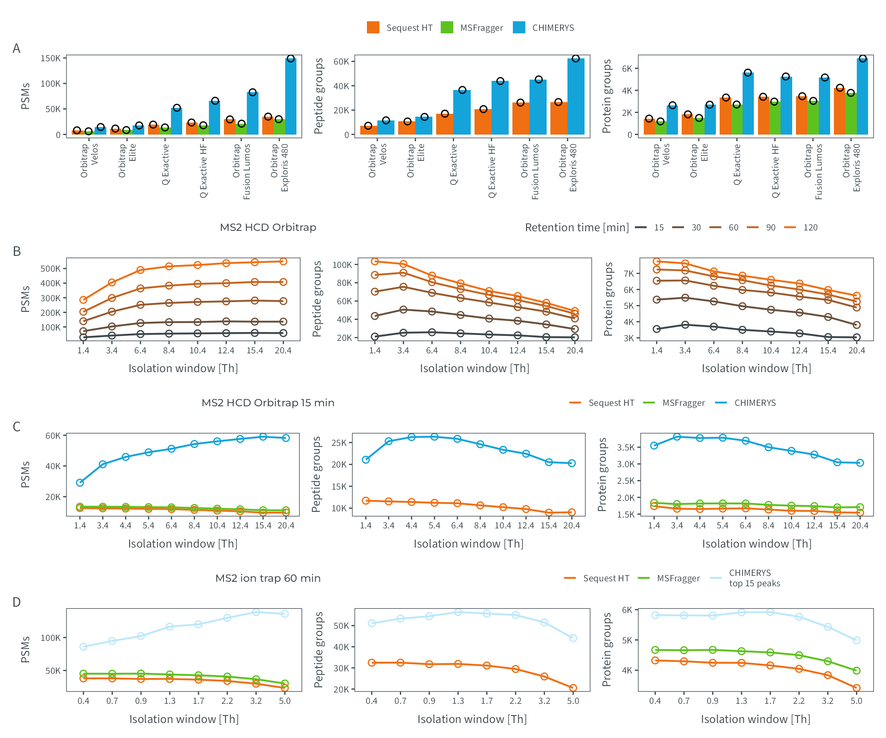

# Figure E5
MSAID
2024-12-18

- [Setup](#setup)
- [Data](#data)
  - [Instruments](#instruments)
  - [OTOT HCD Gradients](#otot-hcd-gradients)
  - [OTOT HCD search engines](#otot-hcd-search-engines)
  - [OTIT CID search engines](#otit-cid-search-engines)
- [Figure](#figure)

# Setup

This document describes how the data analysis and plots for extended
figure 5 were generated. To recreate the figures, make sure to download
all input files (available on
[PRIDE](https://www.ebi.ac.uk/pride/archive?keyword=PXD053241)), place
them under `dataPath` (adjust in `load-dependencies.R` to your own
folder structure) and generate intermediate results in the linked `.R`
scripts.

<details>
<summary>
Details on setup
</summary>

``` r
suppressMessages(source(here::here("scripts/load-dependencies.R")))
path <- file.path(here::here(), "figure-E5")
figurePath <- file.path(dataPath, "data/figure-E5")
msaid_SE <- c("Sequest HT" = msaid_orange,
              "MSFragger" = msaid_green,
              "CHIMERYS" = msaid_blue,
              "CHIMERYS\ntop 15 peaks" = msaid_lightblue)
```

</details>

# Data

<details>
<summary>
Details on data processing
</summary>

All `.csv` input files were generated using the `readIds(...)` function
reading search engine results (`.pdResult` files and MSFragger output
folders).

## Instruments

``` r
data_MS <- fread(file.path(figurePath, "figure-E5A-instruments.csv"))
data_MS[, condition_SE := factor(gsub("^.*_(.)$", "\\1", studies),
                                 levels = c("S", "M", "C"),
                                 labels = c("Sequest HT", "MSFragger", "CHIMERYS"))]
MS_labels <- c("Orbitrap\nVelos", "Orbitrap\nElite",
               "Q Exactive", "Q Exactive HF",
               "Orbitrap\nFusion Lumos", "Orbitrap\nExploris 480")
data_MS[, condition_MS := factor(gsub("^._(.*)_.$", "\\1", studies),
                                 levels = c("Velos", "Elite", "QE", "HF", "Lumos", "Exploris"),
                                 labels = MS_labels)]

p_instruments_psm <- ggplot(data_MS[!is.na(psms_FDR)],
                            aes(x=condition_MS, y=psms_FDR, fill=condition_SE)) +
  geom_bar(stat = "summary", fun = mean, position = "dodge") +
  geom_jitter(shape = 1L, position = position_jitterdodge(0.1, 0, 0.9), show.legend = F) +
  scale_y_continuous(labels = label_number(scale_cut = cut_short_scale2())) +
  scale_fill_manual(NULL, values = msaid_SE) +
  xlab(NULL) + ylab("PSMs") + theme(legend.position = "none") +
  theme_tilt_xaxis(90, T)

p_instruments_pep <- ggplot(data_MS[!is.na(peptideGroups_FDR)],
                            aes(x=condition_MS, y=peptideGroups_FDR, fill=condition_SE)) +
  geom_bar(stat = "summary", fun = mean, position = "dodge") +
  geom_jitter(shape = 1L, position = position_jitterdodge(0.1, 0, 0.9)) +
  scale_y_continuous(labels = label_number(scale_cut = cut_short_scale2())) +
  scale_fill_manual(NULL, values = msaid_SE) +
  xlab(NULL) + ylab("Peptide groups") + theme(legend.position = "none") +
  theme_tilt_xaxis(90, T)

p_instruments_prot <- ggplot(data_MS[!is.na(proteinGroups_FDR)],
                             aes(x=condition_MS, y=proteinGroups_FDR, fill=condition_SE)) +
  geom_bar(stat = "summary", fun = mean, position = "dodge") +
  geom_jitter(shape = 1L, position = position_jitterdodge(0.1, 0, 0.9)) +
  scale_y_continuous(labels = label_number(scale_cut = cut_short_scale2())) +
  scale_fill_manual(NULL, values = msaid_SE) +
  xlab(NULL) + ylab("Protein groups") + theme(legend.position = "none") +
  theme_tilt_xaxis(90, T)
```

## OTOT HCD Gradients

``` r
data_gradient <- fread(file.path(figurePath, "figure-E5B-gradients.csv"))
min_levels <- c("15", "30", "60", "90", "120")
data_gradient[, condition_gradient := factor(condition_gradient, min_levels)]
IW_levels <- c("1.4", "3.4", "6.4", "8.4", "10.4", "12.4", "15.4", "20.4")
data_gradient[, condition_IW := factor(studies, levels = IW_levels)]

p_gradients_psms <- ggplot(data_gradient, aes(x=condition_IW, y=psms_FDR,
                                              group=condition_gradient,
                                              color=condition_gradient)) +
  geom_line() +
  geom_point(shape = 1L, show.legend = F) +
  scale_y_continuous(labels = label_number(scale_cut = cut_short_scale2())) +
  scale_color_manual("Retention time [min]", values = msaid_gradient_2b(5)) +
  xlab("Isolation window [Th]") + ylab("PSMs") + theme(legend.position = "none")

p_gradients_pep <- ggplot(data_gradient, aes(x=condition_IW, y=peptideGroups_FDR,
                                             group=condition_gradient,
                                             color=condition_gradient)) +
  geom_line() +
  geom_point(shape = 1L) +
  scale_y_continuous(labels = label_number(scale_cut = cut_short_scale2())) +
  scale_color_manual(NULL, values = msaid_gradient_2b(5)) +
  xlab("Isolation window [Th]") + ylab("Peptide groups") + theme(legend.position = "none")

p_gradients_prot <- ggplot(data_gradient, aes(x=condition_IW, y=proteinGroups_FDR,
                                              group=condition_gradient,
                                              color=condition_gradient)) +
  geom_line() +
  geom_point(shape = 1L) +
  scale_y_continuous(labels = label_number(scale_cut = cut_short_scale2())) +
  scale_color_manual(NULL, values = msaid_gradient_2b(5)) +
  xlab("Isolation window [Th]") + ylab("Protein groups") + theme(legend.position = "none")
```

## OTOT HCD search engines

``` r
data_OT_SE <- fread(file.path(figurePath, "figure-E5C-seach-engines.csv"))
data_OT_SE[, condition_SE := factor(condition_SE, c("Sequest HT", "MSFragger", "CHIMERYS"))]
IW_labels <- c("1.4", "3.4", "4.4", "5.4", "6.4", "8.4", "10.4", "12.4", "15.4", "20.4")
data_OT_SE[, condition_IW := factor(condition_IW, IW_labels)]

p_SE_psms <- ggplot(data_OT_SE[!is.na(psms_FDR)],
                    aes(x=condition_IW, y=psms_FDR,
                        group=condition_SE, color=condition_SE)) +
  geom_line() +
  geom_point(shape = 1L, show.legend = F) +
  scale_y_continuous(labels = label_number(scale_cut = cut_short_scale2())) +
  scale_color_manual(NULL, values = msaid_SE) +
  xlab("Isolation window [Th]") + ylab("PSMs") + theme(legend.position = "none")

p_SE_pep <- ggplot(data_OT_SE[!is.na(peptideGroups_FDR)],
                   aes(x=condition_IW, y=peptideGroups_FDR,
                       group=condition_SE, color=condition_SE)) +
  geom_line() +
  geom_point(shape = 1L) +
  scale_y_continuous(labels = label_number(scale_cut = cut_short_scale2())) +
  scale_color_manual(NULL, values = msaid_SE) +
  xlab("Isolation window [Th]") + ylab("Peptide groups") + theme(legend.position = "none")

p_SE_prot <- ggplot(data_OT_SE[!is.na(proteinGroups_FDR)],
                    aes(x=condition_IW, y=proteinGroups_FDR,
                        group=condition_SE, color=condition_SE)) +
  geom_line() +
  geom_point(shape = 1L) +
  scale_y_continuous(labels = label_number(scale_cut = cut_short_scale2())) +
  scale_color_manual(NULL, values = msaid_SE) +
  xlab("Isolation window [Th]") + ylab("Protein groups") + theme(legend.position = "none")
```

## OTIT CID search engines

``` r
data_cid <- fread(file.path(figurePath, "figure-E5D-cid.csv"))
data_cid[, condition_SE := factor(condition_SE, levels = c("Sequest HT", "MSFragger", "CHIMERYS\ntop 15 peaks"))]
IW_levels <- c("0.4", "0.7", "0.9", "1.3", "1.7", "2.2", "3.2", "5")
IW_labels <- c("0.4", "0.7", "0.9", "1.3", "1.7", "2.2", "3.2", "5.0")
data_cid[, condition_IW := factor(condition_IW, IW_levels, IW_labels)]

p_cid_psms <- ggplot(data_cid[!is.na(psms_FDR)],
                     aes(x=condition_IW, y=psms_FDR,
                         group=condition_SE, color=condition_SE)) +
  geom_line() +
  geom_point(shape = 1L, show.legend = F) +
  scale_y_continuous(labels = label_number(scale_cut = cut_short_scale2())) +
  scale_color_manual(NULL, values = msaid_SE) +
  xlab("Isolation window [Th]") + ylab("PSMs") + theme(legend.position = "none")

p_cid_pep <- ggplot(data_cid[!is.na(peptideGroups_FDR)],
                    aes(x=condition_IW, y=peptideGroups_FDR,
                        group=condition_SE, color=condition_SE)) +
  geom_line() +
  geom_point(shape = 1L, show.legend = F) +
  scale_y_continuous(labels = label_number(scale_cut = cut_short_scale2())) +
  scale_color_manual(NULL, values = msaid_SE) +
  xlab("Isolation window [Th]") + ylab("Peptide groups") + theme(legend.position = "none")

p_cid_prot <- ggplot(data_cid[!is.na(proteinGroups_FDR)],
                     aes(x=condition_IW, y=proteinGroups_FDR,
                         group=condition_SE, color=condition_SE)) +
  geom_line() +
  geom_point(shape = 1L, show.legend = F) +
  scale_y_continuous(labels = label_number(scale_cut = cut_short_scale2())) +
  scale_color_manual(NULL, values = msaid_SE) +
  xlab("Isolation window [Th]") + ylab("Protein groups") + theme(legend.position = "none")
```

</details>

# Figure

<details>
<summary>
Details on figure generation
</summary>

``` r
p_legend_a <- ggdraw2(get_plot_component(p_instruments_psm + theme(legend.position = "top"),
                                         'guide-box-top', return_all = TRUE))
p_legend_b <- ggdraw2(get_plot_component(p_gradients_psms + theme(legend.position = "top"),
                                         'guide-box-top', return_all = TRUE))
p_legend_c <- ggdraw2(get_plot_component(p_SE_psms + theme(legend.position = "top"),
                                         'guide-box-top', return_all = TRUE))
p_legend_d <- ggdraw2(get_plot_component(p_cid_psms + theme(legend.position = "top"),
                                         'guide-box-top', return_all = TRUE))

p_title_b <- ggplot_placeholder("MS2 HCD Orbitrap", 6, "Montserrat Medium")
p_title_c <- ggplot_placeholder("MS2 HCD Orbitrap 15 min", 6, "Montserrat Medium")
p_title_d <- ggplot_placeholder("MS2 ion trap 60 min", 6, "Montserrat Medium")

p_annotation <- list(c("",
                       "A", "", "",
                       "", "",
                       "B", "", "",
                       "", "",
                       "C", "", "",
                       "", "",
                       "D", "", ""))

p_s3 <- (p_legend_a) / 
  (p_instruments_psm | p_instruments_pep | p_instruments_prot) /
  (p_title_b | p_legend_b) /
  (p_gradients_psms | p_gradients_pep | p_gradients_prot) /
  (p_title_c | p_legend_c) /
  (p_SE_psms | p_SE_pep | p_SE_prot) /
  (p_title_d | p_legend_d) /
  (p_cid_psms | p_cid_pep | p_cid_prot) +
  plot_layout(heights = c(0.2, 1, 0.2, 1, 0.2, 1, 0.2, 1)) +
  plot_annotation(tag_levels = p_annotation)

ggsave2(file.path(path, "figure-E5.pdf"), plot = p_s3,
        width = 180, height = 150, units = "mm", device = cairo_pdf)
ggsave2(file.path(path, "figure-E5.png"), plot = p_s3,
        width = 180, height = 150, units = "mm")
```

</details>


