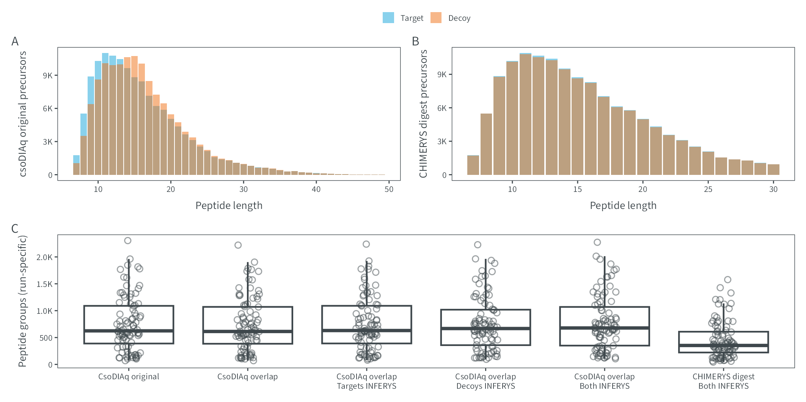

# Figure E9
MSAID
2025-01-20

- [Overview](#overview)
- [Data](#data)
  - [Peptide length distributions](#peptide-length-distributions)
  - [Counts](#counts)
- [Figure](#figure)

# Overview

This document describes how the data analysis and plots for extended
figure 10 were generated. To recreate the figures, make sure to download
all input files (available on
[PRIDE](https://www.ebi.ac.uk/pride/archive?keyword=PXD053241)), place
them under `dataPath` (adjust in `load-dependencies.R` to your own
folder structure) and generate intermediate results in the linked `.R`
scripts.

<details>
<summary>
Details on data processing
</summary>

``` r
suppressMessages(source(here::here("scripts/load-dependencies.R")))
path <- file.path(here::here(), "figure-E9")
figurePath <- file.path(dataPath, "data/figure-E9")
msaid_td <- c("Target" = msaid_blue, "Decoy" = msaid_orange)
```

</details>

# Data

<details>
<summary>
Details on data loading
</summary>

[R code to generate `.csv` input
files](figure-E9-library-and-csodiaq-results.R)

## Peptide length distributions

``` r
pep_zodiaq <- fread(file.path(figurePath, "figure-E9A-csodiaq.csv"))
pep_zodiaq[, isDecoyLabel := factor(isDecoyLabel, c("Target", "Decoy"))]

p_pep_zodiaq <- ggplot(pep_zodiaq, aes(x=n_aa, fill=isDecoyLabel)) +
  geom_bar(position = "identity", alpha = 0.5) +
  scale_y_continuous(labels = label_number(scale_cut = append(cut_short_scale(), 1, 1))) +
  scale_fill_manual(NULL, values = msaid_td) +
  xlab("Peptide length") + ylab("csoDIAq original precursors") +
  theme(legend.position = "top")

pep_inferys <- fread(file.path(figurePath, "figure-E9B-chimerys.csv"))
pep_inferys[, isDecoyLabel := factor(isDecoyLabel, c("Target", "Decoy"))]

p_pep_inferys <- ggplot(pep_inferys, aes(x=n_aa, fill=isDecoyLabel)) +
  geom_bar(position = "identity", alpha = 0.5) +
  scale_y_continuous(labels = label_number(scale_cut = append(cut_short_scale(), 1, 1))) +
  scale_fill_manual(NULL, values = msaid_td) +
  xlab("Peptide length") + ylab("CHIMERYS digest precursors") +
  theme(legend.position = "top")
```

## Counts

``` r
dt <- fread(file.path(figurePath, "figure-E9C-counts.csv"))
types <- c("CsoDIAq original",
           "CsoDIAq overlap",
           "CsoDIAq overlap\nTargets INFERYS",
           "CsoDIAq overlap\nDecoys INFERYS",
           "CsoDIAq overlap\nBoth INFERYS",
           "CHIMERYS digest\nBoth INFERYS")
dt[, type := factor(type, types)]

p_counts <- ggplot(dt, aes(x=type, y=N)) +
  geom_boxplot(outliers = F, color = msaid_darkgray) +
  geom_point(shape = 1L, alpha = 0.5, color = msaid_darkgray,
             position = position_jitter(0.1, seed = 123L)) +
  scale_y_continuous(labels = label_number(scale_cut = append(cut_short_scale(), 1, 1))) +
  xlab(NULL) + ylab("Peptide groups (run-specific)")
```

</details>

# Figure

<details>
<summary>
Details on figure generation
</summary>

``` r
p_design <- "AAAAAA\nBBBCCC\nDDDDDD"

p_library <- guide_area() + p_pep_zodiaq + p_pep_inferys + p_counts +
  plot_layout(heights = c(0.1, 1, 1), design = p_design, guides = "collect") +
  plot_annotation(tag_levels = list(c("A", "B", "C")))

suppressWarnings(ggsave2(file.path(path, "figure-E9.pdf"), plot = p_library,
                         width = 180, height = 90, units = "mm", device = cairo_pdf))
suppressWarnings(ggsave2(file.path(path, "figure-E9.png"), plot = p_library,
                         width = 180, height = 90, units = "mm"))
suppressWarnings(ggsave2(file.path(path, "figure-E9.eps"), plot = p_library,
                         width = 180, height = 90, units = "mm"))
suppressWarnings(ggsave2(file.path(path, "figure-E9.jpeg"), plot = p_library,
                         width = 180, height = 90, units = "mm"))
suppressWarnings(ggsave2(file.path(path, "figure-E9.tiff"), plot = p_library,
                         width = 180, height = 90, units = "mm"))
```

</details>


