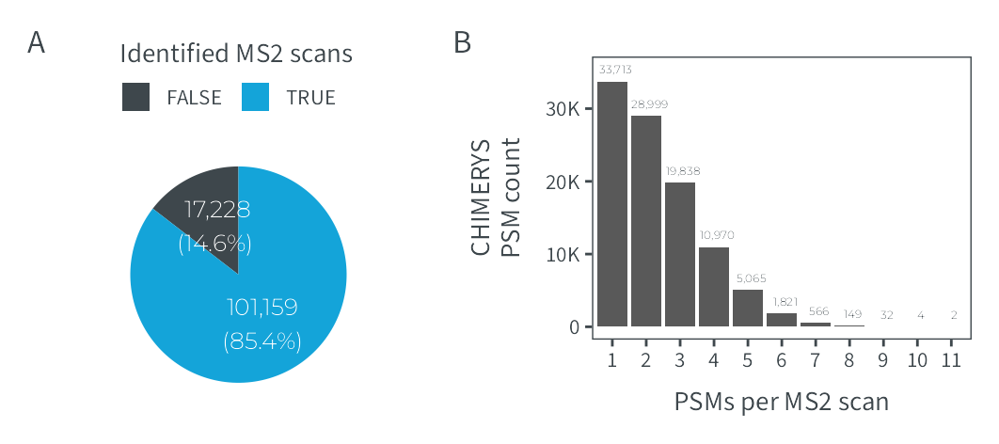

# Figure S1
MSAID
2024-12-03

- [Setup](#setup)
- [Data](#data)
  - [Pie identified scans](#pie-identified-scans)
  - [PSMs per MS2 scan](#psms-per-ms2-scan)
- [Figure](#figure)

# Setup

This document describes how the data analysis and plots for extended
figure 1 were generated. To recreate the figures, make sure to download
all input files (available on
[PRIDE](https://www.ebi.ac.uk/pride/archive?keyword=PXD053241)), place
them under `dataPath` (adjust in `load-dependencies.R` to your own
folder structure) and generate intermediate results in the linked `.R`
scripts.

<details>
<summary>
Details on setup
</summary>

``` r
suppressMessages(source(here::here("scripts/load-dependencies.R")))

path <- file.path(here::here(), "figure-S1-DDA-chimeric")
figurePath <- file.path(dataPath, "data/figure-S1")
```

</details>

# Data

<details>
<summary>
Details on data processing
</summary>

## Pie identified scans

[R code to generate input file
`scans-identified.csv`](figure-S1A-scans-identified.R)

``` r
counts_scans <- fread(file.path(figurePath, "scans-identified.csv"))

p_pie_scans <- ggplot(counts_scans, aes(x="", y=N_rel, fill=is_identified)) +
  geom_bar(stat="identity", width = 2) +
  coord_polar("y", start=0) +
  geom_text(aes(y = ypos, label = N_label), color = "white", size = 6/.pt, family = "Montserrat Light") +
  scale_fill_manual("Identified MS2 scans", values = c(msaid_darkgray, msaid_blue)) +
  theme(panel.border = element_blank(),
        axis.ticks = element_blank(),
        axis.title.x = element_blank(),
        axis.title.y = element_blank(),
        axis.text = element_blank(),
        legend.position = "none") +
  guides(fill = guide_legend(title.position = "top"))

p_pie_legend <- ggdraw2(get_plot_component(p_pie_scans + theme(legend.position = "top"),
                                           'guide-box-top', return_all = TRUE))
```

## PSMs per MS2 scan

[R code to generate input file
`psms-per-scan.csv`](figure-S1B-psms-per-scan.R)

``` r
scan_counts <- fread(file.path(figurePath, "psms-per-scan.csv"))
scan_counts[, N_label := format(N, big.mark=",", trim=T)]

p_psms_ms2 <- ggplot(scan_counts, aes(x=factor(ms2_scans))) +
  geom_bar(aes(y=N), stat = "identity") +
  geom_text(aes(x=seq_along(ms2_scans)+0.1, y=N+0.05*max(y=N), label=N_label), size=3/.pt,
            family = "Montserrat Light", color = msaid_darkgray) +
  scale_y_continuous(labels = label_number(scale_cut = cut_short_scale())) +
  xlab("PSMs per MS2 scan") + ylab("CHIMERYS\nPSM count")
```

</details>

# Figure

<details>
<summary>
Details on figure generation
</summary>

``` r
p_design <- "AAACCC\nBBBCCC"

p_supp_DDA <- p_pie_legend + free(p_pie_scans) + p_psms_ms2 +
  plot_layout(heights = c(0.2, 1), design = p_design) +
  plot_annotation(tag_levels = list(c("A", "", "B")))

suppressWarnings(ggsave2(file.path(path, "figure-S1-DDA-chimeric.pdf"), plot = p_supp_DDA,
                         width = 90, height = 40, units = "mm", device = cairo_pdf))
suppressWarnings(ggsave2(file.path(path, "figure-S1-DDA-chimeric.png"), plot = p_supp_DDA,
                         width = 90, height = 40, units = "mm")) #, dpi = 92
```

</details>


