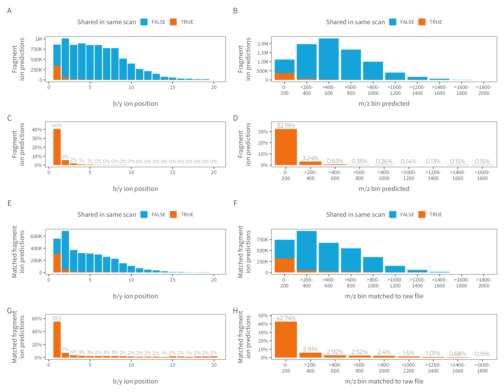

# Figure S1
MSAID
2024-12-17

- [Setup](#setup)
- [Data](#data)
  - [Predicted ions](#predicted-ions)
  - [Matched ions](#matched-ions)
- [Figure](#figure)

# Setup

This document describes how the data analysis and plots for
supplementary figure 1 were generated. To recreate the figures, make
sure to download all input files (available on
[PRIDE](https://www.ebi.ac.uk/pride/archive?keyword=PXD053241)), place
them under `dataPath` (adjust in `load-dependencies.R` to your own
folder structure) and generate intermediate results in the linked `.R`
scripts.

<details>
<summary>
Details on setup
</summary>

``` r
suppressMessages(source(here::here("scripts/load-dependencies.R")))

path <- file.path(here::here(), "figure-S1")
figurePath <- file.path(dataPath, "data/figure-S1")
```

</details>

# Data

<details>
<summary>
Details on data processing
</summary>

## Predicted ions

[R code to generate input files `figure-S1AC-predicted-position.csv` and
`figure-S1BD-predicted-mz.csv`](predictions.R)

``` r
count_pos <- fread(file.path(figurePath, "figure-S1AC-predicted-position.csv"))

p_ion_pred_pos_abs <-
  ggplot(count_pos, aes(x=position, y=N, fill=is_ptm_pred_shared)) +
  geom_bar(stat="identity") +
  scale_fill_manual("shared in same scan", values = c(msaid_blue, msaid_orange)) +
  scale_y_continuous(labels = label_number(scale_cut = cut_short_scale())) +
  xlab("b/y ion position") + ylab("fragment\nion predictions") +
  theme(legend.position = "top")

p_ion_pred_pos_rel <-
  ggplot(count_pos[is_ptm_pred_shared==T],
         aes(x=position, y=N_rel, label=N_rel_label)) +
  geom_bar(stat="identity", fill=msaid_orange) +
  geom_text(aes(y=N_rel+max(N_rel)*0.1), size=5/.pt,
            color=msaid_darkgray, family="Montserrat Light") +
  scale_y_continuous(labels = label_percent(),
                     limits = c(0, count_pos[is_ptm_pred_shared==T, max(N_rel)]*1.15)) +
  xlab("b/y ion position") + ylab("fragment\nion predictions")


#plot 200 mz-bins
count_200 <- fread(file.path(figurePath, "figure-S1BD-predicted-mz.csv"))
mz_lab <- count_200[, paste0(c(0, 0, paste0(">", as.character(mz_ms2_200)[1:(.N-2)])), "-\n", mz_ms2_200)]
count_200[, mzMatch_label := factor(mzMatch_label, unique(mz_lab))]

p_ion_pred_200_abs <-
  ggplot(count_200, aes(x=mzMatch_label, y=N, fill=is_ptm_pred_shared)) +
  geom_bar(stat="identity") +
  scale_fill_manual("shared in same scan", values = c(msaid_blue, msaid_orange)) +
  scale_y_continuous(labels = label_number(scale_cut = cut_short_scale())) +
  xlab("mz predicted") + ylab("fragment\nion predictions") +
  theme(legend.position = "top")

p_ion_pred_200_rel <-
  ggplot(count_200[is_ptm_pred_shared==T],
         aes(x=mzMatch_label, y=N_rel, label=N_rel_label)) +
  geom_bar(stat="identity", fill=msaid_orange) +
  geom_text(aes(y=N_rel+max(N_rel)*0.1), size=6/.pt,
            color=msaid_darkgray, family="Montserrat Light") +
  scale_y_continuous(labels = label_percent(),
                     limits = c(0, count_200[is_ptm_pred_shared==T, max(N_rel)]*1.15)) +
  xlab("mz predicted") + ylab("fragment\nion predictions")
```

## Matched ions

[R code to generate input files `figure-S1EG-matched-position.csv` and
`figure-S1FH-matched-mz.csv`](predictions.R)

``` r
#plot positions
count_pos <- fread(file.path(figurePath, "figure-S1EG-matched-position.csv"))

p_ion_shared_pos_abs <-
  ggplot(count_pos, aes(x=position, y=N, fill=is_ptm_match_shared)) +
  geom_bar(stat="identity") +
  scale_fill_manual("shared in same scan", values = c(msaid_blue, msaid_orange)) +
  scale_y_continuous(labels = label_number(scale_cut = cut_short_scale())) +
  xlab("b/y ion position") + ylab("matched fragment\nion predictions") +
  theme(legend.position = "top")

p_ion_shared_pos_rel <-
  ggplot(count_pos[is_ptm_match_shared==T],
         aes(x=position, y=N_rel, label=N_rel_label)) +
  geom_bar(stat="identity", fill=msaid_orange) +
  geom_text(aes(y=N_rel+max(N_rel)*0.1), size=5/.pt,
            color=msaid_darkgray, family="Montserrat Light") +
  scale_y_continuous(labels = label_percent(),
                     limits = c(0, count_pos[is_ptm_match_shared==T, max(N_rel)]*1.15)) +
  xlab("b/y ion position") + ylab("matched fragment\nion predictions")


#plot 200 mz-bins
count_200 <- fread(file.path(figurePath, "figure-S1FH-matched-mz.csv"))
mz_lab <- count_200[, paste0(c(0, 0, paste0(">", as.character(mzMatch_200)[1:(.N-2)])), "-\n", mzMatch_200)]
count_200[, mzMatch_label := factor(mzMatch_label, unique(mz_lab))]

p_ion_shared_200_abs <-
  ggplot(count_200, aes(x=mzMatch_label, y=N, fill=is_ptm_match_shared)) +
  geom_bar(stat="identity") +
  scale_fill_manual("shared in same scan", values = c(msaid_blue, msaid_orange)) +
  scale_y_continuous(labels = label_number(scale_cut = cut_short_scale())) +
  xlab("mz matched to raw file") + ylab("matched fragment\nion predictions") +
  theme(legend.position = "top")

p_ion_shared_200_rel <-
  ggplot(count_200[is_ptm_match_shared==T],
         aes(x=mzMatch_label, y=N_rel, label=N_rel_label)) +
  geom_bar(stat="identity", fill=msaid_orange) +
  geom_text(aes(y=N_rel+max(N_rel)*0.1), size=6/.pt,
            color=msaid_darkgray, family="Montserrat Light") +
  scale_y_continuous(labels = label_percent(),
                     limits = c(0, count_200[is_ptm_match_shared==T, max(N_rel)]*1.15)) +
  xlab("mz matched to raw file") + ylab("matched fragment\nion predictions")
```

</details>

# Figure

<details>
<summary>
Details on figure generation
</summary>

``` r
p_ions <- p_ion_pred_pos_abs + p_ion_pred_200_abs +
  p_ion_pred_pos_rel + p_ion_pred_200_rel +
  p_ion_shared_pos_abs + p_ion_shared_200_abs +
  p_ion_shared_pos_rel + p_ion_shared_200_rel +
  plot_layout(widths = c(1, 1.25), ncol = 2) +
  plot_annotation(tag_levels = "A")

suppressWarnings(ggsave2(file.path(path, "figure-S1.pdf"), plot = p_ions,
                         width = 180, height = 140, units = "mm", device = cairo_pdf))
suppressWarnings(ggsave2(file.path(path, "figure-S1.png"), plot = p_ions,
                         width = 180, height = 140, units = "mm"))
```

</details>


