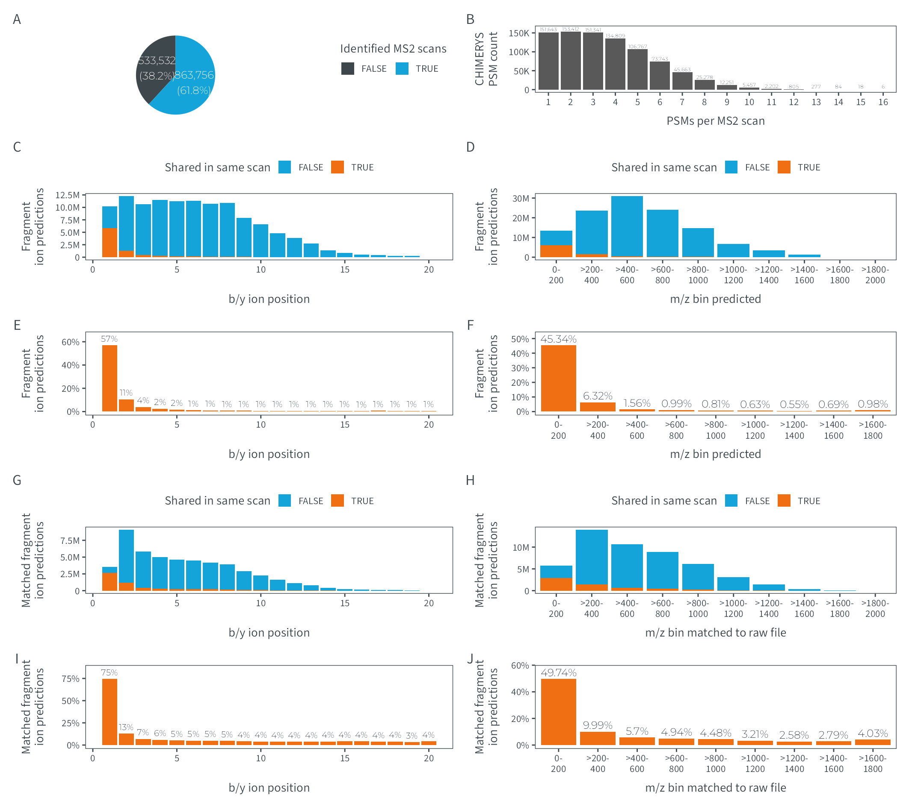

# Figure S2
MSAID
2024-12-20

- [Setup](#setup)
- [Data](#data)
  - [Identified scans](#identified-scans)
  - [PSMs per scan](#psms-per-scan)
  - [Predicted ions](#predicted-ions)
  - [Matched ions](#matched-ions)
- [Figure](#figure)

# Setup

This document describes how the data analysis and plots for
supplementary figure 2 were generated. To recreate the figures, make
sure to download all input files (available on
[PRIDE](https://www.ebi.ac.uk/pride/archive?keyword=PXD053241)), place
them under `dataPath` (adjust in `load-dependencies.R` to your own
folder structure) and generate intermediate results in the linked `.R`
scripts.

<details>
<summary>
Details on setup
</summary>

``` r
suppressMessages(source(here::here("scripts/load-dependencies.R")))
path <- file.path(here::here(), "figure-S2")
figurePath <- file.path(dataPath, "data/figure-S2")
```

</details>

# Data

<details>
<summary>
Details on data processing
</summary>

## Identified scans

[R code to generate input file
`figure-S2A-scans.csv`](figure-S2AB-scans.R)

``` r
counts_scans <- fread(file.path(figurePath, "figure-S2A-scans.csv"))

p_pie_scans <- ggplot(counts_scans, aes(x="", y=N_rel, fill=is_identified)) +
  geom_bar(stat="identity", width = 2) + #, width=1
  coord_polar("y", start=0) +
  geom_text(aes(y = ypos, label = N_label), color = "white", size = 6/.pt, family = "Montserrat Light") +
  scale_fill_manual("Identified MS2 scans", values = c(msaid_darkgray, msaid_blue)) +
  theme(panel.border = element_blank(),
        axis.ticks = element_blank(),
        axis.title.x = element_blank(),
        axis.title.y = element_blank(),
        axis.text = element_blank(),
        legend.position = "none") +
  guides(fill = guide_legend(title.position = "top"))
#text = element_text(family = "Montserrat Light", colour = msaid_darkgray)

p_pie_legend_LFQ3 <- ggdraw2(get_plot_component(p_pie_scans + theme(legend.position = "top"),
                                                'guide-box-top', return_all = TRUE))
```

## PSMs per scan

[R code to generate input file
`figure-S2B-psms.csv`](figure-S2AB-scans.R)

``` r
scan_counts <- fread(file.path(figurePath, "figure-S2B-psms.csv"))
scan_counts[, N_label := format(N, big.mark=",", trim=T)]

p_psms_ms2 <- ggplot(scan_counts, aes(x=factor(ms2_scans))) +
  geom_bar(aes(y=N), stat = "identity") +
  geom_text(aes(y=N+0.05*max(y=N), label=N_label), size=3/.pt,
            family = "Montserrat Light", color = msaid_darkgray) +
  scale_y_continuous(labels = label_number(scale_cut = cut_short_scale())) +
  xlab("PSMs per MS2 scan") + ylab("CHIMERYS\nPSM count")

percent(scan_counts[ms2_scans>1, sum(N)] / scan_counts[, sum(N)], accuracy = 0.01)
```

    [1] "82.44%"

## Predicted ions

[R code to generate input files `figure-S2CE-predicted-position.csv` and
`figure-S2DF-predicted-mz.csv`](figure-S2-predictions.R)

``` r
count_pos <- fread(file.path(figurePath, "figure-S2CE-predicted-position.csv"))

p_ion_pred_pos_abs <-
  ggplot(count_pos, aes(x=position, y=N, fill=is_ptm_pred_shared)) +
  geom_bar(stat="identity") +
  scale_fill_manual("Shared in same scan", values = c(msaid_blue, msaid_orange)) +
  scale_y_continuous(labels = label_number(scale_cut = cut_short_scale())) +
  xlab("b/y ion position") + ylab("Fragment\nion predictions") +
  theme(legend.position = "top")

p_ion_pred_pos_rel <-
  ggplot(count_pos[is_ptm_pred_shared==T],
         aes(x=position, y=N_rel, label=N_rel_label)) +
  geom_bar(stat="identity", fill=msaid_orange) +
  geom_text(aes(y=N_rel+max(N_rel)*0.1), size=5/.pt,
            color=msaid_darkgray, family="Montserrat Light") +
  scale_y_continuous(labels = label_percent(),
                     limits = c(0, count_pos[is_ptm_pred_shared==T, max(N_rel)]*1.15)) +
  xlab("b/y ion position") + ylab("Fragment\nion predictions")


#plot 200 mz-bins
count_200 <- fread(file.path(figurePath, "figure-S2DF-predicted-mz.csv"))
mz_lab <- count_200[, paste0(c(0, 0, paste0(">", as.character(mz_ms2_200)[1:(.N-2)])), "-\n", mz_ms2_200)]
count_200[, mzMatch_label := factor(mzMatch_label, unique(mz_lab))]

p_ion_pred_200_abs <-
  ggplot(count_200, aes(x=mzMatch_label, y=N, fill=is_ptm_pred_shared)) +
  geom_bar(stat="identity") +
  scale_fill_manual("Shared in same scan", values = c(msaid_blue, msaid_orange)) +
  scale_y_continuous(labels = label_number(scale_cut = cut_short_scale())) +
  xlab("m/z bin predicted") + ylab("Fragment\nion predictions") +
  theme(legend.position = "top")

p_ion_pred_200_rel <-
  ggplot(count_200[is_ptm_pred_shared==T],
         aes(x=mzMatch_label, y=N_rel, label=N_rel_label)) +
  geom_bar(stat="identity", fill=msaid_orange) +
  geom_text(aes(y=N_rel+max(N_rel)*0.1), size=6/.pt,
            color=msaid_darkgray, family="Montserrat Light") +
  scale_y_continuous(labels = label_percent(),
                     limits = c(0, count_200[is_ptm_pred_shared==T, max(N_rel)]*1.15)) +
  xlab("m/z bin predicted") + ylab("Fragment\nion predictions")
```

## Matched ions

[R code to generate input files `figure-S1GI-matched-position.csv` and
`figure-S1HJ-matched-mz.csv`](figure-S2-predictions.R)

``` r
#plot positions
count_pos <- fread(file.path(figurePath, "figure-S1GI-matched-position.csv"))

p_ion_shared_pos_abs <-
  ggplot(count_pos, aes(x=position, y=N, fill=is_ptm_match_shared)) +
  geom_bar(stat="identity") +
  scale_fill_manual("Shared in same scan", values = c(msaid_blue, msaid_orange)) +
  scale_y_continuous(labels = label_number(scale_cut = cut_short_scale())) +
  xlab("b/y ion position") + ylab("Matched fragment\nion predictions") +
  theme(legend.position = "top")

p_ion_shared_pos_rel <-
  ggplot(count_pos[is_ptm_match_shared==T],
         aes(x=position, y=N_rel, label=N_rel_label)) +
  geom_bar(stat="identity", fill=msaid_orange) +
  geom_text(aes(y=N_rel+max(N_rel)*0.1), size=5/.pt,
            color=msaid_darkgray, family="Montserrat Light") +
  scale_y_continuous(labels = label_percent(),
                     limits = c(0, count_pos[is_ptm_match_shared==T, max(N_rel)]*1.15)) +
  xlab("b/y ion position") + ylab("Matched fragment\nion predictions")


#plot 200 mz-bins
count_200 <- fread(file.path(figurePath, "figure-S1HJ-matched-mz.csv"))
mz_lab <- count_200[, paste0(c(0, 0, paste0(">", as.character(mzMatch_200)[1:(.N-2)])), "-\n", mzMatch_200)]
count_200[, mzMatch_label := factor(mzMatch_label, unique(mz_lab))]

p_ion_shared_200_abs <-
  ggplot(count_200, aes(x=mzMatch_label, y=N, fill=is_ptm_match_shared)) +
  geom_bar(stat="identity") +
  scale_fill_manual("Shared in same scan", values = c(msaid_blue, msaid_orange)) +
  scale_y_continuous(labels = label_number(scale_cut = cut_short_scale())) +
  xlab("m/z bin matched to raw file") + ylab("Matched fragment\nion predictions") +
  theme(legend.position = "top")

p_ion_shared_200_rel <-
  ggplot(count_200[is_ptm_match_shared==T],
         aes(x=mzMatch_label, y=N_rel, label=N_rel_label)) +
  geom_bar(stat="identity", fill=msaid_orange) +
  geom_text(aes(y=N_rel+max(N_rel)*0.1), size=6/.pt,
            color=msaid_darkgray, family="Montserrat Light") +
  scale_y_continuous(labels = label_percent(),
                     limits = c(0, count_200[is_ptm_match_shared==T, max(N_rel)]*1.15)) +
  xlab("m/z bin matched to raw file") + ylab("Matched fragment\nion predictions")
```

</details>

# Figure

<details>
<summary>
Details on figure generation
</summary>

``` r
p_design <- "AABCCC\nDDDEEE\nFFFGGG\nHHHIII\nJJJKKK"

p_DIA_chim <- free(p_pie_scans) + p_pie_legend_LFQ3 + p_psms_ms2 +
  p_ion_pred_pos_abs + p_ion_pred_200_abs +
  p_ion_pred_pos_rel + p_ion_pred_200_rel +
  p_ion_shared_pos_abs + p_ion_shared_200_abs +
  p_ion_shared_pos_rel + p_ion_shared_200_rel +
  plot_layout(heights = c(1, 1, 1.25, 1, 1.25), design = p_design) +
  plot_annotation(tag_levels = list(c("A", "", "B", LETTERS[3:10])))

ggsave2(file.path(path, "figure-S2.pdf"), plot = p_DIA_chim,
        width = 180, height = 160, units = "mm", device = cairo_pdf)
ggsave2(file.path(path, "figure-S2.png"), plot = p_DIA_chim,
        width = 180, height = 160, units = "mm")
```

</details>


