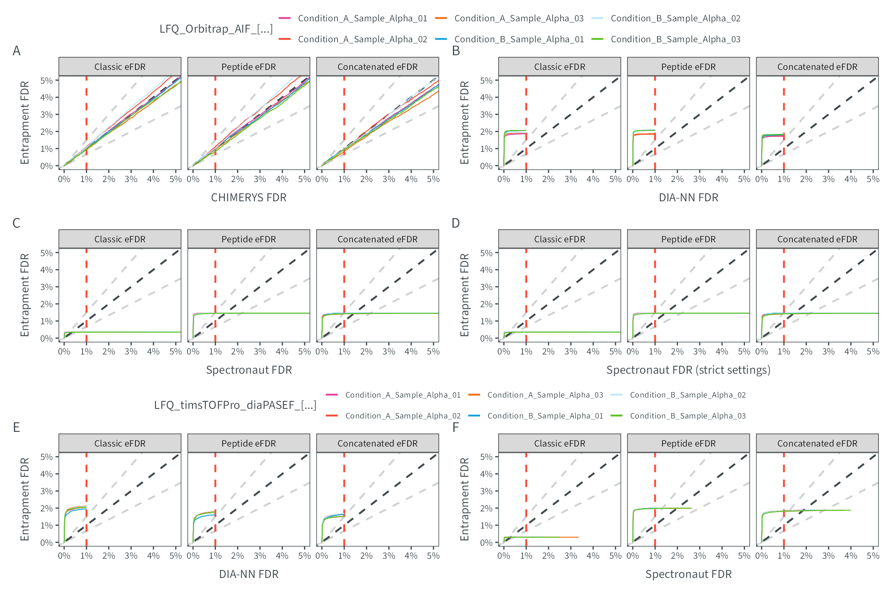

# Figure S8
MSAID
2024-12-05

- [Setup](#setup)
- [Data](#data)
  - [CHIMERYS](#chimerys)
  - [DIA-NN](#dia-nn)
  - [Spectronaut](#spectronaut)
  - [Spectronaut strict](#spectronaut-strict)
  - [DIA-NN Bruker](#dia-nn-bruker)
  - [Spectronaut Bruker](#spectronaut-bruker)
- [Figure](#figure)
  - [ENTRAPMENT_Q_VALUE_1](#entrapment_q_value_1)

# Setup

This document describes how the data analysis and plots for extended
figure 8 were generated. To recreate the figures, make sure to download
all input files (available on
[PRIDE](https://www.ebi.ac.uk/pride/archive?keyword=PXD053241)), place
them under `dataPath` (adjust in `load-dependencies.R` to your own
folder structure) and generate intermediate results in the linked `.R`
scripts.

<details>
<summary>
Details on setup
</summary>

``` r
#source libraries and functions
suppressMessages(source(here::here("scripts/load-dependencies.R")))
msaid_eFDR <- c("TRUE" = msaid_darkgray, "FALSE" = msaid_red)
msaid_unique <- c("TRUE" = msaid_blue, "FALSE" = msaid_darkgray)
efdrLevels <- c("REGULAR", "PEPTIDE", "CONCATENATED")
efdrLabels <- c("Classic eFDR", "Peptide eFDR", "Concatenated eFDR")

path <- file.path(here::here(), "figure-S8-entrapment")
figurePath <- file.path(dataPath, "data/figure-S8")

msaid_thermo <-
  setNames(
    c(c(msaid_purple, msaid_red, msaid_orange),
      c(msaid_blue, msaid_lightblue, msaid_green)),
    c(paste0("Condition_A_Sample_Alpha_0", 1:3),
      paste0("Condition_B_Sample_Alpha_0", 1:3))
  )
```

</details>

# Data

<details>
<summary>
Details on data processing
</summary>

## CHIMERYS

``` r
mean_efdrChimerys <- read_fst(file.path(figurePath, "entrapment_chimerys.fst"), as.data.table = T)
mean_efdrChimerys[, SAMPLE := gsub("^LFQ_Orbitrap_AIF_(Condition_._Sample_Alpha_0.)$", "\\1", SAMPLE)]

mean_efdrChimerys <-
  rbind(mean_efdrChimerys[, .(Q_VALUE = 0, ENTRAPMENT_Q_VALUE = 0, ENTRAPMENT_Q_VALUE_1 = 0),
                          by=.(SOFTWARE, CONDITION, SAMPLE)], mean_efdrChimerys)

mean_efdrChimerys[, ENTRAPMENT_Q_VALUE_MIXED := ifelse(SOFTWARE=="Concatenated eFDR",
                                                       ENTRAPMENT_Q_VALUE_1, ENTRAPMENT_Q_VALUE)]

p_efdrMixedChimerys <-
  ggplot(mean_efdrChimerys, aes(x = Q_VALUE, y = ENTRAPMENT_Q_VALUE_MIXED, color = SAMPLE)) +
  geom_abline(intercept = 0, slope = 1, color = msaid_darkgray, linetype = "dashed") +
  geom_abline(intercept = 0, slope = 1.5, alpha = 0.25,
              color = msaid_darkgray, linetype = "dashed") +
  geom_abline(intercept = 0, slope = 2/3, alpha = 0.25,
              color = msaid_darkgray, linetype = "dashed") +
  geom_vline(xintercept = 0.01, color = msaid_red, linetype = "dashed") + 
  geom_line(linewidth = 0.25, show.legend = T) +
  scale_x_continuous(labels = label_percent()) +
  scale_y_continuous(labels = label_percent()) +
  scale_color_manual("LFQ_Orbitrap_AIF_[...]", values = msaid_thermo) +
  guides(color = guide_legend(override.aes = list(linewidth = 0.5))) +
  facet_grid(cols = vars(SOFTWARE)) +
  xlab("CHIMERYS FDR") + ylab("Entrapment FDR") + theme(legend.position = "left") +
  theme(legend.position = "none", legend.location = "plot",
        plot.background = element_rect("transparent", "transparent")) +
  coord_cartesian(xlim = c(0, 0.05), ylim = c(0, 0.05))
```

## DIA-NN

``` r
mean_efdrDiann <- read_fst(file.path(figurePath, "entrapment_diann.fst"), as.data.table = T)
mean_efdrDiann[, SAMPLE := gsub("^LFQ_Orbitrap_AIF_(Condition_._Sample_Alpha_0.)$", "\\1", SAMPLE)]

mean_efdrDiann <-
  rbind(mean_efdrDiann[, .(Q_VALUE = 0, ENTRAPMENT_Q_VALUE = 0, ENTRAPMENT_Q_VALUE_1 = 0),
                                       by=.(SOFTWARE, CONDITION, SAMPLE)], mean_efdrDiann)

p_efdr1Diann <-
  ggplot(mean_efdrDiann, aes(x = Q_VALUE, y = ENTRAPMENT_Q_VALUE_1, color = SAMPLE)) +
  geom_abline(intercept = 0, slope = 1, color = msaid_darkgray, linetype = "dashed") +
  geom_abline(intercept = 0, slope = 1.5, alpha = 0.25,
              color = msaid_darkgray, linetype = "dashed") +
  geom_abline(intercept = 0, slope = 2/3, alpha = 0.25,
              color = msaid_darkgray, linetype = "dashed") +
  geom_vline(xintercept = 0.01, color = msaid_red, linetype = "dashed") + 
  geom_line(linewidth = 0.25, show.legend = F) +
  scale_x_continuous(labels = label_percent()) +
  scale_y_continuous(labels = label_percent()) +
  scale_color_manual(values = msaid_thermo) +
  guides(color = guide_legend(override.aes = list(linewidth = 0.5))) +
  facet_grid(cols = vars(SOFTWARE)) +
  xlab("DIA-NN FDR") + ylab("Entrapment FDR") +
  theme(legend.position = "left", plot.background = element_rect("transparent", "transparent")) +
  coord_cartesian(xlim = c(0, 0.05), ylim = c(0, 0.05))
```

## Spectronaut

``` r
mean_efdrSpectronaut <-
  read_fst(file.path(figurePath, "entrapment_spectronaut.fst"), as.data.table = T)
mean_efdrSpectronaut[, SAMPLE := gsub("^LFQ_Orbitrap_AIF_(Condition_._Sample_Alpha_0.)$", "\\1", SAMPLE)]

mean_efdrSpectronaut <-
  rbind(mean_efdrSpectronaut[, .(Q_VALUE = 0, ENTRAPMENT_Q_VALUE = 0, ENTRAPMENT_Q_VALUE_1 = 0),
                             by=.(SOFTWARE, CONDITION, SAMPLE)], mean_efdrSpectronaut)

p_efdr1Spectronaut <-
  ggplot(mean_efdrSpectronaut, aes(x = Q_VALUE, y = ENTRAPMENT_Q_VALUE_1, color = SAMPLE)) +
  geom_abline(intercept = 0, slope = 1, color = msaid_darkgray, linetype = "dashed") +
  geom_abline(intercept = 0, slope = 1.5, alpha = 0.25,
              color = msaid_darkgray, linetype = "dashed") +
  geom_abline(intercept = 0, slope = 2/3, alpha = 0.25,
              color = msaid_darkgray, linetype = "dashed") +
  geom_vline(xintercept = 0.01, color = msaid_red, linetype = "dashed") + 
  geom_line(linewidth = 0.25, show.legend = F) +
  scale_x_continuous(labels = label_percent()) +
  scale_y_continuous(labels = label_percent()) +
  scale_color_manual(values = msaid_thermo) +
  guides(color = guide_legend(override.aes = list(linewidth = 0.5))) +
  facet_grid(cols = vars(SOFTWARE)) +
  xlab("Spectronaut FDR") + ylab("Entrapment FDR") + theme(legend.position = "left") +
  coord_cartesian(xlim = c(0, 0.05), ylim = c(0, 0.05))
```

## Spectronaut strict

``` r
mean_efdrSpecStrict <-
  read_fst(file.path(figurePath, "entrapment_spectronaut_strict.fst"), as.data.table = T)
mean_efdrSpecStrict[, SAMPLE := gsub("^LFQ_Orbitrap_AIF_(Condition_._Sample_Alpha_0.)$", "\\1", SAMPLE)]

mean_efdrSpecStrict <-
  rbind(mean_efdrSpecStrict[, .(Q_VALUE = 0, ENTRAPMENT_Q_VALUE = 0, ENTRAPMENT_Q_VALUE_1 = 0),
                            by=.(SOFTWARE, CONDITION, SAMPLE)], mean_efdrSpecStrict)

p_efdr1SpecStrict <-
  ggplot(mean_efdrSpecStrict, aes(x = Q_VALUE, y = ENTRAPMENT_Q_VALUE_1, color = SAMPLE)) +
  geom_abline(intercept = 0, slope = 1, color = msaid_darkgray, linetype = "dashed") +
  geom_abline(intercept = 0, slope = 1.5, alpha = 0.25,
              color = msaid_darkgray, linetype = "dashed") +
  geom_abline(intercept = 0, slope = 2/3, alpha = 0.25,
              color = msaid_darkgray, linetype = "dashed") +
  geom_vline(xintercept = 0.01, color = msaid_red, linetype = "dashed") + 
  geom_line(linewidth = 0.25, show.legend = F) +
  scale_x_continuous(labels = label_percent()) +
  scale_y_continuous(labels = label_percent()) +
  scale_color_manual(values = msaid_thermo) +
  guides(color = guide_legend(override.aes = list(linewidth = 0.5))) +
  facet_grid(cols = vars(SOFTWARE)) +
  xlab("Spectronaut FDR (strict settings)") + ylab("Entrapment FDR") +
  theme(legend.position = "left") +
  coord_cartesian(xlim = c(0, 0.05), ylim = c(0, 0.05))
```

## DIA-NN Bruker

``` r
mean_efdrDiannBruk <-
  read_fst(file.path(figurePath, "entrapment_diann_bruker.fst"), as.data.table = T)
mean_efdrDiannBruk[, SAMPLE := gsub("^LFQ_timsTOFPro_diaPASEF_(Condition_._Sample_Alpha_0.)$", "\\1", SAMPLE)]

mean_efdrDiannBruk <-
  rbind(mean_efdrDiannBruk[, .(Q_VALUE = 0, ENTRAPMENT_Q_VALUE = 0, ENTRAPMENT_Q_VALUE_1 = 0),
                          by=.(SOFTWARE, CONDITION, SAMPLE)], mean_efdrDiannBruk)

p_efdr1DiannBruk <-
  ggplot(mean_efdrDiannBruk, aes(x = Q_VALUE, y = ENTRAPMENT_Q_VALUE_1, color = SAMPLE)) +
  geom_abline(intercept = 0, slope = 1, color = msaid_darkgray, linetype = "dashed") +
  geom_abline(intercept = 0, slope = 1.5, alpha = 0.25,
              color = msaid_darkgray, linetype = "dashed") +
  geom_abline(intercept = 0, slope = 2/3, alpha = 0.25,
              color = msaid_darkgray, linetype = "dashed") +
  geom_vline(xintercept = 0.01, color = msaid_red, linetype = "dashed") + 
  geom_line(linewidth = 0.25, show.legend = T) +
  scale_x_continuous(labels = label_percent()) +
  scale_y_continuous(labels = label_percent()) +
  scale_color_manual("LFQ_timsTOFPro_diaPASEF_[...]", values = msaid_thermo) +
  guides(color = guide_legend(override.aes = list(linewidth = 0.5))) +
  facet_grid(cols = vars(SOFTWARE)) +
  xlab("DIA-NN FDR") + ylab("Entrapment FDR") + theme(legend.position = "left") +
  theme(legend.position = "none", legend.location = "plot",
        legend.text = element_text(size = 5),
        plot.background = element_rect("transparent", "transparent")) +
  coord_cartesian(xlim = c(0, 0.05), ylim = c(0, 0.05))
```

## Spectronaut Bruker

``` r
mean_efdrSpecBruk <-
  read_fst(file.path(figurePath, "entrapment_spectronaut_bruker.fst"), as.data.table = T)
mean_efdrSpecBruk[, SAMPLE := gsub("^LFQ_timsTOFPro_diaPASEF_(Condition_._Sample_Alpha_0.)$", "\\1", SAMPLE)]

mean_efdrSpecBruk <-
  rbind(mean_efdrSpecBruk[, .(Q_VALUE = 0, ENTRAPMENT_Q_VALUE = 0, ENTRAPMENT_Q_VALUE_1 = 0),
                          by=.(SOFTWARE, CONDITION, SAMPLE)], mean_efdrSpecBruk)

p_efdr1SpecBruk <-
  ggplot(mean_efdrSpecBruk, aes(x = Q_VALUE, y = ENTRAPMENT_Q_VALUE_1, color = SAMPLE)) +
  geom_abline(intercept = 0, slope = 1, color = msaid_darkgray, linetype = "dashed") +
  geom_abline(intercept = 0, slope = 1.5, alpha = 0.25,
              color = msaid_darkgray, linetype = "dashed") +
  geom_abline(intercept = 0, slope = 2/3, alpha = 0.25,
              color = msaid_darkgray, linetype = "dashed") +
  geom_vline(xintercept = 0.01, color = msaid_red, linetype = "dashed") + 
  geom_line(linewidth = 0.25, show.legend = T) +
  scale_x_continuous(labels = label_percent()) +
  scale_y_continuous(labels = label_percent()) +
  scale_color_manual("LFQ_timsTOFPro_diaPASEF_[...]", values = msaid_thermo) +
  guides(color = guide_legend(override.aes = list(linewidth = 0.5))) +
  facet_grid(cols = vars(SOFTWARE)) +
  xlab("Spectronaut FDR") + ylab("Entrapment FDR") + theme(legend.position = "left") +
  theme(legend.position = "none", legend.location = "plot",
        legend.text = element_text(size = 5),
        plot.background = element_rect("transparent", "transparent")) +
  coord_cartesian(xlim = c(0, 0.05), ylim = c(0, 0.05))
```

</details>

# Figure

<details>
<summary>
Details on figure generation
</summary>

## ENTRAPMENT_Q_VALUE_1

``` r
p_legendRaw <- ggdraw2(get_plot_component(p_efdrMixedChimerys + theme(legend.position = "top"),
                                          'guide-box-top', return_all = TRUE))
p_legendBruk <- ggdraw2(get_plot_component(p_efdr1SpecBruk + theme(legend.position = "top"),
                                           'guide-box-top', return_all = TRUE))

p_design <- "AAAAAA\nBBBCCC\nDDDEEE\nFFFFFF\nGGGHHH"
p_annotation <- list(c("", "A", "B", "C", "D", "", "E", "F"))

p_efdr <- free(p_legendRaw) + p_efdrMixedChimerys + p_efdr1Diann + p_efdr1Spectronaut +
  p_efdr1SpecStrict + free(p_legendBruk) + p_efdr1DiannBruk + p_efdr1SpecBruk +
  plot_layout(heights = c(0.2, 1, 1, 0.2, 1, 1), design = p_design) +
  plot_annotation(tag_levels = p_annotation)

ggsave2(file.path(path, "figure-S8-entrapment.pdf"), plot = p_efdr,
        width = 180, height = 120, units = "mm", device = cairo_pdf)
ggsave2(file.path(path, "figure-S8-entrapment.png"), plot = p_efdr,
        width = 180, height = 120, units = "mm")
```

</details>


